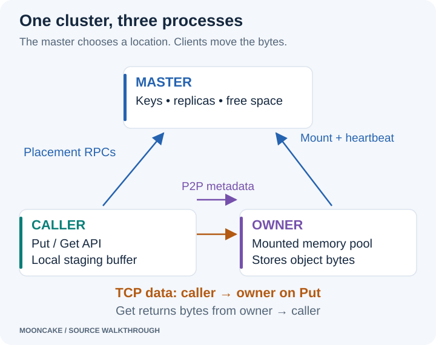

# Understanding Mooncake from the source

How does memory in one process become storage for another process? Where does
a Put send its bytes? What does the master do while the clients exchange data?

This series follows those questions through Mooncake's C++ source. It starts
with three debugging diagrams: master startup, owner startup, and the Put
path. Each article connects the diagram to real classes, functions, and
breakpoints.

## Read the series



The diagrams are SVG images. Click an image to open it at full size. They do
not need a Mermaid plugin or JavaScript to display.

## The small cluster used throughout

We use three Linux processes in the same container:

- **Master:** keeps object locations and manages available storage.
- **Owner:** a Mooncake client that contributes a memory segment.
- **Caller:** a second Mooncake client that calls Put and Get.

“Owner” and “caller” describe roles in this example. They are not different
client implementations. A client can contribute storage and make requests.
Our caller contributes no global storage so that the data path is easier to
see.

We use CPU memory, TCP, one memory replica, `P2PHANDSHAKE`, and the classic
Transfer Engine (`USE_TENT=OFF`). We leave high availability, disk offload,
and GPU paths out of the main example. The articles mark optional branches
where they appear in the source.

All processes use `127.0.0.1` because they share one network namespace. On
separate machines, each client must advertise an address that other clients
can reach. A container's loopback address is not your Mac's loopback address.

## Two kinds of messages

**Control messages** answer questions such as “where can I put this object?”
and “which owner has it?” They include master RPCs and peer metadata
handshakes. RPC means *remote procedure call*: a client asks a service in
another process to run a function.

**Data messages** carry the object bytes. In this example, the caller sends
them directly to the owner's TCP data port. They do not pass through the
master.

The master still uses memory for its own metadata. The distinction is about
where the object payload lives.

## A few words used in the articles

| Term | Meaning in this series |
| --- | --- |
| Object | A key and its value, such as `blog/example` and 4096 bytes. |
| Replica | One stored copy of an object. |
| Store segment | A region of client memory registered with the master as storage capacity. |
| Mount | Tell the master that a segment is available. This is not a filesystem mount. |
| Transfer Engine | The layer that moves bytes between registered memory regions. |
| P2P handshake | A direct exchange of Transfer Engine descriptions between peers. P2P means peer to peer. |
| Endpoint | A network address and port for a particular service. |
| Lease | A limited period during which the Store protects a read's replica from ordinary reclamation. It cannot prevent an owner crash. |
| Asio | The asynchronous I/O library used by the TCP transport. |

## Source version and the original drawings

The walkthrough is checked against Mooncake commit
[`719735896c86b56fabec6cf3e825fb2ea640597a`](https://github.com/kvcache-ai/Mooncake/tree/719735896c86b56fabec6cf3e825fb2ea640597a).
Source links use that fixed revision. Search for the named function when
following a link; line numbers in a locally modified checkout may differ.

The starting material was `master_service.drawio`, `client_memory.drawio`,
and `client_put_get.drawio`. The new diagrams keep their main path and add
missing transitions, including RPC server startup and Put completion. The
debugger screenshots show one particular run. Addresses, automatically
selected ports, and configuration values will vary in another run.

The author's debug checkout also has descriptive thread names and fixed-port
options. Those local changes are not required by this series and are not
assumed to exist in the public revision. Follow function names rather than
expecting a particular OS thread name.

Start with [how the master starts](mooncake_service_starting.html).
