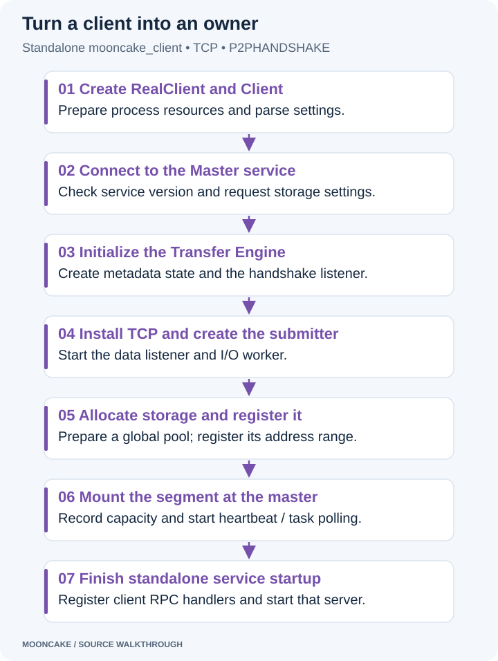
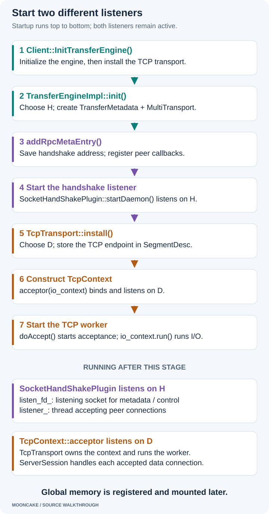
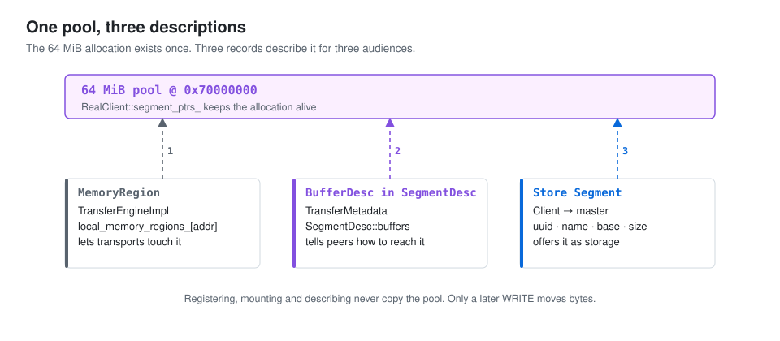
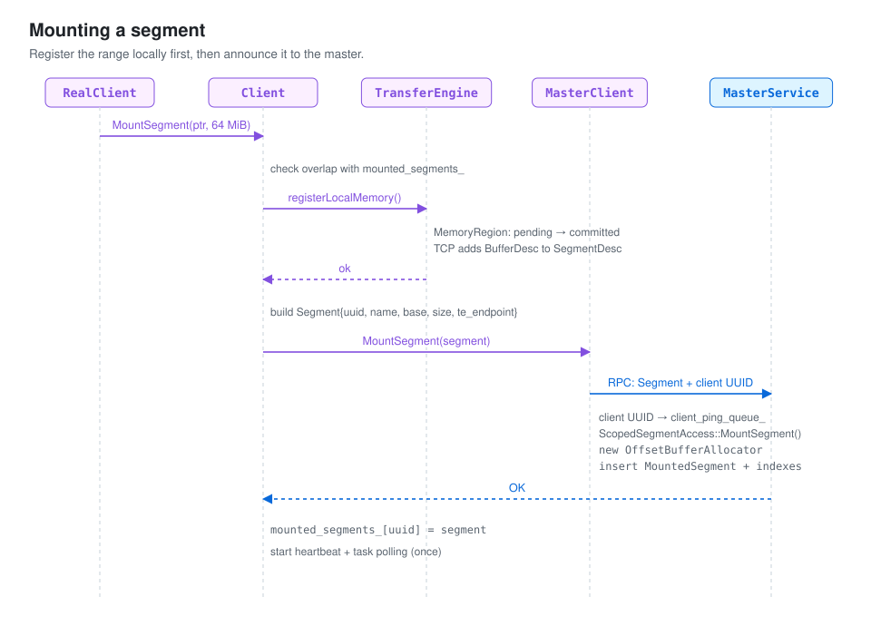
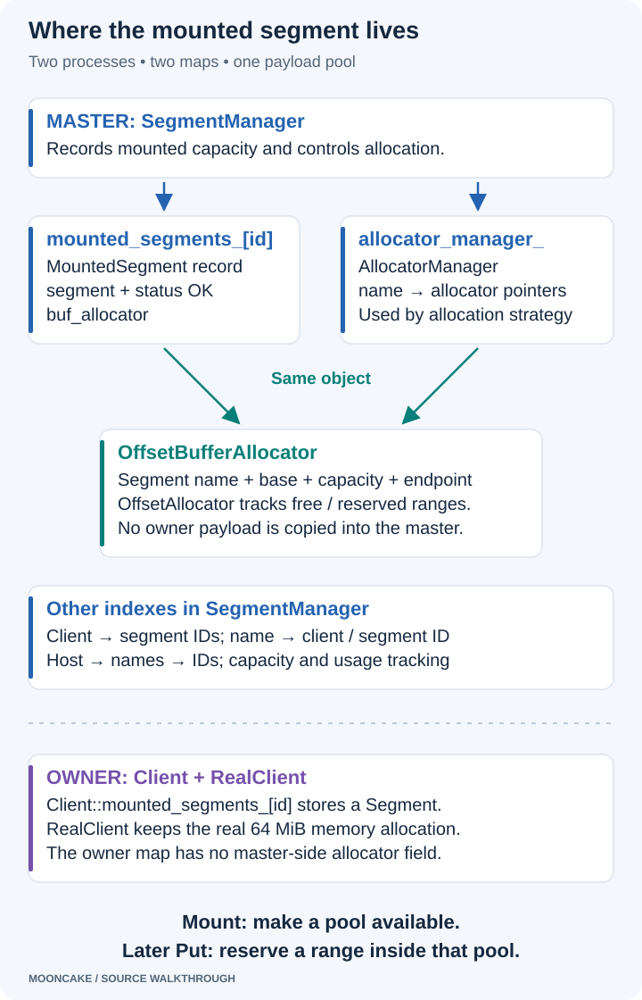
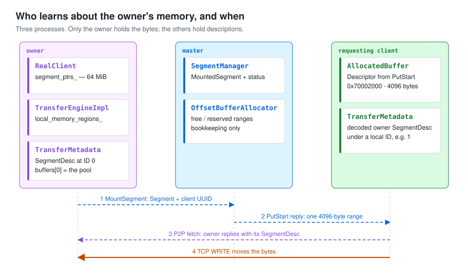

# How a Mooncake owner starts and mounts memory

[Series index](index.html) · [Environment setup](environment_setting_up.html) · [Previous: master startup](mooncake_service_starting.html) · [Next: the Put path](mooncake_put_path.html)

The owner is the process that supplies memory for stored objects. The master
records this capacity and chooses space for objects. The object bytes stay in
the owner's memory.

This chapter follows the public `mooncake_client` program using CPU memory,
TCP, and `P2PHANDSHAKE`. Peer-to-peer (P2P) metadata exchange lets one Transfer Engine
ask another engine for its transport description. The Master service still
manages object placement and owner liveness.

Start with this class map. It shows the main objects and the member names
you will see in the debugger. Click the diagram to read it at full size.

[](assets/owner-class-map.svg)

Read the nested boxes from the outside in. `RealClient` holds `Client`;
`Client` holds `TransferEngine`; and its `impl_` holds the transport and
metadata state. The boxes describe member relationships, including shared
pointers. They do not mean that every object has its own thread.

Three details help when following the source:

- `TransferSubmitter` belongs to `Client`. Its `engine_` references the same
  `TransferEngine` that `Client::transfer_engine_` holds.
- `TransferEngineImpl`, `MultiTransport`, and `TcpTransport` share one
  `TransferMetadata` object. The dashed arrows show the extra references.
- `Client::mounted_segments_` holds Store `Segment` records. The maps inside
  `TransferMetadata` hold Transfer Engine descriptions and IDs. These maps
  serve different purposes.

The source reference is commit
[`719735896c86b56fabec6cf3e825fb2ea640597a`](https://github.com/kvcache-ai/Mooncake/tree/719735896c86b56fabec6cf3e825fb2ea640597a).
We follow the `TransferEngineImpl` implementation used by this TCP setup.
Source links name the relevant symbols so you can find them even when line
numbers change.

## 1. Start one owner

First build the programs using the [environment guide](environment_setting_up.html).
Start the master as shown in the [previous chapter](mooncake_service_starting.html).
It must listen at `127.0.0.1:50051` inside the same Linux container.

In another terminal **inside that Linux container**, run:

```bash
cd /workspace/build/mooncake-store/src
./mooncake_client \
  --host=127.0.0.1:12345 \
  --metadata_server=P2PHANDSHAKE \
  --master_server_address=127.0.0.1:50051 \
  --global_segment_size='64 MB' \
  --local_buffer_size=0 \
  --protocol=tcp \
  --port=50052
```

Use the same arguments in a CLion run configuration for `mooncake_client`.
Keep the build step enabled before launch. All addresses here are Linux
loopback addresses; they are suitable for processes in this one container.

Mooncake's size parser treats `MB` as `1024 × 1024` bytes. Therefore, `'64 MB'`
means **64 MiB**, or 67,108,864 bytes. The parser does not accept `MiB` as a
suffix. See `try_string_to_byte_size` in
[utils.h](https://github.com/kvcache-ai/Mooncake/blob/719735896c86b56fabec6cf3e825fb2ea640597a/mooncake-store/include/utils.h).

The zero local buffer is intentional. This owner still supplies 64 MiB of
global storage. Its local transfer buffer is a separate allocation.

## 2. See how the objects fit together

Several objects work together inside the owner process. Each handles a
different part of the job: the Store API, master requests, transfer selection,
peer metadata, or socket I/O. They are not separate services or processes.

Use the opening class map alongside the table below. The map groups the
objects; the table explains what each member does.

### Follow the members in the debugger

| Object | Important member or relationship | Purpose |
| --- | --- | --- |
| `RealClient` | Inherits `PyClient`; its inherited `client_` points to `Client`. | Provides the high-level API and manages this process's buffers and services. |
| `Client` | `master_client_` is a `MasterClient`. | Sends Store RPCs, such as `MountSegment`, `Ping`, and `PutStart`, to the master. |
| `Client` | `transfer_engine_` points to `TransferEngine`. | Holds the engine used to register memory and move bytes. |
| `Client` | `transfer_submitter_` points to `TransferSubmitter`. | Submits Store data transfers through the Transfer Engine. |
| `TransferSubmitter` | `engine_` is a reference to that same `TransferEngine`. | Uses the client's engine; it does not create a second engine. |
| `TransferEngine` | `impl_` points to `TransferEngineImpl` in this setup. | Exposes the public transfer API and delegates to its implementation. |
| `TransferEngineImpl` | `multi_transports_` points to `MultiTransport`. | Manages installed transports and routes requests to them. |
| `TransferEngineImpl` | `metadata_` points to `TransferMetadata`. | Keeps local and peer transport descriptions available to the engine. |
| `MultiTransport` | `transport_map_["tcp"]` holds a `shared_ptr<Transport>` whose object is a `TcpTransport`. | Selects the concrete transport for a request. |
| `TcpTransport` | Inherits `Transport`; `context_` points to `TcpContext`, and `thread_` is its worker. | Implements TCP memory registration and data transfer. |
| `TcpContext` | Contains `io_context`, `acceptor`, and a validation callback. | Tracks asynchronous I/O, accepts data connections, and checks requested memory ranges. |
| `TransferMetadata` | `handshake_plugin_` points to a `HandShakePlugin`; P2P uses `SocketHandShakePlugin`. | Exchanges transport descriptions with peers through the handshake listener. |

`RealClient` also holds `client_buffer_allocator_` through its `PyClient`
base. That allocator manages local staging space. Its global storage
allocations are managed separately. The later memory sections explain both.

### `Transport` is an interface; `TcpTransport` is an implementation

`Transport` defines the common operations that transport implementations
provide. In this setup, `TcpTransport` implements those operations.

The map in `MultiTransport` uses the common `Transport` type. Its `"tcp"` entry points
to a `TcpTransport`. There is no extra TCP object hidden behind a separate
generic transport service: these are the base and derived types of the same
object.

Likewise, the name `MultiTransport` does not mean that this owner must use
several protocols. It can manage just TCP. It is not itself an I/O thread.

### One shared `TransferMetadata`, not three copies

`TransferEngineImpl` creates the metadata object and passes it to
`MultiTransport`. When TCP is installed, `MultiTransport` passes that same
object to `TcpTransport::install()`. TCP stores the shared pointer in
`metadata_`, a member inherited from `Transport`.

That gives three paths to the same metadata state:

```text
TransferEngineImpl::metadata_ ──────────┐
MultiTransport::metadata_ ─────────────┼──> one TransferMetadata object
TcpTransport's inherited metadata_ ───┘
```

This sharing matters during memory registration. TCP adds a `BufferDesc` to
the local description through `TransferMetadata::addLocalMemoryBuffer()`.
The handshake handler reads from the same metadata object when a peer asks
for the owner's description. The engine does not need to copy that update
between three independent metadata managers.

`TransferMetadata` contains the local/peer segment-description maps, segment
name-to-ID map, and local handshake endpoint information. In P2P mode,
`handshake_plugin_` provides the socket-based metadata exchange. The external
metadata `storage_plugin_` is not created on this path.

This is **Transfer Engine metadata**, such as endpoints and registered
address ranges. The Master service holds different metadata: keys, replica
states, and storage placement.

### `TcpContext` connects the sockets to the worker

`TcpTransport` allocates its `TcpContext` and starts `thread_`. That worker
calls `context_->doAccept()` and then `context_->io_context.run()`.

- `io_context` tracks pending asynchronous operations and ready callbacks.
- `acceptor` listens for new TCP data connections. It is constructed with
  that `io_context`.
- A completed accept creates a `ServerSession` with the accepted socket.
  Its asynchronous reads and writes use the socket's executor, which connects
  them to the same event loop.
- The validation callback uses the shared metadata to check whether an
  incoming address range is registered.

`io_context` is an object, not a thread. `thread_` is the actual thread that
runs its event loop. A `ServerSession` does not need another worker for each
connection, or its own explicit `io_context` member.

The sending side also uses this event loop. `lane_runtime_` stores an
executor obtained from the context. Connection groups, resolvers, and sockets
use that executor to schedule outgoing work. The next article follows this
path through `PeerConnectionGroup` and `ClientSession`.

The P2P handshake listener is separate from this TCP data listener. Sharing
`TransferMetadata` does not make their sockets or worker threads the same.

### Put the object map next to the startup sequence

The relationship diagram shows **what exists and how it is connected**.
The following diagram shows **when the main pieces become ready**.

[](assets/owner-startup.svg)

## 3. Connect to the master before creating the engine

In `main()`, `ResourceTracker` is initialized before other threads. This lets
it prepare signal handling. `RealClient::create()` constructs the client and
registers it with the tracker. Then `main()` calls `setup_internal()`.

Our `--host` includes an explicit port, so setup uses `127.0.0.1:12345` as
the logical client name. When no port is supplied, setup can choose a name
with an available port and retry creation. That branch is outside this example.

`setup_internal()` calls `Client::Create()`. This factory constructs `Client`
and connects to the master. `MasterClient::Connect()` calls the remote
`WrappedMasterService::ServiceReady()` method. The reply contains the Store
version, and the client checks that it matches its own version.

Next, `Client::Create()` requests storage configuration, then initializes the
Transfer Engine for TCP transfers.

Follow `RealClient::setup_internal` in
[real_client.cpp](https://github.com/kvcache-ai/Mooncake/blob/719735896c86b56fabec6cf3e825fb2ea640597a/mooncake-store/src/real_client.cpp),
`Client::Create` in
[client_service.cpp](https://github.com/kvcache-ai/Mooncake/blob/719735896c86b56fabec6cf3e825fb2ea640597a/mooncake-store/src/client_service.cpp),
and `MasterClient::Connect` in
[master_client.cpp](https://github.com/kvcache-ai/Mooncake/blob/719735896c86b56fabec6cf3e825fb2ea640597a/mooncake-store/src/master_client.cpp).

## 4. Start the metadata and TCP listeners

The owner needs two separate listeners. The **handshake listener** answers
peer requests for transport information. The **TCP data listener** accepts
connections that read or write object bytes.

The listening socket for the handshake belongs to `SocketHandShakePlugin`.
The listening socket for TCP data is `TcpContext::acceptor`; `TcpTransport`
owns that context and runs its I/O worker.

In the diagram, **H** means the selected handshake port and **D** means the
selected data port. They are labels, not configuration values. The public
revision chooses available ports automatically.

[](assets/owner-listeners.svg)

### A. Initialize the engine and create metadata state

After connecting to the master, `Client::Create()` creates a `TransferEngine`
and calls `Client::InitTransferEngine()`. This enters
[`TransferEngineImpl::init()`](https://github.com/kvcache-ai/Mooncake/blob/719735896c86b56fabec6cf3e825fb2ea640597a/mooncake-transfer-engine/src/transfer_engine_impl.cpp).

The implementation selects handshake port H and creates `TransferMetadata`
and `MultiTransport`. In P2P mode, the engine's advertised endpoint uses this
handshake port. `TransferMetadata` creates a `SocketHandShakePlugin`; it does
not create an external metadata storage plugin.

Creating the plugin object alone does not start its listener. The next call
starts it.

### B. SocketHandShakePlugin listens on H

[`TransferMetadata::addRpcMetaEntry()`](https://github.com/kvcache-ai/Mooncake/blob/719735896c86b56fabec6cf3e825fb2ea640597a/mooncake-transfer-engine/src/transfer_metadata.cpp)
saves the local handshake address and registers callbacks for peer metadata,
notifications, and probes. It then calls the plugin's `startDaemon()`.

[`SocketHandShakePlugin::startDaemon()`](https://github.com/kvcache-ai/Mooncake/blob/719735896c86b56fabec6cf3e825fb2ea640597a/mooncake-transfer-engine/src/transfer_metadata_plugin.cpp)
uses the prepared socket, or creates and binds one if needed. It calls
`listen()` on its `listen_fd_` socket and starts its `listener_` thread.
That thread waits for peer connections with `accept()`. `TransferMetadata`
provides the request callbacks; `SocketHandShakePlugin` owns the listening
socket and accepts the connections.

The setup thread can now continue installing TCP while the handshake listener
remains active. A later peer metadata request reaches `receivePeerMetadata()`,
which returns the owner's local transport description. The description is
filled in further as TCP is installed and buffers are registered.

### C. Install TCP and describe its separate data endpoint

Back in `Client::InitTransferEngine()`, installing the TCP transport reaches
[`TcpTransport::install()`](https://github.com/kvcache-ai/Mooncake/blob/719735896c86b56fabec6cf3e825fb2ea640597a/mooncake-transfer-engine/src/transport/tcp_transport/tcp_transport.cpp).
It selects data port D. `allocateLocalSegmentID()` creates or updates the
local `SegmentDesc` with the TCP data host, port, and protocol version.

This method name can be confusing: creating this Transfer Engine description
is not mounting a Store memory pool. The global pool is allocated and
registered later in sections 6–7.

Installation calls `startHandshakeDaemon()` again. The socket plugin sees
that its listener is already running and returns success. It does not start
another listener thread.

Next, `updateLocalSegmentDesc()` updates the description through the metadata
layer. In P2P mode there is no upload to an external metadata server. Peers
obtain the local description through listener H.

### D. TcpContext::acceptor listens on D

TCP installation constructs
[`TcpContext`](https://github.com/kvcache-ai/Mooncake/blob/719735896c86b56fabec6cf3e825fb2ea640597a/mooncake-transfer-engine/src/transport/tcp_transport/tcp_transport_session_impl.h).
Its constructor creates the acceptor with `acceptor(io_context)`, then opens,
binds, and listens on data port D. It also stores the callback that validates
incoming memory ranges.

The acceptor's type is `asio::ip::tcp::acceptor`. This is the object holding
the data-listening socket. `TcpTransport::context_` points to the `TcpContext`
that contains it.

`TcpTransport` then starts its worker thread. The worker calls:

```cpp
context_->doAccept();         // Register an asynchronous accept.
context_->io_context.run();   // Run ready callbacks and wait for I/O.
```

When a data connection arrives, the accept callback creates a `ServerSession`
and calls `start()`. The session begins reading a request header. A later
WRITE request receives bytes into a registered owner range; a READ request
sends bytes from that range. The same event loop advances these operations.
It does not create a new worker thread for each session.

### What is ready when this stage ends?

| Port | Class and member that listen | How requests are handled |
| --- | --- | --- |
| Handshake H | `SocketHandShakePlugin::listen_fd_`, accepted by its `listener_` thread | Peer metadata/control requests reach callbacks in `TransferMetadata`, such as `receivePeerMetadata()`. |
| TCP data D | `TcpContext::acceptor`, an `asio::ip::tcp::acceptor` | The `TcpTransport` worker runs the event loop. `ServerSession` handles reads/writes on each accepted connection. |

For example, a peer first asks the plugin on H for the owner's data endpoint
and registered ranges. It then connects to the acceptor on D to transfer
bytes. `ServerSession` uses the accepted socket; it does not listen on
another port.

Both listeners are active, but setup still has to allocate, register, and
mount the global storage pool. Listening on a port alone does not make that
pool available for Store objects.

## 5. Create the transfer submitter and local buffer

After engine initialization, `Client::Create()` calls
`Client::InitTransferSubmitter()`. The submitter belongs to `Client`.
For transfers to another process, the submitter prepares requests for the
Transfer Engine.

For a TCP-only engine, local memory-copy optimization is enabled by default.
This helps transfers within the same endpoint. Remote transfers still use TCP.

Control then returns to `RealClient::setup_internal()`, which creates
`ClientBufferAllocator`. With `--local_buffer_size=0`, it has no backing buffer,
and setup skips local buffer registration.

With a positive size, setup would allocate a separate local buffer, register
it with the Transfer Engine, and record its bounds in `local_buffer_region_`.
That registration alone does not mount storage capacity with the master.

See `TransferSubmitter::TransferSubmitter` in
[transfer_task.cpp](https://github.com/kvcache-ai/Mooncake/blob/719735896c86b56fabec6cf3e825fb2ea640597a/mooncake-store/src/transfer_task.cpp)
and the constructors in
[client_buffer.cpp](https://github.com/kvcache-ai/Mooncake/blob/719735896c86b56fabec6cf3e825fb2ea640597a/mooncake-store/src/client_buffer.cpp).

## 6. Allocate the global storage pool

[](assets/owner-memory.svg)

Setup allocates one 64 MiB CPU memory pool for global storage.
`RealClient::segment_ptrs_` keeps the backing allocation alive. Setup then
passes its address and size to `Client::MountSegment()`.

## 7. Register the address range, then mount it

Mounting connects two facts: **the owner has a real memory allocation**, and
**the master may now assign parts of that allocation to objects**. It does
not send the contents of the pool to the master.

[](assets/segment-mount-flow.svg)

### Which client-side classes take part?

`RealClient::setup_internal()` allocates the global pool, then calls
`client_->MountSegment(ptr, mount_size, protocol, seg_location)`.
`Client::MountSegment()` delegates to `MountSegmentAndGetId()`. The latter
does the registration and RPC work, then returns the segment UUID. The
`MountSegment()` wrapper returns success or an error instead of that UUID.

| Class | Work during this mount |
| --- | --- |
| `RealClient` | Allocates the global pool and manages the backing memory's lifetime. Passes its address and size to `Client`. |
| `Client` | Checks the range, registers it with the engine, creates the Store `Segment`, calls the master, and records a successful mount. |
| `TransferEngine` / `TransferEngineImpl` | Registers the local range and tracks pending/committed registrations. |
| `MultiTransport` | Holds the installed transports that engine registration visits. It does not send the Store mount RPC. |
| `TcpTransport` | Adds the registered buffer description through `TransferMetadata`. |
| `TransferMetadata` | Keeps the updated local description available to peers through the handshake service. |
| `MasterClient` | Sends the `Segment` and owner client UUID to the Master service. |

`TransferSubmitter` is not the component that mounts the segment. It is used
later when Store operations need to move data. No object transfer is required
to complete this mount.

### Register the range before announcing storage capacity

`MountSegmentAndGetId()` validates the parameters and locks
`mounted_segments_mutex_`. It checks for overlap with the owner's existing
Store mounts. It then calls the engine's `registerLocalMemory()`.

Inside `TransferEngineImpl::registerLocalMemory()`, the sequence is:

1. Create a `MemoryRegion` describing the address, size, location, and access flag.
2. Reserve the range in `registering_memory_regions_` after checking overlap.
3. Ask each installed transport to register the range.
4. On success, remove the pending entry and insert it into `local_memory_regions_`.

The pending map prevents another registration from claiming an overlapping
range while registration is still in progress. Both maps belong to
`TransferEngineImpl`.

TCP registration creates a `BufferDesc` and calls
`TransferMetadata::addLocalMemoryBuffer()`. That method copies the current
local `SegmentDesc`, appends the buffer description, and replaces the stored
description. `TcpTransport` does not insert entries into the engine's pending map.

### The data structures: one allocation, several descriptions

The allocation is a range of actual bytes. The following structures describe
that range for different parts of Mooncake. Creating a description does not
copy the payload or allocate a second pool.

| Structure | Important fields | Where it is stored |
| --- | --- | --- |
| `MemoryRegion` | `addr`, `length`, `location`, `remote_accessible` | Owner's `TransferEngineImpl`: first `registering_memory_regions_`, then `local_memory_regions_`. Both maps use the numeric base address as the key. |
| `BufferDesc` | `name`, `addr`, `length` for the TCP path | An entry in `TransferMetadata::SegmentDesc::buffers`. |
| `SegmentDesc` | Engine name, protocol, registered buffers, and TCP data endpoint | `TransferMetadata::segment_id_to_desc_map_`, in either the owner or a peer that fetched its description. |
| Store `Segment` | UUID, logical name, base, size, protocol, host ID, and `te_endpoint` | Owner's `Client::mounted_segments_`; also inside the master's `MountedSegment`. |
| `MountedSegment` | `segment`, `status`, `buf_allocator` | Master's `SegmentManager::mounted_segments_`. |

For the ordinary CPU allocation path used here, `RealClient::segment_ptrs_`
holds the backing allocation through a smart pointer with a deleter. The
maps above describe the memory; this holder keeps it alive.

#### Inside SegmentDesc

This shortened view shows the fields used to understand the TCP path.

```cpp
// Selected fields from TransferMetadata's nested types.
struct BufferDesc {
    std::string name;
    uint64_t addr;
    uint64_t length;
};

struct SegmentDesc {
    std::string name;
    std::string protocol;
    std::vector<BufferDesc> buffers;
    std::string tcp_data_host;
    int tcp_data_port{0};
    int tcp_proto_version{1};
};
```

In this P2P setup, `SegmentDesc::name` is the engine's handshake endpoint.
`tcp_data_host` and `tcp_data_port` identify the separate data listener.
TCP installation sets `tcp_proto_version` to 2 in this revision; the default
value 1 also supports older descriptions.

`buffers` describes the registered address ranges reachable through that
engine. A `BufferDesc` covers a registered region, such as the whole 64 MiB
pool. It is not an object key or the 4096-byte allocation for one Put.
TCP fills its `name` with the local engine name.

One `SegmentDesc` can hold several `BufferDesc` entries. If the owner mounts
several pools, their ranges can appear in the same engine description. A
registered local staging buffer can also appear there without being mounted
as Store capacity. Therefore, counting `buffers` is not the same as counting
Store segments.

#### How the owner's local description changes

During TCP installation, `allocateLocalSegmentID()` creates the local engine
description and calls `TransferMetadata::addLocalSegment()`. It records:

```text
segment_id_to_desc_map_[LOCAL_SEGMENT_ID] → shared_ptr<SegmentDesc>
segment_name_to_id_map_[engine_name]      → LOCAL_SEGMENT_ID
```

`LOCAL_SEGMENT_ID` is 0. Later, when this pool is registered,
`addLocalMemoryBuffer()` makes a new `SegmentDesc`, copies the existing
description, adds the `BufferDesc`, and replaces the map's shared pointer
under the metadata lock. This updates the description without modifying an
older snapshot that another reader may still hold.

The engine commits the `MemoryRegion` into `local_memory_regions_` after
transport registration succeeds. The `MemoryRegion` map and the
`SegmentDesc::buffers` vector are separate bookkeeping structures updated
during the same registration path.

Source: the [data structure declarations](https://github.com/kvcache-ai/Mooncake/blob/719735896c86b56fabec6cf3e825fb2ea640597a/mooncake-transfer-engine/include/transfer_metadata.h)
and [`TransferMetadata::addLocalMemoryBuffer()`](https://github.com/kvcache-ai/Mooncake/blob/719735896c86b56fabec6cf3e825fb2ea640597a/mooncake-transfer-engine/src/transfer_metadata.cpp).

### Build the Store record and send the RPC

After engine registration succeeds, `Client` builds a `Segment`:

| Field | Value or meaning in our example |
| --- | --- |
| `id` | A new UUID generated by this owner-side `Client`, not by the master. |
| `name` | Logical client name: `127.0.0.1:12345`. |
| `base` | Numeric address of the allocated pool in the owner process. |
| `size` | Mountable pool size, 64 MiB for this ordinary allocation example. |
| `protocol` | `tcp`. |
| `host_id` | Host identity used for placement; separate from the client and segment UUIDs. |
| `te_endpoint` | The owner's actual P2P handshake endpoint. Peers use it to discover the TCP data endpoint. |

`MasterClient::MountSegment(segment)` adds its `client_id_` to the RPC
arguments. One client can mount several segments, so the **client UUID** and
**segment UUID** answer different questions: who owns the capacity, and which
particular pool is being mounted?

The call crosses the process boundary here:

```text
Owner process                         Master process
MasterClient::MountSegment
  └─ RPC: Segment + client UUID ─────> WrappedMasterService::MountSegment
                                       └─ MasterService::MountSegment
```

The reply is success or an error. It does not return a new pool or allocate
an object value. P2P handshakes are separate from this Store RPC; the mount
record merely gives the master the endpoint to include in later replica
descriptions.

Sources: [`Client::MountSegmentAndGetId`](https://github.com/kvcache-ai/Mooncake/blob/719735896c86b56fabec6cf3e825fb2ea640597a/mooncake-store/src/client_service.cpp),
[`MasterClient::MountSegment`](https://github.com/kvcache-ai/Mooncake/blob/719735896c86b56fabec6cf3e825fb2ea640597a/mooncake-store/src/master_client.cpp),
[`WrappedMasterService::MountSegment`](https://github.com/kvcache-ai/Mooncake/blob/719735896c86b56fabec6cf3e825fb2ea640597a/mooncake-store/src/rpc_service.cpp),
[`Segment`](https://github.com/kvcache-ai/Mooncake/blob/719735896c86b56fabec6cf3e825fb2ea640597a/mooncake-store/include/types.h).

## 8. Store the segment and create its allocator on the master

`WrappedMasterService::MountSegment()` enters the RPC wrapper and calls its
`MasterService` member. `MasterService::MountSegment()` gets a
`ScopedSegmentAccess` from `segment_manager_`. This access object holds the
segment lock while the segment records are changed. It is a temporary lock
guard and access helper, not a second segment manager.

While holding that access, the master places the **client UUID** in
`client_ping_queue_`. This starts liveness tracking for the owner. It happens
before the mount completes; if the queue is full, the request fails instead
of leaving newly mounted capacity without that tracking request.

Next, `ScopedSegmentAccess::MountSegment()` validates the reported base and
size and checks the segment UUID. For a fresh mount in this setup, it
creates the configured allocator, attaches usage tracking, and inserts the
segment into the manager's records. An already mounted UUID with status
`OK` is treated as success by the outer service; it does not create a second
allocator for that existing record.

### Which structures keep the segment?

[](assets/segment-mount-state.svg)

The main master-side record is `SegmentManager::mounted_segments_`:

```cpp
// In SegmentManager. UUID is the Store segment ID.
std::unordered_map<UUID, MountedSegment, boost::hash<UUID>>
    mounted_segments_;

struct MountedSegment {
    Segment segment;
    SegmentStatus status;
    std::shared_ptr<BufferAllocatorBase> buf_allocator;
};
```

The new `MountedSegment` contains the supplied `Segment`, status
`SegmentStatus::OK`, and the associated allocator. `OK` means that this
segment is available for normal allocation. It is a segment status, separate
from an object's replica status such as `PROCESSING` or `COMPLETE`.

Several indexes support other ways to find the same capacity:

| Member in `SegmentManager` | Lookup | Why it exists |
| --- | --- | --- |
| `mounted_segments_` | Segment UUID → `MountedSegment` | Find the full record, status, and allocator for a specific segment. |
| `client_segments_` | Client UUID → vector of segment UUIDs | Find an owner's segments for cleanup or liveness handling. |
| `client_by_name_` | Segment name → client UUID | Find the client associated with a logical segment name. |
| `segment_id_by_name_` | Segment name → segment UUID | Supports name-based lookup. This is a single-ID map, not the full list of an owner's pools. |
| `segments_by_host_` | Host ID → segment name → set of segment UUIDs | Find allocatable segments by host for placement. A host entry is added when `host_id` is nonempty. |
| `allocator_manager_` | Segment name → vector of allocator pointers | Gives allocation strategies access to allocators for segments in `OK` state. |

Inside `AllocatorManager`, `allocators_` holds those vectors and `names_`
keeps the available names. A vector is useful because one logical client name
can have several mounted pools.
The UUID maps distinguish those pools. The single-value
`segment_id_by_name_` entry is assigned the ID during each mount; it must not
be mistaken for that complete collection.

`MountedSegment::buf_allocator` and the allocator-manager entry point to the
**same allocator object**. Adding it to both places does not create two
independent free-space records.

### Why create an allocator when the owner already allocated memory?

The owner allocated the **whole pool**. The master still needs to divide that
pool among future objects without giving two live allocations the same
bytes.

For this configuration, mounting creates:

```text
OffsetBufferAllocator(name, base, size, te_endpoint)
  └─ OffsetAllocator: free blocks, size bins, and allocation handles
```

`OffsetBufferAllocator` keeps the segment identity, base, capacity, and
transport endpoint. Its inner `OffsetAllocator` tracks which address ranges
are free or reserved. The master allocates memory for this bookkeeping, but
it does not allocate another 64 MiB payload pool or dereference the owner's
base address.

Suppose the owner pool starts at the illustrative address `0x70000000`:

| Moment | Owner memory | Master's allocator state |
| --- | --- | --- |
| Before mount | A 64 MiB allocation exists. | No allocator for this segment yet. |
| After mount | The same allocation remains. | The pool is available for object allocations. No key was created by mounting. |
| A later 4096-byte Put | Bytes will be written into a selected range. | Reserve a free range and return its address in a replica descriptor. |
| That object is safely reclaimed | The large pool still exists. | Release the object's range for reuse; adjacent free blocks can be merged. |

For example, choosing byte offset `0x2000` gives destination address
`0x70002000`. The master returns that address and the owner's transport
endpoint to the Put caller. The caller's Transfer Engine sends the bytes to
the owner. Allocation sizes can be rounded internally; this address example
does not specify the allocator's exact size-class layout.

The **allocation strategy chooses a segment**. The **segment's allocator
chooses a free range inside it**. `AllocatorManager` makes the candidate
allocators available; it does not itself own another payload pool.

This master-side allocator also differs from the owner's
`ClientBufferAllocator`, which manages local staging memory. Our owner has
zero local staging capacity, yet the master still creates an allocator for
its 64 MiB global segment. This setup uses `OffsetBufferAllocator`.

The [offset allocator implementation](https://github.com/kvcache-ai/Mooncake/blob/719735896c86b56fabec6cf3e825fb2ea640597a/mooncake-store/src/offset_allocator.cpp)
contains the free-bin search, block splitting, and later coalescing.

### Finish the mount on both sides

After inserting the records, the master updates capacity accounting. The
outer service also updates the client-to-host information and recomputes
effective tenant quotas for a newly mounted segment. It returns success.

Only after that reply does the owner's `Client` insert its local record:

```cpp
// In Client, not SegmentManager. The value is Segment, not MountedSegment.
std::unordered_map<UUID, Segment, boost::hash<UUID>> mounted_segments_;
// After a successful master RPC:
mounted_segments_[segment.id] = segment;
```

This owner-side map helps with overlap checks, unmounting, and remounting.
It does not contain the master's object-allocation state. In the debugger,
check the enclosing class before interpreting a member named
`mounted_segments_`.

Finally, `EnsureStorageControlPlaneStarted()` starts the storage heartbeat
and task-poll threads once. Heartbeats tell the master that the owner is
alive. Task polling obtains assignments such as replica copies or moves.
Both loops currently use one-second intervals in their normal paths.
If several pools are mounted, these threads can run while later mounts proceed.

### How the descriptions reach the master and another client

There are three processes to keep separate: the owner, the master, and a
requesting client. “Remote metadata” can mean either the master's Store
records or the requesting client's Transfer Engine cache.

[](assets/owner-memory-distribution.svg)

**First, mounting sends Store metadata to the master.**
`MasterClient::MountSegment()` sends a serialized Store `Segment` and the
owner's client UUID. The master stores a `MountedSegment` and creates its
allocator, as described above. This RPC does not send `SegmentDesc`, copy the
owner's registration maps, or broadcast the pool description to all clients.

**Later, a Put caller receives an allocation description.** After selecting
space, the master returns a replica descriptor containing an
`AllocatedBuffer::Descriptor`. For a memory replica, its fields are:

```cpp
struct Descriptor {
    uint64_t size_;
    uintptr_t buffer_address_;
    std::string protocol_;
    std::string transport_endpoint_;
};
```

For example, the registered pool may cover 64 MiB starting at `0x70000000`,
while this descriptor identifies only 4096 bytes at `0x70002000`.
`transport_endpoint_` tells the caller which owner's Transfer Engine to open.
The addresses here are examples, not fixed settings.

**The caller then fetches the owner's engine description on demand.**
`TransferSubmitter::submitTransferEngineOperation()` calls
`engine_.openSegment(handle.transport_endpoint_)`. On a cache miss, the
call reaches `TransferMetadata::getSegmentID()`, then
`getSegmentDescInternal()` and `SocketHandShakePlugin::exchangeMetadata()`.

The owner handles that request through
`TransferMetadata::receivePeerMetadata()`. It reads its local `SegmentDesc`
at ID 0 and encodes it into the reply. The caller decodes that reply into a
**new local `SegmentDesc` object**. The two processes do not share a C++
`shared_ptr` across the network.

The caller's `getSegmentID()` gives the fetched description a caller-local
numeric ID and stores it in its own `TransferMetadata`:

```text
Caller process — example remote ID 1:
segment_name_to_id_map_[owner_endpoint] → 1
segment_id_to_desc_map_[1]             → owner's decoded SegmentDesc
```

ID 1 is only an example. It depends on the caller's lookup history. The
owner's local ID 0, the caller's remote ID, and the Store segment UUID are
three different identifiers.

The caller does not add this remote region to its own
`TransferEngineImpl::local_memory_regions_` or `Client::mounted_segments_`.
It caches a description of somebody else's memory. Its own local registration
maps still describe its own buffers.

The P2P request also carries the caller's description, but this revision's
owner-side `receivePeerMetadata()` does not automatically cache that incoming
description. It replies with the owner's local description. Do not assume
that one exchange fills both peers' caches symmetrically.

With the remote description cached, TCP obtains the data endpoint and
registered ranges from it. The allocation descriptor supplies the particular
object address and size. Together, those two descriptions let the caller
write the object into the owner pool. Registering, mounting, and fetching
metadata do not move the object's bytes; the later WRITE does.

| Location after these steps | Class that keeps the record | What it holds |
| --- | --- | --- |
| Owner allocation | `RealClient` | Actual global memory and its lifetime holder. |
| Owner registration | `TransferEngineImpl` | Committed `MemoryRegion`, keyed by local base address. |
| Owner engine metadata | `TransferMetadata` | Local `SegmentDesc` at ID 0, containing the registered `BufferDesc`. |
| Owner Store state | `Client` | Store `Segment`, keyed by segment UUID after mount success. |
| Remote master | `SegmentManager` | `MountedSegment`, status, allocator, and lookup indexes. |
| Requesting peer | Its own `TransferMetadata` | A decoded owner `SegmentDesc` under a peer-local ID. |

Cached descriptions are snapshots. Registering another owner buffer does not
push a new copy into every peer's cache. Later lookups and refresh behavior
determine when a peer fetches a newer description.

Follow [`getSegmentID()` and `receivePeerMetadata()`](https://github.com/kvcache-ai/Mooncake/blob/719735896c86b56fabec6cf3e825fb2ea640597a/mooncake-transfer-engine/src/transfer_metadata.cpp)
for the cache path, and [`AllocatedBuffer::Descriptor`](https://github.com/kvcache-ai/Mooncake/blob/719735896c86b56fabec6cf3e825fb2ea640597a/mooncake-store/include/allocator.h)
for the per-object range returned by the master.

Sources: [`MasterService::MountSegment`](https://github.com/kvcache-ai/Mooncake/blob/719735896c86b56fabec6cf3e825fb2ea640597a/mooncake-store/src/master_service.cpp),
[`ScopedSegmentAccess::MountSegment`](https://github.com/kvcache-ai/Mooncake/blob/719735896c86b56fabec6cf3e825fb2ea640597a/mooncake-store/src/segment.cpp),
[`SegmentManager` and `MountedSegment`](https://github.com/kvcache-ai/Mooncake/blob/719735896c86b56fabec6cf3e825fb2ea640597a/mooncake-store/include/segment.h),
[`AllocatorManager`](https://github.com/kvcache-ai/Mooncake/blob/719735896c86b56fabec6cf3e825fb2ea640597a/mooncake-store/include/allocation_strategy.h),
[`OffsetBufferAllocator`](https://github.com/kvcache-ai/Mooncake/blob/719735896c86b56fabec6cf3e825fb2ea640597a/mooncake-store/src/allocator.cpp),
[`Client::mounted_segments_`](https://github.com/kvcache-ai/Mooncake/blob/719735896c86b56fabec6cf3e825fb2ea640597a/mooncake-store/include/client_service.h).

## 9. Finish setup and start the owner RPC server

The standalone program starts its inter-process communication (IPC) service
for local dummy clients. The TCP data listener and handshake listener are
already running at this point.

Only after setup returns does `main()` start the dummy-client monitor,
construct the real-client RPC server, register its handlers, and start
listening on `50052`. Do not move this last RPC-server step before memory
mounting in a startup diagram. See `main` and `RegisterClientRpcService` in
[real_client_main.cpp](https://github.com/kvcache-ai/Mooncake/blob/719735896c86b56fabec6cf3e825fb2ea640597a/mooncake-store/src/real_client_main.cpp).

| Address or port | Purpose in this example |
|---|---|
| `127.0.0.1:50051` | Master service RPC |
| `127.0.0.1:12345` | Logical client name supplied to setup |
| Selected P2P handshake port | Peer metadata and handshake requests |
| Selected TCP data port | Object-byte transfers |
| `127.0.0.1:50052` | Standalone real-client RPC service |

Read the startup logs for the selected handshake and data ports. They are
chosen automatically in this public revision. The debugging checkout used
for some screenshots adds `MC_TE_HANDSHAKE_PORT`, `MC_TCP_DATA_PORT`, and
`mc-*` thread names locally. These are not upstream interfaces or default
thread names at the linked commit.

## 10. Check failures and choose breakpoints

Registration and mounting are separate stages. If a transport registration
fails, the engine tries to unregister the attempted transports and releases
the pending range. If the later master mount RPC fails, the method returns
an error without recording a successful local Store mount. That path does
not immediately undo the earlier TE registration. Do not assume the whole
mount operation is one transaction.

Normal cleanup is handled by `RealClient::tearDownAll_internal()` and object
destructors. Cleanup stops services, unregisters the local buffer, releases
client resources, and frees owned allocations. `Client` stops its control
threads and attempts to unmount tracked segments. Cleanup logs and master
liveness tracking matter when an owner exits unexpectedly; a failed startup
is not proof that every remote record was removed immediately.

Use these function breakpoints to inspect one boundary at a time:

| Breakpoint | Useful state to inspect |
|---|---|
| `RealClient::setup_internal` | Host, protocol, global size, local size |
| `MasterClient::Connect` | Master address and returned version |
| `TransferEngineImpl::init` | Logical name and selected handshake endpoint |
| `TcpTransport::install` | Data port and local segment description |
| `Client::MountSegmentAndGetId` | Pool address, size, Store UUID |
| `TransferEngineImpl::registerLocalMemory` | Pending and committed memory maps |
| `TransferMetadata::addLocalMemoryBuffer` | Buffer address and description list |
| `MasterClient::MountSegment` | Outgoing `Segment`, owner client UUID, and RPC result |
| `WrappedMasterService::MountSegment` | The same arguments received across the process boundary |
| `MasterService::MountSegment` | Segment received by the master |
| `ScopedSegmentAccess::MountSegment` | Allocator and mounted-segment record |
| `OffsetBufferAllocator::OffsetBufferAllocator` | Owner base address, capacity, and new offset bookkeeping |
| `Client::EnsureStorageControlPlaneStarted` | First start of heartbeat and task polling |
| `RegisterClientRpcService` | Final handler registration after setup |

Keep the owner's backing allocation alive while inspecting master-side
addresses. A pointer value sent to the master still refers to memory in the
owner process. The [next chapter](mooncake_put_path.html) follows how a Put
request receives space in that pool and transfers its bytes.
