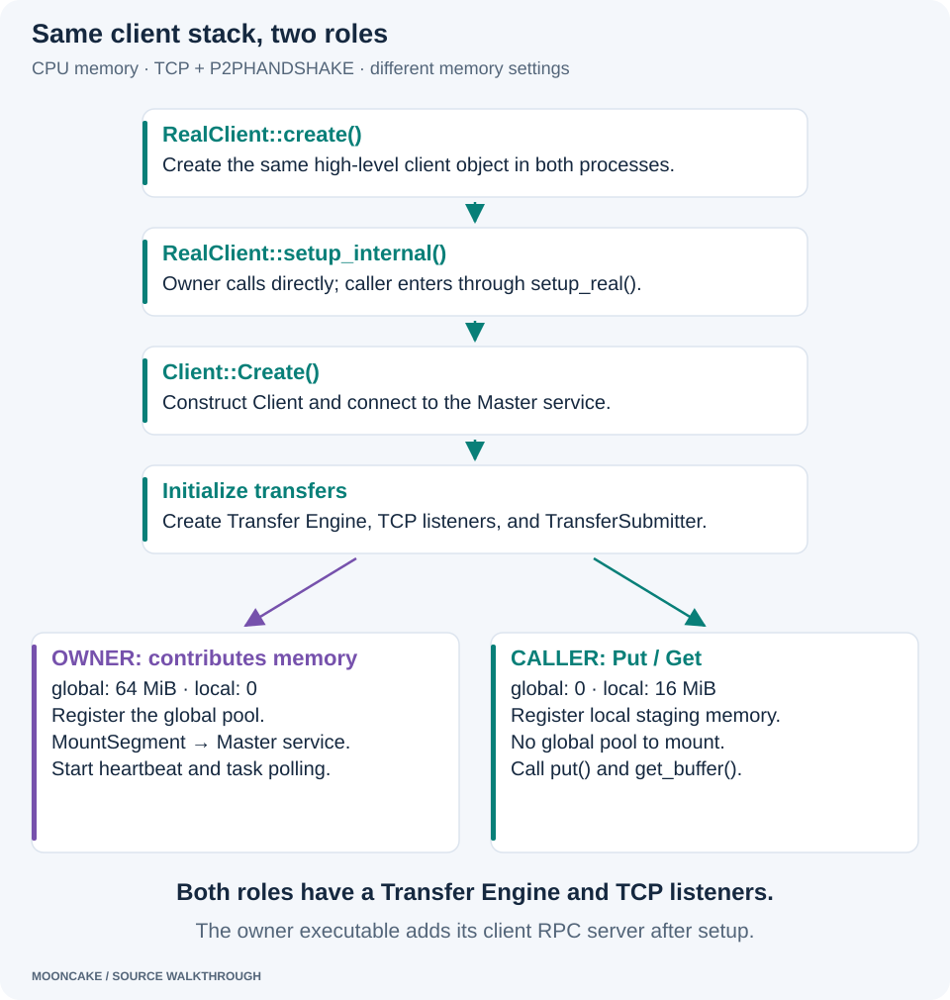
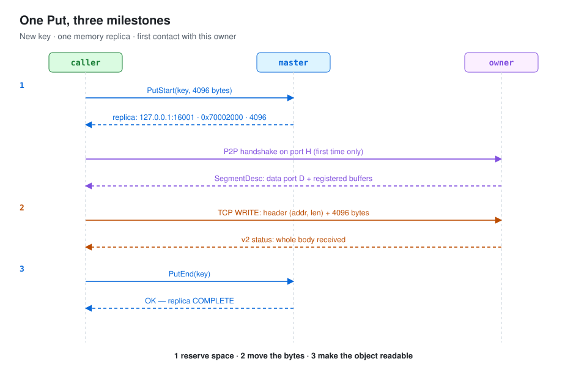
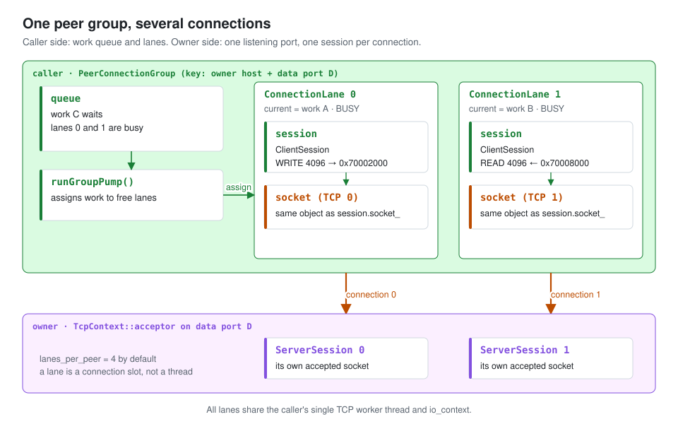
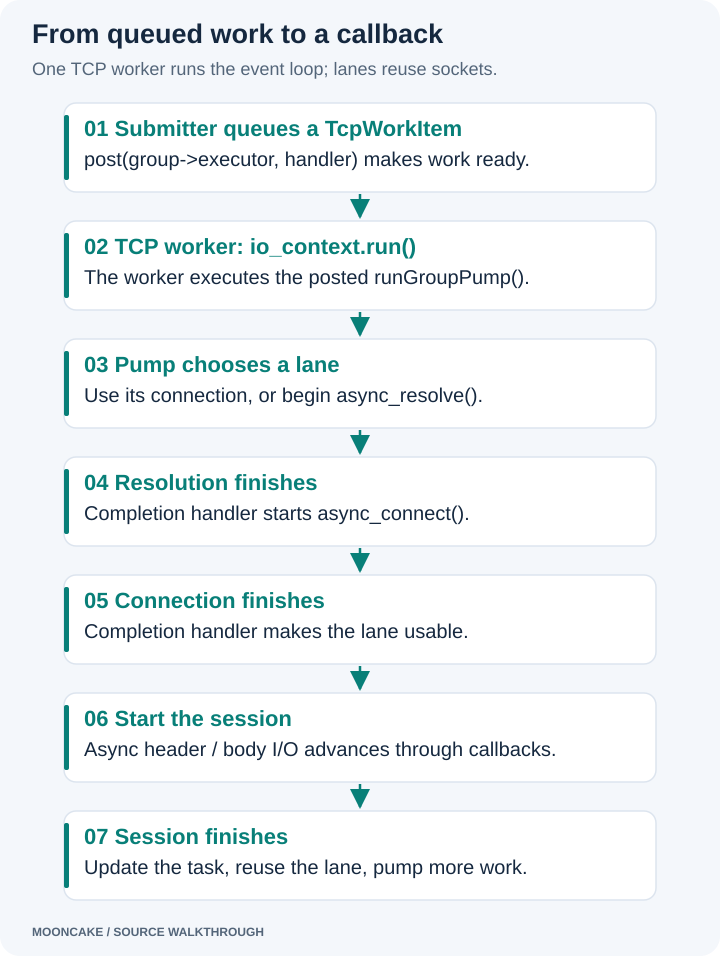
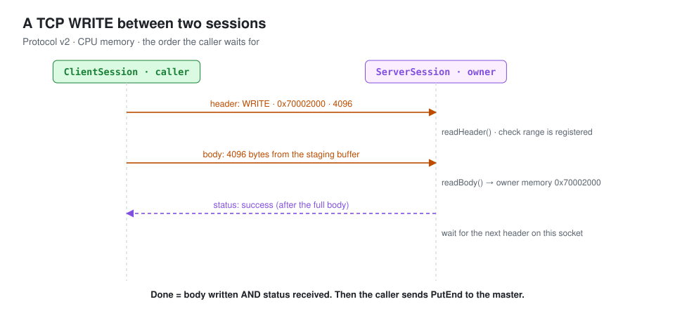
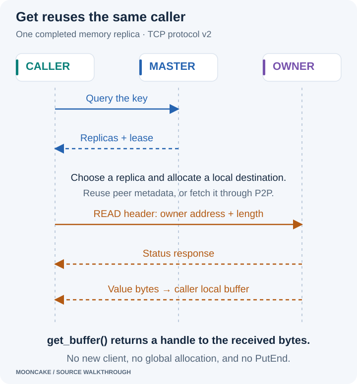

# A client that puts and gets

The Master service is running, and an owner has mounted its CPU memory.
Now we create a second client to put a value into that memory and read it
back. This article follows the application API and the TCP transfer work.

The [Master service article](mooncake_service_starting.html) explains key
metadata and replica lookup. The [owner article](mooncake_owner_starting.html)
explains the class relationships, listeners, memory registration, and mounting.
We use those same components here: CPU memory, TCP, `P2PHANDSHAKE`, and one
memory replica.

## 1. The caller and owner use the same client stack

“Owner” and “caller” are roles in this example, not different client classes.
Both use `RealClient`, `Client`, `TransferEngine`, `TransferMetadata`,
`MultiTransport`, `TcpTransport`, and `TransferSubmitter`.

The owner executable calls `RealClient::create()` and `setup_internal()`.
Our application calls `RealClient::create()` and `setup_real()`, which delegates
to the same `setup_internal()` implementation.

[](assets/client-role-workflow.svg)

The important difference is the memory configuration:

| Setting or behavior | Owner in the previous article | Put/Get caller in this article |
| --- | --- | --- |
| Global segment size | 64 MiB | 0 |
| Local staging buffer | 0 | 16 MiB |
| Transfer Engine and TCP listeners | Created | Created |
| Register local staging memory | Skipped: size is zero | Register the 16 MiB buffer |
| Register and mount a global pool | Yes | Skipped: size is zero |
| Storage heartbeat and task polling | Start after the first successful mount | Not started by this setup, which mounts no storage |

The caller still needs its own Transfer Engine. It uses its local staging
memory as the source of a Put and the destination of a Get. Contributing no
global storage does not make it an RPC-only client.

The owner program also starts its standalone client RPC service after setup.
Our application uses `RealClient` directly and does not run that executable's
RPC-server startup. Its logical name, `127.0.0.1:12346`, must differ from the
owner's name; its handshake and data ports are selected separately.

For the shared startup details, see the owner's
[class map](mooncake_owner_starting.html),
[listener setup](mooncake_owner_starting.html#4-start-the-metadata-and-tcp-listeners),
and [local-buffer setup](mooncake_owner_starting.html#5-create-the-transfer-submitter-and-local-buffer).
The method delegation is in
[`RealClient::setup_real()`](https://github.com/kvcache-ai/Mooncake/blob/719735896c86b56fabec6cf3e825fb2ea640597a/mooncake-store/src/real_client.cpp).

## 2. Run a small C++ Put/Get example

The application does not need to construct a TCP work item or call `PutStart`
itself. `RealClient` handles the lower layers.

This is a complete small caller. It creates a fresh key on each run, puts
4096 bytes, reads them back, checks the result, and removes its object. The
master and owner must already be running in the same Linux container.

Create `mooncake-store/src/blog_roundtrip.cpp` in your **Mooncake source
checkout**, with these contents:

```cpp
#include <chrono>
#include <iostream>
#include <span>
#include <string>

#include "real_client.h"

int main() {
    auto client = mooncake::RealClient::create();
    const int setup = client->setup_real(
        "127.0.0.1:12346",       // Logical name, different from the owner.
        "P2PHANDSHAKE",
        0,                      // Contribute no global storage.
        16 * 1024 * 1024,        // Local staging buffer: 16 MiB.
        "tcp", "", "127.0.0.1:50051");
    if (setup != 0) {
        std::cerr << "setup failed: " << setup << '\n';
        return 1;
    }

    const auto id = std::chrono::steady_clock::now()
                        .time_since_epoch().count();
    const std::string key = "blog/example/" + std::to_string(id);
    const std::string value(4096, 'x');
    mooncake::ReplicateConfig config;
    config.replica_num = 1;

    const int put_result = client->put(
        key, std::span<const char>(value.data(), value.size()), config);
    bool matched = false;
    if (put_result == 0) {
        // Release the returned buffer before tearing down its client.
        auto buffer = client->get_buffer(key);
        if (buffer) {
            const std::string received(
                static_cast<const char*>(buffer->ptr()), buffer->size());
            matched = received == value;
        }
    }

    const int remove_result = client->remove(key, true);
    const int close_result = client->tearDownAll();
    std::cout << "put=" << put_result << ", matched=" << matched
              << ", remove=" << remove_result
              << ", close=" << close_result << '\n';
    return put_result == 0 && matched && remove_result == 0
                   && close_result == 0 ? 0 : 1;
}
```

For the CPU build in the [environment guide](environment_setting_up.html),
add this target at the end of `mooncake-store/src/CMakeLists.txt`:

```cmake
add_executable(blog_roundtrip blog_roundtrip.cpp)
target_compile_features(blog_roundtrip PRIVATE cxx_std_20)
target_link_libraries(blog_roundtrip PRIVATE
    mooncake_store transfer_engine asio_shared
    gflags::gflags yalantinglibs::yalantinglibs)
```

Inside the Linux container, reconfigure the existing build and compile:

```bash
cmake -S /workspace/mooncake -B /workspace/build
cmake --build /workspace/build --target blog_roundtrip --parallel 2
MC_STORE_MEMCPY=0 /workspace/build/mooncake-store/src/blog_roundtrip
```

The first command reuses the CMake options from the environment guide.
`MC_STORE_MEMCPY=0` disables the Store's direct-memory-copy transfer shortcut
so the walkthrough follows the Transfer Engine path. It does not remove the
ordinary local copy into the staging buffer.

In CLion, reload CMake, select `blog_roundtrip`, and use the existing remote
toolchain and debug profile. Set `MC_STORE_MEMCPY=0` in the run configuration's
environment variables. Keep **Before launch → Build** enabled. Start the
master and owner first, then debug this target.

Source: [`RealClient` API declarations](https://github.com/kvcache-ai/Mooncake/blob/719735896c86b56fabec6cf3e825fb2ea640597a/mooncake-store/include/real_client.h).

## 3. Follow one Put

Use a new key and a 4096-byte value. The example program adds a suffix to
`blog/example` so each run follows the new-key path.

[](assets/put-sequence.svg)

1. **Prepare bytes.** `RealClient::put_internal()` allocates from
   `client_buffer_allocator_`, copies the value, and builds Store `Slice`
   records. Each slice describes a pointer and size. The buffer stays alive
   until the operation finishes.
2. **Reserve the destination.** `Client::Put()` calls
   `MasterClient::PutStart()`. The reply gives the owner's endpoint, allocated
   address, and length. See the Master's
   [Put metadata example](mooncake_service_starting.html#4-example-what-is-stored-after-put)
   for how that replica is created.
3. **Find the TCP endpoint.** `TransferWrite()` enters `TransferData()`, then
   `TransferSubmitter::submitTransferEngineOperation()`. Its `openSegment()`
   call uses the peer cache or fetches the owner's description through P2P.
   The owner's [metadata-distribution section](mooncake_owner_starting.html#how-the-descriptions-reach-the-master-and-another-client)
   explains exactly which descriptions and maps are involved.
4. **Transfer the bytes.** Submit a WRITE through the TCP connection group
   and session path described below.
5. **Finish the Store operation.** After transfer completion, `Client::Put()`
   sends `PutEnd()`. Only successful finalization completes this Put.

For example, the returned destination can be 4096 bytes at `0x70002000` in
the owner. This is an illustrative remote address, not a pointer the caller
can dereference. The owner's
[allocator explanation](mooncake_owner_starting.html#why-create-an-allocator-when-the-owner-already-allocated-memory)
shows how that range is reserved inside the already-mounted pool.

In this revision, `Client::Put()` treats `OBJECT_ALREADY_EXISTS` as success
without replacing that value. A fresh key avoids skipping the write while
debugging; replacement uses the separate upsert API.

Follow [`RealClient::put_internal()`](https://github.com/kvcache-ai/Mooncake/blob/719735896c86b56fabec6cf3e825fb2ea640597a/mooncake-store/src/real_client.cpp)
and [`Client::Put()`](https://github.com/kvcache-ai/Mooncake/blob/719735896c86b56fabec6cf3e825fb2ea640597a/mooncake-store/src/client_service.cpp)
for the application-side coordination.

## 4. Turn the Store transfer into a TCP work item

For each Store slice, `submitTransferEngineOperation()` fills a transfer
request:

| Request field | Meaning for this Put |
| --- | --- |
| `opcode` | `WRITE` |
| `source` | Pointer into the caller's staging buffer |
| `target_id` | Caller-local Transfer Engine ID for the owner |
| `target_offset` | Owner destination address plus this slice's offset |
| `length` | Number of bytes in this slice |

Despite its name, `target_offset` in this memory path contains a remote
address value. It is not simply an offset from zero.

The submitter allocates a batch ID and calls `submitTransfer()`.
`MultiTransport` routes the request to the TCP transport based on the target
description. TCP prepares transport slices and wraps work in `TcpWorkItem`.

These objects describe work at different levels:

| Object | Role |
| --- | --- |
| Store `Slice` | Describes part of the application's staged value. |
| `TransferRequest` | Describes the source, target, length, and operation. |
| `TransferTask` | Tracks completion of a submitted request. |
| TCP transport slice | Tracks the transport's piece of that request. |
| `TcpWorkItem` | Wraps one TCP transfer task for queuing and assignment to a connection lane. For example, a **WRITE task** sends 4096 bytes from caller memory to owner memory; a **READ task** receives 4096 bytes from owner memory into caller memory. Its `slice` pointer describes the operation, addresses, and byte count. |
| `TransferFuture` | Lets the Store caller wait for the transfer result. |

Creating these wrappers does not repeatedly copy the full value. The source
buffer must remain valid until the transfer has finished.

### What does a `TcpWorkItem` do? WRITE and READ examples

A `TcpWorkItem` represents one piece of TCP transfer work. Its `slice`
pointer refers to a transport `Slice`, which holds the operation, local
buffer address, remote memory address, and byte count. The work item wraps
that description so the connection group can queue and schedule it. It does
not contain the value bytes or the Store key.

Suppose the caller wants to write a new 4096-byte value and read a different,
already completed 4096-byte value from the same owner. Assume each transfer
fits in one transport slice. The following addresses are only examples.

| Field reached through `TcpWorkItem::slice` | Work A: WRITE a new value | Work B: READ an existing value |
| --- | --- | --- |
| `opcode` | `WRITE` | `READ` |
| `source_addr` | `0x10000000`: caller buffer containing bytes to send | `0x10002000`: caller buffer that will receive bytes |
| `tcp.dest_addr` | `0x70002000`: owner memory reserved for the new value | `0x70008000`: owner memory containing the existing value |
| `length` | `4096` bytes | `4096` bytes |
| Payload direction | Caller → owner | Owner → caller |

The field names can be confusing for READ: `source_addr` still identifies
**local memory**, but that memory is the destination for the received bytes.
Likewise, `tcp.dest_addr` identifies **remote memory**, which is the source
of the bytes for READ.

For **work A**, `ClientSession` sends a WRITE header and then the 4096 value
bytes. The owner's `ServerSession` receives them into owner address
`0x70002000`.

For **work B**, `ClientSession` sends a READ header asking for 4096 bytes at
owner address `0x70008000`. The owner's `ServerSession` sends those bytes
back. The caller receives them into local address `0x10002000`.

Both work items can use the same `PeerConnectionGroup` because they target
the same owner data endpoint. WRITE and READ do not need separate pools.
With two available lanes, A and B can be in progress together. Reading the
value being written by A is different: wait for that Put to complete before
issuing a Get for that value.

These are internal transfer descriptions. Application code calls `put()`
and `get_buffer()`; it does not need to construct `TcpWorkItem` itself.

### One peer group, several lanes, one socket per connected lane

**`PeerConnectionGroup` acts as a connection pool and work scheduler
for one peer data endpoint.** In this Put example, that endpoint is the
owner's host and TCP data port. The connections go to the owner that holds
the value bytes, not to the Master service. A different peer data endpoint
has its own group.

Its `lanes` vector holds `ConnectionLane` objects. Each lane can handle one
active `TcpWorkItem` through its own TCP connection. The group has three
main purposes:

- **Let transfers overlap.** With several connected lanes, several work
  items can make progress at the same time. While one lane waits for network
  I/O or an acknowledgement, another lane can continue its transfer. This
  can improve throughput and reduce waiting behind a busy connection.
- **Reuse connections.** A healthy socket can serve later work items. The
  caller avoids opening a new TCP connection for every transfer.
- **Manage waiting work and connection failures.** The group keeps bounded
  queues, assigns work to available lanes, and coordinates reconnection.
  It does not create an unlimited number of sockets when work arrives faster
  than it can be sent.

For example, suppose two lanes are connected. Work A is the WRITE above,
work B is the READ above, and work C is another WRITE to a different reserved
range on the same owner. A can use lane 0 while B uses lane 1. C waits. If B finishes first,
lane 1 can take C using its existing connection, even while A is still in
progress. Each item represents transport work; it is not necessarily an
entire application `put()` call.

More lanes do not guarantee proportionally higher throughput. The connections
still share network bandwidth, CPU time, and owner memory bandwidth. Their
purpose is to allow useful overlap while keeping connection use bounded.

[](assets/tcp-lanes.svg)

Read the diagram from top to bottom:

1. New work enters the group's `queue`. `runGroupPump()` assigns queued work
   to available lanes. In this example, lanes 0 and 1 are handling work A and
   B, while work C waits in the queue.
2. Each lane keeps its active work in `current`. Its `resolver` and `socket`
   are created when it needs to establish a connection.
3. `startLaneSession()` creates a `ClientSession` with `lane->socket`, then
   saves the session in `lane->session`. The lane's `socket` and the session's
   `socket_` are shared pointers to **the same socket object**.
4. On the owner, each accepted connection has a separate socket and
   `ServerSession`. Both connections enter through the same
   `TcpContext::acceptor` and data port. They do not need separate listening
   ports.
5. When an operation finishes successfully and the connection is reusable,
   the lane can take another work item using the same socket. A new
   `ClientSession` handles that next operation. A failed connection may need
   to be closed and reconnected.

The diagram shows two lanes for clarity. The lane count is configurable;
`ConnectionLaneState::lanes_per_peer` defaults to four. A lane is a connection
slot, not an OS thread. The group's `executor` comes from the caller's
`TcpContext::io_context`. The TCP worker runs the callbacks for all these
lanes, so their network operations can be in progress at the same time.
[Section 5](#5-how-does-rungrouppump-start-running) follows that event flow.

For the exact members, see
[`PeerConnectionGroup` and `ConnectionLane`](https://github.com/kvcache-ai/Mooncake/blob/719735896c86b56fabec6cf3e825fb2ea640597a/mooncake-transfer-engine/include/transport/tcp_transport/tcp_transport.h).
For assignment, session creation, and reuse, see
[`runGroupPump`, `startLaneSession`, and `handleLaneTerminal`](https://github.com/kvcache-ai/Mooncake/blob/719735896c86b56fabec6cf3e825fb2ea640597a/mooncake-transfer-engine/src/transport/tcp_transport/tcp_transport_lane_impl.h).

Sources: [`MultiTransport`](https://github.com/kvcache-ai/Mooncake/blob/719735896c86b56fabec6cf3e825fb2ea640597a/mooncake-transfer-engine/src/multi_transport.cpp),
[`TcpTransport::prepareTransfer` and `startTransfer`](https://github.com/kvcache-ai/Mooncake/blob/719735896c86b56fabec6cf3e825fb2ea640597a/mooncake-transfer-engine/src/transport/tcp_transport/tcp_transport.cpp).

## 5. How does `runGroupPump()` start running?

The TCP worker and event loop were started during the shared client setup.
See the owner's [TcpContext explanation](mooncake_owner_starting.html#tcpcontext-connects-the-sockets-to-the-worker)
for their relationship. Here we follow how a new transfer reaches that worker.

[](assets/asio-flow.svg)

When new work enters a connection group, this code schedules the pump:

```cpp
asio::post(group->executor, [group, pump_epoch] {
    runGroupPump(group, pump_epoch);
});
```

`post()` queues a handler. It does not jump the calling thread into
`TcpTransport::worker()`. Later, the worker already inside `io_context.run()`
executes that handler.

`runGroupPump()` is driven by events such as new work, a completed connection,
a finished session, or a retry. It is not a periodic scan of the queue.
The pump assigns queued work to available lanes. If a lane needs a
connection, it starts resolution and connection first.

### Resolve, connect, then send

`startLaneConnect()` constructs a resolver and socket using `group->executor`.
It sets the connection stage to `RESOLVING` and calls `async_resolve()`.

The word *asynchronous* means the operation can finish later. The callback is
how the application receives its result. It is not a new thread for every
request.

In the bundled Asio implementation, name resolution can use an internal
resolver worker to perform the blocking lookup. Completion is posted back to
the associated event loop. `handleLaneResolved()` then starts `async_connect()`.
`handleLaneConnected()` makes the connected lane available to the pump.

The captured `shared_ptr` values keep the group and lane alive while callbacks
are outstanding. The epoch value helps reject callbacks from an old attempt.
Those two mechanisms solve different problems: object lifetime and stale
results.

For a numeric address such as `127.0.0.1`, the resolver need not perform an
external DNS lookup. The asynchronous completion model still applies.

Sources: [`postGroupPump`, `runGroupPump`, `startLaneConnect`](https://github.com/kvcache-ai/Mooncake/blob/719735896c86b56fabec6cf3e825fb2ea640597a/mooncake-transfer-engine/src/transport/tcp_transport/tcp_transport_lane_impl.h),
[`TcpTransport::worker`](https://github.com/kvcache-ai/Mooncake/blob/719735896c86b56fabec6cf3e825fb2ea640597a/mooncake-transfer-engine/src/transport/tcp_transport/tcp_transport.cpp),
[`bundled Asio resolver implementation`](https://github.com/alibaba/yalantinglibs/blob/7801bc9ad9021781f15217552214e325a1cf7373/include/ylt/thirdparty/asio/detail/impl/resolver_service_base.ipp).

## 6. Follow the bytes through the two sessions

When a lane is connected, `startLaneSession()` constructs a `ClientSession`.
It calls `initiate()` with the source pointer, remote address, length, and
operation.

[](assets/tcp-write.svg)

The client session sends a header containing the destination address, byte
count, and operation. For `WRITE`, it then sends bytes from the source buffer.
Large transfers are sent in chunks. The key string is not needed by this
TCP memory-copy protocol: the Store already resolved the key into a replica
address.

The owner's [data-listener setup](mooncake_owner_starting.html#d-tcpcontextacceptor-listens-on-d)
explains how an accepted socket becomes a `ServerSession`. With that session
running, the next steps handle this WRITE request.

The owner's sequence is:

1. `readHeader()` reads and decodes the operation and target range.
2. The session checks the requested range against registered memory.
3. For `WRITE`, `readBody()` receives the bytes into the owner buffer.
4. With TCP protocol v2, the owner sends a success status after receiving
   the full body.
5. The session waits for another header on the reusable connection.

The range check is transport memory validation. It is not a lookup of the
object key or an authentication check for a tenant.

For v2 writes, the caller completes the operation only when its body write
has finished **and** the owner's acknowledgement has succeeded. A local
socket completion alone does not prove that the owner's receive handler
has processed the whole body. Acknowledgement reading and body writing may
overlap; the diagram shows their logical dependency.

Source: [`ClientSession`, `ServerSession`, and `TcpContext`](https://github.com/kvcache-ai/Mooncake/blob/719735896c86b56fabec6cf3e825fb2ea640597a/mooncake-transfer-engine/src/transport/tcp_transport/tcp_transport_session_impl.h).

## 7. Wait for completion and finalize

The session's terminal callback enters `handleLaneTerminal()`. It updates
transfer completion and makes a healthy connection lane available for more
work. `TransferData()` waits on the transfer future; creating a future does
not imply creating another thread.

`Client::Put()` then calls `PutEnd()`. The Master's
[finalization section](mooncake_service_starting.html#putend-make-the-replica-readable)
explains the replica state change. After this succeeds, the application call
returns and its temporary staging allocation can be released.

| Failure | What the caller observes or does |
| --- | --- |
| `PutStart` fails | No destination was returned for this write. |
| Peer discovery or TCP transfer fails | The value was not successfully transferred; the client can revoke allocated replica work through `PutRevoke`. |
| `PutEnd` fails | Bytes may already be on the owner, but Store finalization was not confirmed. |

The earlier articles cover master cleanup and owner liveness. Pausing the
owner in a debugger also pauses its I/O and heartbeats.

Source: [`handleLaneTerminal()`](https://github.com/kvcache-ai/Mooncake/blob/719735896c86b56fabec6cf3e825fb2ea640597a/mooncake-transfer-engine/src/transport/tcp_transport/tcp_transport_lane_impl.h)
and [`TransferFuture`](https://github.com/kvcache-ai/Mooncake/blob/719735896c86b56fabec6cf3e825fb2ea640597a/mooncake-store/src/transfer_task.cpp).

## 8. Follow Get for the same key

The same caller now runs `get_buffer(key)`. Its `RealClient`, Transfer Engine,
local buffer allocator, and TCP worker already exist. It does not create a
second client for the read.

[](assets/get-sequence.svg)

1. `RealClient::get_buffer_internal()` calls `Client::Query(key)`, which asks
   the Master service for readable replicas and a lease. The Master's
   [Get lookup section](mooncake_service_starting.html#5-how-does-get-find-the-same-key-and-its-replicas)
   follows the tenant, key, and replica indexes.
2. The caller uses `SelectBestReplica()` to choose a candidate. In this
   example there is one memory replica. It allocates a local destination
   from `ClientBufferAllocator` and calls `Client::Get()`.
3. The transfer path prepares a READ for that owner's address and length.
   A cached peer description and healthy TCP connection can be reused.
4. The owner's `ServerSession` handles the READ. With TCP v2 it returns a
   status before the value bytes. The caller receives the body into its
   local destination and checks transfer completion.
5. `get_buffer()` returns a buffer handle. The example checks its bytes and
   releases the handle before tearing down the client.

Get does not reserve another global replica or call `PutEnd()`. It reads the
existing completed replica. The read must complete within its lease; long
breakpoint pauses can cause lease-related failures.

Source: [`RealClient::get_buffer_internal()`](https://github.com/kvcache-ai/Mooncake/blob/719735896c86b56fabec6cf3e825fb2ea640597a/mooncake-store/src/real_client.cpp)
and [`Client::Query()`, `Client::Get()`, `TransferRead()`](https://github.com/kvcache-ai/Mooncake/blob/719735896c86b56fabec6cf3e825fb2ea640597a/mooncake-store/src/client_service.cpp).

## 9. A useful breakpoint route

Use the earlier articles for Master service and owner startup breakpoints.
Start this transfer walkthrough with a fresh caller process and a fresh key. This makes it easier to
see both the first peer handshake and the first TCP connection. With an
existing connection, some startup breakpoints will not run again.

| Process | Breakpoint | What to inspect |
| --- | --- | --- |
| Caller | `RealClient::put_internal` | Application bytes, allocated staging pointer, Store slices. |
| Caller | `TransferSubmitter::submitTransferEngineOperation` | Endpoint, target ID, source and target addresses. |
| Owner | `TransferMetadata::receivePeerMetadata` | Local description returned to the caller. |
| Caller | `TcpTransport::runGroupPump` | Pending work, lane state, pump epoch. |
| Caller | `handleLaneResolved`, `handleLaneConnected` | Resolution result, connection result, selected peer. |
| Caller | `ClientSession::writeHeader`, `writeBody` | Operation, destination address, local payload. |
| Owner | `ServerSession::readHeader`, `readBody` | Registered target range and received bytes. |
| Caller | `TcpTransport::handleLaneTerminal` | Transfer success or failure and lane reuse. |
| Caller | `RealClient::get_buffer_internal` | Read destination and returned buffer lifetime. |

At an Asio boundary, “step into” cannot follow a callback that will run later
on another thread. Set a breakpoint inside that callback and resume. If the
debugger suspends all threads in an owner process, it also stops that owner's
heartbeats and I/O progress until you resume it.

You can now connect the three original drawings: startup creates the
services; mounting makes owner memory available; Put reserves a range,
transfers bytes into it, and finalizes the object record.

[Back to the series](index.html) · [Previous: owner startup](mooncake_owner_starting.html)
