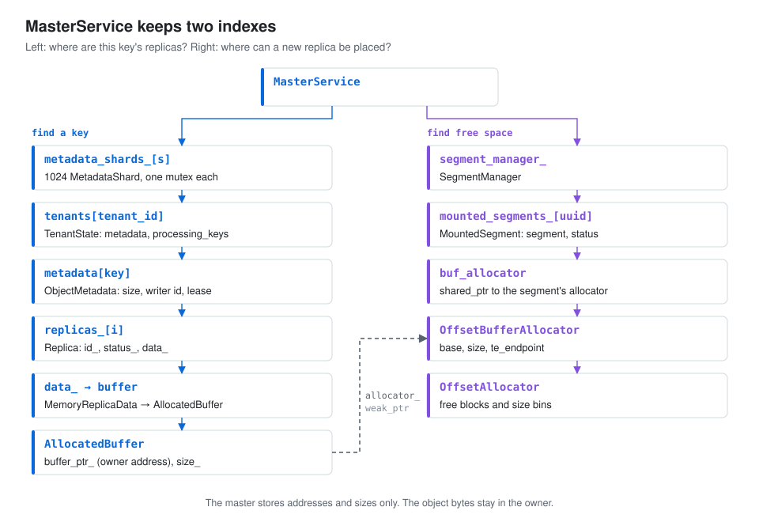
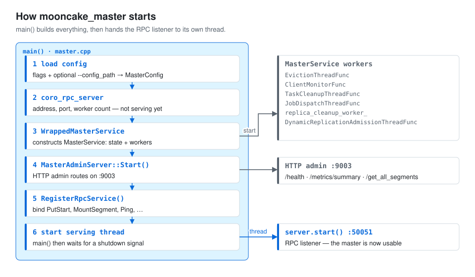
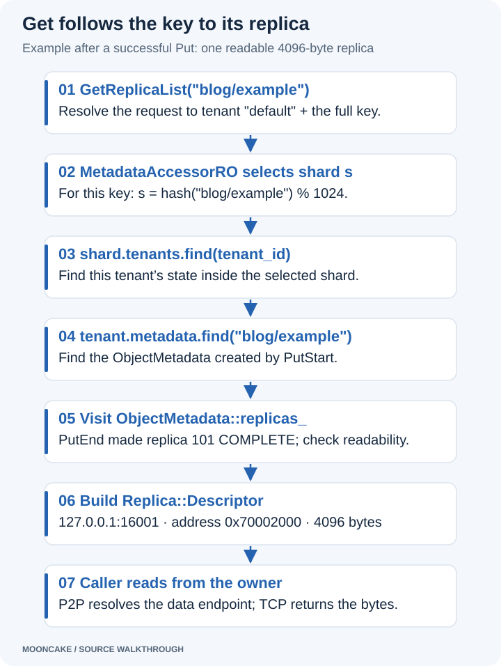

# Mooncake Master service: startup, metadata, and key lookup

The master is Mooncake's bookkeeper. It records keys, where their replicas
live, which client memory is mounted, and which clients are alive. It never
stores the object bytes: those stay in the owners' memory.

This article starts a master, walks through its startup, and then follows one
key from Put to Get through the master's data structures.

> **Setup:** one master, CPU memory, TCP. High availability (HA), snapshots
> and snapshot restore are off. The clients in later articles use
> `P2PHANDSHAKE` for Transfer Engine metadata; that is a client setting and
> does not replace the master's RPC server.

The master keeps two indexes. The left one answers **"where are this key's
replicas?"** The right one answers **"where can a new replica go?"**

[](assets/master-class-map.svg)

A few points about this map:

- `ObjectMetadata` sits between `TenantState` and `Replica`. The tenant's key
  map stores an `ObjectMetadata`, and its `replicas_` vector stores the
  replicas.
- For a memory replica, `Replica::data_` holds `MemoryReplicaData`, which owns
  an `AllocatedBuffer`.
- `AllocatedBuffer` stores an **address in the owner process**. Its
  `allocator_` is a weak reference to that segment's allocator on the master.
- `Replica::status_` is a `ReplicaStatus` enum and `Replica::id_` is a numeric
  replica ID. Neither one is the Store segment UUID.

If the container and binaries are not ready yet, start with the
[environment setup](environment_setting_up.html).

## 1. Start a master for debugging

In CLion, pick the `mooncake_master` target and the `Mooncake Debug` profile
(remote SSH toolchain, **Before launch → Build** enabled). Use these program
arguments:

```text
--rpc_address=127.0.0.1 --rpc_port=50051 --rpc_thread_num=2 --enable_ha=false --client_ttl=36000 --put_start_discard_timeout_sec=36000 --put_start_release_timeout_sec=72000 --default_kv_lease_ttl=10m --enable_metric_reporting=false
```

These are debug settings, not all upstream defaults. The very long timeouts
stop the master from cleaning things up while you sit at a breakpoint.

| Argument | Meaning here |
|---|---|
| `rpc_address=127.0.0.1` | Listen on loopback inside the container. Run the clients in the same container. |
| `rpc_port=50051` | Port for master RPC requests. |
| `rpc_thread_num=2` | Two RPC workers. The master has other threads too. |
| `enable_ha=false` | Take the single-master startup path. |
| `client_ttl=36000` | A client stays alive for ten hours without a heartbeat. |
| `put_start_discard_timeout_sec=36000` | Discard an unfinished write after ten hours. |
| `put_start_release_timeout_sec=72000` | Release that write's allocation after twenty hours. |
| `default_kv_lease_ttl=10m` | Object lease of ten minutes (stored as `600000` ms). |
| `enable_metric_reporting=false` | No periodic metric log lines. The HTTP admin server still starts. |

A **lease** is a time window that protects an object from normal eviction.
Client expiry and object leases are separate mechanisms. So are discarding an
unfinished write and releasing its allocation: they are two cleanup stages.

To run from a terminal instead, open a shell **inside the container**:

```bash
docker exec -it -u debugger mooncake-debug bash
```

Then start the master. Skip this if CLion already runs one on port 50051.

```bash
MC_RPC_PROTOCOL=tcp /workspace/build/mooncake-store/src/mooncake_master \
  --rpc_address=127.0.0.1 \
  --rpc_port=50051 \
  --rpc_thread_num=2 \
  --enable_ha=false \
  --client_ttl=36000 \
  --put_start_discard_timeout_sec=36000 \
  --put_start_release_timeout_sec=72000 \
  --default_kv_lease_ttl=10m \
  --enable_metric_reporting=false
```

`MC_RPC_PROTOCOL=tcp` forces TCP. Set the same variable in CLion if your
environment might select RDMA. Adjust the binary path if your build directory
is different.

## 2. Follow the startup sequence

Start at `main()` in [master.cpp][master]. It builds every object first and
starts serving last:

[](assets/master-startup.svg)

**Load the configuration.** `main()` parses the command-line flags and, if
`--config_path` is given, a config file. `LoadConfigFromCmdline()` then applies
the flags; explicit flags usually win over file values. The RPC port and
thread count also accept the older `port` and `max_threads` flags.
`ResolveRpcAddressFromInterfaceOrDie()` handles an optional network interface.

**Pick the startup branch.** With `enable_ha=false` there is no
`MasterServiceSupervisor`. The master uses a dummy view version of zero. (In
HA mode, a view version identifies a leadership term.)

**Construct the RPC server.** The non-HA branch creates
`coro_rpc::coro_rpc_server` with the worker count, address, port, connection
timeout and TCP_NODELAY setting. Creating it does not start serving; that
happens at the very end.

**Construct the service.** Next comes a shared `WrappedMasterService`, which
contains a `MasterService`. The configuration is narrowed at each layer:

```text
MasterConfig
  -> WrappedMasterServiceConfig
  -> MasterServiceConfig
```

See [master_config.h][config] and `WrappedMasterService::WrappedMasterService()`
in [rpc_service.cpp][rpc]. The wrapper exposes the RPC operations;
`MasterService` holds the state and does the work. Both live in the same
process.

## 3. What MasterService creates

`MasterService::MasterService()` initializes its members, checks the
configuration and starts the background workers. Read it in
[master_service.cpp][service]. Each structure answers one question:

| Structure | Question it answers |
|---|---|
| Object metadata | Which replicas belong to this key, and what state are they in? |
| `SegmentManager` | Which client memory regions are mounted and available? |
| Allocation strategy | Which segments should receive a new allocation? |
| Client liveness state | Which clients still respond? |
| `ClientTaskManager` | Which copy or move tasks are pending, running or done? |

**Object metadata.** A replica is one stored copy of an object.
`ObjectMetadata` records its size, the writer's identity, timing, pin state and
the replica list. Keys are grouped by tenant. A tenant is a logical
namespace; a single-tenant setup uses the default tenant. See `ObjectMetadata`
and `TenantState` in [master_service.h][service-header].

**Segments.** A segment is a region of client memory: base address, size,
logical name and Transfer Engine endpoint. A mounted segment also has a status
and an allocator. See `Segment` in [types.h][types] and `MountedSegment` in
[segment.h][segment-header].

**SegmentManager.** In a fresh master it is empty. Its constructor only stores
allocation settings; it does not create any large buffers. When a client later
calls `MountSegment`, `ScopedSegmentAccess::MountSegment()` creates allocator
bookkeeping for that region. With this configuration that is an
`OffsetBufferAllocator`. See [segment.cpp][segment].

The manager keeps several indexes: segment ID → mounted record, client ID →
segments, segment name → client ID, and host → available segments. They are
all empty until a client mounts memory.

**ClientTaskManager.** Its constructor stores task limits, timeouts and retry
settings. It does not start a thread. See [task_manager.h][tasks].

### From a key to its replica records

These members in [master_service.h][service-header] form one chain:

```text
MasterService::metadata_shards_             array of 1024 MetadataShard
  [shard index].tenants                     TenantId → TenantState
    [tenant ID].metadata                    string key → ObjectMetadata
      [key].replicas_                       vector<Replica>
        [replica index].data_               variant holding MemoryReplicaData
          .buffer                          unique_ptr<AllocatedBuffer>
```

Each `MetadataShard` has its own mutex. A shard is a slice of the metadata
table inside the master; it is not an owner machine. One tenant can have keys
in many shards, so a `TenantState` is that tenant's state *within one shard*.

| Structure | Members that matter here |
| --- | --- |
| `TenantState` | `metadata` holds key records; `processing_keys` tracks unfinished writes. |
| `ObjectMetadata` | `tenant_id`, `user_key`, writer `client_id`, `size`, lease timing, `replicas_`. |
| `Replica` | `id_`, `status_`, `data_` (here: `MemoryReplicaData`). |
| `MemoryReplicaData` | `buffer`, a `unique_ptr<AllocatedBuffer>`. |
| `AllocatedBuffer` | `buffer_ptr_`, `size_`, TCP `protocol`, `offset_handle_`, weak `allocator_`. |

The free-space side is a separate index. `SegmentManager::mounted_segments_`
maps `segment UUID → MountedSegment`, which holds a Store `Segment`, its status
and a shared pointer to its allocator. `allocator_manager_.allocators_` groups
the same allocator pointers by segment name, and `client_segments_` maps each
owner's client UUID to its segment UUIDs.

The two sides meet during a Put: the allocation strategy picks a segment, the
`OffsetBufferAllocator` reserves a range in it, and the resulting
`AllocatedBuffer` becomes part of a `Replica` inside the key's
`ObjectMetadata`. That is why the master can find a key without searching
every segment.

Full types: [replica structures][replica] and
[buffer and descriptor definitions][allocator-header].

## 4. Example: what Put stores

Take the default tenant, one owner and one memory replica. The key is new and
has no routing group. The application does:

```cpp
std::string key = "blog/example";
std::string value(4096, 'x');
// The configured client calls put(key, value), with one memory replica.
```

Assume the owner already mounted a 64 MiB pool at `0x70000000`, with logical
name `127.0.0.1:12345` and Transfer Engine endpoint `127.0.0.1:16001`. These
values are illustrative; real ports and addresses change on every run.

### Before Put: space exists, the key does not

The segment side already has the pool:

```text
segment_manager_.mounted_segments_[segment_uuid_A]
  segment.name        = "127.0.0.1:12345"
  segment.base        = 0x70000000
  segment.size        = 67108864
  segment.te_endpoint = "127.0.0.1:16001"
  status              = OK
  buf_allocator       → OffsetBufferAllocator for this pool
```

There is no `ObjectMetadata` for `blog/example` yet. Mounting created
capacity, not a key.

### PutStart: reserve space and insert the key

`Client::Put()` calls `PutStart()`. `MasterService::PutStart()` builds the
object identity from the tenant and key and picks its shard:

```cpp
const size_t s = std::hash<std::string>{}("blog/example") % 1024;
```

We write `s` instead of a number because `std::hash` results depend on the C++
library. What matters is that Put and Get use the same function in the same
master.

`AllocateAndInsertMetadata()` asks the allocation strategy for space.
Suppose the allocator reserves 4096 bytes at offset `0x2000`, so the owner
address is `0x70002000`. The method inserts an `ObjectMetadata` into
`tenant_state.metadata`, moves the replica into it, and adds the key to
`processing_keys`:

```text
metadata_shards_[s]
  tenants[TenantId("default")]
    processing_keys = {"blog/example"}
    metadata["blog/example"]
      tenant_id      = "default"
      user_key       = "blog/example"
      client_id      = writer_client_uuid
      size           = 4096
      replicas_[0]
        id_          = 101                 # illustrative replica ID
        status_      = PROCESSING
        data_        = MemoryReplicaData
          buffer     → AllocatedBuffer
            buffer_ptr_   = 0x70002000     # address in the owner process
            size_         = 4096
            protocol      = "tcp"
            allocator_    ⇢ same OffsetBufferAllocator (weak reference)
            offset_handle_ = reserved-range handle
```

This is a simplified debugger view, not a file format. Note that `client_id`
is the **writer** that started the Put, not necessarily the owner. The segment
side records the owner.

The master sends a replica descriptor back to the writer. The writer then
sends the bytes **directly to the owner** over TCP. The master never writes
through `buffer_ptr_`; that address only means something inside the owner.

### PutEnd: make the replica readable

When the transfer succeeds, the writer calls `PutEnd()`. The master checks the
writer's identity and completes the replica:

```text
replicas_[0].status_: PROCESSING → COMPLETE
processing_keys:      remove "blog/example"
```

Now the owner holds the 4096 bytes and the master holds everything needed to
find them.

[](assets/master-key-lookup.svg)

Follow `AllocateAndInsertMetadata()`, `PutStart()` and `PutEnd()` in
[master_service.cpp][service].

## 5. How Get finds the same key

A read enters `RealClient::get_buffer_internal()`, which calls
`Client::Query(key)`. `MasterClient::GetReplicaList()` sends the RPC. It asks
for locations only; no value bytes come back from the master.

### Resolve the identity and walk the indexes

`MasterService::GetReplicaList()` starts like this:

```cpp
const auto object_id = MakeObjectIdentityForRequest(key, tenant_id);
MetadataAccessorRO accessor(this, object_id);
```

`MakeObjectIdentityForRequest()` returns the effective tenant and the
unchanged key. Here the tenant is `TenantId::Default()`. No new UUID is
created.

`MetadataAccessorRO` is a lookup-and-lock helper, not another table. Its
constructor:

1. calls `getMetadataShardIndex(tenant_id, user_key)` to find shard `s`;
2. takes read access to that shard through `MetadataShardAccessorRO`;
3. calls `shard.tenants.find(tenant_id)`;
4. calls `tenant_state.metadata.find(user_key)`;
5. keeps the result and the lock while the service reads it.

That is exactly the path Put used:

```text
"default" + "blog/example"
  → shard s
  → tenants[TenantId("default")]
  → metadata["blog/example"]
  → replicas_[0]
  → MemoryReplicaData::buffer
  → owner address 0x70002000, length 4096
```

> **The hash picks a shard; the full key picks the object.** Different keys
> can land in the same shard, but the tenant's `unordered_map` compares full
> key strings, so they never share a record.

`getMetadataShardIndex()` first checks the routing table for a group and
falls back to tenant/key hashing when there is none. Put and Get both use it.
The shard number says nothing about which owner holds the data; that comes
from the replica.

### Only readable replicas are returned

`accessor.Exists()` checks that the key has valid metadata. Then
`GetReplicaList()` runs `IsReplicaReadable()` on each replica. A memory
replica is readable when:

- `status_ == ReplicaStatus::COMPLETE`,
- its memory allocation handle is valid, and
- the master has not marked its transport endpoint invalid.

A Put that is still `PROCESSING` is not returned. A missing or invalid object
gives `OBJECT_NOT_FOUND`; a record with no ready replica can give
`REPLICA_IS_NOT_READY`.

For each readable replica, `replica.get_descriptor()` builds a serializable
`Replica::Descriptor`. The `unique_ptr`, weak allocator reference and offset
handle stay on the master. The reader gets:

```text
Replica::Descriptor
  id     = 101
  status = COMPLETE
  descriptor_variant = MemoryDescriptor
    buffer_descriptor = AllocatedBuffer::Descriptor
      buffer_address_     = 0x70002000
      size_               = 4096
      protocol_           = "tcp"
      transport_endpoint_ = "127.0.0.1:16001"
```

`AllocatedBuffer::get_descriptor()` takes the endpoint from the allocator. The
endpoint identifies the owner; address and size identify the range inside its
memory. The master also grants a **read lease** and returns its length, so
normal reclamation does not remove the replica during a timely read.

With several replicas, the reader gets a list and its `SelectBestReplica()`
picks one. Nobody searches every owner for the key.

### Turn the location into a TCP read

The reader opens the owner's Transfer Engine endpoint. On a cache miss it
fetches the owner's `SegmentDesc` through P2P, which gives the TCP data host
and port. It then sends a READ for `0x70002000`, and the owner returns the
bytes. Three different lookups are involved:

| Lookup | Result |
| --- | --- |
| Tenant + key in the master | Readable replica descriptors. |
| Owner endpoint in the reader's Transfer Engine metadata | The owner's `SegmentDesc`, including its TCP data endpoint. |
| Object address in the owner's registered pool | The 4096 value bytes. |

So the master's `ObjectMetadata` and the Transfer Engine's `SegmentDesc` are
different things. The first maps a key to its copies. The second describes
how to reach registered memory behind an endpoint.

Sources: [`MetadataAccessorRO` and `getShardIndex()`][service-header],
[`GetReplicaList()` and `IsReplicaReadable()`][service],
[`AllocatedBuffer::get_descriptor()`][allocator-source]. The
[Put and Get article](mooncake_put-get_path.html) follows the TCP calls.

## 6. Background workers

Near the end of its constructor, `MasterService` starts these workers. They
run while `main()` continues to the admin server and RPC registration.

| Worker | What it does |
|---|---|
| `EvictionThreadFunc()` | Watches memory pressure and evicts objects; cleans up abandoned processing replicas. |
| `ClientMonitorFunc()` | Processes heartbeats, detects expired clients, cleans their segments and replicas. |
| `TaskCleanupThreadFunc()` | Prunes expired and finished tasks, expired soft pins and old dynamic-replication state. |
| `replica_cleanup_worker_` | Runs `ClearInvalidHandles()` when cleanup is scheduled. |
| `JobDispatchThreadFunc()` | Advances segment drain jobs through `ProcessDrainJobs()`. |
| `DynamicReplicationAdmissionThreadFunc()` | Processes queued proposals for extra memory replicas. |

All six start on this path, even the dynamic-replication thread when
`dynamic_replication_mode` is `off`: a running worker does not mean the
feature is active. These are C++ names; OS thread names may differ.

The replica cleanup worker sleeps until scheduled. It removes stale completed
replicas, then removes object metadata that has no valid replicas left. A
normal segment unmount can schedule it after blocking new allocations, and
repeated requests are merged; see `BackgroundWorker` in
[background_worker.h][background].

A **soft pin** is a time-based retention hint, weaker than a hard pin. The
task cleanup worker removes expired soft pins even though they are not tasks.

### How drain jobs use client tasks

A drain job moves replicas off chosen segments so those segments can be
retired. That is why both a job dispatcher and a task manager exist:

1. `CreateDrainJob()` marks the source segments `DRAINING`. They stay
   readable but accept no new allocations.
2. `ProcessDrainJobs()` checks task results and plans more work.
3. `ScheduleDrainJobTasks()` finds objects and target segments within the
   job's concurrency limit. Leases, hard pins, incomplete replicas or another
   replication in progress can block a move.
4. `CreateMoveTask()` submits a `REPLICA_MOVE` task through
   `ClientTaskManager`, assigned to the client that owns the source segment.
5. That client fetches work with `FetchTasks()` and reports back with
   `MarkTaskToComplete()`.
6. The dispatcher records the result and may retry. A segment with no
   replicas left becomes `DRAINED`.

The master coordinates; the owning client moves the data. All of these
functions are in [master_service.cpp][service].

## 7. Admin server and RPC handlers

After the service is built, `main()` creates `MasterAdminServer`, calls
`Start()`, attaches the wrapped service and marks it available. The admin
server listens on port 9003 by default, separate from RPC port 50051.

`MasterAdminServer::Start()` registers HTTP handlers and starts the HTTP
server. With `enable_metric_reporting=false` it only skips the periodic metric
log thread. See [master_admin_service.cpp][admin]. From another shell in the
container:

```bash
curl -sS http://127.0.0.1:9003/health
curl -sS http://127.0.0.1:9003/metrics/summary
curl -sS http://127.0.0.1:9003/get_all_segments
```

An empty segment list is normal before an owner mounts memory. The admin API
also offers key inspection and management operations such as drain jobs.

`RegisterRpcService()` then binds the wrapper's methods to the RPC server:
`MountSegment`, `Ping`, `PutStart`, `PutEnd`, `GetReplicaList` and more. This
only tells the server which method handles which request. See
[rpc_service.cpp][rpc].

Finally, a separate thread calls `server.start()`, and `main()` waits for a
shutdown signal or for that thread to end.

> **Note:** the log line "Master service started" is printed *before*
> `server.start()`. It does not prove that the RPC listener is ready.

## 8. Breakpoints and shutdown

Use these function breakpoints. Some names have overloads; pick the
constructor or function named here.

| Breakpoint | What to inspect |
|---|---|
| `main` in `master.cpp` | Entry, before configuration loads. |
| `LoadConfigFromCmdline` | File values, explicit flags, effective RPC settings. |
| `WrappedMasterService::WrappedMasterService` | Configuration passed to the wrapper. |
| `MasterService::MasterService` | Empty state, managers, worker startup. |
| `MasterAdminServer::Start` | HTTP routes and the metric logging condition. |
| `RegisterRpcService` | Methods attached to the RPC server. |
| `MasterService::MountSegment` | First owner registration (next article). |
| `MasterService::AllocateAndInsertMetadata` | New key, chosen allocator, `PROCESSING` replica. |
| `MasterService::PutEnd` | `COMPLETE` transition and removal from `processing_keys`. |
| `MasterService::MakeObjectIdentityForRequest` | Effective tenant and unchanged key. |
| `MasterService::MetadataAccessorRO::MetadataAccessorRO` | `shard_idx_`, tenant lookup, key iterator. |
| `MasterService::GetReplicaList` | Readable descriptors and lease length. |
| `MasterService::~MasterService` | Worker stop flags and joins at shutdown. |

Some workers run all the time. Disable their breakpoints while you inspect
something else, or they will keep interrupting you.

To stop a terminal run, press **Ctrl+C**. The SIGINT handler requests
shutdown: `main()` calls `server.stop()`, joins the serving thread, and then
destroys the admin server and the service. `MasterService` stops and wakes its
workers and joins them before it is destroyed. A debugger's force-stop kills
the process instead, so send a normal signal if you want to step through
shutdown.

[master]: https://github.com/kvcache-ai/Mooncake/blob/719735896c86b56fabec6cf3e825fb2ea640597a/mooncake-store/src/master.cpp
[config]: https://github.com/kvcache-ai/Mooncake/blob/719735896c86b56fabec6cf3e825fb2ea640597a/mooncake-store/include/master_config.h
[rpc]: https://github.com/kvcache-ai/Mooncake/blob/719735896c86b56fabec6cf3e825fb2ea640597a/mooncake-store/src/rpc_service.cpp
[service]: https://github.com/kvcache-ai/Mooncake/blob/719735896c86b56fabec6cf3e825fb2ea640597a/mooncake-store/src/master_service.cpp
[service-header]: https://github.com/kvcache-ai/Mooncake/blob/719735896c86b56fabec6cf3e825fb2ea640597a/mooncake-store/include/master_service.h
[types]: https://github.com/kvcache-ai/Mooncake/blob/719735896c86b56fabec6cf3e825fb2ea640597a/mooncake-store/include/types.h
[segment-header]: https://github.com/kvcache-ai/Mooncake/blob/719735896c86b56fabec6cf3e825fb2ea640597a/mooncake-store/include/segment.h
[segment]: https://github.com/kvcache-ai/Mooncake/blob/719735896c86b56fabec6cf3e825fb2ea640597a/mooncake-store/src/segment.cpp
[tasks]: https://github.com/kvcache-ai/Mooncake/blob/719735896c86b56fabec6cf3e825fb2ea640597a/mooncake-store/include/task_manager.h
[background]: https://github.com/kvcache-ai/Mooncake/blob/719735896c86b56fabec6cf3e825fb2ea640597a/mooncake-store/include/background_worker.h
[admin]: https://github.com/kvcache-ai/Mooncake/blob/719735896c86b56fabec6cf3e825fb2ea640597a/mooncake-store/src/master_admin_service.cpp
[replica]: https://github.com/kvcache-ai/Mooncake/blob/719735896c86b56fabec6cf3e825fb2ea640597a/mooncake-store/include/replica.h
[allocator-header]: https://github.com/kvcache-ai/Mooncake/blob/719735896c86b56fabec6cf3e825fb2ea640597a/mooncake-store/include/allocator.h
[allocator-source]: https://github.com/kvcache-ai/Mooncake/blob/719735896c86b56fabec6cf3e825fb2ea640597a/mooncake-store/src/allocator.cpp
