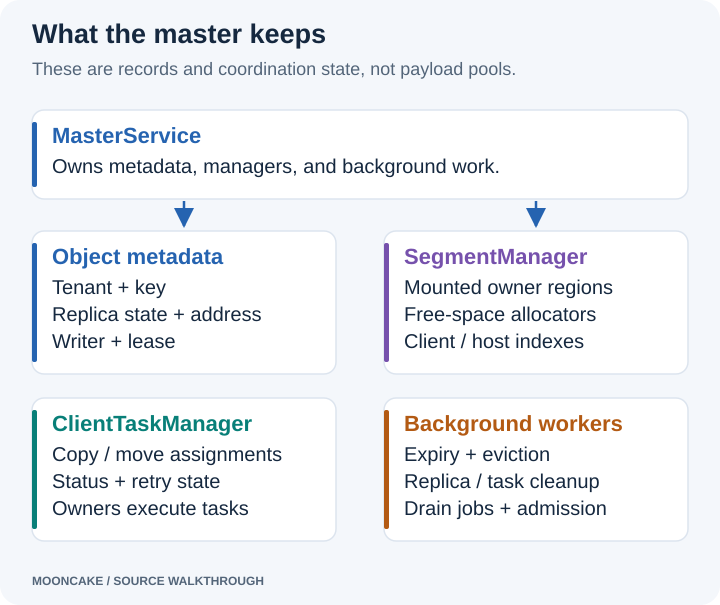

# Mooncake Master service: startup, metadata, and key lookup

The master keeps the information needed to find and manage stored objects.
It records keys, replica locations, mounted memory segments, and client state.
For the memory path in this guide, clients hold the value bytes in their own
memory. The master manages the records and available space.

This chapter follows a fresh master using CPU memory and TCP. High availability
(HA), snapshots, and snapshot restore are disabled. The following client
chapters use `P2PHANDSHAKE` for Transfer Engine metadata exchange. That setting
belongs to the client transfer setup; it does not replace the master RPC server.
RPC means remote procedure call: one process asks another process to run a
named operation.

Start with the two branches in this class map. The left branch answers
**“where are this key's replicas?”** The right branch answers
**“where can a new replica be allocated?”** Click the image for full size.

[](assets/master-class-map.svg)

`MasterService` owns both branches. `ObjectMetadata` is the link missing
between `TenantState` and `Replica` in a first sketch: the tenant's key map
stores an `ObjectMetadata`, and its `replicas_` vector stores the replicas.
For a memory replica, `Replica::data_` holds `MemoryReplicaData`, which owns
an `AllocatedBuffer`.

`AllocatedBuffer` records an address in an owner process. Its `allocator_`
is a **weak reference** to the segment's allocator on the master. The actual
object bytes remain in the owner. `Replica::status_` is a `ReplicaStatus`
enum; `Replica::id_` is a numeric replica ID. Neither is the Store segment UUID.

The source links use commit `719735896c86b56fabec6cf3e825fb2ea640597a`.
Start with the [environment setup](environment_setting_up.html) if the Linux
container and binaries are not ready. The [series index](index.html) shows the
full reading order.

## 1. Start a master for debugging

In CLion, select the `mooncake_master` target and the `Mooncake Debug` profile.
Use the remote SSH toolchain from the setup guide. Keep **Before launch →
Build** enabled. Paste these program arguments into the run configuration:

```text
--rpc_address=127.0.0.1 --rpc_port=50051 --rpc_thread_num=2 --enable_ha=false --client_ttl=36000 --put_start_discard_timeout_sec=36000 --put_start_release_timeout_sec=72000 --default_kv_lease_ttl=10m --enable_metric_reporting=false
```

These are the original debug settings for this walkthrough. They are not all
upstream defaults. The long timeouts make it easier to pause at breakpoints.

| Argument | Meaning in this example |
|---|---|
| `rpc_address=127.0.0.1` | Listen on loopback inside the Linux container. Run the example clients in that container too. |
| `rpc_port=50051` | Port used for master RPC requests. |
| `rpc_thread_num=2` | Configure two RPC workers. Other service threads also exist. |
| `enable_ha=false` | Use the single-master startup branch. |
| `client_ttl=36000` | Keep a client alive for up to ten hours without another heartbeat. |
| `put_start_discard_timeout_sec=36000` | Set the unfinished-write discard timeout to ten hours. |
| `put_start_release_timeout_sec=72000` | Set the later allocation-release timeout to twenty hours. |
| `default_kv_lease_ttl=10m` | Use a ten-minute object lease duration. The parsed field is `600000` milliseconds. |
| `enable_metric_reporting=false` | Disable periodic metric log messages. The HTTP admin server still starts. |

A lease is a time window that protects an object from ordinary eviction.
Client expiry and object leases are separate mechanisms. Likewise, discarding
an unfinished write and releasing its allocation are separate cleanup stages.

For a terminal run, open a shell **inside the container** from the Mac:

```bash
docker exec -it -u debugger mooncake-debug bash
```

Then run this command in that Linux shell. Do not start a second copy if CLion
already has a master running on port 50051.

```bash
MC_RPC_PROTOCOL=tcp /workspace/build/mooncake-store/src/mooncake_master \
  --rpc_address=127.0.0.1 \
  --rpc_port=50051 \
  --rpc_thread_num=2 \
  --enable_ha=false \
  --client_ttl=36000 \
  --put_start_discard_timeout_sec=36000 \
  --put_start_release_timeout_sec=72000 \
  --default_kv_lease_ttl=10m \
  --enable_metric_reporting=false
```

`MC_RPC_PROTOCOL=tcp` selects TCP for this run. In CLion, use the same environment
setting if an inherited environment might select RDMA. The binary path comes
from the build directory in the setup guide. Change it if your build directory
is different.

## 2. Follow the startup sequence

Start at `main()` in [master.cpp][master]. The following diagram separates
construction, registration, and serving.

[](assets/master-startup.svg)

First, `main()` parses command-line flags. If `--config_path` is supplied, it
loads the configuration file. `LoadConfigFromCmdline()` then applies command-line
settings. Explicit flags generally override file values. RPC port and thread
count also have compatibility rules for older `port` and `max_threads` flags.
`ResolveRpcAddressFromInterfaceOrDie()` handles an optional network interface.

Next, the program validates settings and selects the startup branch. This guide
uses `enable_ha=false`, so it does not create a `MasterServiceSupervisor`.
Instead, it uses a dummy view version of zero. A view version identifies a
leadership term in HA operation; that role is unnecessary here.

The non-HA branch constructs `coro_rpc::coro_rpc_server`. It passes the configured
worker count, address, port, connection timeout, and TCP_NODELAY setting. Creating
this object is one step. Calling its serving function comes later.

The next statement creates a shared `WrappedMasterService`. Its constructor
constructs a `MasterService` member. Configuration is converted along this path:

```text
MasterConfig
  -> WrappedMasterServiceConfig
  -> MasterServiceConfig
```

These types select the settings needed by each layer. See [master_config.h][config]
and `WrappedMasterService::WrappedMasterService()` in [rpc_service.cpp][rpc].
The wrapper exposes RPC-facing operations. `MasterService` owns the main state
and implements their behavior. They run in the same process.

## 3. Inspect the state created by MasterService

`MasterService::MasterService()` initializes its members, checks configuration,
and starts background work. Read it in [master_service.cpp][service].

[](assets/master-state.svg)

The main structures answer different questions:

| Structure | Question it answers |
|---|---|
| Object metadata | Which replicas belong to this key, and what is their state? |
| `SegmentManager` | Which client memory regions are mounted and available? |
| Allocation strategy | Which suitable segments should receive a new allocation? |
| Client liveness state | Which clients are still responding? |
| `ClientTaskManager` | Which copy or move tasks are pending, running, or finished? |

A replica is one stored copy of an object. `ObjectMetadata` records its size,
writer identity, timing information, pin state, and replica list. The key map is
organized within tenant state. A tenant is a logical namespace; the basic
single-tenant setup uses the default tenant. See `ObjectMetadata` and
`TenantState` in [master_service.h][service-header].

A segment describes a region supplied by a client. It includes a base address,
size, logical name, and Transfer Engine endpoint. A mounted segment also has a
status and allocator. See `Segment` in [types.h][types] and `MountedSegment` in
[segment.h][segment-header].

`SegmentManager` starts with empty indexes in this fresh run. Its constructor
stores allocation settings. It does not create the clients'
large memory buffers. When a client later calls `MountSegment`,
`ScopedSegmentAccess::MountSegment()` creates allocator bookkeeping for that
reported region. With this configuration, it uses `OffsetBufferAllocator`.
See [segment.cpp][segment].

Several indexes make different lookups possible: segment ID to mounted record,
client ID to its segments, segment name to client ID, and host to available
segments. Seeing these maps empty before clients start is expected.

`ClientTaskManager` also starts as management state. Its constructor saves task
limits, timeouts, and retry settings. It does not start a thread itself. See
[task_manager.h][tasks].

### The exact path from a key to its replica records

The relevant members in [master_service.h][service-header] form this chain:

```text
MasterService::metadata_shards_             array of 1024 MetadataShard
  [shard index].tenants                     TenantId → TenantState
    [tenant ID].metadata                    string key → ObjectMetadata
      [key].replicas_                       vector<Replica>
        [replica index].data_               variant holding MemoryReplicaData
          .buffer                          unique_ptr<AllocatedBuffer>
```

Each `MetadataShard` has its own mutex. A shard is one part of the metadata
table inside this Master service; it is not an owner machine. One tenant can
have keys in many shards, so `TenantState` here is that tenant's state within
one shard.

| Structure | Important members for this example |
| --- | --- |
| `TenantState` | `metadata` holds key records; `processing_keys` tracks unfinished writes. |
| `ObjectMetadata` | `tenant_id`, `user_key`, writer `client_id`, `size`, lease timing, and `replicas_`. |
| `Replica` | `id_`, `status_`, and `data_`; the selected data type is `MemoryReplicaData`. |
| `MemoryReplicaData` | `buffer`, a `unique_ptr<AllocatedBuffer>`. |
| `AllocatedBuffer` | `buffer_ptr_`, `size_`, TCP `protocol`, `offset_handle_`, and weak `allocator_`. |

`SegmentManager::mounted_segments_` is a different index:
`segment UUID → MountedSegment`. A `MountedSegment` combines a Store
`Segment`, its status, and a shared pointer to its allocator.
`allocator_manager_.allocators_` groups allocator pointers by logical segment
name. The mounted record and allocator manager refer to the same allocator.
`client_segments_` maps each owner client UUID to its segment UUIDs.

The allocation strategy chooses a segment, and `OffsetBufferAllocator`
reserves a range within it. The resulting `AllocatedBuffer` becomes part of
a `Replica`, which is then placed in the key's `ObjectMetadata`. The master
can therefore find a key without searching every mounted segment.

See the [replica structures][replica] and [buffer/descriptor definitions][allocator-header]
for the complete types.

## 4. Example: what is stored after Put?

Use the default tenant, one owner, and one memory replica. The key is new,
and no routing group is assigned. The application calls:

```cpp
std::string key = "blog/example";
std::string value(4096, 'x');
// The configured client calls put(key, value), with one memory replica.
```

Assume the owner has already mounted a 64 MiB pool at `0x70000000`. Its
logical segment name is `127.0.0.1:12345`, and its Transfer Engine handshake
endpoint is `127.0.0.1:16001`. These addresses and IDs are illustrative; the
actual port and allocation addresses vary by run.

### Before Put: capacity exists, but the key does not

The master's segment branch already contains a mounted pool:

```text
segment_manager_.mounted_segments_[segment_uuid_A]
  segment.name        = "127.0.0.1:12345"
  segment.base        = 0x70000000
  segment.size        = 67108864
  segment.te_endpoint = "127.0.0.1:16001"
  status              = OK
  buf_allocator       → OffsetBufferAllocator for this pool
```

There is no `ObjectMetadata` for `blog/example` yet. Mounting the owner
created capacity, not a key/value entry.

### PutStart: reserve space and insert the key record

`Client::Put()` asks the master to reserve space through `PutStart()`.
`MasterService::PutStart()` constructs the request's object identity from
the tenant and key and determines its metadata shard.

For our default-tenant key with no routing group, the shard index is:

```cpp
const size_t s = std::hash<std::string>{}("blog/example") % 1024;
```

The diagram and snapshots use `s` rather than inventing a fixed number.
The numeric result of `std::hash` can depend on the C++ library. Put and Get
use the same routing function in the same Master service.

`AllocateAndInsertMetadata()` asks the allocation strategy for a memory
replica. Suppose the allocator reserves 4096 bytes at offset `0x2000`, giving
owner address `0x70002000`. The method inserts an `ObjectMetadata` into
`tenant_state.metadata`, moves the replica into it, and inserts the key into
`processing_keys`.

This is a simplified debugger view, not a serialized file format:

```text
metadata_shards_[s]
  tenants[TenantId("default")]
    processing_keys = {"blog/example"}
    metadata["blog/example"]
      tenant_id      = "default"
      user_key       = "blog/example"
      client_id      = writer_client_uuid
      size           = 4096
      replicas_[0]
        id_          = 101                 # illustrative replica ID
        status_      = PROCESSING
        data_        = MemoryReplicaData
          buffer     → AllocatedBuffer
            buffer_ptr_   = 0x70002000     # address in the owner process
            size_         = 4096
            protocol      = "tcp"
            allocator_    ⇢ same OffsetBufferAllocator (weak reference)
            offset_handle_ = reserved-range handle
```

`client_id` identifies the **writer** that began the Put. It is not necessarily
the owner holding the replica. The segment branch records the owner.

The master returns a replica descriptor to the writer. The writer then sends
the bytes directly to the owner over TCP. The master never writes through
`buffer_ptr_`; that address is meaningful in the owner process.

### PutEnd: make the replica readable

After the transfer succeeds, the writer calls `PutEnd()`. The master verifies
the writer identity and completes the targeted replica. For this one-replica
example, the changes are:

```text
replicas_[0].status_: PROCESSING → COMPLETE
processing_keys:      remove "blog/example"
```

The key, replica ID, address, and length remain associated in the same metadata
record. At the end of a successful Put, the owner holds the 4096 value bytes,
and the master holds the information needed to find them.

[](assets/master-key-lookup.svg)

Follow `AllocateAndInsertMetadata()`, `PutStart()`, and `PutEnd()` in
[master_service.cpp][service] for the insert and state transitions.

## 5. How does Get find the same key and its replicas?

The high-level read enters `RealClient::get_buffer_internal()`, which calls
`Client::Query(key)`. `MasterClient::GetReplicaList()` sends the request to
the Master service. This RPC asks for locations; it does not return the
object's value bytes.

### Resolve the object identity and follow the indexes

Your screenshot shows the start of `MasterService::GetReplicaList()`:

```cpp
const auto object_id = MakeObjectIdentityForRequest(key, tenant_id);
MetadataAccessorRO accessor(this, object_id);
```

`MakeObjectIdentityForRequest()` returns the effective tenant ID and the
unchanged user key. In this single-tenant setup, the effective tenant is
`TenantId::Default()`. This identity is not a new UUID.

`MetadataAccessorRO` is a lookup-and-lock helper, not another metadata table.
Its constructor performs these steps:

1. Call `getMetadataShardIndex(tenant_id, user_key)` to find shard `s`.
2. Acquire read access to that shard through `MetadataShardAccessorRO`.
3. Call `shard.tenants.find(tenant_id)` to locate the tenant's state.
4. Call `tenant_state.metadata.find(user_key)` to locate `ObjectMetadata`.
5. Keep the lookup result and lock available while the service reads it.

For the example, this resolves the same path used by Put:

```text
"default" + "blog/example"
  → shard s
  → tenants[TenantId("default")]
  → metadata["blog/example"]
  → replicas_[0]
  → MemoryReplicaData::buffer
  → owner address 0x70002000, length 4096
```

**The hash chooses a shard; the full key identifies the object.** Different
keys can hash to the same shard. They still occupy distinct entries in the
tenant's `unordered_map`, which compares the actual key strings. A hash
collision does not mean two keys share an object record.

This example has no group routing. The real `getMetadataShardIndex()` first
checks the routing table, then uses ordinary tenant/key hashing when no group
is assigned. Both Put and Get use this helper. The shard number does not
identify an owner or encode a memory address; those come from the replica.

### Return readable replicas, not every recorded replica

`accessor.Exists()` checks that the key has valid metadata.
`GetReplicaList()` then visits `metadata.replicas_` and applies
`IsReplicaReadable()` to each replica. For a memory replica, it requires:

- `status_ == ReplicaStatus::COMPLETE`;
- a valid memory allocation handle;
- a transport endpoint not marked invalid by the master.

If a new Put is still `PROCESSING`, its sole replica is not returned as a
readable result. A missing/invalid object returns `OBJECT_NOT_FOUND`; a
record with no ready replica can return `REPLICA_IS_NOT_READY`. The exact
error depends on the record's state.

For each readable replica, `replica.get_descriptor()` produces a serializable
`Replica::Descriptor`. The in-memory `unique_ptr`, weak allocator reference,
and offset handle are not sent to the reader. For our completed replica, the
response contains this simplified structure:

```text
Replica::Descriptor
  id     = 101
  status = COMPLETE
  descriptor_variant = MemoryDescriptor
    buffer_descriptor = AllocatedBuffer::Descriptor
      buffer_address_     = 0x70002000
      size_               = 4096
      protocol_           = "tcp"
      transport_endpoint_ = "127.0.0.1:16001"
```

`AllocatedBuffer::get_descriptor()` obtains the endpoint from the associated
allocator. The endpoint identifies the owner; the address and size identify
the allocated range within its memory. The master also grants a read lease
and returns its duration so ordinary reclamation does not remove the replica
while a timely read is in progress.

If the key has several replicas, the same lookup returns a list of readable
descriptors. The caller's `SelectBestReplica()` chooses a candidate from that
list. It does not search every owner for the key.

### Convert the replica location into a TCP read

The reader opens the owner's Transfer Engine endpoint. On a metadata cache
miss, it fetches the owner's `SegmentDesc` through P2P. That description gives
the TCP data host and port; the replica descriptor gives the object's address
and length. The reader sends a READ request to that data endpoint, and the
owner returns the bytes from `0x70002000`.

These are three separate lookups:

| Lookup | Result |
| --- | --- |
| Tenant + key in the Master service | The object's readable replica descriptors. |
| Owner endpoint in the reader's Transfer Engine metadata | Owner `SegmentDesc`, including its TCP data endpoint. |
| Object address in the owner's registered pool | The actual 4096 value bytes. |

The Master service's `ObjectMetadata` is therefore different from the Transfer
Engine's `SegmentDesc`. The first maps a key to stored copies. The second
describes how to reach registered memory at an engine endpoint.

See [`MetadataAccessorRO` and `getShardIndex()`][service-header],
[`GetReplicaList()` and `IsReplicaReadable()`][service], and
[`AllocatedBuffer::get_descriptor()`][allocator-source]. The
[Put/Get walkthrough](mooncake_put-get_path.html) follows the remaining TCP calls.

## 6. Background workers start before RPC serving

Near the end of `MasterService` construction, these workers start. They can run
while `main()` continues toward admin startup and RPC registration.

| Worker function or component | Work it performs |
|---|---|
| `EvictionThreadFunc()` | Checks memory pressure and selects objects for eviction. It also handles cleanup of abandoned processing replicas. |
| `ClientMonitorFunc()` | Processes heartbeat records, detects expired clients, and cleans affected segments and replicas. |
| `TaskCleanupThreadFunc()` | Prunes expired and finished tasks, expired soft pins, and old dynamic-replication state. |
| `replica_cleanup_worker_` | Runs `ClearInvalidHandles()` when cleanup is scheduled. |
| `JobDispatchThreadFunc()` | Advances segment drain jobs through `ProcessDrainJobs()`. |
| `DynamicReplicationAdmissionThreadFunc()` | Processes queued proposals for additional memory replicas. |

All six start on the basic path. The dynamic-replication thread starts even when
`dynamic_replication_mode` is `off`; starting a worker does not mean the feature
is generating requests. These are C++ function/component names. The operating
system's displayed thread names may differ.

The replica cleanup worker sleeps until scheduled. Its callback removes stale
completed replicas, then removes object metadata when no valid replicas remain.
Ordinary non-HA segment unmount can schedule this work after preventing new
allocations. The helper combines repeated pending cleanup requests; see
`BackgroundWorker` in [background_worker.h][background].

A soft pin is an additional time-based retention preference. It differs from a
hard pin, which has stronger protection. Expired soft-pin bookkeeping is cleaned
by the task cleanup worker, even though it is not itself a client task.

### How drain jobs use client tasks

A drain job moves replicas away from selected segments so those segments can be
taken out of use. This explains why both a job dispatcher and a task manager
exist.

1. `CreateDrainJob()` marks source segments `DRAINING`. They remain readable but
   stop accepting new allocations.
2. `ProcessDrainJobs()` checks current task results and plans more work.
3. `ScheduleDrainJobTasks()` finds eligible objects and target segments. It
   respects the job's concurrency limit. Leases, hard pins, incomplete replicas,
   or another replication operation can block a move.
4. `CreateMoveTask()` submits a `REPLICA_MOVE` task through `ClientTaskManager`.
   It assigns the task to the client that owns the source segment.
5. That client fetches assigned work through `FetchTasks()` and reports completion
   through `MarkTaskToComplete()`.
6. The dispatcher records successes or failures and may retry. Segments with no
   remaining replicas become `DRAINED`.

The dispatcher coordinates this process. The owning client performs the data
movement. A drain job can contain many individual tasks. These functions are
all in [master_service.cpp][service].

## 7. Start the admin server and register RPC handlers

After service construction, `main()` creates `MasterAdminServer` and calls
`Start()`. It then attaches the wrapped service and marks it available.
The default admin port is 9003. This is separate from RPC port 50051.

`MasterAdminServer::Start()` registers HTTP handlers and starts the HTTP server.
With `enable_metric_reporting=false`, it skips only the periodic metric logging
thread. HTTP routes remain available. See [master_admin_service.cpp][admin].

From another Linux shell in the same container, inspect the running service:

```bash
curl -sS http://127.0.0.1:9003/health
curl -sS http://127.0.0.1:9003/metrics/summary
curl -sS http://127.0.0.1:9003/get_all_segments
```

An empty segment list is normal before an owner mounts memory. The admin service
also provides key inspection and management operations such as drain jobs.

Next, `RegisterRpcService()` binds methods on the existing wrapper to the RPC
server. Examples include `MountSegment`, `Ping`, `PutStart`, `PutEnd`, and
`GetReplicaList`. Registration tells the server which method handles each
request. It does not create another master service. See [rpc_service.cpp][rpc].

Finally, a separate thread calls `server.start()`. Main waits for either a
shutdown signal or the serving thread to finish. The early log line saying
“Master service started” appears before this call, so that line alone does not
prove the RPC listener is ready.

## 8. Breakpoints and shutdown

Use these source symbols as breakpoints. Function breakpoints can show overloads;
select the constructor or function named in the table.

| Breakpoint | What to inspect |
|---|---|
| `main` in `master.cpp` | Entry point before configuration is loaded. |
| `LoadConfigFromCmdline` | File values, explicit flags, and effective RPC settings. |
| `WrappedMasterService::WrappedMasterService` | Configuration passed into the wrapper. |
| `MasterService::MasterService` | Empty state, manager members, and worker startup. |
| `MasterAdminServer::Start` | HTTP routes and the metric logging condition. |
| `RegisterRpcService` | Wrapper methods attached to the RPC server. |
| `MasterService::MountSegment` | First owner registration, covered next. |
| `MasterService::AllocateAndInsertMetadata` | The new key, selected allocator, and `PROCESSING` replica. |
| `MasterService::PutEnd` | Replica transition to `COMPLETE` and removal of the processing marker. |
| `MasterService::MakeObjectIdentityForRequest` | Effective tenant ID and unchanged key. |
| `MasterService::MetadataAccessorRO::MetadataAccessorRO` | `shard_idx_`, tenant lookup, and key iterator. |
| `MasterService::GetReplicaList` | Readable descriptors and returned lease duration. |
| `MasterService::~MasterService` | Worker stop flags and joins during shutdown. |

Some workers run continuously. Disable their breakpoints when inspecting another
path, or they may repeatedly interrupt the session.

For the foreground terminal run, press **Ctrl+C**. The SIGINT handler requests
shutdown. Main calls `server.stop()` and joins the serving thread. Leaving the
scope destroys the admin server and wrapped service. The admin destructor stops
HTTP service. `MasterService` stops helper workers, wakes sleeping threads, and
joins its workers before destruction finishes.

A debugger's force-stop action may terminate the process directly. Use a normal
signal when you want to step through this shutdown path.

Next: [start an owner client and mount its memory](mooncake_owner_starting.html).

[master]: https://github.com/kvcache-ai/Mooncake/blob/719735896c86b56fabec6cf3e825fb2ea640597a/mooncake-store/src/master.cpp
[config]: https://github.com/kvcache-ai/Mooncake/blob/719735896c86b56fabec6cf3e825fb2ea640597a/mooncake-store/include/master_config.h
[rpc]: https://github.com/kvcache-ai/Mooncake/blob/719735896c86b56fabec6cf3e825fb2ea640597a/mooncake-store/src/rpc_service.cpp
[service]: https://github.com/kvcache-ai/Mooncake/blob/719735896c86b56fabec6cf3e825fb2ea640597a/mooncake-store/src/master_service.cpp
[service-header]: https://github.com/kvcache-ai/Mooncake/blob/719735896c86b56fabec6cf3e825fb2ea640597a/mooncake-store/include/master_service.h
[types]: https://github.com/kvcache-ai/Mooncake/blob/719735896c86b56fabec6cf3e825fb2ea640597a/mooncake-store/include/types.h
[segment-header]: https://github.com/kvcache-ai/Mooncake/blob/719735896c86b56fabec6cf3e825fb2ea640597a/mooncake-store/include/segment.h
[segment]: https://github.com/kvcache-ai/Mooncake/blob/719735896c86b56fabec6cf3e825fb2ea640597a/mooncake-store/src/segment.cpp
[tasks]: https://github.com/kvcache-ai/Mooncake/blob/719735896c86b56fabec6cf3e825fb2ea640597a/mooncake-store/include/task_manager.h
[background]: https://github.com/kvcache-ai/Mooncake/blob/719735896c86b56fabec6cf3e825fb2ea640597a/mooncake-store/include/background_worker.h
[admin]: https://github.com/kvcache-ai/Mooncake/blob/719735896c86b56fabec6cf3e825fb2ea640597a/mooncake-store/src/master_admin_service.cpp
[replica]: https://github.com/kvcache-ai/Mooncake/blob/719735896c86b56fabec6cf3e825fb2ea640597a/mooncake-store/include/replica.h
[allocator-header]: https://github.com/kvcache-ai/Mooncake/blob/719735896c86b56fabec6cf3e825fb2ea640597a/mooncake-store/include/allocator.h
[allocator-source]: https://github.com/kvcache-ai/Mooncake/blob/719735896c86b56fabec6cf3e825fb2ea640597a/mooncake-store/src/allocator.cpp
