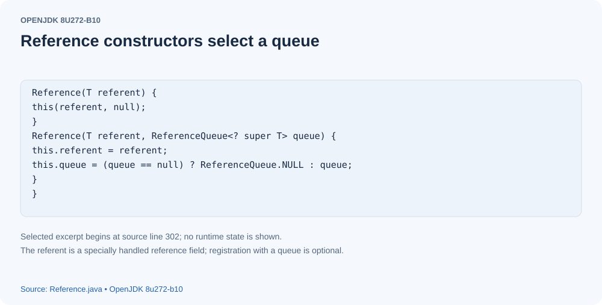
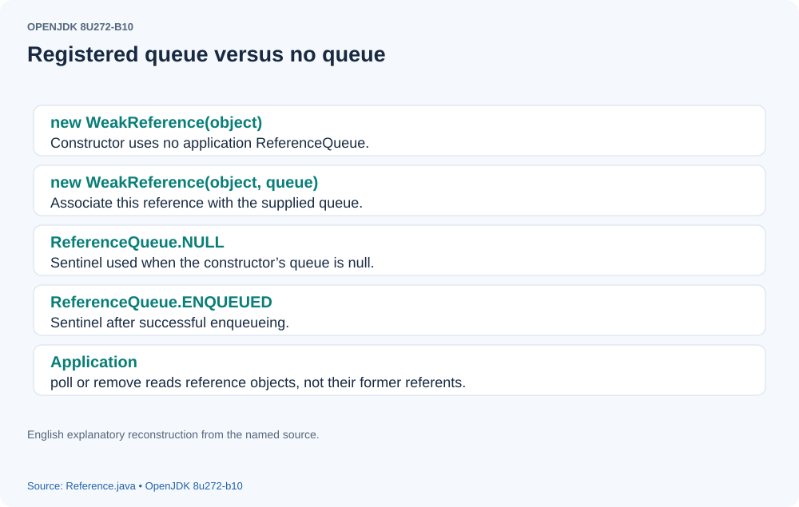
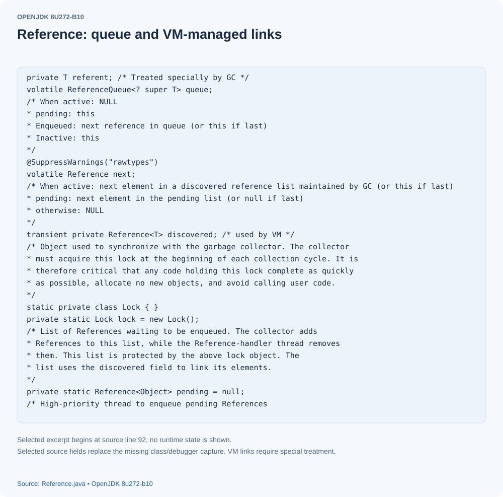
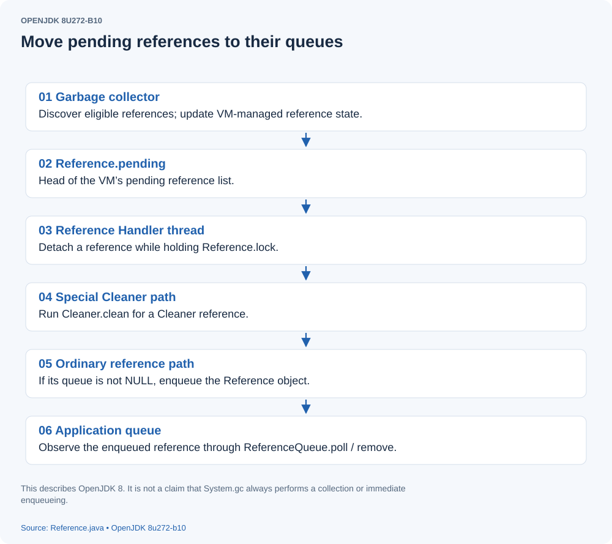
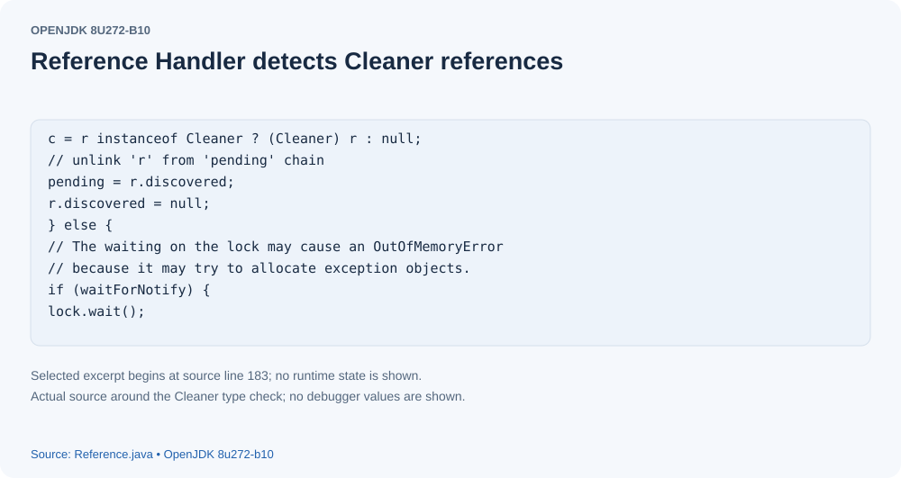
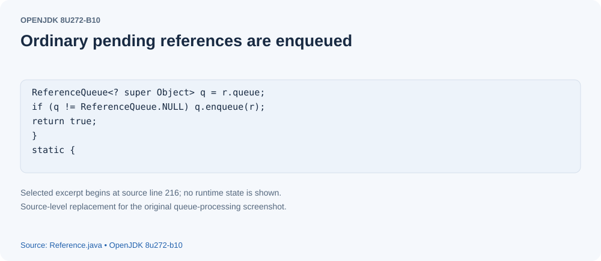
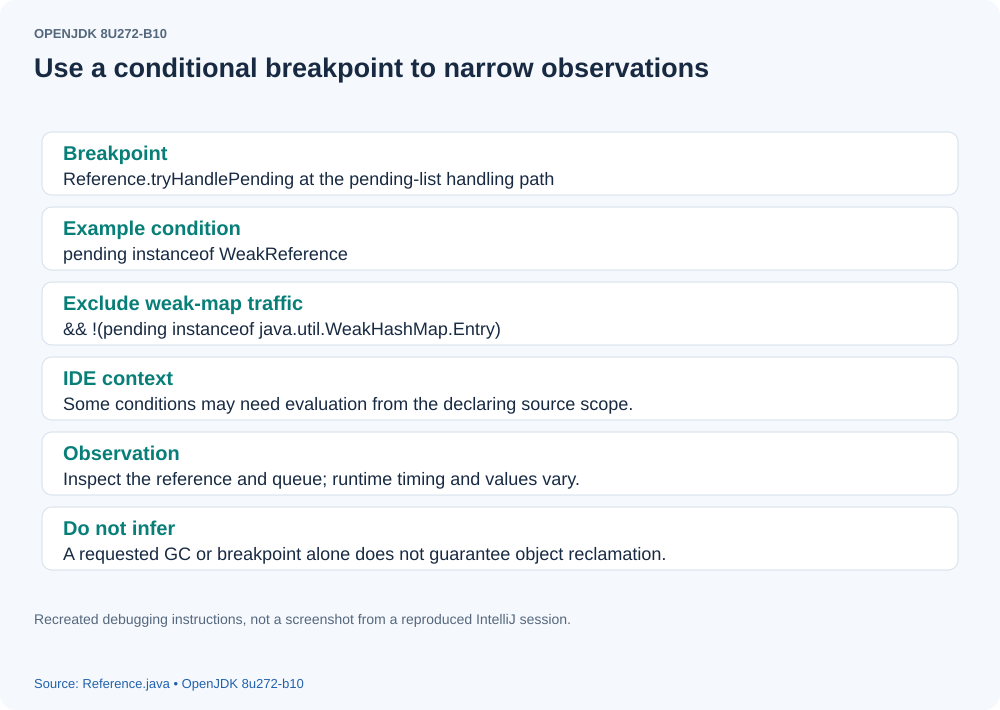

# How Java Processes Soft, Weak, and Phantom References

## Background
Java distinguishes four kinds of reference: strong, soft, weak, and phantom. Strong references are the ones we use most often. For example, in `Object obj = new Object()`, `obj` is a strong reference to the newly created object. `SoftReference`, `WeakReference`, and `PhantomReference` all extend the abstract `Reference` class.

## Creating references

```

ReferenceQueue referenceQueue = new ReferenceQueue();
Object obj = new Object();
SoftReference sr = new SoftReference(obj,referenceQueue);
WeakReference wr = new WeakReference(obj,referenceQueue);
PhantomReference pr = new PhantomReference(obj,referenceQueue);

```

The three reference types have similar construction APIs. A `ReferenceQueue` is optional for soft and weak references; when none is supplied, the parent `Reference` class uses its null-queue sentinel: [](assets/java-reference-processing-01.svg)
[](assets/java-reference-processing-02.svg)

## Purpose

Objects referenced only through these special references can become eligible for collection once the appropriate reachability conditions are met. A softly reachable object may be retained according to the collector's policy; soft references are cleared before the VM throws an out-of-memory error. Weak references are cleared when the collector determines that their referents are weakly reachable. Phantom references become eligible for enqueueing after their referents are phantom reachable; in this JDK 8 implementation a phantom reference does not automatically clear its referent. These transitions do not guarantee immediate physical reclamation. `SoftReference.get()` and `WeakReference.get()` can return the referent while it remains available, whereas `PhantomReference.get()` always returns `null`. Registered reference objects are eventually enqueued, allowing application code to obtain the reference object and perform its own cleanup logic. It is the reference object, not the referent, that appears in the queue.

## Reference processing
- Reference 
This class also acts as a linked-list node in the VM's reference-processing machinery.
[](assets/java-reference-processing-03.svg)

- ReferenceHandler
`ReferenceHandler` is an inner class of `Reference` that extends `Thread`.

The static initializer of `Reference` starts this thread:

```

 static {
        ThreadGroup tg = Thread.currentThread().getThreadGroup();
        for (ThreadGroup tgn = tg;
             tgn != null;
             tg = tgn, tgn = tg.getParent());
        Thread handler = new ReferenceHandler(tg, "Reference Handler");
        /* If there were a special system-only priority greater than
         * MAX_PRIORITY, it would be used here
         */
        handler.setPriority(Thread.MAX_PRIORITY);
        handler.setDaemon(true);
        handler.start();

        // provide access in SharedSecrets
        SharedSecrets.setJavaLangRefAccess(new JavaLangRefAccess() {
            @Override
            public boolean tryHandlePendingReference() {
                return tryHandlePending(false);
            }
        });
    }

```

Its `run` method is:

```

 public void run() {
            while (true) {
                tryHandlePending(true);
            }
        }

```

What happens in `tryHandlePending`?

```

 static boolean tryHandlePending(boolean waitForNotify) {
        Reference<Object> r;
        Cleaner c;
        try {
            synchronized (lock) {
                if (pending != null) {
                    r = pending;
                    // 'instanceof' might throw OutOfMemoryError sometimes
                    // so do this before un-linking 'r' from the 'pending' chain...
                    c = r instanceof Cleaner ? (Cleaner) r : null;
                    // unlink 'r' from 'pending' chain
                    pending = r.discovered;
                    r.discovered = null;
                } else {
                    // The waiting on the lock may cause an OutOfMemoryError
                    // because it may try to allocate exception objects.
                    if (waitForNotify) {
                        lock.wait();
                    }
                    // retry if waited
                    return waitForNotify;
                }
            }
        } catch (OutOfMemoryError x) {
            // Give other threads CPU time so they hopefully drop some live references
            // and GC reclaims some space.
            // Also prevent CPU intensive spinning in case 'r instanceof Cleaner' above
            // persistently throws OOME for some time...
            Thread.yield();
            // retry
            return true;
        } catch (InterruptedException x) {
            // retry
            return true;
        }

        // Fast path for cleaners
        if (c != null) {
            c.clean();
            return true;
        }

        ReferenceQueue<? super Object> q = r.queue;
        if (q != ReferenceQueue.NULL) q.enqueue(r);
        return true;
    }

```

This is the central method: understanding it explains how references discovered by the collector are handed over to cleanup code or an application queue.
Inside the synchronized block, the method first tests whether `pending` is empty. If it is empty, the handler waits. The field is declared in `Reference` as follows:

```

 private static Reference<Object> pending = null;

```

Its initial value is `null`. Who assigns it, and when?
The JVM populates `pending` while processing references discovered by garbage collection. The field points to the head reference; the remaining references are connected through their `discovered` fields. Each call to `tryHandlePending` removes and processes one reference from that list.
[](assets/java-reference-processing-04.svg)
How is each reference processed? If it is a `Cleaner`, the handler calls its `clean` method.
[](assets/java-reference-processing-05.svg)
`Cleaner` extends `PhantomReference`. `DirectByteBuffer` uses it to release native memory; that separate mechanism is beyond this article's scope. For a reference that is not a `Cleaner`, the handler enqueues it on its registered `ReferenceQueue`, unless the queue is the null sentinel.
[](assets/java-reference-processing-06.svg)
Application code can then retrieve the reference from its `ReferenceQueue`.
This completes the processing path. The following experiment demonstrates it.

## Experiment

```

        Object obj = new Object();
        ReferenceQueue referenceQueue = new ReferenceQueue();
        WeakReference weakReference = new WeakReference(obj,referenceQueue);
        WeakReference weakReference2 = new WeakReference(obj,referenceQueue);
        WeakReference weakReference3 = new WeakReference(obj,referenceQueue);

        System.out.println(weakReference.get());
        System.out.println(referenceQueue.poll());
        obj = null ;
        System.gc();
        System.out.println("before isEnqueue----"+weakReference.isEnqueued());

        Thread.sleep(1000);
        System.out.println("after isEnqueue----"+weakReference.isEnqueued());

        Reference t = referenceQueue.poll() ;
        System.out.println(t);

        System.out.println(weakReference.get());

```


The example creates an object with a strong reference `obj`, then creates three weak references to it. Initially, `weakReference.get()` can retrieve the object, and `referenceQueue.poll()` returns no queued reference. Setting `obj = null` removes this particular strong reference, and `System.gc()` requests collection. If the object is weakly reachable and the VM performs the requested work, the three weak references are cleared and later become available through the queue. The background `ReferenceHandler` makes enqueueing asynchronous, so the first `before isEnqueue` print may be `false`; sleeping for one second gives the handler time to run, and the later print may be `true`. Neither the GC request nor a fixed sleep guarantees these observations. Calling `poll()` up to three times can retrieve the three registered weak reference objects once they have been enqueued. `isEnqueued()` reports queue membership, not a guarantee that the referent's storage has already been reclaimed.

Tip: to watch these weak references being enqueued in `tryHandlePending`, use a conditional debugger breakpoint.
[](assets/java-reference-processing-07.svg)
The IDEA condition in the figure is `pending instanceof WeakReference && !(pending instanceof WeakHashMap.Entry)`. The VM and libraries also use many references of these types, so filtering avoids stepping through numerous unrelated references before reaching this experiment.


## Source version and reconstructed figures

This article describes OpenJDK internals, not a Netty class. The original claims of immediate reclamation and a guaranteed full GC have been corrected to distinguish reachability, reference clearing, enqueueing, and physical reclamation. JDK 8 phantom references have different clearing semantics from later JDKs. The code uses the JDK 8 pending-list implementation; later JDK reference processing should not be inferred from it.

The original externally hosted images are replaced in their original positions by English source-derived diagrams or source cards. They are explanatory reconstructions, not recovered debugger screenshots.

Source baseline: OpenJDK 8u272-b10 (October 2020).

- [Reference.java](https://github.com/openjdk/jdk8u/blob/c3b5603e949d6272d777ef57952833672a97b4e3/jdk/src/share/classes/java/lang/ref/Reference.java)
- [ReferenceQueue.java](https://github.com/openjdk/jdk8u/blob/c3b5603e949d6272d777ef57952833672a97b4e3/jdk/src/share/classes/java/lang/ref/ReferenceQueue.java)
- [SoftReference.java](https://github.com/openjdk/jdk8u/blob/c3b5603e949d6272d777ef57952833672a97b4e3/jdk/src/share/classes/java/lang/ref/SoftReference.java)
- [WeakReference.java](https://github.com/openjdk/jdk8u/blob/c3b5603e949d6272d777ef57952833672a97b4e3/jdk/src/share/classes/java/lang/ref/WeakReference.java)
- [PhantomReference.java](https://github.com/openjdk/jdk8u/blob/c3b5603e949d6272d777ef57952833672a97b4e3/jdk/src/share/classes/java/lang/ref/PhantomReference.java)
- [Cleaner.java](https://github.com/openjdk/jdk8u/blob/c3b5603e949d6272d777ef57952833672a97b4e3/jdk/src/share/classes/sun/misc/Cleaner.java)
