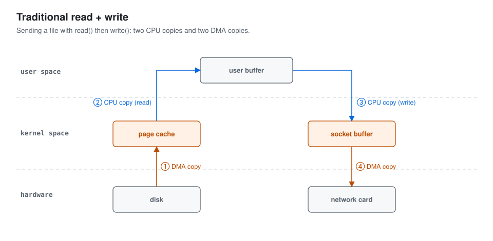
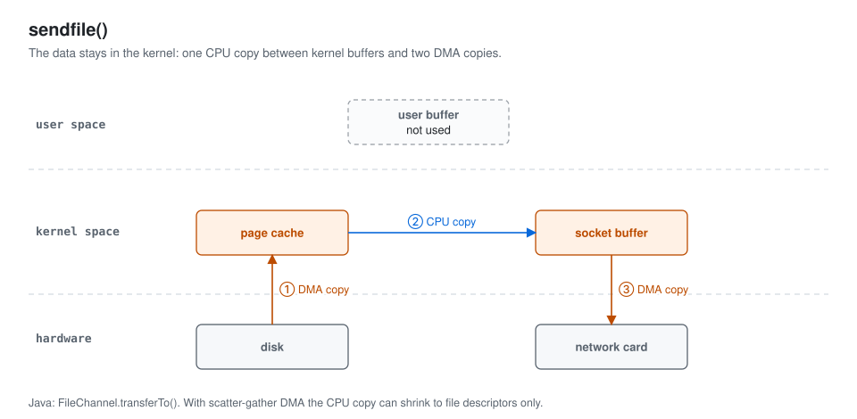
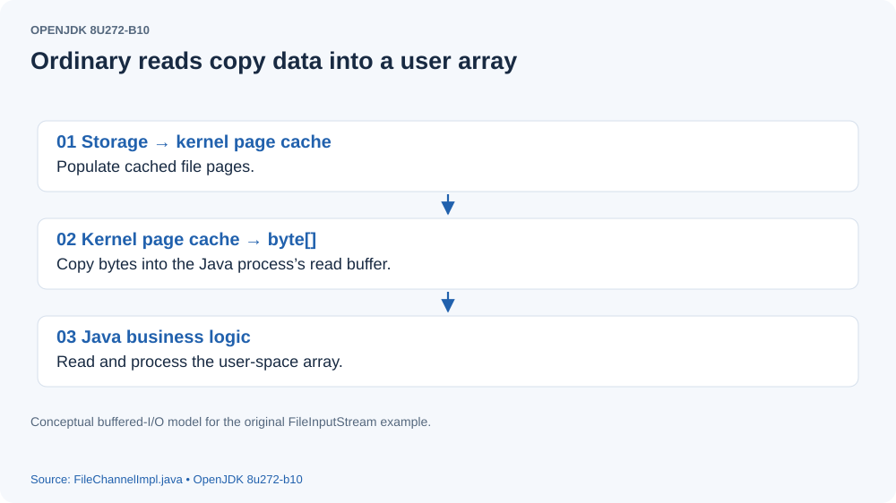
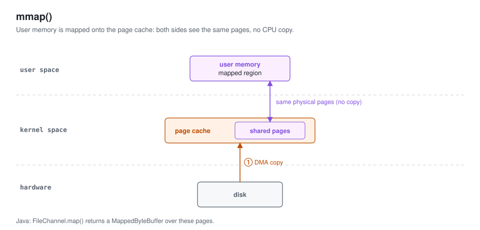

# Understanding Java Zero-Copy with sendfile and mmap

## What zero-copy means
When an application reads network or disk data, the bytes often move between application buffers and kernel buffers. Zero-copy techniques reduce copies between user space and kernel space, and sometimes between kernel buffers. The term does not imply that no data movement occurs: devices still transfer bytes, often through DMA. Reducing avoidable CPU copies can reduce CPU work and the memory occupied by intermediate buffers.

## sendfile
The following Java socket example uses blocking I/O. The server accepts a client connection, reads the client's bytes, and writes a response. The client connects to the server, reads data from a file, and sends it to the server.

####  server

```

public class Server {

    private ServerSocket ss;

    public Server(int port) throws Exception {
        ss = new ServerSocket(port);
    }

    public void doAccept() throws Exception {

        while (true) {
            Socket client = ss.accept();
            System.out.println("get a conn " + client);
            new Worker(client).start();
        }
    }


    class Worker extends Thread {
        Socket client;
        byte[] buffer = new byte[1024];

        Worker(Socket socket) {
            client = socket;
        }

        public void run() {
            try {
                BufferedInputStream bis = new BufferedInputStream(client.getInputStream());
                BufferedOutputStream bos = new BufferedOutputStream(client.getOutputStream());
                int len = 0;
                while ((len = bis.read(buffer)) != -1) {
                    System.out.println(new String(buffer, 0, len));
                    bos.write(buffer, 0, len);
                }
            } catch (IOException e) {
                e.printStackTrace();
            }
        }
    }
    public static void main(String[] args) {
        try {
            Server server = new Server(6687);
            server.doAccept();
        } catch (Exception e) {
            e.printStackTrace();
        }
    }

}

```

#### Client

```

class Client {
    Socket socket;

    Client(String host, int port) throws Exception {
        socket = new Socket(host, port);
    }

    public void sendMessage() {
        File f = new File("a.txt");
        byte[] buffer = new byte[1024];
        try {
            OutputStream outputStream = socket.getOutputStream();
            FileInputStream fis = new FileInputStream(f);
            int len = 0;
            while ((len = fis.read(buffer)) != -1) {
                outputStream.write(buffer, 0, len);
            }
        } catch (FileNotFoundException e) {
            e.printStackTrace();
        } catch (IOException e) {
            e.printStackTrace();
        }
    }

    public static void main(String[] args) {
        try {
            Client client = new Client("127.0.0.1",6687);
            client.sendMessage();
        } catch (Exception e) {
            e.printStackTrace();
        }
    }
}

```

From the client's perspective, the traditional path copies data through disk, the kernel cache, the application buffer, and the socket buffer as shown below.
1. DMA transfers file data from the device into the kernel page cache.
2. The CPU copies bytes from the kernel buffer into the application buffer.
3. The CPU copies the application bytes into a socket buffer in kernel space.
4. DMA transfers the socket data to the network device.

[](assets/java-zero-copy-01.svg)
If the application does not need to inspect or modify the file contents, the intermediate application-buffer copies can be avoided. Linux provides `sendfile` for this purpose. The following client uses `FileChannel.transferTo`, whose implementation can use the operating system's direct transfer mechanism. A kernel-to-kernel copy may still occur on some paths; scatter/gather support can avoid that additional CPU copy. This is an implementation-dependent optimization rather than a guarantee that every `transferTo` invocation makes zero CPU copies.

```

class ClientChannel {
    SocketChannel socketChannel;

    ClientChannel(String host, int port) throws Exception {
        socketChannel = SocketChannel.open();
        socketChannel.connect(new InetSocketAddress(host, port));
    }

    public void sendMessage() {
        File f = new File("a.txt");
        try {
            FileInputStream fis = new FileInputStream(f);
            FileChannel fileChannel = fis.getChannel();
            fileChannel.transferTo(0, f.length(), socketChannel);
        } catch (FileNotFoundException e) {
            e.printStackTrace();
        } catch (IOException e) {
            e.printStackTrace();
        }
    }

    public static void main(String[] args) {
        try {
            ClientChannel client = new ClientChannel("127.0.0.1", 6687);
            client.sendMessage();
        } catch (Exception e) {
            e.printStackTrace();
        }
    }
}

```

[](assets/java-zero-copy-02.svg)

## mmap
For an application that must read file contents and apply business logic, how can we reduce copying between kernel and application buffers?

##### Without memory mapping

```

public class FileReader {
    File f ;

    public void readFile(String fileName){

        f = new File(fileName);
        byte[] buffer = new byte[1024] ;
        try {
            BufferedInputStream bis = new BufferedInputStream(new FileInputStream(f));
            int len= 0;
            while((len =bis.read(buffer)) != -1){
                doBusiness(buffer,len);
            }

        } catch (IOException e) {
            e.printStackTrace();
        }

    }
    private void doBusiness(byte[] data,int len){
        System.out.println(new String(data,0,len));
    }
    
}

```

The preceding code follows this data-copy path:
[](assets/java-zero-copy-03.svg)

1. DMA transfers data into the kernel page cache.
2. Data is copied from the kernel buffer into the application buffer.

##### With memory mapping

```

public class MmapFileReader {

    byte buffer[];
    File f ;

    public MmapFileReader(String fileName){
        f =  new File(fileName) ;
        buffer = new byte[(int)f.length()] ;
    }

    public void doMmap(){
        try {
            MappedByteBuffer mappedByteBuffer = new RandomAccessFile(f,"rw").getChannel().map(FileChannel.MapMode.READ_WRITE,0,f.length());
            ByteBuffer byteBuffer = mappedByteBuffer.get(buffer);
            System.out.println(new String(buffer,0,(int)f.length()));
        } catch (FileNotFoundException e) {
            e.printStackTrace();
        } catch (IOException e) {
            e.printStackTrace();
        }

    }
}

```

This code uses a file channel to create a mapping through the operating system's `mmap` mechanism.
The mapping lets user-space loads and stores address file-backed pages that also belong to the kernel page cache. Writes through a shared read/write mapping dirty those pages; they are written back according to the operating system's policy. Use `MappedByteBuffer.force()` when explicit writeback is required, and account for the filesystem and device's persistence guarantees. The particular example still calls `mappedByteBuffer.get(buffer)`, which copies mapped bytes into a Java array: memory mapping avoids the read-system-call copy, but this extra application copy remains. Processing the mapped buffer directly is necessary to avoid that array copy.

[](assets/java-zero-copy-04.svg)


### References
[https://www.jianshu.com/p/fad3339e3448](https://www.jianshu.com/p/fad3339e3448)
[https://zhuanlan.zhihu.com/p/66595734](https://zhuanlan.zhihu.com/p/66595734)


## Source version and reconstructed figures

The original Java socket, `transferTo`, buffered file reader, and mapped file reader examples are retained. `sendfile` targets file-to-socket transfer without application inspection; `mmap` provides file-backed memory for application processing. The original blanket claims about eliminating every CPU copy and immediate disk persistence have been qualified. These are illustrative snippets. The original server writes to a `BufferedOutputStream` without flushing, so a short echoed response can remain buffered; call `flush()` after a response. The clients do not read the echoed response, so sufficiently large transfers can deadlock under backpressure. Give the protocol an explicit end-of-file boundary (for example, a length header or `shutdownOutput()`), read responses concurrently when needed, and close streams/channels. A single `transferTo` can transfer fewer than the requested bytes; loop on its returned count, taking care to handle zero progress. The mapped example casts file length to `int` and is limited to a single mapping and Java-array-sized files; map large files in windows. Do not assume TCP preserves write boundaries.

The original externally hosted images are replaced in their original positions by English source-derived diagrams or source cards. They are explanatory reconstructions, not recovered debugger screenshots.

Source baseline: Netty 4.1.53.Final (released October 13, 2020).

- [FileChannel implementation (OpenJDK 8u272-b10)](https://github.com/openjdk/jdk8u/blob/c3b5603e949d6272d777ef57952833672a97b4e3/jdk/src/share/classes/sun/nio/ch/FileChannelImpl.java)
- [MappedByteBuffer (OpenJDK 8u272-b10)](https://github.com/openjdk/jdk8u/blob/c3b5603e949d6272d777ef57952833672a97b4e3/jdk/src/share/classes/java/nio/MappedByteBuffer.java)
- [Netty DefaultFileRegion](https://github.com/netty/netty/blob/d4a0050ef33cab2542a80e11489a4977a63859f8/transport/src/main/java/io/netty/channel/DefaultFileRegion.java)
