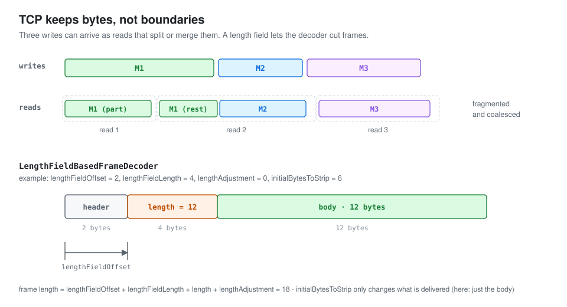

# Handling Fragmented and Coalesced Messages in Netty

TCP is a **byte stream**. It keeps the bytes in order but forgets where one application write ended and the next began. So the receiver sees two effects, often called "half packets" and "sticky packets":

- **Fragmentation:** one read holds only part of a message. Large messages usually span several segments, but even a small message can need several reads.
- **Coalescing:** one read holds bytes from several messages.

This has nothing to do with whether a message is larger than an IP packet. The receiver has to find message boundaries itself, using the application protocol.

[](assets/message-framing-01.svg)

## 1. Three ways to frame messages

| Strategy | How the receiver finds the end | Netty decoder |
| --- | --- | --- |
| Delimiter | a marker byte sequence ends each message | `DelimiterBasedFrameDecoder` |
| Length field | a header holds the message length | `LengthFieldBasedFrameDecoder` |
| Fixed length | every message has the same size | `FixedLengthFrameDecoder` |

All three need an **accumulator** on the receiving side: bytes pile up until the decoder can see a complete message, the decoder takes that message's bytes, and any incomplete rest waits for the next read. Netty calls turning bytes into messages **decoding**. This article follows the length-field decoder.

## 2. `LengthFieldBasedFrameDecoder`

Many protocols reserve a few bytes at a fixed position for the message length. `LengthFieldBasedFrameDecoder` handles exactly that.

Its base class, `ByteToMessageDecoder`, does the accumulating. It is a `ChannelInboundHandlerAdapter`, so network reads reach it through the pipeline in `channelRead`.

### `ByteToMessageDecoder.channelRead`

```java
   // msg is the data delivered by network I/O.
public void channelRead(ChannelHandlerContext ctx, Object msg) throws Exception {
        // This decoder consumes ByteBuf messages.
        if (msg instanceof ByteBuf) {
         // CodecOutputList stores messages produced by decoding.
            CodecOutputList out = CodecOutputList.newInstance();
            try {
                first = cumulation == null;
                // cumulation is the byte accumulator, represented as a ByteBuf.
                // cumulator implements accumulation; the default is MERGE_CUMULATOR.
                // Merge incoming bytes into the existing cumulation.
                cumulation = cumulator.cumulate(ctx.alloc(),
                        first ? Unpooled.EMPTY_BUFFER : cumulation, (ByteBuf) msg);
              // Pass accumulated bytes to the concrete decoder.
                callDecode(ctx, cumulation, out);
            } catch (DecoderException e) {
                throw e;
            } catch (Exception e) {
                throw new DecoderException(e);
            } finally {

                if (cumulation != null && !cumulation.isReadable()) {
                    // Release an accumulator with no readable bytes left.
                    numReads = 0;
                    cumulation.release();
                    cumulation = null;
                } else if (++ numReads >= discardAfterReads) {
                    // After discardAfterReads reads (default 16), try discarding consumed space.
                    // We did enough reads already try to discard some bytes so we not risk to see a OOME.
                    // See https://github.com/netty/netty/issues/4275
                    numReads = 0;
                    discardSomeReadBytes();
                }
                // Count decoded output messages.
                int size = out.size();
                firedChannelRead |= out.insertSinceRecycled();
               // Fire channelRead for the decoded outputs.
                fireChannelRead(ctx, out, size);
               // Recycle the output-list object.
                out.recycle();
            }
        } else {
           // Forward non-ByteBuf messages to the next pipeline handler.
            ctx.fireChannelRead(msg);
        }
    }
```

How does a new buffer get appended to `cumulation`?

```java
        // alloc supplies storage for the accumulating ByteBuf.
        // in is the newly received buffer to append.
        public ByteBuf cumulate(ByteBufAllocator alloc, ByteBuf cumulation, ByteBuf in) {
            if (!cumulation.isReadable() && in.isContiguous()) {
                // If cumulation is empty and input buffer is contiguous, use it directly
              // If the initial accumulator is empty, reuse in and release the old empty buffer.
                cumulation.release();
                return in;
            }
            try {
                // Count the bytes in this incoming buffer.
                final int required = in.readableBytes();
                if (required > cumulation.maxWritableBytes() ||
                        (required > cumulation.maxFastWritableBytes() && cumulation.refCnt() > 1) ||
                        cumulation.isReadOnly()) {
                    // Expand cumulation (by replacing it) under the following conditions:
                    // - cumulation cannot be resized to accommodate the additional data
                    // - cumulation can be expanded with a reallocation operation to accommodate but the buffer is
                    //   assumed to be shared (e.g. refCnt() > 1) and the reallocation may not be safe.
                   // Expand the accumulator if the required writable capacity is unavailable.
                   // Allocate storage for the unread accumulated bytes plus the incoming bytes.
                  // Copy existing unread data into the new buffer and release the old accumulator.
                    return expandCumulation(alloc, cumulation, in);
                }
             // Append the incoming readable bytes.
                cumulation.writeBytes(in, in.readerIndex(), required);
                in.readerIndex(in.writerIndex());
                return cumulation;
            } finally {
                // We must release in in all cases as otherwise it may produce a leak if writeBytes(...) throw
                // for whatever release (for example because of OutOfMemoryError)
                // Release the incoming buffer when it is not reused as the accumulator.
                in.release();
            }
        }
    }
```

### `callDecode`

With the bytes accumulated, `callDecode` cuts messages out of them:

```java
// in is the byte accumulator; out stores decoded messages.
protected void callDecode(ChannelHandlerContext ctx, ByteBuf in, List<Object> out) {
        try {
            // Continue decoding while readable bytes remain and progress is possible.
            while (in.isReadable()) {
                int outSize = out.size();

                if (outSize > 0) {
                    // Deliver decoded outputs through channelRead.
                    fireChannelRead(ctx, out, outSize);
                    // Clear the output list after delivering those messages.
                    out.clear();

                    // Check if this handler was removed before continuing with decoding.
                    // If it was removed, it is not safe to continue to operate on the buffer.
                    //
                    // See:
                    // - https://github.com/netty/netty/issues/4635
                   // Stop if this decoder's context was removed from the pipeline.
                    if (ctx.isRemoved()) {
                        break;
                    }
                    outSize = 0;
                }
               // Record the number of readable accumulated bytes before decoding.
                int oldInputLength = in.readableBytes();
              // Invoke the concrete decoder through the reentry-protection wrapper.
                decodeRemovalReentryProtection(ctx, in, out);

                // Check if this handler was removed before continuing the loop.
                // If it was removed, it is not safe to continue to operate on the buffer.
                //
                // See https://github.com/netty/netty/issues/1664
                if (ctx.isRemoved()) {
                    break;
                }

                if (outSize == out.size()) {
                    if (oldInputLength == in.readableBytes()) {
                       // If decoding consumed no input and produced no output, await more data.
                        break;
                    } else {
                        continue;
                    }
                }

                if (oldInputLength == in.readableBytes()) {
                    // Producing output without consuming bytes violates the decoder contract.
                    throw new DecoderException(
                            StringUtil.simpleClassName(getClass()) +
                                    ".decode() did not read anything but decoded a message.");
                }

                if (isSingleDecode()) {
                    break;
                }
            }
        } catch (DecoderException e) {
            throw e;
        } catch (Exception cause) {
            throw new DecoderException(cause);
        }
    }
```

It goes through `decodeRemovalReentryProtection`:

```java
 final void decodeRemovalReentryProtection(ChannelHandlerContext ctx, ByteBuf in, List<Object> out)
            throws Exception {
       // Mark decodeState as STATE_CALLING_CHILD_DECODE.
        decodeState = STATE_CALLING_CHILD_DECODE;
        try {
            // Call the concrete decode implementation.
            decode(ctx, in, out);
        } finally {
           // Removal during decode sets STATE_HANDLER_REMOVED_PENDING.
          // In that case, removePending becomes true.
            boolean removePending = decodeState == STATE_HANDLER_REMOVED_PENDING;
            decodeState = STATE_INIT;
            if (removePending) {
               // Deliver pending outputs before finishing handler removal.
                fireChannelRead(ctx, out, out.size());
                out.clear();
                handlerRemoved(ctx);
            }
        }
    }
```

### `LengthFieldBasedFrameDecoder.decode`

The length-field decoder itself:

```java
protected final void decode(ChannelHandlerContext ctx, ByteBuf in, List<Object> out) throws Exception {
       // Decode at most one frame through the two-argument decode method.
        Object decoded = decode(ctx, in);
        if (decoded != null) {
            // Append a non-null frame to the output list.
            out.add(decoded);
        }
    }


// Concrete frame-decoding implementation
protected Object decode(ChannelHandlerContext ctx, ByteBuf in) throws Exception {
       // Each decoder has a configured maximum frame length.
       // A frame larger than that maximum is discarded.
        if (discardingTooLongFrame) {
            discardingTooLongFrame(in);
        }
        // Wait until enough bytes exist to include the entire length field and its offset.
        if (in.readableBytes() < lengthFieldEndOffset) {
            return null;
        }
        // lengthFieldOffset locates the length field within the frame.
        // Calculate that field's position within the accumulator.
        int actualLengthFieldOffset = in.readerIndex() + lengthFieldOffset;
          // lengthFieldLength is the field width in bytes.
          // Read the unadjusted length-field value.
        long frameLength = getUnadjustedFrameLength(in, actualLengthFieldOffset, lengthFieldLength, byteOrder);

        if (frameLength < 0) {
            failOnNegativeLengthField(in, frameLength, lengthFieldEndOffset);
        }

      //lengthFieldEndOffset = lengthFieldOffset+lengthFieldLength
      // lengthAdjustment reconciles the protocol's field meaning with total frame length.
      // Some protocols count a body only, while others include some or all header bytes.
     // Configure this adjustment according to the actual wire format.
     // Add lengthAdjustment and lengthFieldEndOffset to obtain the full frame length.
        frameLength += lengthAdjustment + lengthFieldEndOffset;

        if (frameLength < lengthFieldEndOffset) {
            failOnFrameLengthLessThanLengthFieldEndOffset(in, frameLength, lengthFieldEndOffset);
        }
       // Discard a frame exceeding maxFrameLength.
        if (frameLength > maxFrameLength) {
            exceededFrameLength(in, frameLength);
            return null;
        }

        // never overflows because it's less than maxFrameLength
        int frameLengthInt = (int) frameLength;
        // If the complete frame has not arrived, return without extracting a message.
        if (in.readableBytes() < frameLengthInt) {
            return null;
        }
        // initialBytesToStrip removes the configured prefix from each delivered frame.
        if (initialBytesToStrip > frameLengthInt) {
            failOnFrameLengthLessThanInitialBytesToStrip(in, frameLength, initialBytesToStrip);
        }
        in.skipBytes(initialBytesToStrip);

        // extract frame
        int readerIndex = in.readerIndex();
       // Calculate the number of frame bytes remaining after stripping.
        int actualFrameLength = frameLengthInt - initialBytesToStrip;
       // Extract one frame from the accumulator.
        ByteBuf frame = extractFrame(ctx, in, readerIndex, actualFrameLength);
        // Advance the reader index to the start of the next frame.
        in.readerIndex(readerIndex + actualFrameLength);
        return frame;
    }
```

## 3. Frames that are too long

If a frame is longer than the configured maximum, the decoder discards it instead of buffering it.

### `exceededFrameLength`

```java
 private void exceededFrameLength(ByteBuf in, long frameLength) {
        // Calculate how many frame bytes remain beyond the bytes already accumulated.
        long discard = frameLength - in.readableBytes();
        // Record the oversized frame length for later error reporting.
        tooLongFrameLength = frameLength;

        if (discard < 0) {
            // If all frame bytes are present with additional data, skip the oversized frame directly.
            // buffer contains more bytes then the frameLength so we can discard all now
            in.skipBytes((int) frameLength);
        } else {
            // Enter the discard mode and discard everything received so far.
         // Otherwise the accumulator holds only part of the oversized frame.
         // The remaining bytes may still be in transit.

           // Keep discarding on future decode invocations until the whole oversized frame is skipped.
            discardingTooLongFrame = true;
         // Record how many bytes still need to be discarded.
            bytesToDiscard = discard;
           // Discard all currently accumulated bytes from this oversized frame.
            in.skipBytes(in.readableBytes());
        }
        failIfNecessary(true);
    }
```

### `discardingTooLongFrame`

At the start of `decode`, this checks whether bytes of an earlier oversized frame still need to be skipped:

```java
 private void discardingTooLongFrame(ByteBuf in) {
        long bytesToDiscard = this.bytesToDiscard;
        // Bound this invocation's discard by the available readable bytes.
        int localBytesToDiscard = (int) Math.min(bytesToDiscard, in.readableBytes());
       // Skip localBytesToDiscard bytes.
        in.skipBytes(localBytesToDiscard);
        bytesToDiscard -= localBytesToDiscard;
         // Update the remaining discard count.
        this.bytesToDiscard = bytesToDiscard;
        failIfNecessary(false);
    }
```

### `failIfNecessary`

```java
private void failIfNecessary(boolean firstDetectionOfTooLongFrame) {

        if (bytesToDiscard == 0) {
            // Zero remaining bytes means the oversized frame is fully discarded.
            // Reset to the initial state and tell the handlers that
            // the frame was too large.
            long tooLongFrameLength = this.tooLongFrameLength;
           // Reset oversized-frame bookkeeping.
            this.tooLongFrameLength = 0;
            discardingTooLongFrame = false;
            if (!failFast || firstDetectionOfTooLongFrame) {
                fail(tooLongFrameLength);
            }
        } else {
            // Keep discarding and notify handlers if necessary.
            if (failFast && firstDetectionOfTooLongFrame) {
                // Throw when the configured failFast policy requires reporting the oversized frame.
                fail(tooLongFrameLength);
            }
        }
    }
```

## Notes on the source

- The original text tied fragmentation to packet size. In fact TCP segmentation and application read boundaries are separate things, and TCP never keeps message boundaries.
- In this version the default merge cumulator either reuses the buffer or copies into a larger one.
- The decoder computes the full frame size from the length value, the end offset of the length field and `lengthAdjustment`. `initialBytesToStrip` only changes what is delivered, not the size used to check the frame.

## Source references

- [ByteToMessageDecoder.java](https://github.com/netty/netty/blob/d4a0050ef33cab2542a80e11489a4977a63859f8/codec/src/main/java/io/netty/handler/codec/ByteToMessageDecoder.java)
- [LengthFieldBasedFrameDecoder.java](https://github.com/netty/netty/blob/d4a0050ef33cab2542a80e11489a4977a63859f8/codec/src/main/java/io/netty/handler/codec/LengthFieldBasedFrameDecoder.java)
- [DelimiterBasedFrameDecoder.java](https://github.com/netty/netty/blob/d4a0050ef33cab2542a80e11489a4977a63859f8/codec/src/main/java/io/netty/handler/codec/DelimiterBasedFrameDecoder.java)
- [FixedLengthFrameDecoder.java](https://github.com/netty/netty/blob/d4a0050ef33cab2542a80e11489a4977a63859f8/codec/src/main/java/io/netty/handler/codec/FixedLengthFrameDecoder.java)
