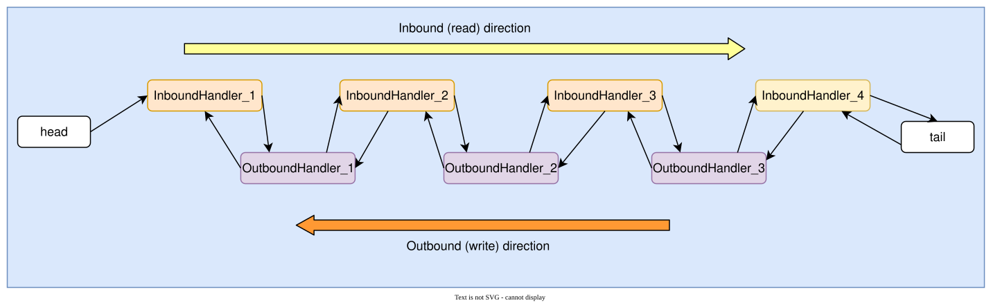
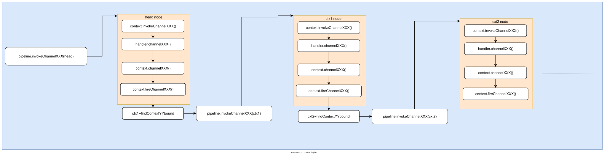

# How Netty Pipeline Events Travel Through Handlers

## Pipeline
Netty's pipeline implements the chain-of-responsibility pattern. Its nodes are ordered according to the method and position used when adding handlers. The chain is doubly linked; user handlers are wrapped in `DefaultChannelHandlerContext` objects that form its nodes.

### DefaultChannelPipeline
The default pipeline is `DefaultChannelPipeline`. It starts with a head and a tail node, and application handlers are inserted between them. For this discussion, network I/O has two main directions: ***reading and writing***.
Netty exposes `ChannelInboundHandler` and `ChannelOutboundHandler` as the handler interfaces for these directions. Inbound handlers receive read events and other inbound lifecycle notifications; outbound handlers receive write requests and other outbound operations. The two directions traverse the pipeline differently.
- Inbound events propagate from the head toward the tail, visiting the relevant inbound handlers.
- Outbound operations propagate from the tail toward the head, visiting the relevant outbound handlers. A context-initiated operation begins relative to that context rather than always at the pipeline tail.

[{: .diagram}](assets/pipeline-01.svg)

---
### Handler
A handler is the basic unit of event processing. Application I/O logic lives in custom handlers.


### ChannelHandlerContext
`ChannelHandlerContext` holds a handler's context. Pipeline nodes are contexts; the ordinary implementation is `DefaultChannelHandlerContext`.
Here is its source:

```

final class DefaultChannelHandlerContext extends AbstractChannelHandlerContext {

    // DefaultChannelHandlerContext stores the user-defined handler.
    private final ChannelHandler handler;

    DefaultChannelHandlerContext(
            DefaultChannelPipeline pipeline, EventExecutor executor, String name, ChannelHandler handler) {
        super(pipeline, executor, name, handler.getClass());
        this.handler = handler;
    }

    @Override
    public ChannelHandler handler() {
        return handler;
    }
}

```

The superclass, `AbstractChannelHandlerContext`, has `prev` and `next` fields pointing to adjacent nodes, which makes the pipeline a doubly linked list.

### Associating a context with a handler
How is a user-defined handler associated with a `DefaultChannelHandlerContext`?
Consider `pipeline.addLast()`. Adding a custom handler ultimately executes the following code:

```

 @Override
    public final ChannelPipeline addLast(EventExecutorGroup group, String name, ChannelHandler handler) {
        final AbstractChannelHandlerContext newCtx;
        synchronized (this) {
            checkMultiplicity(handler);
           // newContext constructs a DefaultChannelHandlerContext that stores this handler.
            newCtx = newContext(group, filterName(name, handler), handler);
           // Append the new context before the pipeline's tail node.
            addLast0(newCtx);

            // If the registered is false it means that the channel was not registered on an eventLoop yet.
            // In this case we add the context to the pipeline and add a task that will call
            // ChannelHandler.handlerAdded(...) once the channel is registered.
            if (!registered) {
                newCtx.setAddPending();
                callHandlerCallbackLater(newCtx, true);
                return this;
            }

            EventExecutor executor = newCtx.executor();
            if (!executor.inEventLoop()) {
                callHandlerAddedInEventLoop(newCtx, executor);
                return this;
            }
        }
        callHandlerAdded0(newCtx);
        return this;
    }

```

### executionMask
Constructing a `DefaultChannelHandlerContext` initializes its superclass, `AbstractChannelHandlerContext`. The `executionMask` field deserves a closer look.
A pipeline supports many event types, and different handlers implement different callbacks. `executionMask` records which callbacks a handler needs to receive. The mask is calculated as follows:

```

private static int mask0(Class<? extends ChannelHandler> handlerType) {
        int mask = MASK_EXCEPTION_CAUGHT;
        try {
            if (ChannelInboundHandler.class.isAssignableFrom(handlerType)) {
                mask |= MASK_ALL_INBOUND;

                if (isSkippable(handlerType, "channelRegistered", ChannelHandlerContext.class)) {
                    mask &= ~MASK_CHANNEL_REGISTERED;
                }
                if (isSkippable(handlerType, "channelUnregistered", ChannelHandlerContext.class)) {
                    mask &= ~MASK_CHANNEL_UNREGISTERED;
                }
                if (isSkippable(handlerType, "channelActive", ChannelHandlerContext.class)) {
                    mask &= ~MASK_CHANNEL_ACTIVE;
                }
                if (isSkippable(handlerType, "channelInactive", ChannelHandlerContext.class)) {
                    mask &= ~MASK_CHANNEL_INACTIVE;
                }
                if (isSkippable(handlerType, "channelRead", ChannelHandlerContext.class, Object.class)) {
                    mask &= ~MASK_CHANNEL_READ;
                }
                if (isSkippable(handlerType, "channelReadComplete", ChannelHandlerContext.class)) {
                    mask &= ~MASK_CHANNEL_READ_COMPLETE;
                }
                if (isSkippable(handlerType, "channelWritabilityChanged", ChannelHandlerContext.class)) {
                    mask &= ~MASK_CHANNEL_WRITABILITY_CHANGED;
                }
                if (isSkippable(handlerType, "userEventTriggered", ChannelHandlerContext.class, Object.class)) {
                    mask &= ~MASK_USER_EVENT_TRIGGERED;
                }
            }

            if (ChannelOutboundHandler.class.isAssignableFrom(handlerType)) {
                mask |= MASK_ALL_OUTBOUND;

                if (isSkippable(handlerType, "bind", ChannelHandlerContext.class,
                        SocketAddress.class, ChannelPromise.class)) {
                    mask &= ~MASK_BIND;
                }
                if (isSkippable(handlerType, "connect", ChannelHandlerContext.class, SocketAddress.class,
                        SocketAddress.class, ChannelPromise.class)) {
                    mask &= ~MASK_CONNECT;
                }
                if (isSkippable(handlerType, "disconnect", ChannelHandlerContext.class, ChannelPromise.class)) {
                    mask &= ~MASK_DISCONNECT;
                }
                if (isSkippable(handlerType, "close", ChannelHandlerContext.class, ChannelPromise.class)) {
                    mask &= ~MASK_CLOSE;
                }
                if (isSkippable(handlerType, "deregister", ChannelHandlerContext.class, ChannelPromise.class)) {
                    mask &= ~MASK_DEREGISTER;
                }
                if (isSkippable(handlerType, "read", ChannelHandlerContext.class)) {
                    mask &= ~MASK_READ;
                }
                if (isSkippable(handlerType, "write", ChannelHandlerContext.class,
                        Object.class, ChannelPromise.class)) {
                    mask &= ~MASK_WRITE;
                }
                if (isSkippable(handlerType, "flush", ChannelHandlerContext.class)) {
                    mask &= ~MASK_FLUSH;
                }
            }

            if (isSkippable(handlerType, "exceptionCaught", ChannelHandlerContext.class, Throwable.class)) {
                mask &= ~MASK_EXCEPTION_CAUGHT;
            }
        } catch (Exception e) {
            // Should never reach here.
            PlatformDependent.throwException(e);
        }

        return mask;
    }

```

The mask is calculated from the event callbacks implemented by the handler class, including callback-skipping annotations.

---


### How events propagate through the pipeline
The pipeline is a doubly linked list. How do events move from node to node? We will use `channelRegistered` as the example.
Once a channel registers with its `NioEventLoop`, it fires `channelRegistered`. The pipeline entry point is `DefaultChannelPipeline.fireChannelRegistered()`.

```

public final ChannelPipeline fireChannelRegistered() {
         // head is the first context: registration propagates from head toward tail.
        AbstractChannelHandlerContext.invokeChannelRegistered(head);
        return this;
    }

```

Here is `AbstractChannelHandlerContext.invokeChannelRegistered`:

```

  static void invokeChannelRegistered(final AbstractChannelHandlerContext next) {
        EventExecutor executor = next.executor();
        if (executor.inEventLoop()) {
             // Invoke the registration callback on this context.
            next.invokeChannelRegistered();
        } else {
            executor.execute(new Runnable() {
                @Override
                public void run() {
                    next.invokeChannelRegistered();
                }
            });
        }
    }

```

Continue into the instance form of `invokeChannelRegistered`:

```

private void invokeChannelRegistered() {
        if (invokeHandler()) {
            try {
                // Call channelRegistered on the handler associated with this context.
                // This invokes the callback overridden by application code.
                ((ChannelInboundHandler) handler()).channelRegistered(this);
            } catch (Throwable t) {
                notifyHandlerException(t);
            }
        } else {
            fireChannelRegistered();
        }
    }

```

How does a custom handler continue propagation after its own work? Normally its `channelRegistered` callback calls `ctx.fireChannelRegistered()`.
Here is `fireChannelRegistered`:

```


public ChannelHandlerContext fireChannelRegistered() {
  // Find the next inbound context toward the tail that can handle channelRegistered.
invokeChannelRegistered(findContextInbound(MASK_CHANNEL_REGISTERED));
        return this;
    }

```

The following diagram summarizes this flow. `XXX` denotes an event such as registered or added, and `YY` denotes its direction: inbound or outbound.
[{: .diagram}](assets/pipeline-02.svg)

---

### ChannelInitializer
`ChannelInitializer` is a special built-in inbound handler that helps application code install its handlers. It is normally added first. Developers override `initChannel` to populate the pipeline. When a handler is added, Netty invokes its `handlerAdded` callback. Here is `ChannelInitializer.handlerAdded`:

```

 @Override
    public void handlerAdded(ChannelHandlerContext ctx) throws Exception {
       // Check whether the channel has registered yet.
       // Before registration, handler-added callbacks are retained as pending callbacks.
       // Registration later processes that pending callback list.
    // Invoke handlerAdded for each pending addition.
        if (ctx.channel().isRegistered()) {
            // This should always be true with our current DefaultChannelPipeline implementation.
            // The good thing about calling initChannel(...) in handlerAdded(...) is that there will be no ordering
            // surprises if a ChannelInitializer will add another ChannelInitializer. This is as all handlers
            // will be added in the expected order.
           // Invoke the application's overridden initChannel method.
           // This installs the application handlers in the pipeline.
           // After successful initialization, remove the ChannelInitializer itself.
          // The head, tail, and installed application handlers remain.
            if (initChannel(ctx)) {

                // We are done with init the Channel, removing the initializer now.

                removeState(ctx);
            }
        }
    }

```

---
This completes the pipeline walkthrough.

## Source version and figures

Pipeline traversal is callback propagation, not an automatic visit to every handler: a handler must forward an event when it wants propagation to continue. Outbound calls made through a context begin at the preceding outbound context; calls made through the channel or pipeline begin at the tail. Both lifecycle events and I/O operations participate in the pipeline.

The figures are the author's original diagrams, with their labels translated into English.

Source baseline: Netty 4.1.53.Final (released October 13, 2020).

- [DefaultChannelPipeline.java](https://github.com/netty/netty/blob/d4a0050ef33cab2542a80e11489a4977a63859f8/transport/src/main/java/io/netty/channel/DefaultChannelPipeline.java)
- [AbstractChannelHandlerContext.java](https://github.com/netty/netty/blob/d4a0050ef33cab2542a80e11489a4977a63859f8/transport/src/main/java/io/netty/channel/AbstractChannelHandlerContext.java)
- [ChannelHandlerMask.java](https://github.com/netty/netty/blob/d4a0050ef33cab2542a80e11489a4977a63859f8/transport/src/main/java/io/netty/channel/ChannelHandlerMask.java)
- [ChannelInitializer.java](https://github.com/netty/netty/blob/d4a0050ef33cab2542a80e11489a4977a63859f8/transport/src/main/java/io/netty/channel/ChannelInitializer.java)
