# How Netty Allocates and Reuses Pooled Memory

## Background
Life can resemble a walled city: those outside want to enter, and those inside want to leave. Java programmers usually do not implement memory allocation algorithms or manually decide when an object such as `Object obj = new Object()` is reclaimed; the garbage collector manages that. A C programmer allocating with `malloc` must arrange a corresponding `free` after use. Java programmers may be curious about direct memory manipulation, while C programmers may envy Java's automatic management. To allocate and reuse buffers efficiently, Netty implements a pooled allocator inspired by jemalloc.

## Before the implementation
jemalloc is an established memory allocator; its full design is outside this article's scope. This walkthrough concentrates on Netty's pooled direct-memory implementation. Heap buffers use substantially the same pool-management structure. **Version note:** the complete walkthrough below preserves the original legacy tiny/small and buddy-tree allocator, verified against Netty 4.1.50.Final. Netty 4.1.53.Final already contains a redesigned allocator, described explicitly at the end; this historical exception must not be mistaken for the series baseline.

## Implementation model
The diagram shows the allocator's logical memory subdivisions.
[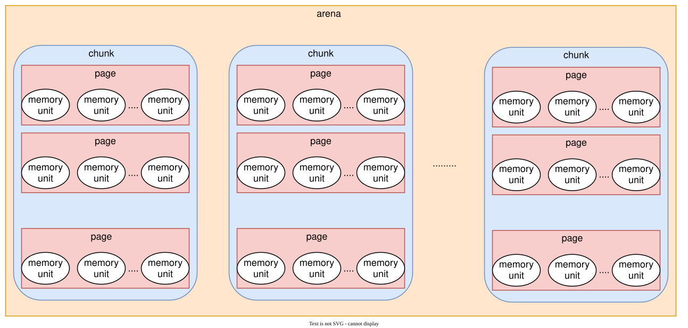{: .diagram}](assets/pooled-memory-01.svg)
### Important objects
- PooledByteBufAllocator
Applications obtain buffers through this allocator. Here are its fields.

```

    // Number of heap arenas; calculated using the corresponding heap-memory limit.
    private static final int DEFAULT_NUM_HEAP_ARENA;
    // Number of direct arenas: min(availableProcessors * 2, maxDirectMemory / chunkSize / 2 / 3).
    // Unless the configured memory limit is very small,
    // the processor-based bound commonly gives twice the available processor count.
    private static final int DEFAULT_NUM_DIRECT_ARENA;
     // Logical page size; the default is 8192 bytes (8 KiB).
    private static final int DEFAULT_PAGE_SIZE;
    // Default maxOrder is 11, giving a chunk of 8192 << 11 = 16 MiB.
    private static final int DEFAULT_MAX_ORDER; // 8192 << 11 = 16 MiB per chunk
    // Maximum entries per tiny-size cache; default 512 in this legacy version.
    private static final int DEFAULT_TINY_CACHE_SIZE;
    // Maximum entries per small-size cache; default 256.
    private static final int DEFAULT_SMALL_CACHE_SIZE;
   // Maximum entries per normal-size cache; default 64.
    private static final int DEFAULT_NORMAL_CACHE_SIZE;
   // Maximum cacheable normal allocation; default 32 KiB.
    private static final int DEFAULT_MAX_CACHED_BUFFER_CAPACITY;
    // Allocation-attempt interval between cache trimming; default 8192.
    private static final int DEFAULT_CACHE_TRIM_INTERVAL;
    private static final long DEFAULT_CACHE_TRIM_INTERVAL_MILLIS;
    // Whether ordinary threads also receive caches; legacy default true.
    private static final boolean DEFAULT_USE_CACHE_FOR_ALL_THREADS;
    private static final int DEFAULT_DIRECT_MEMORY_CACHE_ALIGNMENT;
// Use 1023 by default as we use an ArrayDeque as backing storage which will then allocate an internal array
        // of 1024 elements. Otherwise we would allocate 2048 and only use 1024 which is wasteful.
    static final int DEFAULT_MAX_CACHED_BYTEBUFFERS_PER_CHUNK;
//------------------------------------- Remaining fields -------------------------------------
    // Array of heap-memory arenas.
    private final PoolArena<byte[]>[] heapArenas;
    // Array of direct-memory arenas.
    private final PoolArena<ByteBuffer>[] directArenas;
    // Configured value corresponding to DEFAULT_TINY_CACHE_SIZE.
    private final int tinyCacheSize;
    private final int smallCacheSize;
    private final int normalCacheSize;
    private final List<PoolArenaMetric> heapArenaMetrics;
    private final List<PoolArenaMetric> directArenaMetrics;
    // FastThreadLocal holding each thread's pool-cache information.
    private final PoolThreadLocalCache threadCache;
    // Bytes represented by one PoolChunk; default 16 MiB.
    private final int chunkSize;

```

Initialization creates heap and direct arenas. Here is how the arena arrays are allocated.

```

 private static <T> PoolArena<T>[] newArenaArray(int size) {
        return new PoolArena[size];
    }

```

Each slot is then assigned an arena. The direct-memory case follows.

```

   for (int i = 0; i < directArenas.length; i ++) {
                PoolArena.DirectArena arena = new PoolArena.DirectArena(
                        this, pageSize, maxOrder, pageShifts, chunkSize, directMemoryCacheAlignment);
                directArenas[i] = arena;
                metrics.add(arena);
            }

```

- Arena
An arena is a memory-management unit inspired by jemalloc. Threads allocate and free regions through their assigned arena. There are normally several arenas; each thread is assigned an arena, and several threads can share one. Their relationship is shown below.
[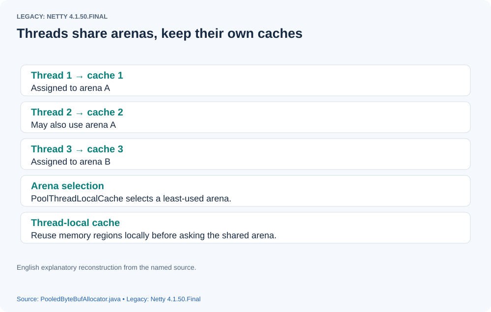{: .diagram}](assets/pooled-memory-02.svg)

Here are the fields of `PoolArena`.

```

    // Default maxOrder is 11.
    private final int maxOrder;
    // Default logical page size is 8192 bytes.
    final int pageSize;
    // Default pageShifts is 13 because 8192 is 2 to the power 13.
    final int pageShifts;
   // Default chunk size is 16 MiB.
    final int chunkSize;
     // ~(pageSize - 1), used to identify capacities at least as large as a page.
     // A normalized capacity AND this mask equals zero for a subpage request.
     // A nonzero result identifies a request at least one page in size.
    final int subpageOverflowMask;
   // pageShifts - 9; default 4.
    final int numSmallSubpagePools;
    final int directMemoryCacheAlignment;
    final int directMemoryCacheAlignmentMask;
     // Tiny subpage pool heads: array length 32; positive sizes use indexes 1 through 31.
    private final PoolSubpage<T>[] tinySubpagePools;
     // Small subpage pool heads: default array length 4.
    private final PoolSubpage<T>[] smallSubpagePools;
    // Each PoolChunkList manages a linked list of chunks.
    // Its chunks occupy a configured utilization band.
    // For example, q075 has a minimum utilization of 75 percent.
    private final PoolChunkList<T> q050;
    private final PoolChunkList<T> q025;
    private final PoolChunkList<T> q000;
    private final PoolChunkList<T> qInit;
    private final PoolChunkList<T> q075;
    private final PoolChunkList<T> q100;

  private final List<PoolChunkListMetric> chunkListMetrics;

// The following fields record allocation and lifecycle statistics.
    // Metrics for allocations and deallocations
    private long allocationsNormal;
    // We need to use the LongCounter here as this is not guarded via synchronized block.
    private final LongCounter allocationsTiny = PlatformDependent.newLongCounter();
    private final LongCounter allocationsSmall = PlatformDependent.newLongCounter();
    private final LongCounter allocationsHuge = PlatformDependent.newLongCounter();
    private final LongCounter activeBytesHuge = PlatformDependent.newLongCounter();

    private long deallocationsTiny;
    private long deallocationsSmall;
    private long deallocationsNormal;

    // We need to use the LongCounter here as this is not guarded via synchronized block.
    private final LongCounter deallocationsHuge = PlatformDependent.newLongCounter();

    // Number of thread caches backed by this arena.
    final AtomicInteger numThreadCaches = new AtomicInteger();

```

First examine initialization of the tiny and small subpage-head arrays.

```

 private PoolSubpage<T>[] newSubpagePoolArray(int size) {
        return new PoolSubpage[size];
    }

```

Each array element becomes a sentinel `PoolSubpage`. It is a doubly linked list node whose `prev` and `next` initially point to itself.

```

private PoolSubpage<T> newSubpagePoolHead(int pageSize) {
        PoolSubpage<T> head = new PoolSubpage<T>(pageSize);
        head.prev = head;
        head.next = head;
        return head;
    }

```

The initialized arrays therefore have the following structure.
[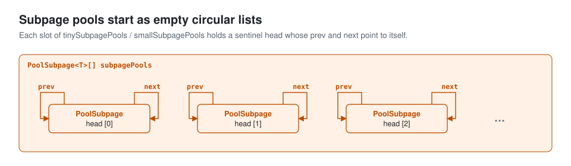{: .diagram}](assets/pooled-memory-03.svg)

Before examining `PoolSubpage`, consider allocation granularity. Netty obtains pooled backing storage in chunks, defaulting to 16 MiB per chunk. Internally, a chunk contains logical pages of 8 KiB, giving 2048 pages at these defaults.
[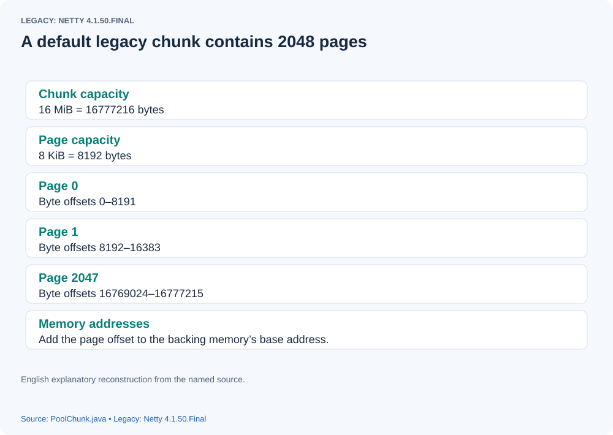{: .diagram}](assets/pooled-memory-04.svg)
Requests are handled in two broad ways:
1) A normalized capacity no larger than a chunk is pooled. For requests at least one page, the legacy allocator reserves a power-of-two run of pages: a 10 KiB request normalizes to 16 KiB and uses two pages. A subpage request reserves a page as backing storage and divides it into smaller allocation units; the application receives its requested size class rather than the whole page.
2) A request larger than a chunk uses a separate unpooled allocation. The following figure shows direct-memory allocation.
[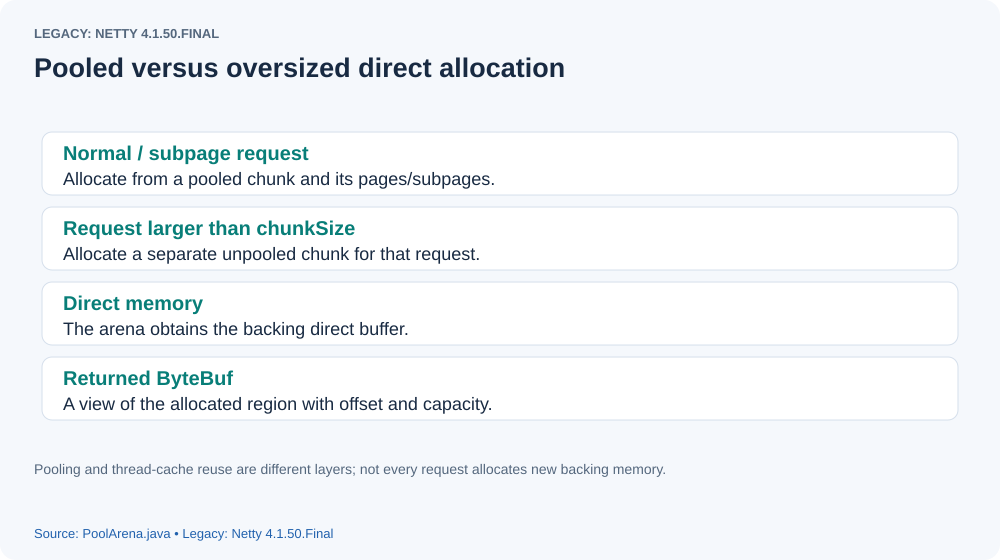{: .diagram}](assets/pooled-memory-05.svg)


- PoolSubpage
If every 32-byte request consumed a full 8 KiB page, most of the page would be wasted. `PoolSubpage` instead divides that backing page into units of the normalized requested size, so many small allocations can share it and reduce fragmentation.
There are two legacy subpage categories:
1) Tiny: positive normalized sizes below 512 bytes.
2) Small: normalized sizes 512, 1024, 2048, and 4096 bytes with the default page size.
The following diagram illustrates them.
[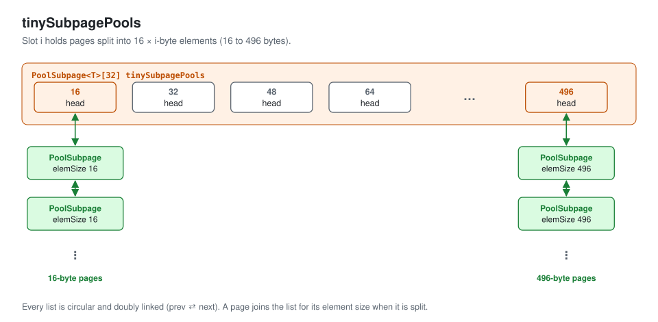{: .diagram}](assets/pooled-memory-06.svg)
[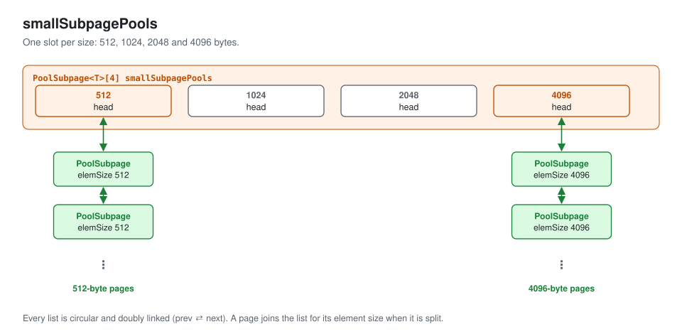{: .diagram}](assets/pooled-memory-07.svg)


The legacy allocator manages several size classes within each category.
1. Tiny classes are multiples of 16 through 496. `tinySubpagePools` has 32 slots: index zero handles the special zero-size case, and indexes 1 through 31 correspond to 16 through 496 bytes. The final positive class is at index 31, not a nonexistent index 32.
2. Small classes double from 512 through 4096. The four slots in `smallSubpagePools` correspond to pages divided into units of 512, 1024, 2048, and 4096 bytes.
Here are the fields of `PoolSubpage`:

```

    // The chunk owning this subpage.
    final PoolChunk<T> chunk;
   // This page's node index in the legacy memoryMap tree.
    private final int memoryMapIdx;
   // Start offset of the page within the chunk.
    private final int runOffset;
    private final int pageSize;
   // The page contains pageSize / elemSize allocation units.
   // A bitmap records which units are occupied.
    private final long[] bitmap;

    PoolSubpage<T> prev;
    PoolSubpage<T> next;

    boolean doNotDestroy;
    int elemSize;
    private int maxNumElems;
    private int bitmapLength;
   // Cached index of the next available unit.
    private int nextAvail;
   // Number of units still available.
    private int numAvail;

```


- PoolChunk
`PoolChunk` represents and manages one backing allocation, normally 16 MiB.

```

    // The arena owning this chunk.
    final PoolArena<T> arena;
    // Backing storage of chunkSize bytes.
    // It is a direct ByteBuffer for this direct arena, or a byte array for a heap arena; no-cleaner direct paths can also use native allocation.
    final T memory;
    final boolean unpooled;
    final int offset;
    // Tree metadata recording allocation availability.
    private final byte[] memoryMap;
    // Immutable initial node depths for the binary tree.
    private final byte[] depthMap;
   // subpages has 2048 slots at the default configuration.
   // Each PoolSubpage represents one 8 KiB logical page.
   // That page can be divided according to its allocation-unit size.
   // It still accounts for one page of backing storage.
   // A 16 MiB chunk has 2048 such page positions.
   // The array indexes those positions, creating subpage objects as needed.
    private final PoolSubpage<T>[] subpages;
    /** Used to determine if the requested capacity is equal to or greater than pageSize. */
    private final int subpageOverflowMask;
    private final int pageSize;
    private final int pageShifts;
    private final int maxOrder;
    private final int chunkSize;
    private final int log2ChunkSize;
    private final int maxSubpageAllocs;
    /** Used to mark memory as unusable */
    private final byte unusable;

    // Use as cache for ByteBuffer created from the memory. These are just duplicates and so are only a container
    // around the memory itself. These are often needed for operations within the Pooled*ByteBuf and so
    // may produce extra GC, which can be greatly reduced by caching the duplicates.
    //
    // This may be null if the PoolChunk is unpooled as pooling the ByteBuffer instances does not make any sense here.
    private final Deque<ByteBuffer> cachedNioBuffers;
    // Remaining free bytes in this chunk.
    int freeBytes;
    // The utilization list currently owning this chunk.
    PoolChunkList<T> parent;
    // Previous chunk in that list.
    PoolChunk<T> prev;
    // Next chunk in that list.
    PoolChunk<T> next;

```


- PoolChunkList
An arena manages many chunks of the same configured backing size. As allocation proceeds, their *free capacities* differ; their total sizes do not shrink. The arena groups chunks by utilization band to find suitable space efficiently. `PoolChunkList` manages each group, and the groups themselves are linked.
[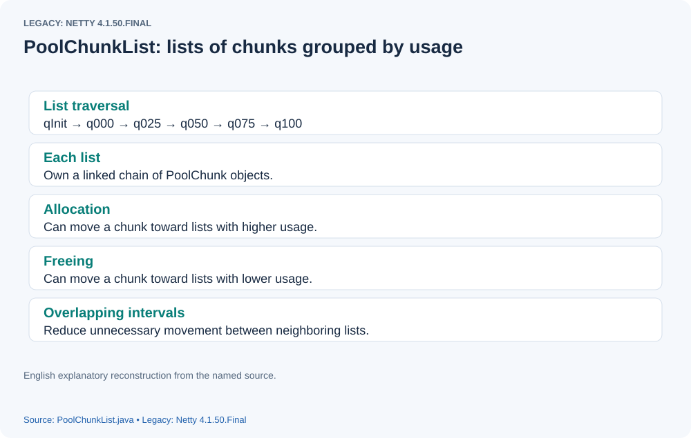{: .diagram}](assets/pooled-memory-08.svg)
Here are the fields of `PoolChunkList`:

```

    // Owning arena.
    private final PoolArena<T> arena;
    // Next utilization-band list.
    private final PoolChunkList<T> nextList;
    // minUsage and maxUsage define the utilization band.
    private final int minUsage;
    private final int maxUsage;
    // Maximum allocation size that can be satisfied within this list's band.
    private final int maxCapacity;
    // First chunk managed by this list.
    private PoolChunk<T> head;
    private final int freeMinThreshold;
    private final int freeMaxThreshold;

    // This is only update once when create the linked like list of PoolChunkList in PoolArena constructor.
    // Previous utilization-band list.
    private PoolChunkList<T> prevList;

```

The arena defines six utilization bands using `minUsage` and `maxUsage`.
[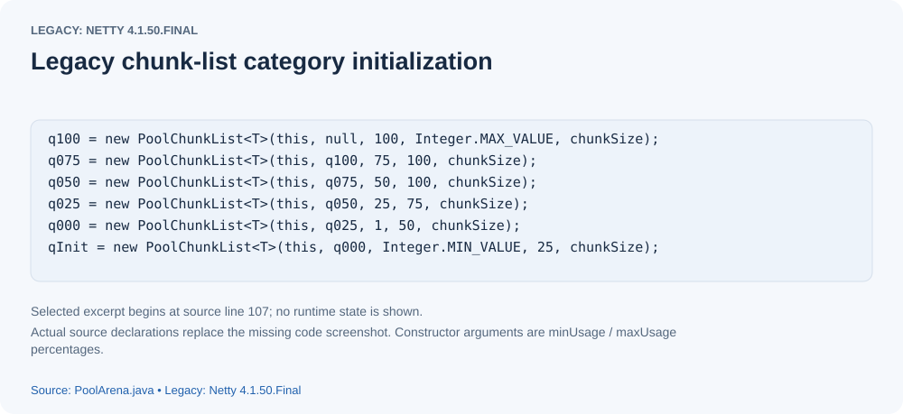](assets/pooled-memory-09.svg)
These bounds differ among its chunk lists.

```

freeMinThreshold = (maxUsage == 100) ? 0 : (int) (chunkSize * (100.0 - maxUsage + 0.99999999) / 100L);
freeMaxThreshold = (minUsage == 100) ? 0 : (int) (chunkSize * (100.0 - minUsage + 0.99999999) / 100L);

```

`freeMinThreshold` is derived from `maxUsage`, and `freeMaxThreshold` from `minUsage`. For `q025`, the bounds are 25 and 75. The source computes thresholds as `(int) (chunkSize * (100.0 - usage + 0.99999999) / 100L)` (with a zero special case when usage is 100), giving approximately 4.16 MiB and 12.16 MiB for a 16 MiB chunk. After allocation takes free bytes to or below the lower threshold, a chunk moves toward a higher-utilization list. After freeing takes free bytes above the upper threshold, it moves toward a lower-utilization list. The ranges overlap deliberately; these are migration thresholds rather than a partition into mutually exclusive capacities.
[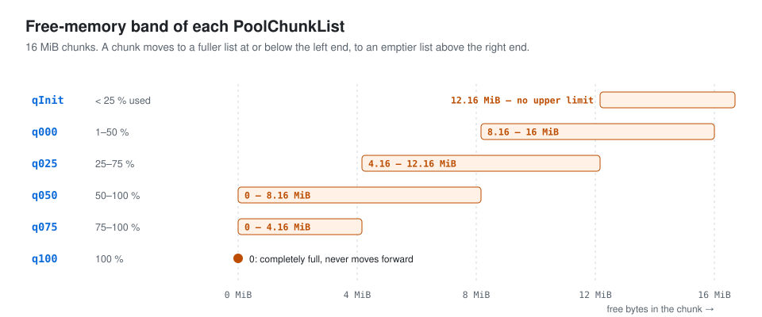{: .diagram}](assets/pooled-memory-10.svg)

---

- PoolThreadLocalCache
This `FastThreadLocal` associates each thread with a `PoolThreadCache`.
- PoolThreadCache
As its name suggests, `PoolThreadCache` caches reusable memory regions for a thread. Arenas, chunks, pages, and subpages manage shared backing storage. The cache retains regions allocated through the thread's arenas. A later allocation first tries the appropriate cache; only a miss requires returning to shared arena allocation.
Here are its important fields.

```

    // Heap arena assigned to this thread.
    final PoolArena<byte[]> heapArena;
    // Direct arena assigned to this thread.
    final PoolArena<ByteBuffer> directArena;

    // Hold the caches for the different size classes, which are tiny, small and normal.

    // The legacy allocator classifies positive capacities through 4096 bytes as subpage sizes.
    // Tiny requests normalize to multiples of 16 below 512.
    // Positive tiny classes are 16, 32, 48, ... , 496.
    // The arena's tinySubpagePools indexes those classes.
    // tinySubPageDirectCaches also has 32 slots.
   // Each slot corresponds to the arena's matching subpage size class.
   // For example, index 1 caches 16-byte direct-memory regions.
   // A positive request no larger than 16 first checks that cache.
    private final MemoryRegionCache<ByteBuffer>[] tinySubPageDirectCaches;
    // smallSubPageDirectCaches has four slots by default.
    // They cache the 512, 1024, 2048, and 4096 byte size classes.
    private final MemoryRegionCache<ByteBuffer>[] smallSubPageDirectCaches;
    // Heap-memory equivalent of the tiny direct caches.
    private final MemoryRegionCache<byte[]>[] tinySubPageHeapCaches;
   // Heap-memory equivalent of the small direct caches.
    private final MemoryRegionCache<byte[]>[] smallSubPageHeapCaches;

    // normalDirectCaches has three slots with the default cache limit.
    // They represent 8, 16, and 32 KiB regions.
    // Larger-than-subpage allocations reserve power-of-two page runs.
    // Of those normal runs, only sizes through the configured 32 KiB limit are cached.
    // The cache stores reusable regions of backing chunks, not separately allocated buffers of each size.
    // Future matching requests try this cache before arena allocation.
    private final MemoryRegionCache<ByteBuffer>[] normalDirectCaches;
     // Heap-memory equivalent of normalDirectCaches.
    private final MemoryRegionCache<byte[]>[] normalHeapCaches;

```

- MemoryRegionCache
`MemoryRegionCache` manages reuse for one region size class.
Here are its fields:

```

        // Bound the number of entries: tiny defaults to 512, small to 256,
        // and normal to 64 in this legacy implementation.
         // A full queue rejects additional returns until entries are consumed or freed.
        private final int size;
        // Queue of Entry records identifying reusable memory regions.
        private final Queue<Entry<T>> queue;
        // Region category: tiny, small, or normal.
        private final SizeClass sizeClass;

```

These are the central classes used to manage pooled buffer backing storage and the per-thread caches layered over it.

---

The following code requests a direct buffer; we will follow its allocation.

```

 ByteBuf byteBuf5 = pooledByteBufAllocator.buffer(18) ;

```

The call chain is long, so follow it one step at a time.
[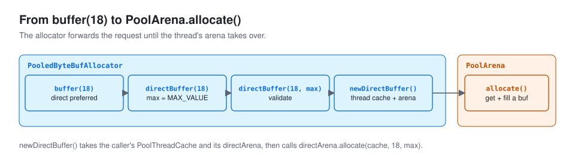{: .diagram}](assets/pooled-memory-11.svg)

- ##### newDirectBuffer()
Skip the allocator's forwarding methods and start at `newDirectBuffer`.

```

protected ByteBuf newDirectBuffer(int initialCapacity, int maxCapacity) {
       // Obtain this thread's PoolThreadCache.
        PoolThreadCache cache = threadCache.get();
       // Obtain the direct arena assigned to that cache.
       // The association is created when PoolThreadCache is initialized.
       // How are threads distributed approximately evenly among arenas?
        // Each arena counts its associated thread caches.
        // Choose the arena with the fewest associated caches for a newly created cache.
        PoolArena<ByteBuffer> directArena = cache.directArena;

        final ByteBuf buf;
        if (directArena != null) {
            // Enter arena allocation with the application's initialCapacity.
           // The usual maxCapacity default is Integer.MAX_VALUE.
            buf = directArena.allocate(cache, initialCapacity, maxCapacity);
        } else {
            buf = PlatformDependent.hasUnsafe() ?
                    UnsafeByteBufUtil.newUnsafeDirectByteBuf(this, initialCapacity, maxCapacity) :
                    new UnpooledDirectByteBuf(this, initialCapacity, maxCapacity);
        }

        return toLeakAwareBuffer(buf);
    }

```

- ##### First arena allocate overload

```

  PooledByteBuf<T> allocate(PoolThreadCache cache, int reqCapacity, int maxCapacity) {
        // Obtain the pooled ByteBuf wrapper that will be returned to the caller.
       // This wrapper is recyclable; newByteBuf obtains it through an object recycler.
        // See the Recycler article for the object-pool mechanism.
        // recycler.html
        PooledByteBuf<T> buf = newByteBuf(maxCapacity);
        allocate(cache, buf, reqCapacity);
        return buf;
    }

```

- ##### Second arena allocate overload
This larger method implements the size-category decision.

```

private void allocate(PoolThreadCache cache, PooledByteBuf<T> buf, final int reqCapacity) {
         // Normalize the requested capacity according to the legacy size classes.
         // Positive tiny requests below 512 round up to a multiple of 16.
         // Choose the smallest such multiple at least as large as reqCapacity.
         // For example, 18 becomes 32 and 6 becomes 16.
         // Larger pooled requests round up to the next power of two (or retain an exact power).
         // For example, 1025 becomes 2048; huge requests use the separate unpooled path.
        final int normCapacity = normalizeCapacity(reqCapacity);
        // Check whether normalized capacity is smaller than one logical page.
        if (isTinyOrSmall(normCapacity)) { // capacity < pageSize
            int tableIdx;
            PoolSubpage<T>[] table;
            // Distinguish tiny normalized capacities below 512.
            boolean tiny = isTiny(normCapacity);
            if (tiny) { // < 512
                // First try the thread's tiny-size cache.
                if (cache.allocateTiny(this, buf, reqCapacity, normCapacity)) {
                    // was able to allocate out of the cache so move on
                    return;
                }
                // On a miss, select tinySubpagePools.
                // Calculate its index for normCapacity.
                tableIdx = tinyIdx(normCapacity);
                table = tinySubpagePools;
            } else {
                 // Otherwise try the thread's small-size cache.
                if (cache.allocateSmall(this, buf, reqCapacity, normCapacity)) {
                    // was able to allocate out of the cache so move on
                    return;
                }
                // On a miss, select smallSubpagePools.
                // Calculate its index for normCapacity.
                tableIdx = smallIdx(normCapacity);
                table = smallSubpagePools;
            }


            // head is the sentinel for the selected subpage size-class list.
            // Compare the earlier tiny and small subpage-pool diagrams.
            final PoolSubpage<T> head = table[tableIdx];

            /**
             * Synchronize on the head. This is needed as {@link PoolChunk#allocateSubpage(int)} and
             * {@link PoolChunk#free(long)} may modify the doubly linked list as well.
             */

            synchronized (head) {
                final PoolSubpage<T> s = head.next;
               // If the first entry is the head itself, no available subpage exists in this list.
                if (s != head) {
                    assert s.doNotDestroy && s.elemSize == normCapacity;
                    long handle = s.allocate();
                    assert handle >= 0;
                    s.chunk.initBufWithSubpage(buf, null, handle, reqCapacity, cache);
                    incTinySmallAllocation(tiny);
                    return;
                }
            }
            synchronized (this) {
                // On a cache/subpage-list miss, allocate through the arena.
                allocateNormal(buf, reqCapacity, normCapacity, cache);
            }

            incTinySmallAllocation(tiny);
            return;
        }
         // A normalized capacity no larger than chunkSize uses the normal pooled path.
        if (normCapacity <= chunkSize) {
            // Try the normal-size thread cache first.
            if (cache.allocateNormal(this, buf, reqCapacity, normCapacity)) {
                // was able to allocate out of the cache so move on
                return;
            }
            synchronized (this) {
               // On a cache miss, allocate through the arena.
                allocateNormal(buf, reqCapacity, normCapacity, cache);
                ++allocationsNormal;
            }
        } else {
            // Huge allocations are never served via the cache so just call allocateHuge
           // A larger request uses allocateHuge.
            allocateHuge(buf, reqCapacity);
        }
    }

```

Allocation first tries the thread's `PoolThreadCache`, then uses the arena's backing storage on a miss. Examine the tiny-size cache path first.
- cacheForTiny
The cache has a 32-slot array for tiny heap regions and an analogous array for direct regions. `cacheForTiny` finds the matching `MemoryRegionCache` for `normCapacity`, choosing the appropriate heap or direct array according to the arena.

```

private MemoryRegionCache<?> cacheForTiny(PoolArena<?> area, int normCapacity) {
       // Calculate the tiny cache's size-class index.
        int idx = PoolArena.tinyIdx(normCapacity);
        if (area.isDirect()) {
            return cache(tinySubPageDirectCaches, idx);
        }
        return cache(tinySubPageHeapCaches, idx);
    }

// Obtain the cache for this index and memory type.
 private static <T> MemoryRegionCache<T> cache(MemoryRegionCache<T>[] cache, int idx) {
        if (cache == null || idx > cache.length - 1) {
            return null;
        }
        return cache[idx];
    }

```

- MemoryRegionCache.allocate()
Obtain a region from the thread cache:

```

 public final boolean allocate(PooledByteBuf<T> buf, int reqCapacity, PoolThreadCache threadCache) {
           // queue contains Entry records describing regions of this size class.
            Entry<T> entry = queue.poll();
            if (entry == null) {
              // If no matching cached region is available, return false.
                return false;
            }
           // Initialize the returned ByteBuf wrapper with the cached region; initialization is examined below.
            initBuf(entry.chunk, entry.nioBuffer, entry.handle, buf, reqCapacity, threadCache);
            // Recycle the consumed Entry metadata object.
            entry.recycle();

            // allocations is not thread-safe which is fine as this is only called from the same thread all time.
            ++ allocations;
            return true;
        }

```

On a cache miss, arena allocation handles the request. For a tiny allocation there are two cases:
1) Locate the normalized-size list in `tinySubpagePools`. If it has an available subpage after its sentinel head, allocate a unit from that subpage.

```

 long allocate() {
         // A zero-size element uses its special handle encoding.
        if (elemSize == 0) {
            return toHandle(0);
        }
       // If this subpage has no available unit or has been marked for destruction,
       // report allocation failure with -1.
        if (numAvail == 0 || !doNotDestroy) {
            return -1;
        }
       // Find the next available allocation unit.
       // The bitmap search is examined below.
        final int bitmapIdx = getNextAvail();
        int q = bitmapIdx >>> 6;
        int r = bitmapIdx & 63;
        assert (bitmap[q] >>> r & 1) == 0;
        bitmap[q] |= 1L << r;
        // Once all units are occupied, remove this page from the available-subpage list.
        if (-- numAvail == 0) {
            removeFromPool();
        }
       // Return a handle encoding the allocated unit and page.
        return toHandle(bitmapIdx);
    }

```

2) With no suitable available subpage, allocate through `allocateNormal`.

```

 // Pooled requests are bounded by chunkSize.
 // First search existing chunks through the arena's utilization lists.
 private void allocateNormal(PooledByteBuf<T> buf, int reqCapacity, int normCapacity, PoolThreadCache threadCache) {
        if (q050.allocate(buf, reqCapacity, normCapacity, threadCache) ||
            q025.allocate(buf, reqCapacity, normCapacity, threadCache) ||
            q000.allocate(buf, reqCapacity, normCapacity, threadCache) ||
            qInit.allocate(buf, reqCapacity, normCapacity, threadCache) ||
            q075.allocate(buf, reqCapacity, normCapacity, threadCache)) {
            return;
        }

        // Add a new chunk.
       // If no existing list satisfies the request, allocate a new chunk.
       // Then obtain the requested region from that chunk.
        PoolChunk<T> c = newChunk(pageSize, maxOrder, pageShifts, chunkSize);
        // Allocate within the newly created chunk.
        boolean success = c.allocate(buf, reqCapacity, normCapacity, threadCache);
        assert success;
       // Insert the chunk into the utilization-list structure.
        qInit.add(c);
    }

```

- newChunk()
If the allocator has no backing chunk yet, or no existing chunk can supply the required region, it obtains another chunk from the JVM/native allocator. The default backing size is 16 MiB. Sufficient total free bytes alone do not guarantee a sufficiently large contiguous run.

```

 protected PoolChunk<ByteBuffer> newChunk(int pageSize, int maxOrder,
                int pageShifts, int chunkSize) {
            if (directMemoryCacheAlignment == 0) {
                // Allocate the direct backing storage for a chunk here.
                return new PoolChunk<ByteBuffer>(this,
                        allocateDirect(chunkSize), pageSize, maxOrder,
                        pageShifts, chunkSize, 0);
            }
            final ByteBuffer memory = allocateDirect(chunkSize
                    + directMemoryCacheAlignment);
            return new PoolChunk<ByteBuffer>(this, memory, pageSize,
                    maxOrder, pageShifts, chunkSize,
                    offsetCacheLine(memory));
        }

```

Constructing a legacy `PoolChunk` initializes `memoryMap` and `depthMap`.
The legacy allocator reserves normal regions in power-of-two page runs. A three-page request therefore rounds to four pages; a five-page request rounds to eight. At the defaults, a chunk contains 2048 logical pages, managed by a complete binary tree with 12 levels numbered 0 through 11. The 2048 leaves each represent one page, and an internal node represents the combined capacity of its children.

[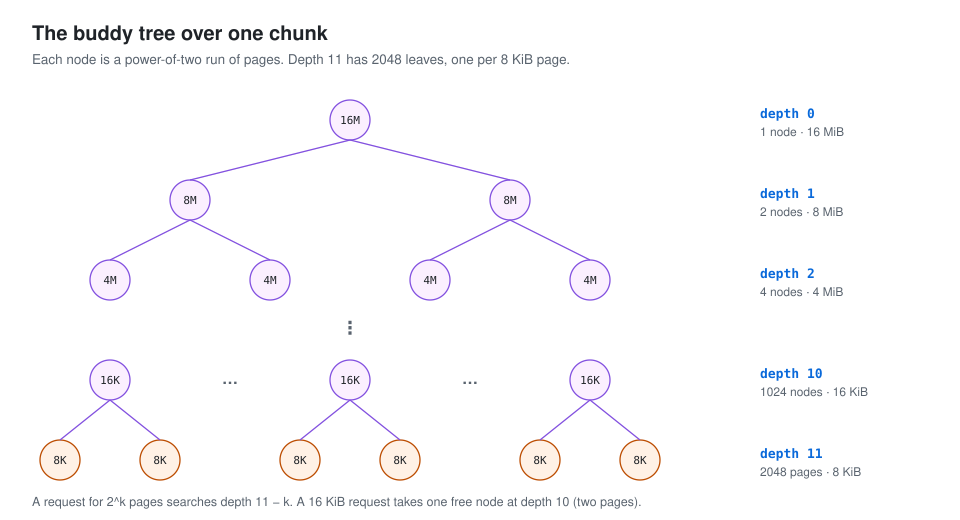{: .diagram}](assets/pooled-memory-12.svg)

`memoryMap` and `depthMap` encode this tree in arrays. Their default length is 4096, but the tree has 4095 nodes because index zero is unused. `memoryMap` changes as regions are allocated and freed; `depthMap` retains each node's original depth. Here is their initialization.

```

        // Use one-based indexes for the complete binary tree.
        int memoryMapIndex = 1;
       // maxOrder defaults to 11; depth d ranges from 0 through 11.
       // A leaf's depth is 11, corresponding to one 8 KiB page.
       // A node at depth 2 represents 4 MiB at these defaults.
        for (int d = 0; d <= maxOrder; ++ d) { // move down the tree one level at a time
            // Calculate the number of nodes on this level.
            int depth = 1 << d;
            // Assign the same initial depth value to every node on the level.
            for (int p = 0; p < depth; ++ p) {
                // in each level traverse left to right and set value to the depth of subtree
                memoryMap[memoryMapIndex] = (byte) d;
                depthMap[memoryMapIndex] = (byte) d;
                memoryMapIndex ++;
            }
        }

```

Each node's represented byte capacity follows the formula below.
`8 KiB * 2^(maxOrder - d)`

The allocation algorithm is examined next.

- PoolChunk.allocate()
`PoolChunk.allocate` reserves memory from the tree. It distinguishes two cases:
1) A normalized subpage capacity uses `allocateSubpage`.
2) A normalized capacity at least one page uses `allocateRun`.
The subpage case also subdivides one page into equal-size units and records their occupancy. Start with that more involved case.

```

   // A subpage request reserves one backing page.
 private long allocateSubpage(int normCapacity) {
        // Obtain the head of the PoolSubPage pool that is owned by the PoolArena and synchronize on it.
        // This is need as we may add it back and so alter the linked-list structure.
       // Find the sentinel of the matching tiny or small size-class list.
       // This is the list into which the newly created subpage will be inserted.
        PoolSubpage<T> head = arena.findSubpagePoolHead(normCapacity);
        int d = maxOrder; // subpages are only be allocated from pages i.e., leaves
        synchronized (head) {
            // Allocate a tree node; id is its memoryMap index.
            int id = allocateNode(d);
           // A negative id indicates allocation failure.
            if (id < 0) {
                return id;
            }

            final PoolSubpage<T>[] subpages = this.subpages;
            final int pageSize = this.pageSize;
            // Subtract one page from the chunk's free bytes.
            freeBytes -= pageSize;
           // Calculate this page's index in the subpages array.
            int subpageIdx = subpageIdx(id);
            PoolSubpage<T> subpage = subpages[subpageIdx];
            if (subpage == null) {
                // Initialize a new PoolSubpage for this page.
                subpage = new PoolSubpage<T>(head, this, id, runOffset(id), pageSize, normCapacity);
                // Store it in subpages.
                subpages[subpageIdx] = subpage;
            } else {
                subpage.init(head, normCapacity);
            }
           // Allocate one normCapacity unit from the subpage.
            return subpage.allocate();
        }
    }

```

- allocateNode(int d)
Allocate a node from the tree encoded by `memoryMap`:

```

// d is the requested tree depth: 11 for 8 KiB and 10 for 16 KiB at the defaults.
 private int allocateNode(int d) {
      // Start from root index 1 and search for an available node at depth d.
        int id = 1;
        int initial = - (1 << d); // has last d bits = 0 and rest all = 1
        byte val = value(id);
        if (val > d) { // unusable
            return -1;
        }
         // If the node's availability value is smaller than d, descend to its left child.
        while (val < d || (id & initial) == 0) { // id & initial == 1 << d for all ids at depth d, for < d it is 0
            id <<= 1;
            val = value(id);
            // If that subtree cannot satisfy depth d, inspect its sibling.
            if (val > d) {
                id ^= 1;
                val = value(id);
            }
        }
        byte value = value(id);
        assert value == d && (id & initial) == 1 << d : String.format("val = %d, id & initial = %d, d = %d",
                value, id & initial, d);
       // Mark the chosen node unavailable using maxOrder + 1, default 12.
        setValue(id, unusable); // mark as unusable
      // Internal nodes summarize the best available depth in their children.
      // Update those summaries along the path to the root after allocation.
        updateParentsAlloc(id);
        return id;
    }

```

- updateParentsAlloc(id)
Update parent availability after allocating a child:

```

  private void updateParentsAlloc(int id) {
        while (id > 1) {
            // Find the parent node.
            int parentId = id >>> 1;
            // Read the current child's availability value.
            byte val1 = value(id);
            // Read its sibling's availability value.
            byte val2 = value(id ^ 1);
            // Choose min(val1, val2).
            byte val = val1 < val2 ? val1 : val2;
            // Store that value in memoryMap for the parent.
            setValue(parentId, val);
            id = parentId;
        }
    }

```

- PoolSubpage initialization
After obtaining a page, initialize the `PoolSubpage` that divides it into units.

```

 PoolSubpage(PoolSubpage<T> head, PoolChunk<T> chunk, int memoryMapIdx, int runOffset, int pageSize, int elemSize) {
       // These fields were described earlier.
        this.chunk = chunk;
        this.memoryMapIdx = memoryMapIdx;
        this.runOffset = runOffset;
        this.pageSize = pageSize;
        // The bitmap array has eight longs at the default page size.
        // Each long holds 64 occupancy bits, so eight longs provide 512 bits.
        // A page has 8192 bytes and the smallest positive unit is 16 bytes.
       // Therefore at most 512 units need occupancy bits.
        bitmap = new long[pageSize >>> 10]; // pageSize / 16 / 64
        init(head, elemSize);
    }


void init(PoolSubpage<T> head, int elemSize) {
        doNotDestroy = true;
      // elemSize is the normalized size of each allocation unit.
        this.elemSize = elemSize;
        if (elemSize != 0) {
            // Calculate the number of units in this page.
            maxNumElems = numAvail = pageSize / elemSize;
            nextAvail = 0;
           // Divide the unit count by 64 to obtain the initial bitmap length.
            bitmapLength = maxNumElems >>> 6;
            if ((maxNumElems & 63) != 0) {
                // Round up by one long when the count is not a multiple of 64.
                // For example, a 1024-byte unit gives eight units per page.
               // Eight shifted right by six is zero, though eight bits are required.
               // One long supplies those bits.
                bitmapLength ++;
            }
            // Clear the relevant bitmap words: all units initially are free.
            for (int i = 0; i < bitmapLength; i ++) {
                bitmap[i] = 0;
            }
        }
       // Insert this available subpage immediately after its size-class sentinel.
        addToPool(head);
    }

```

- PoolSubpage.allocate()
Return a unit of `normCapacity` bytes:

```

long allocate() {
        if (elemSize == 0) {
            return toHandle(0);
        }

        if (numAvail == 0 || !doNotDestroy) {
            return -1;
        }
        // Find the next available unit index.
        // bitmapIdx encodes both its bitmap word and bit position.
        // The upper portion selects a long in the bitmap array.
        // The low six bits select one of that long's 64 bits.
        final int bitmapIdx = getNextAvail();
        // q is the bitmap-word index.
        int q = bitmapIdx >>> 6;
        // r is the bit position within that word.
        int r = bitmapIdx & 63;
        assert (bitmap[q] >>> r & 1) == 0;
        // Set the occupancy bit to one for this allocated unit.
        bitmap[q] |= 1L << r;
        // Remove a fully occupied subpage from the available size-class list.
        if (-- numAvail == 0) {
            removeFromPool();
        }
        // Return the encoded handle.
        return toHandle(bitmapIdx);
    }

```

- toHandle
[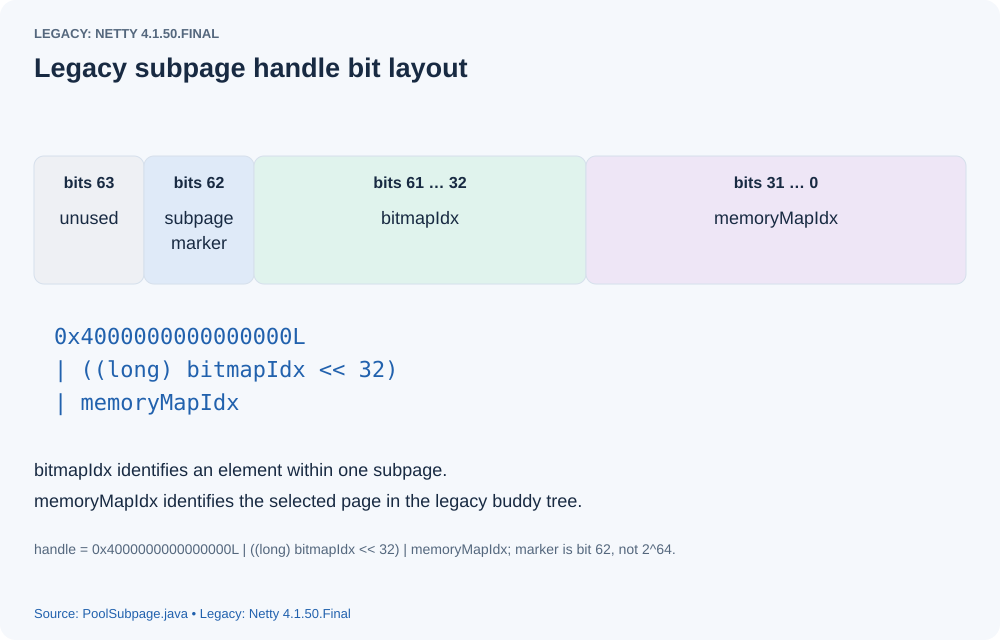](assets/pooled-memory-13.svg)
The legacy handle combines three values with bitwise OR. Its subpage marker is `0x4000000000000000L`, or `2^62`; the original claim of `2^64` was incorrect.
The second portion stores the unit's index within its page (for example, unit 19), and the low 32 bits store the page's tree node index within the chunk.
These fields allow the allocator to recover both the page and the unit's position within it.

- getNextAvail
The next free unit is found through `getNextAvail`,
`findNextAvail`, and `findNextAvail0`. Examine the search below.

```

private int findNextAvail() {

        final long[] bitmap = this.bitmap;
        final int bitmapLength = this.bitmapLength;
        for (int i = 0; i < bitmapLength; i ++) {
            long bits = bitmap[i];
            // If ~bits is zero, every bit in this word is occupied.
            // Continue with the next bitmap word.
            // Otherwise at least one bit may represent a free unit.
            if (~bits != 0) {
                return findNextAvail0(i, bits);
            }
        }
       // No free unit was found.
        return -1;
    }

private int findNextAvail0(int i, long bits) {
        // i selects the bitmap word.
        final int maxNumElems = this.maxNumElems;
       // baseVal is that word's starting unit index, i << 6.
        final int baseVal = i << 6;
        // Examine its 64 bits; j is the bit index within this word.
        for (int j = 0; j < 64; j ++) {
             // A zero low bit means this candidate unit is free.
            if ((bits & 1) == 0) {
               // Combine baseVal with j to form the unit index.
               // Shifting the result right by six recovers i.
               // AND with 63 recovers j; baseVal is a multiple of 64 and can be zero.
                int val = baseVal | j;
                if (val < maxNumElems) {
                    return val;
                } else {
                    break;
                }
            }
           // This candidate bit is occupied.
            // Unsigned-shift to inspect the next bit.
            bits >>>= 1;
        }
        return -1;
    }

```

- PoolChunk.initBuf
After obtaining a region identified by its handle, initialize the `ByteBuf` wrapper.

```

void initBuf(PooledByteBuf<T> buf, ByteBuffer nioBuffer, long handle, int reqCapacity,
                 PoolThreadCache threadCache) {
        int memoryMapIdx = memoryMapIdx(handle);
        int bitmapIdx = bitmapIdx(handle);
        // bitmapIdx == 0 identifies a normal page-run allocation.
        if (bitmapIdx == 0) {
            byte val = value(memoryMapIdx);
            assert val == unusable : String.valueOf(val);
            // runOffset calculates the region's start within the chunk.
            // Its calculation is examined below.
            buf.init(this, nioBuffer, handle, runOffset(memoryMapIdx) + offset,
                    reqCapacity, runLength(memoryMapIdx), threadCache);
        } else {
            // A nonzero bitmap portion identifies a subpage allocation.
            initBufWithSubpage(buf, nioBuffer, handle, bitmapIdx, reqCapacity, threadCache);
        }
    }

private void initBufWithSubpage(PooledByteBuf<T> buf, ByteBuffer nioBuffer,
                                    long handle, int bitmapIdx, int reqCapacity, PoolThreadCache threadCache) {
        assert bitmapIdx != 0;

        int memoryMapIdx = memoryMapIdx(handle);

        PoolSubpage<T> subpage = subpages[subpageIdx(memoryMapIdx)];
        assert subpage.doNotDestroy;
        assert reqCapacity <= subpage.elemSize;

        buf.init(
            this, nioBuffer, handle,
            runOffset(memoryMapIdx) + (bitmapIdx & 0x3FFFFFFF) * subpage.elemSize + offset,
                reqCapacity, subpage.elemSize, threadCache);
    }

```

Both normal and subpage allocations eventually call `PooledByteBuf.init`. The main difference is how their start offset within the backing chunk is computed. Examine the two cases.
- runOffset
For a normal run, calculate the run's starting position within the chunk.

```


private int runOffset(int id) {
        // represents the 0-based offset in #bytes from start of the byte-array chunk
       // depth(id) reads the node's immutable depth from depthMap.
       // 1 << depth(id) is the first node index on that tree level.
       // XOR with id obtains its horizontal index within the level.
       // For example, node 2049 is the second node on level 11, giving index 1.
       // shift stores that horizontal index.
        int shift = id ^ 1 << depth(id);
        // runLength is the byte capacity represented by the node.
        // Node 2049 represents 8 KiB; node 512 represents 32 KiB at the defaults.
        // Multiplying horizontal index by runLength gives the chunk-relative offset.
        return shift * runLength(id);
    }

  private byte depth(int id) {
        return depthMap[id];
    }

  private int runLength(int id) {
        // represents the size in #bytes supported by node 'id' in the tree
        // log2ChunkSize defaults to 24 because 16 MiB is 2 to the power 24 bytes.
        return 1 << log2ChunkSize - depth(id);
    }

```

For a subpage allocation, the offset formula is:

```

runOffset(memoryMapIdx) + (bitmapIdx & 0x3FFFFFFF) * subpage.elemSize + offset

```

It has three terms:
1) `runOffset(memoryMapIdx)` gives the page's starting position within the chunk.
2) `(bitmapIdx & 0x3FFFFFFF) * subpage.elemSize` gives the unit's offset within that page. The mask removes the marker bit carried into the upper 32-bit bitmap field when the handle is shifted; it is not simply a signed-number correction.
3) The chunk's backing-storage `offset`, normally zero unless alignment adds an offset.
Adding the three terms gives the allocated unit's start in the backing storage.

- buf.init
Finally, initialize the pooled buffer wrapper. The fields below follow from the region information already examined.

```

private void init0(PoolChunk<T> chunk, ByteBuffer nioBuffer,
                       long handle, int offset, int length, int maxLength, PoolThreadCache cache) {
        assert handle >= 0;
        assert chunk != null;

        this.chunk = chunk;
        memory = chunk.memory;
        tmpNioBuf = nioBuffer;
        allocator = chunk.arena.parent;
        this.cache = cache;
        this.handle = handle;
        this.offset = offset;
        this.length = length;
        this.maxLength = maxLength;
    }

```


The huge-allocation path for requests larger than `chunkSize` is shorter and is not examined further here.
This completes the allocation walkthrough.


## References

[http://anyteam.me/netty-memory-allocation-PoolArena/](http://anyteam.me/netty-memory-allocation-PoolArena/)
[http://www.programmersought.com/article/9322400832/](http://www.programmersought.com/article/9322400832/)
[https://www.jianshu.com/p/4856bd30dd56](https://www.jianshu.com/p/4856bd30dd56)
[https://juejin.im/post/5d4f6d74f265da03e83b5e07](https://juejin.im/post/5d4f6d74f265da03e83b5e07)


## Source version and figures

The allocator excerpts are preserved as a **legacy Netty 4.1.50.Final walkthrough**, an explicit exception to the series baseline. Their `tinySubpagePools`, `memoryMap`, `depthMap`, and tree-index handles do not describe Netty 4.1.53.Final. At 4.1.53, `PoolArena` extends `SizeClasses`, tiny allocations are merged into small size classes, `PoolChunk` manages runs with size-indexed priority queues and a run map, and handles encode run offset, page count, used/subpage flags, and bitmap index. Defaults of `pageSize = 8192` and `maxOrder = 11` still produce a 16 MiB chunk in both versions. Legacy size rounding, cache defaults, and tree formulas above must be read in the historical context. The original explanations of whole-page delivery for tiny requests, changing chunk sizes, cache-trim trigger, handle marker, bitmap mask, and array indexing have been corrected.

Diagrams drawn for the original article are reproduced with English labels. Where the original was a screenshot that could not be recovered, the figure is reconstructed from the source; those are explanatory diagrams, not newly observed debugger output.

Source baseline: Netty 4.1.53.Final (released October 13, 2020).

- [Legacy PoolArena.java](https://github.com/netty/netty/blob/8c5b72aaf02e7f349a9972dd9179b449b5a6067b/buffer/src/main/java/io/netty/buffer/PoolArena.java)
- [Legacy PoolChunk.java](https://github.com/netty/netty/blob/8c5b72aaf02e7f349a9972dd9179b449b5a6067b/buffer/src/main/java/io/netty/buffer/PoolChunk.java)
- [Legacy PoolSubpage.java](https://github.com/netty/netty/blob/8c5b72aaf02e7f349a9972dd9179b449b5a6067b/buffer/src/main/java/io/netty/buffer/PoolSubpage.java)
- [Legacy PoolThreadCache.java](https://github.com/netty/netty/blob/8c5b72aaf02e7f349a9972dd9179b449b5a6067b/buffer/src/main/java/io/netty/buffer/PoolThreadCache.java)
- [Legacy PooledByteBufAllocator.java](https://github.com/netty/netty/blob/8c5b72aaf02e7f349a9972dd9179b449b5a6067b/buffer/src/main/java/io/netty/buffer/PooledByteBufAllocator.java)
- [4.1.53 SizeClasses.java](https://github.com/netty/netty/blob/d4a0050ef33cab2542a80e11489a4977a63859f8/buffer/src/main/java/io/netty/buffer/SizeClasses.java)
- [4.1.53 PoolChunk.java](https://github.com/netty/netty/blob/d4a0050ef33cab2542a80e11489a4977a63859f8/buffer/src/main/java/io/netty/buffer/PoolChunk.java)
- [4.1.53 PoolSubpage.java](https://github.com/netty/netty/blob/d4a0050ef33cab2542a80e11489a4977a63859f8/buffer/src/main/java/io/netty/buffer/PoolSubpage.java)
- [4.1.53 PooledByteBufAllocator.java](https://github.com/netty/netty/blob/d4a0050ef33cab2542a80e11489a4977a63859f8/buffer/src/main/java/io/netty/buffer/PooledByteBufAllocator.java)
