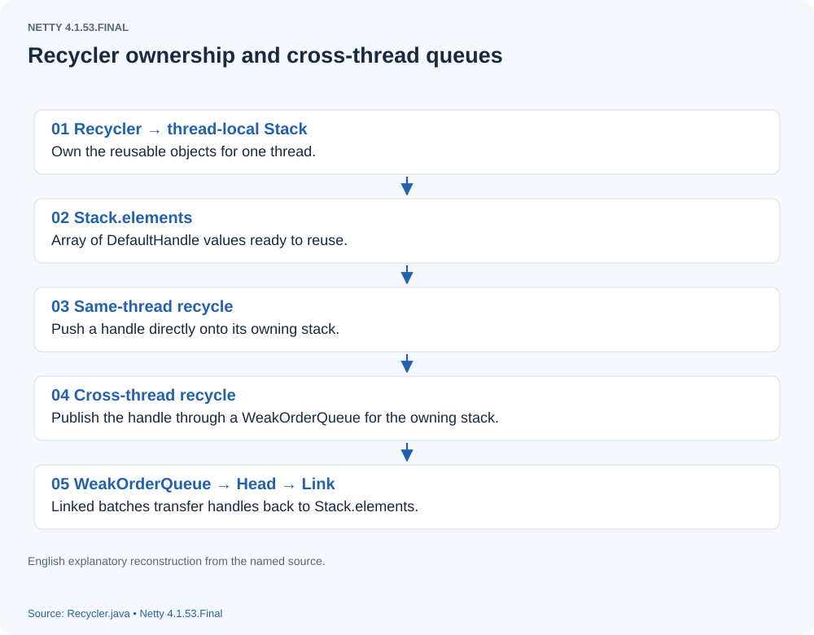
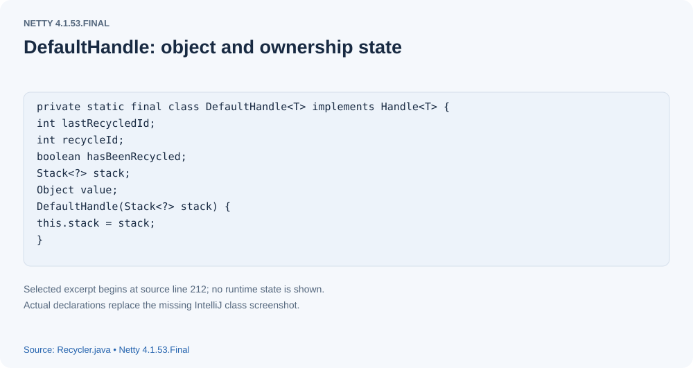
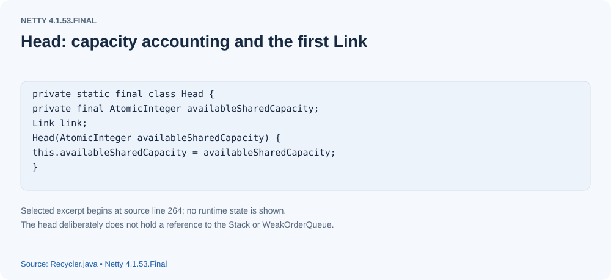
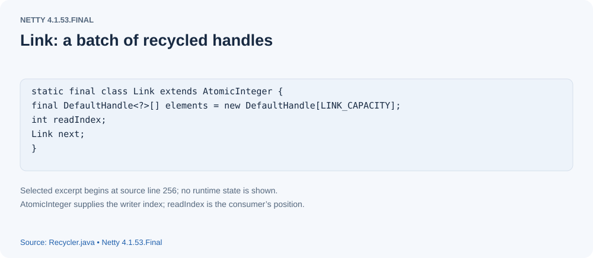
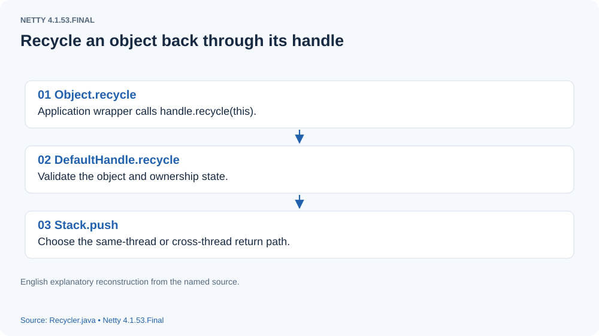
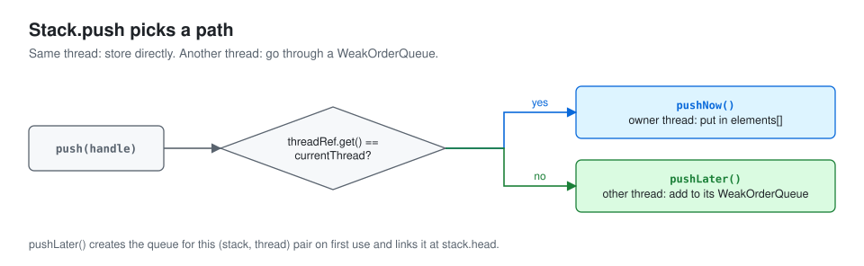
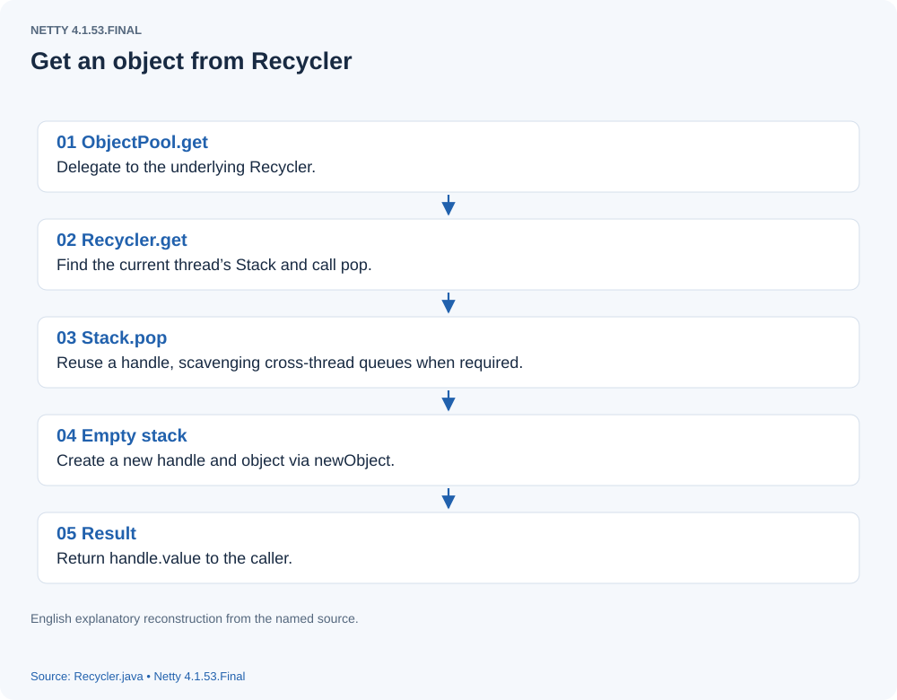
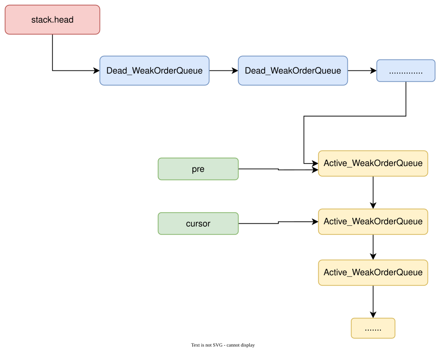

# How Netty Recycler Reuses Objects Across Threads

## Background
Repeatedly creating and collecting many objects of the same type can increase allocation and GC work. An object pool allows reuse: return an object when finished, and obtain one from the pool when needed. Netty uses many short-lived internal objects and provides a thread-local recycler for them.

## Defining a reusable type in Netty
- Create a recycler for the object type.
- Give the reusable class a recycle method.
- Keep its `Handle` in each reusable object.

```

`Handle` is a Netty interface whose ordinary implementation is `DefaultHandle`. It provides the operation used to return an object to the recycler.

```


## A simple example

```

import io.netty.util.Recycler;
import io.netty.util.internal.ObjectPool;

public class Recycler_T {
      // productObjectPoolRecycle is the recycler for Product instances.
    static ObjectPool<Product> productObjectPoolRecycle =  ObjectPool.newPool(new ObjectPool.ObjectCreator<Product>() {
        @Override
        public Product newObject(ObjectPool.Handle<Product> handle) {
            return new Product(handle);
        }
    });

    static class Product{
        ObjectPool.Handle<Product> handle ;

        Product(ObjectPool.Handle<Product> handle){
            this.handle = handle ;
        }

        void recycle(){
            this.handle.recycle(this);
        }

    }

    public static void main(String[] args) {
        Product p1 = productObjectPoolRecycle.get();
        p1.recycle();
        Product p2 = productObjectPoolRecycle.get();
        Product p3 = productObjectPoolRecycle.get();
        p3.recycle();
        Product p4 = productObjectPoolRecycle.get();
        System.out.println(p1==p2);
        System.out.println(p3==p4);
    }

}

```

The example shows the requirements for a reusable object type:
1) Create the recycler.
2) Store the supplied handle in `Product`.
3) Expose a method that returns the object through that handle.
In `main`, obtaining `p1` initially calls the recycler's `newObject` because no reusable object exists. After using and recycling `p1`, obtaining `p2` can return that same object. In the shown sequence `p3` and `p4` differ. Why? The recycler's admission policy, described below, decides which newly recycled objects to retain; object identity observations depend on that policy and the example's operation order.

## Before discussing the implementation
Each thread has its own stack for a recycler. A thread obtains objects from its own stack rather than sharing a single synchronized pool with all other threads. Cross-thread recycling uses separate transfer queues, so this does not mean objects can never move between threads.

## Implementation model
Start with the diagram.
[{: .diagram}](assets/recycler-01.svg)
The main elements are described below.
- ##### stack
`Stack` is a thread's local pool implementation. Each owning thread has its own stack.
- ##### stack -> elements
`elements` is a `DefaultHandle` array, initially sized to `min(maxCapacity, 256)`. Each occupied slot represents a retained reusable object.
- ##### DefaultHandle
`DefaultHandle` links reuse to the object: `stack` identifies the owning pool and `value` identifies the reusable object. The pool actually stores handles.
[](assets/recycler-02.svg)

- ##### stack -> head
`head` points to the first `WeakOrderQueue` in a linked list.
- ##### stack -> cursor
`cursor` records the queue at which scavenging resumes; it is examined below.
- ##### stack -> pre
`prev` records the preceding queue during scavenging; it is examined below.
- ##### WeakOrderQueue
Thread-local stacks avoid synchronizing every ordinary obtain and recycle operation. However, another thread can return an object to its owner's recycler. Instead of changing the owner's `elements` array directly, that producer thread creates a `WeakOrderQueue` for the stack and appends handles to it. Several producer threads therefore create several queues, linked together. The stack's `head` points to the most recently linked queue.
- ##### WeakOrderQueue -> next
`next` points to the next queue in that linked list.
- ##### WeakOrderQueue -> id
Each queue has a unique `id`.
- ##### WeakOrderQueue -> head
`head` within the queue points to a `Head` object, discussed below.
- ##### WeakOrderQueue -> tail
`tail` points to the final `Link` in the queue's link list.
- ##### Head
`Head` connects the queue to its link list and manages reservations from the stack's shared-capacity budget. The links hold the handles recycled by another thread.
[](assets/recycler-03.svg)

- ##### Link
Objects recycled by their owner go into the stack's `elements` array. Objects returned by other threads enter `Link.elements`; each link has a default capacity of 16 handles.
[](assets/recycler-04.svg)
A link has a `readIndex` and a published write index. Since `Link` extends `AtomicInteger`, its atomic value acts as the write index. Returning an object appends at the write index and increments it; transferring objects advances the read index. Equal indexes mean there is currently no unread handle in that link. Handles are not returned to callers directly from these links: they first move into the owner's stack, from which `pop` obtains an object.

---
## Source walkthrough: recycling an object
Start with returning objects, so the later obtain path has a clear source for the objects it finds.
[{: .diagram}](assets/recycler-05.svg)
The diagram shows the recycling call chain. What happens in `stack.push`?

```

 void push(DefaultHandle<?> item) {
            Thread currentThread = Thread.currentThread();
            if (threadRef.get() == currentThread) {
                // The current Thread is the thread that belongs to the Stack, we can try to push the object now.
                pushNow(item);
            } else {
                // The current Thread is not the one that belongs to the Stack
                // (or the Thread that belonged to the Stack was collected already), we need to signal that the push
                // happens later.
                pushLater(item, currentThread);
            }
        }

```

`threadRef` weakly identifies the stack's owning thread. If that same thread returns an object, the stack uses `pushNow`; if another thread returns it, the stack uses `pushLater`.
[{: .diagram}](assets/recycler-06.svg)
Examine the two cases separately.
- ##### pushNow

```

 private void pushNow(DefaultHandle<?> item) {
            if ((item.recycleId | item.lastRecycledId) != 0) {
                throw new IllegalStateException("recycled already");
            }
           // Set recycleId and lastRecycledId for this return.
            item.recycleId = item.lastRecycledId = OWN_THREAD_ID;

            int size = this.size;
            // size is the number of retained handles; maxCapacity bounds that count.
           // Drop this return when size is at or above the maximum.
            if (size >= maxCapacity || dropHandle(item)) {
                // Hit the maximum capacity or should drop - drop the possibly youngest object.
                return;
            }
          // If admission succeeds and the local array is full, grow it.
          // New capacity is bounded by min(2 * size, maxCapacity).
            if (size == elements.length) {
                elements = Arrays.copyOf(elements, min(size << 1, maxCapacity));
            }
           // Store the recycled handle in elements.
            elements[size] = item;
           // Increase the count of available handles.
            this.size = size + 1;
        }

```

`dropHandle` decides whether this handle should be retained.

```

boolean dropHandle(DefaultHandle<?> handle) {

             // hasBeenRecycled identifies a handle previously admitted to reuse.
            if (!handle.hasBeenRecycled) {
                 // On first admission, increment and compare handleRecycleCount with interval.
                // The default interval is 8; the initial counter allows the first admission.
               // Thereafter drop eight previously unadmitted handles before admitting the next one.
               // This sampling policy limits rapid pool growth.
              // It explains the differing identities in the opening example.
                if (handleRecycleCount < interval) {
                    handleRecycleCount++;
                    // Drop the object.
                    return true;
                }
                handleRecycleCount = 0;
                handle.hasBeenRecycled = true;
            }
            return false;
        }

```

That is the same-thread return path.

- ##### pushLater
When another thread returns an object to this stack, it uses the following method.

```

 private void pushLater(DefaultHandle<?> item, Thread thread) {
            // maxDelayedQueues bounds the producer thread's delayed-queue map.
            // Its default is availableProcessors * 2; zero disables this delayed-queue path.
            if (maxDelayedQueues == 0) {
                // We don't support recycling across threads and should just drop the item on the floor.
                return;
            }

            // we don't want to have a ref to the queue as the value in our weak map
            // so we null it out; to ensure there are no races with restoring it later
            // we impose a memory ordering here (no-op on x86)
            // DELAYED_RECYCLED is a FastThreadLocal.
           // Each producer thread has a Map<Stack<?>, WeakOrderQueue>.
           // It records that producer's queues for returning objects to other stacks.
            // The key is the destination stack.
            // The value is this producer's return queue for that stack.
            Map<Stack<?>, WeakOrderQueue> delayedRecycled = DELAYED_RECYCLED.get();
            WeakOrderQueue queue = delayedRecycled.get(this);
            if (queue == null) {
                // No queue has been created for this destination stack yet.
                if (delayedRecycled.size() >= maxDelayedQueues) {
                    // Add a dummy queue so we know we should drop the object
                   // If the producer's map has reached maxDelayedQueues,
                   // store the DUMMY sentinel for this destination rather than allocate a queue.
                    delayedRecycled.put(this, WeakOrderQueue.DUMMY);
                    return;
                }
                // Check if we already reached the maximum number of delayed queues and if we can allocate at all.
                // Create a WeakOrderQueue when capacity permits.
                if ((queue = newWeakOrderQueue(thread)) == null) {
                    // drop object
                    return;
                }
                delayedRecycled.put(this, queue);
            } else if (queue == WeakOrderQueue.DUMMY) {
                // drop object
               // A DUMMY queue drops the returned handle.
                return;
            }
           // Add the handle to the delayed return queue.
            queue.add(item);
        }

```


- Implementation of newWeakOrderQueue

```

static WeakOrderQueue newQueue(Stack<?> stack, Thread thread) {
            // We allocated a Link so reserve the space
            // Bound the shared capacity for cross-thread returns to this stack.
            // With maxCapacity 4096 and the default factor 2, the budget is 2048 handles.
            // Head.reserveSpaceForLink reserves enough capacity for one link.
            // Check whether availableSharedCapacity can cover LINK_CAPACITY.
            // A default link occupies 16 handle slots.
            // Atomically subtract that reservation on success; otherwise fail allocation.
            if (!Head.reserveSpaceForLink(stack.availableSharedCapacity)) {
                return null;
            }
           // Construct the queue and its initial tail link.
           // At creation, the queue's tail and Head.link reference the same Link.
           // This is the initial empty link shown in the model diagram.
            final WeakOrderQueue queue = new WeakOrderQueue(stack, thread);
            // Done outside of the constructor to ensure WeakOrderQueue.this does not escape the constructor and so
            // may be accessed while its still constructed.
            // Multiple producer threads can link queues concurrently, so synchronize this update.
            // Set the stack's head to this newly linked queue.
            stack.setHead(queue);

            return queue;
        }

```

Here is `reserveSpaceForLink`:

```

 static boolean reserveSpaceForLink(AtomicInteger availableSharedCapacity) {
                for (;;) {
                    int available = availableSharedCapacity.get();
                    if (available < LINK_CAPACITY) { // Default link capacity is 16.
                        return false;
                    }
                    if (availableSharedCapacity.compareAndSet(available, available - LINK_CAPACITY)) {
                        return true;
                    }
                }
            }
        }

```

Here is `stack.setHead`:

```

synchronized void setHead(WeakOrderQueue queue) {
            queue.setNext(head);
            head = queue;
        }

```

After a queue is obtained and admission checks succeed, `WeakOrderQueue.add` returns the object.

```

void add(DefaultHandle<?> handle) {
            handle.lastRecycledId = id;

            // While we also enforce the recycling ratio one we transfer objects from the WeakOrderQueue to the Stack
            // we better should enforce it as well early. Missing to do so may let the WeakOrderQueue grow very fast
            // without control if the Stack
            // Apply the delayed queue's first-admission sampling policy.
            if (handleRecycleCount < interval) {
                handleRecycleCount++;
                // Drop the item to prevent recycling to aggressive.
                return;
            }
            handleRecycleCount = 0;
            // tail points to the newest link accepting recycled handles.
            Link tail = this.tail;
            int writeIndex;
            if ((writeIndex = tail.get()) == LINK_CAPACITY) {
               // A write index equal to LINK_CAPACITY means this link is full.
               // Allocate a new link, reserving another LINK_CAPACITY slots.
               // head.newLink checks the stack's remaining shared budget.
              // Insufficient capacity drops this return rather than extending the queue.
                Link link = head.newLink();
                if (link == null) {
                    // Drop it.
                    return;
                }
                // We allocate a Link so reserve the space
               // After allocation, move tail to the new link.
                this.tail = tail = tail.next = link;

                writeIndex = tail.get();
            }
           // Store the returned handle in the link's elements array.
            tail.elements[writeIndex] = handle;
            handle.stack = null;
            // we lazy set to ensure that setting stack to null appears before we unnull it in the owning thread;
            // this also means we guarantee visibility of an element in the queue if we see the index updated
            // Publish the updated write index.
            tail.lazySet(writeIndex + 1);
        }

```

That completes the delayed queue's return path.
Here is `Head.newLink`:

```

Link newLink() {
                return reserveSpaceForLink(availableSharedCapacity) ? new Link() : null;
            }

```


## The complete recycling path has now been covered.
---
## Obtaining a reusable object

The obtain call chain is shown below.
[{: .diagram}](assets/recycler-07.svg)
The central method is `Recycler.get`.

```

public final T get() {
        // maxCapacityPerThread bounds each thread's local pool; the default is 4096.
        if (maxCapacityPerThread == 0) {
         // A zero capacity disables retention and creates a new object for each get.
            return newObject((Handle<T>) NOOP_HANDLE);
        }
       // threadLocal is a FastThreadLocal<Stack<T>> giving each thread its stack.
        Stack<T> stack = threadLocal.get();
       // Pop a handle from the current thread's stack.
        DefaultHandle<T> handle = stack.pop();
        if (handle == null) {
           // If no reusable handle is found, construct an object through newObject.
            handle = stack.newHandle();
            handle.value = newObject(handle);
        }
        return (T) handle.value;
    }

```

### stack.pop
Continue into the implementation.

```

 DefaultHandle<T> pop() {
            // size counts handles currently stored in the local elements array.
            int size = this.size;
           // Zero means the local stack currently has no reusable handle.
            if (size == 0) {
                // scavenge attempts to transfer returns from other threads' queues.
                if (!scavenge()) {
                   // If no delayed return is available either, return null.
                    return null;
                }
                size = this.size;
                if (size <= 0) {
                    // double check, avoid races
                    return null;
                }
            }
            // A handle is available; decrease the local count and select it.
            size --;
            DefaultHandle ret = elements[size];
            // Clear its slot in the local array.
            elements[size] = null;
            // As we already set the element[size] to null we also need to store the updated size before we do
            // any validation. Otherwise we may see a null value when later try to pop again without a new element
            // added before.
            this.size = size;
            // Consistent recycle IDs verify that the handle was not returned twice.
            if (ret.lastRecycledId != ret.recycleId) {
                throw new IllegalStateException("recycled multiple times");
            }
          // Reset the handle's recycle IDs for its next use.
            ret.recycleId = 0;
            ret.lastRecycledId = 0;
            return ret;
        }

```

When `elements` is nonempty, `pop` simply obtains a handle from it. When empty, it tries `scavenge`.

### scavenge

```

 private boolean scavenge() {
            // continue an existing scavenge, if any
           // scavengeSome performs the actual delayed-queue search.
            if (scavengeSome()) {
                return true;
            }

            // reset our scavenge cursor
           // After an unsuccessful traversal, reset cursor to head and prev to null.
           // The prior search reached the end without transferring a usable handle.
           // Resetting allows a later search to start from the queue-list head.
           // This also lets the next attempt see newly linked producer queues.
            prev = null;
            cursor = head;
            return false;
        }

```

### scavengeSome
The more involved `scavengeSome` method searches the `WeakOrderQueue` list.

```

private boolean scavengeSome() {
            WeakOrderQueue prev;
           // Choose the starting queue for this traversal.
            WeakOrderQueue cursor = this.cursor;
            if (cursor == null) {
                prev = null;
                // With no saved cursor, begin at the stack's head.
                cursor = head;
                if (cursor == null) {
                    return false;
                }
            } else {
                prev = this.prev;
            }

            boolean success = false;
            do {
                // Transfer handles from the queue referenced by cursor.
                // The destination is the owning stack's elements array.
                if (cursor.transfer(this)) {
                    success = true;
                    break;
                }
               // If transfer fails, consider the next queue in the list.
                WeakOrderQueue next = cursor.getNext();
                 // A collected producer thread leaves a dead-owner queue.
                 // Try draining its remaining delayed returns before unlinking it.
                if (cursor.get() == null) {
                    // If the thread associated with the queue is gone, unlink it, after
                    // performing a volatile read to confirm there is no data left to collect.
                    // We never unlink the first queue, as we don't want to synchronize on updating the head.
                 // Keep transferring while the dead-owner queue contains final data.
                    if (cursor.hasFinalData()) {
                        for (;;) {
                            if (cursor.transfer(this)) {
                                success = true;
                            } else {
                                break;
                            }
                        }
                    }

                    if (prev != null) {
                        // Ensure we reclaim all space before dropping the WeakOrderQueue to be GC'ed.
                       // Reclaim shared-capacity reservations for this dead-owner queue.
                        cursor.reclaimAllSpaceAndUnlink();
                     // Unlink it when a predecessor is available so it can become collectible.
                        prev.setNext(next);
                    }
                } else {
                    prev = cursor;
                }
               // Advance cursor to the next delayed queue.
                cursor = next;

            } while (cursor != null && !success);

           // Save prev and cursor for a future scavenging attempt.
            this.prev = prev;
            this.cursor = cursor;
            return success;
        }

```

`scavengeSome` transfers delayed returns into the local stack. For a queue with a live producer, a successful link transfer ends the search. For a dead producer, it attempts to drain final data as capacity and admission allow. A drained dead-owner queue can be unlinked when a predecessor is available. The code does not replace the stack's head from this path; that choice avoids racing with synchronized producer-side insertion. Consequently, a dead head or a leading run of dead-owner queues may remain linked until later lifecycle cleanup. This observation is about list reachability in this implementation, not proof that every such queue permanently retains all its returned objects.
[{: .diagram}](assets/recycler-08.svg)
In the figure, the blue `Dead_WeakOrderQueue` nodes sit at the front of the chain, before any live queue that could serve as `prev`. With no predecessor to unlink through, they cannot be reclaimed. A dead queue later in the chain, including the last node, can be unlinked once a live queue has become `prev`; the original claim that a dead last node can never be reclaimed was incorrect.

### WeakOrderQueue.transfer(stack)
`transfer` moves reusable handles from one queue link into the stack. Its source follows.

```

boolean transfer(Stack<?> dst) {
            // Start from the queue Head's current link.
            Link head = this.head.link;
             // Without a link, no transfer is possible.
            if (head == null) {
                return false;
            }
           // A read index at LINK_CAPACITY means this link has been fully consumed.
           // Its retained handles have already been processed.
            if (head.readIndex == LINK_CAPACITY) {
                if (head.next == null) {
                    return false;
                }
               // Advance to the next link.
                head = head.next;
                // Detach the consumed link by moving Head.link forward.
                // head.relink updates the current head link.
                // It also returns LINK_CAPACITY slots to the stack's shared budget.
                this.head.relink(head);
            }
            // srcStart is the first unread slot in the source link.
            final int srcStart = head.readIndex;
            // srcEnd is the published write index, exclusive.
            int srcEnd = head.get();
           // srcSize is the number of currently transferable handles.
            final int srcSize = srcEnd - srcStart;
           // Return false when no unread handle exists.
            if (srcSize == 0) {
                return false;
            }
            // dstSize is the stack's current retained-handle count.
           // It may be nonzero while repeatedly draining a dead producer's queue.
           // Ordinary scavenging begins with an empty stack.
           // A successful transfer from a live producer ends that search.
            final int dstSize = dst.size;
            // Calculate the desired destination count after this transfer.
            final int expectedCapacity = dstSize + srcSize;
            // If the destination array is too short, expand it.
            // Double repeatedly until it covers expectedCapacity,
             // bounded by the stack's maxCapacity.
            if (expectedCapacity > dst.elements.length) {
                final int actualCapacity = dst.increaseCapacity(expectedCapacity);
                srcEnd = min(srcStart + actualCapacity - dstSize, srcEnd);
            }

         // There are handles to process.
            if (srcStart != srcEnd) {
                // Source link elements.
                final DefaultHandle[] srcElems = head.elements;
               // Destination stack elements.
                final DefaultHandle[] dstElems = dst.elements;
                int newDstSize = dstSize;
                // Move eligible handles from source to destination.
                for (int i = srcStart; i < srcEnd; i++) {
                    DefaultHandle<?> element = srcElems[i];
                    if (element.recycleId == 0) {
                        // Set the transferred handle's recycle ID consistently.
                        element.recycleId = element.lastRecycledId;
                    } else if (element.recycleId != element.lastRecycledId) {
                         // An inconsistent nonzero ID indicates an invalid repeated return.
                        throw new IllegalStateException("recycled already");
                    }
                   // Clear the source slot after taking its handle.
                    srcElems[i] = null;
                   // Apply the stack's first-admission dropHandle check.
                    if (dst.dropHandle(element)) {
                        // Drop the object.
                        continue;
                    }
                    element.stack = dst;
                    // Append this admitted handle to the destination stack.
                    dstElems[newDstSize ++] = element;
                }
                // If the link has been consumed through its final slot
                // and another link follows it,
                // advance Head.link and release the consumed link's reservation.
                if (srcEnd == LINK_CAPACITY && head.next != null) {
                    // Add capacity back as the Link is GCed.
                    this.head.relink(head.next);
                }
                // Save the source read index after processing these slots.
                head.readIndex = srcEnd;
               // If every transferred candidate was dropped, report no usable transfer.
                if (dst.size == newDstSize) {
                    return false;
                }
               // Save the new count of available handles in the stack.
                dst.size = newDstSize;
                return true;
            } else {
                // The destination stack is full already.
                return false;
            }
        }

```


## References
Thanks to the authors of the following articles, whose explanations helped me read this code.
[https://huzb.me/2019/10/17/netty%E6%BA%90%E7%A0%81%E5%AD%A6%E4%B9%A0%E7%AC%94%E8%AE%B0%E2%80%94%E2%80%94%E5%AF%B9%E8%B1%A1%E6%B1%A0/](https://huzb.me/2019/10/17/netty%E6%BA%90%E7%A0%81%E5%AD%A6%E4%B9%A0%E7%AC%94%E8%AE%B0%E2%80%94%E2%80%94%E5%AF%B9%E8%B1%A1%E6%B1%A0/)

[https://www.cnblogs.com/jackion5/p/11369705.html](https://www.cnblogs.com/jackion5/p/11369705.html)


## Source version and figures

This is the Stack/WeakOrderQueue implementation present in Netty 4.1.53.Final. The default maximum delayed queues is `availableProcessors() * 2`, not a universal constant 16. The initial local array is bounded by the configured maximum. Queues weakly reference their producer threads, and the delayed-map keys are weak. Some synchronization and atomics remain on cross-thread paths, despite the absence of a global synchronized object pool. With the default interval 8, the actual counter logic admits the first candidate and then drops eight new candidates before admitting another; the source comment describing every eighth try is imprecise. Recycling is an admission decision, not a guarantee of future reuse; applications must stop using an object once returned.

Diagrams drawn for the original article are reproduced with English labels. Where the original was a screenshot that could not be recovered, the figure is reconstructed from the source; those are explanatory diagrams, not newly observed debugger output.

Source baseline: Netty 4.1.53.Final (released October 13, 2020).

- [Recycler.java](https://github.com/netty/netty/blob/d4a0050ef33cab2542a80e11489a4977a63859f8/common/src/main/java/io/netty/util/Recycler.java)
- [ObjectPool.java](https://github.com/netty/netty/blob/d4a0050ef33cab2542a80e11489a4977a63859f8/common/src/main/java/io/netty/util/internal/ObjectPool.java)
- [ChannelOutboundBuffer.Entry](https://github.com/netty/netty/blob/d4a0050ef33cab2542a80e11489a4977a63859f8/transport/src/main/java/io/netty/channel/ChannelOutboundBuffer.java)
