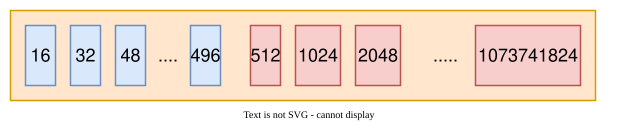

# How NioSocketChannel Reads Data

If the other side sends `hello world`, how do those bytes reach your handler? This article follows the read path of `NioSocketChannel`, from the selector to `channelRead`, and then explains how Netty sizes its receive buffers. The [next article](socket-write.html) follows the write path.

> **Source:** Netty 4.1.53.Final (October 2020) · NIO transport. Code excerpts keep the original selection; comments are translated. The figure is the author's original diagram with English labels.

## 1. A read event fires

Client and server channels are both initialized and registered; a client also connects, while an accepted server channel is already connected. Once a channel is active and reading is on, Netty registers interest in `OP_READ`. When bytes arrive, the channel's event loop selects the ready keys and handles them in `processSelectedKeys` (see [the thread model](thread-model.html)).

### `processSelectedKeys`

```java
// When selector instrumentation succeeds, selectedKeys is a SelectedSelectionKeySet and the optimized path is used.
private void processSelectedKeys() {
        if (selectedKeys != null) {
            processSelectedKeysOptimized();
        } else {
            processSelectedKeysPlain(selector.selectedKeys());
        }
    }

private void processSelectedKeysOptimized() {
        for (int i = 0; i < selectedKeys.size; ++i) {
            // Obtain the SelectionKey for this ready I/O event.
            final SelectionKey k = selectedKeys.keys[i];
            // null out entry in the array to allow to have it GC'ed once the Channel close
            // See https://github.com/netty/netty/issues/2363
           // Clear the processed entry in the selected-key array.
            selectedKeys.keys[i] = null;

            final Object a = k.attachment();
            // For a Netty NIO channel, enter processSelectedKey.
            if (a instanceof AbstractNioChannel) {
                processSelectedKey(k, (AbstractNioChannel) a);
            } else {
                @SuppressWarnings("unchecked")
                NioTask<SelectableChannel> task = (NioTask<SelectableChannel>) a;
                processSelectedKey(k, task);
            }

            if (needsToSelectAgain) {
                // null out entries in the array to allow to have it GC'ed once the Channel close
                // See https://github.com/netty/netty/issues/2363
                selectedKeys.reset(i + 1);

                selectAgain();
                i = -1;
            }
        }
    }
```

The actual dispatch happens in `processSelectedKey`.

### `processSelectedKey`

```java
private void processSelectedKey(SelectionKey k, AbstractNioChannel ch) {
        // Obtain the channel's unsafe implementation.
        final AbstractNioChannel.NioUnsafe unsafe = ch.unsafe();
        if (!k.isValid()) {
            final EventLoop eventLoop;
            try {
                eventLoop = ch.eventLoop();
            } catch (Throwable ignored) {
                // If the channel implementation throws an exception because there is no event loop, we ignore this
                // because we are only trying to determine if ch is registered to this event loop and thus has authority
                // to close ch.
                return;
            }
            // Only close ch if ch is still registered to this EventLoop. ch could have deregistered from the event loop
            // and thus the SelectionKey could be cancelled as part of the deregistration process, but the channel is
            // still healthy and should not be closed.
            // See https://github.com/netty/netty/issues/5125
            if (eventLoop == this) {
                // close the channel if the key is not valid anymore
               // If the key is invalid, close the channel when this event loop owns it.
                unsafe.close(unsafe.voidPromise());
            }
            return;
        }

        try {
            // Read the ready-operation bit mask.
            int readyOps = k.readyOps();
            // We first need to call finishConnect() before try to trigger a read(...) or write(...) as otherwise
            // the NIO JDK channel implementation may throw a NotYetConnectedException.
            // Handle OP_CONNECT readiness.
            if ((readyOps & SelectionKey.OP_CONNECT) != 0) {
                // remove OP_CONNECT as otherwise Selector.select(..) will always return without blocking
                // See https://github.com/netty/netty/issues/924
                int ops = k.interestOps();
                // Clear OP_CONNECT from the interest set.
                ops &= ~SelectionKey.OP_CONNECT;
                k.interestOps(ops);
                // Complete the connection attempt.
                unsafe.finishConnect();
            }

            // Process OP_WRITE first as we may be able to write some queued buffers and so free memory.
            if ((readyOps & SelectionKey.OP_WRITE) != 0) {
                // Call forceFlush which will also take care of clear the OP_WRITE once there is nothing left to write
                // For OP_WRITE, force a flush of queued outbound data.
                ch.unsafe().forceFlush();
            }

            // Also check for readOps of 0 to workaround possible JDK bug which may otherwise lead
            // to a spin loop
            if ((readyOps & (SelectionKey.OP_READ | SelectionKey.OP_ACCEPT)) != 0 || readyOps == 0) {
               // Handle read or accept readiness.
                unsafe.read();
            }
        } catch (CancelledKeyException ignored) {
            unsafe.close(unsafe.voidPromise());
        }
    }
```

## 2. Read the bytes

### `unsafe.read()`

```java
@Override
        public final void read() {
            final ChannelConfig config = config();
            // shouldBreakReadReady checks whether input is shut down in a way that prevents further reads.
            // Stop reading and clear read interest when necessary.
            if (shouldBreakReadReady(config)) {
                clearReadPending();
                return;
            }
            final ChannelPipeline pipeline = pipeline();
            // Obtain the ByteBuf allocator; see the pooled-memory article for allocation details.
            final ByteBufAllocator allocator = config.getAllocator();
// The receive allocator's HandleImpl chooses the attempted read size and caps messages per read loop (the default for this channel type is 16).
 // The adaptive allocator starts at 1024 bytes and adjusts its next allocation from observed reads.
            final RecvByteBufAllocator.Handle allocHandle = recvBufAllocHandle();
            allocHandle.reset(config);

            ByteBuf byteBuf = null;
            boolean close = false;
            try {
                do {
                    // Allocate a ByteBuf of the size selected by allocHandle.
                    byteBuf = allocHandle.allocate(allocator);
                   // doReadBytes enters the underlying SocketChannel read path.
                   // lastBytesRead records the result; full-buffer reads can increase the next attempted read size.
                    allocHandle.lastBytesRead(doReadBytes(byteBuf));
                    if (allocHandle.lastBytesRead() <= 0) {
                       // Release the buffer when no bytes were read or end of stream was reached.
                        // nothing was read. release the buffer.
                        byteBuf.release();
                        byteBuf = null;
                        close = allocHandle.lastBytesRead() < 0;
                        if (close) {
                            // There is nothing left to read as we received an EOF.
                            readPending = false;
                        }
                        break;
                    }
                   // Count this delivered read buffer in the read loop.
                    allocHandle.incMessagesRead(1);
                    readPending = false;
                    // Fire channelRead with the buffer.
                    pipeline.fireChannelRead(byteBuf);
                    byteBuf = null;
                  // continueReading decides whether this read loop should attempt another read.
                  // Its decision includes autoRead, the message limit, bytes read, and whether more data is expected.
                } while (allocHandle.continueReading());
               // Adjust the receive allocator from this loop's total bytes read.
                allocHandle.readComplete();
             // Fire the read-complete event.
                pipeline.fireChannelReadComplete();

                if (close) {
                    closeOnRead(pipeline);
                }
            } catch (Throwable t) {
                handleReadException(pipeline, byteBuf, t, close, allocHandle);
            } finally {
                // Check if there is a readPending which was not processed yet.
                // This could be for two reasons:
                // * The user called Channel.read() or ChannelHandlerContext.read() in channelRead(...) method
                // * The user called Channel.read() or ChannelHandlerContext.read() in channelReadComplete(...) method
                //
                // See https://github.com/netty/netty/issues/2254
                if (!readPending && !config.isAutoRead()) {
                    removeReadOp();
                }
            }
        }
    }
```

### `doReadBytes`

And its call chain:

```java
  protected int doReadBytes(ByteBuf byteBuf) throws Exception {
        final RecvByteBufAllocator.Handle allocHandle = unsafe().recvBufAllocHandle();
         // Record the number of bytes this attempt can read.
        allocHandle.attemptedBytesRead(byteBuf.writableBytes());

        return byteBuf.writeBytes(javaChannel(), allocHandle.attemptedBytesRead());
    }

// ByteBuf.writeBytes implementation
   public int writeBytes(ScatteringByteChannel in, int length) throws IOException {
        ensureWritable(length);

        int writtenBytes = setBytes(writerIndex, in, length);
        if (writtenBytes > 0) {
          // Advance writerIndex by the number of bytes actually read.
            writerIndex += writtenBytes;
        }
        return writtenBytes;
    }

// ByteBuf.setBytes implementation
 @Override
    public final int setBytes(int index, ScatteringByteChannel in, int length) throws IOException {
        try {
           // internalNioBuffer exposes the backing ByteBuffer; SocketChannel.read fills that buffer.
            return in.read(internalNioBuffer(index, length));
        } catch (ClosedChannelException ignored) {
            return -1;
        }
    }
```

After reading into a `ByteBuf`, Netty fires `channelRead`, and your inbound handler gets the buffer.

> **Note:** TCP is a byte stream. One buffer is not one application message: a message can be split across buffers, or several can arrive in one. The [framing article](message-framing.html) deals with that.

That is the path from the network to a buffer.

## 3. Size the next buffer

How big should the next receive buffer be? Netty adapts it to recent reads. The logic runs from `allocHandle.readComplete()`:

### `readComplete`

```java
   public void readComplete() {
            // totalBytesRead is the total read during this readiness-processing loop.
            record(totalBytesRead());
    }
```

### `record`

```java
 private void record(int actualReadBytes) {
            // SIZE_TABLE lists candidate receive-buffer capacities in ascending order.
           // Its values are described below.
          // index selects the next capacity from SIZE_TABLE.
           // INDEX_DECREMENT defaults to 1.
            // A read at or below the preceding entry is a candidate for reducing capacity.
            if (actualReadBytes <= SIZE_TABLE[max(0, index - INDEX_DECREMENT)]) {
                if (decreaseNow) {
                   // Decrease the index by one, bounded by minIndex, then read the new capacity from SIZE_TABLE.

                    index = max(index - INDEX_DECREMENT, minIndex);
                    nextReceiveBufferSize = SIZE_TABLE[index];
                    decreaseNow = false;
                } else {
                   // The first small observation only sets decreaseNow.
                   // A second qualifying observation permits the next receive buffer to shrink.
                    decreaseNow = true;
                }
            } else if (actualReadBytes >= nextReceiveBufferSize) {
                index = min(index + INDEX_INCREMENT, maxIndex);
                nextReceiveBufferSize = SIZE_TABLE[index];
                decreaseNow = false;
            }
        }
```

`SIZE_TABLE` is an `int[]` with **53** candidate sizes in two ranges:

| Range | Values | Entries |
| --- | --- | --- |
| Small | multiples of 16, from 16 to 496 | 31 |
| Large | powers of two, from 512 to 2^30 | 22 |

[{: .diagram}](assets/socket-read-01.svg)

`record` moves through this table: it grows the buffer quickly after a full read and shrinks it slowly after small ones.

## Notes on the source

- The default adaptive allocator uses a minimum of **64**, an initial size of **1024** and a maximum of **65536** bytes. Each allocator only uses the part of the 53-entry table inside its own range.
- A "message" in the read loop means one delivered buffer, not an application message.
- If Netty cannot instrument the selector's key set (or it is disabled), it uses the plain, non-optimized path.

Source references (Netty 4.1.53.Final, released October 13, 2020):

- [AbstractNioByteChannel.java](https://github.com/netty/netty/blob/d4a0050ef33cab2542a80e11489a4977a63859f8/transport/src/main/java/io/netty/channel/nio/AbstractNioByteChannel.java)
- [NioSocketChannel.java](https://github.com/netty/netty/blob/d4a0050ef33cab2542a80e11489a4977a63859f8/transport/src/main/java/io/netty/channel/socket/nio/NioSocketChannel.java)
- [AdaptiveRecvByteBufAllocator.java](https://github.com/netty/netty/blob/d4a0050ef33cab2542a80e11489a4977a63859f8/transport/src/main/java/io/netty/channel/AdaptiveRecvByteBufAllocator.java)
- [DefaultMaxMessagesRecvByteBufAllocator.java](https://github.com/netty/netty/blob/d4a0050ef33cab2542a80e11489a4977a63859f8/transport/src/main/java/io/netty/channel/DefaultMaxMessagesRecvByteBufAllocator.java)
- [NioEventLoop.java](https://github.com/netty/netty/blob/d4a0050ef33cab2542a80e11489a4977a63859f8/transport/src/main/java/io/netty/channel/nio/NioEventLoop.java)
