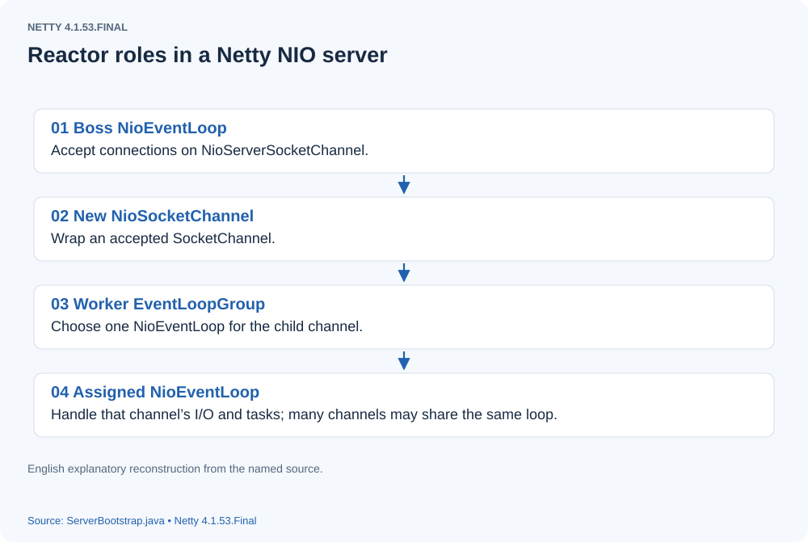
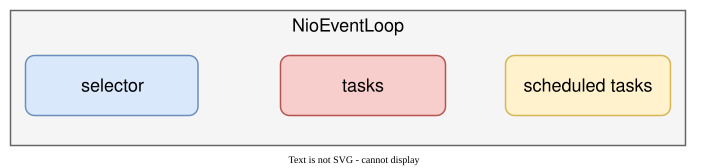
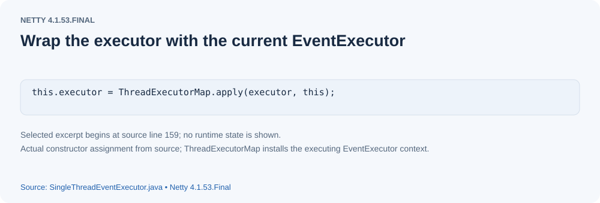

# Understanding the Netty Thread Model

## Background
Netty is a high-performance network communication framework written in Java. A Netty server follows the reactor pattern: an acceptor handles connection requests and creates a `SocketChannel` for each connection. Each accepted channel is assigned an event loop; subsequent events on that channel are handled by the event loop's thread.
[](assets/thread-model-01.svg)

## Scope
The following analysis uses the NIO transport.

## NioEventLoopGroup
From a threading perspective, think of `NioEventLoopGroup` as a group of execution threads. Its size is configurable; by default it is twice the number of available processors. Strictly speaking, the children are `EventExecutor` instances rather than raw threads, but thinking of each as a thread makes the initial model easier to understand. A group creates a chooser to distribute work among its children. Netty supplies two default chooser implementations. This describes the event-loop groups in this example, not every thread that every Netty feature can create.
- PowerOfTwoEventExecutorChooser
When the group's number of children is a power of two, it uses this chooser:

```

 private static final class PowerOfTwoEventExecutorChooser implements EventExecutorChooser {
        private final AtomicInteger idx = new AtomicInteger();
        private final EventExecutor[] executors;

        PowerOfTwoEventExecutorChooser(EventExecutor[] executors) {
            this.executors = executors;
        }

        @Override
        public EventExecutor next() {
            return executors[idx.getAndIncrement() & executors.length - 1];
        }
    }

```

- GenericEventExecutorChooser
When the number of children is not a power of two, it uses this chooser:

```

 private static final class GenericEventExecutorChooser implements EventExecutorChooser {
        private final AtomicInteger idx = new AtomicInteger();
        private final EventExecutor[] executors;

        GenericEventExecutorChooser(EventExecutor[] executors) {
            this.executors = executors;
        }

        @Override
        public EventExecutor next() {
            return executors[Math.abs(idx.getAndIncrement() % executors.length)];
        }
    }

```

Both choosers distribute selections across the group's children. The second implementation works for general sizes. Why also provide `PowerOfTwoEventExecutorChooser`? For a power-of-two size, a bitwise AND can replace the remainder operation. The implementation takes advantage of this inexpensive indexing operation even when the individual saving is small.


## NioEventLoop
`NioEventLoop` represents the single-threaded event loop. Each `NioSocketChannel` is registered with one such event loop, which handles that channel's events. The event loop wraps a thread; once started, it processes the task types shown below.
[](assets/thread-model-02.svg)
- selector
Every new `NioSocketChannel` is assigned an event loop, while the group's number of event loops is fixed. When there are more channels than event loops, multiple channels share an event loop and register their interest in I/O events with its selector. The event loop processes these selected events.
- tasks
Ordinary tasks may be submitted from another thread or by the event-loop thread itself. For example, registering a channel from the main thread submits a registration task to the selected event loop.
- scheduled tasks
Scheduled tasks run at a deadline. For example, if a client channel's connection attempt does not finish immediately, its event loop schedules a timeout task that fails the attempt when the configured connection deadline expires.

The following is the source of the core `NioEventLoop.run` method:

```

 @Override
    protected void run() {
        int selectCnt = 0;
        for (;;) {
            try {
                int strategy;
                try {
                    strategy = selectStrategy.calculateStrategy(selectNowSupplier, hasTasks());
                    switch (strategy) {
                    case SelectStrategy.CONTINUE:
                        continue;

                    case SelectStrategy.BUSY_WAIT:
                        // fall-through to SELECT since the busy-wait is not supported with NIO

                    case SelectStrategy.SELECT:
                        long curDeadlineNanos = nextScheduledTaskDeadlineNanos();
                        if (curDeadlineNanos == -1L) {
                            curDeadlineNanos = NONE; // nothing on the calendar
                        }
                        // Set nextWakeupNanos to the earliest scheduled-task deadline.
                        nextWakeupNanos.set(curDeadlineNanos);
                        try {
                           // If no ordinary task is queued, perform selector selection.
                           // With no scheduled task this can block; otherwise wait until curDeadlineNanos, unless another thread wakes the selector.
                            if (!hasTasks()) {

                                strategy = select(curDeadlineNanos);
                            }
                        } finally {
                            // This update is just to help block unnecessary selector wakeups
                            // so use of lazySet is ok (no race condition)
                            nextWakeupNanos.lazySet(AWAKE);
                        }
                        // fall through
                    default:
                    }
                } catch (IOException e) {
                    // If we receive an IOException here its because the Selector is messed up. Let's rebuild
                    // the selector and retry. https://github.com/netty/netty/issues/8566
                    rebuildSelector0();
                    selectCnt = 0;
                    handleLoopException(e);
                    continue;
                }

                selectCnt++;
                cancelledKeys = 0;
                needsToSelectAgain = false;
                final int ioRatio = this.ioRatio;
                boolean ranTasks;
                if (ioRatio == 100) {
                    try {
                        if (strategy > 0) {
                           // A positive strategy means I/O events are ready; process the selected keys.
                            processSelectedKeys();
                        }
                    } finally {
                        // Ensure we always run tasks.
                      // Run queued tasks.
                        ranTasks = runAllTasks();
                    }
                } else if (strategy > 0) {
                    final long ioStartTime = System.nanoTime();
                    try {
                        processSelectedKeys();
                    } finally {
                        // Ensure we always run tasks.
                        final long ioTime = System.nanoTime() - ioStartTime;
                        ranTasks = runAllTasks(ioTime * (100 - ioRatio) / ioRatio);
                    }
                } else {
                    ranTasks = runAllTasks(0); // This will run the minimum number of tasks
                }

                if (ranTasks || strategy > 0) {
                    if (selectCnt > MIN_PREMATURE_SELECTOR_RETURNS && logger.isDebugEnabled()) {
                        logger.debug("Selector.select() returned prematurely {} times in a row for Selector {}.",
                                selectCnt - 1, selector);
                    }
                    selectCnt = 0;
                } else if (unexpectedSelectorWakeup(selectCnt)) { // Unexpected wakeup (unusual case)
                    selectCnt = 0;
                }
            } catch (CancelledKeyException e) {
                // Harmless exception - log anyway
                if (logger.isDebugEnabled()) {
                    logger.debug(CancelledKeyException.class.getSimpleName() + " raised by a Selector {} - JDK bug?",
                            selector, e);
                }
            } catch (Throwable t) {
                handleLoopException(t);
            }
            // Always handle shutdown even if the loop processing threw an exception.
            try {
                if (isShuttingDown()) {
                    closeAll();
                    if (confirmShutdown()) {
                        return;
                    }
                }
            } catch (Throwable t) {
                handleLoopException(t);
            }
        }
    }

```


### How an event loop acquires its thread
How does a `NioEventLoop` become associated with a thread?
Initialization of `NioEventLoopGroup` installs an `Executor`. Unless the caller supplies one, the default is `ThreadPerTaskExecutor`.

```

public final class ThreadPerTaskExecutor implements Executor {
    private final ThreadFactory threadFactory;

    public ThreadPerTaskExecutor(ThreadFactory threadFactory) {
        this.threadFactory = ObjectUtil.checkNotNull(threadFactory, "threadFactory");
    }

    @Override
    public void execute(Runnable command) {
        threadFactory.newThread(command).start();
    }
}

```

When each event loop is initialized, `ThreadPerTaskExecutor` is passed to its constructor. `ThreadExecutorMap.apply` wraps it, and the wrapper becomes the `executor` field in the event loop's superclass.
[](assets/thread-model-03.svg)
Here is the implementation of `ThreadExecutorMap.apply`:

```

 public static Executor apply(final Executor executor, final EventExecutor eventExecutor) {
        ObjectUtil.checkNotNull(executor, "executor");
        ObjectUtil.checkNotNull(eventExecutor, "eventExecutor");
        return new Executor() {
        @Override
        public void execute(final Runnable command) {
            executor.execute(apply(command, eventExecutor));
        }
    };

```

`apply` returns an anonymous `Executor` that wraps `ThreadPerTaskExecutor`. Calling it ultimately calls `ThreadPerTaskExecutor.execute`, which creates a thread to run the supplied, wrapped runnable.

Here is how the runnable form of `apply` works:

```

 public static Runnable apply(final Runnable command, final EventExecutor eventExecutor) {
        ObjectUtil.checkNotNull(command, "command");
        ObjectUtil.checkNotNull(eventExecutor, "eventExecutor");
        return new Runnable() {
            @Override
            public void run() {
                setCurrentEventExecutor(eventExecutor);
                try {
                    command.run();
                } finally {
                    setCurrentEventExecutor(null);
                }
            }
        };
    }

```

This method returns an anonymous `Runnable` that wraps the final task. Its purpose is to associate the current event loop with the executing thread: `setCurrentEventExecutor` stores that event loop in a `FastThreadLocal`.


## How the thread starts
When the main thread registers a channel with a selected event loop, it submits a registration task through `execute`. The implementation is shown below.

```

 private void execute(Runnable task, boolean immediate) {
        // Check whether the caller is the event loop's own thread.
        boolean inEventLoop = inEventLoop();
        // Add the submitted task to the event loop's taskQueue.
        addTask(task);
        if (!inEventLoop) {
            // A caller outside the event loop triggers startup of its thread.
            // startThread is idempotent: start only if the event loop has not already started.
            startThread();
            if (isShutdown()) {
                boolean reject = false;
                try {
                    if (removeTask(task)) {
                        reject = true;
                    }
                } catch (UnsupportedOperationException e) {
                    // The task queue does not support removal so the best thing we can do is to just move on and
                    // hope we will be able to pick-up the task before its completely terminated.
                    // In worst case we will log on termination.
                }
                if (reject) {
                    reject();
                }
            }
        }

        if (!addTaskWakesUp && immediate) {
            wakeup(inEventLoop);
        }
    }

```

Here is `startThread`:

```

 private void startThread() {
        // Test whether the event loop has started.
        if (state == ST_NOT_STARTED) {
            // Atomically transition to the started state.
            if (STATE_UPDATER.compareAndSet(this, ST_NOT_STARTED, ST_STARTED)) {
                boolean success = false;
                try {
                     // Start the thread.
                    doStartThread();
                    success = true;
                } finally {
                    if (!success) {
                        // Restore the not-started state if doStartThread fails.
                        STATE_UPDATER.compareAndSet(this, ST_STARTED, ST_NOT_STARTED);
                    }
                }
            }
        }
    }

```


The longer `doStartThread` implementation follows:

```

private void doStartThread() {
        assert thread == null;
        // This executor is the wrapper around ThreadPerTaskExecutor discussed above.
        // It delegates to ThreadPerTaskExecutor.execute.
        // The thread factory creates a thread to execute the runnable.
        // ThreadExecutorMap.apply also wraps this anonymous runnable to install the current executor mapping.
        executor.execute(new Runnable() {
            @Override
            public void run() {
              // The event loop's execution thread has now started.
              // Store the current Thread to complete the association with this event loop.
                thread = Thread.currentThread();
                if (interrupted) {
                    thread.interrupt();
                }

                boolean success = false;
                updateLastExecutionTime();
                try {
                    // Invoke the overridden NioEventLoop.run implementation described earlier.
                    SingleThreadEventExecutor.this.run();
                    success = true;
                } catch (Throwable t) {
                    logger.warn("Unexpected exception from an event executor: ", t);
                } finally {
                   // The remaining code handles state changes and cleanup when execution ends.
                    for (;;) {
                        // Mark the event loop as shutting down.
                        int oldState = state;
                        if (oldState >= ST_SHUTTING_DOWN || STATE_UPDATER.compareAndSet(
                                SingleThreadEventExecutor.this, oldState, ST_SHUTTING_DOWN)) {
                            break;
                        }
                    }

                    // Check if confirmShutdown() was called at the end of the loop.
                    if (success && gracefulShutdownStartTime == 0) {
                        if (logger.isErrorEnabled()) {
                            logger.error("Buggy " + EventExecutor.class.getSimpleName() + " implementation; " +
                                    SingleThreadEventExecutor.class.getSimpleName() + ".confirmShutdown() must " +
                                    "be called before run() implementation terminates.");
                        }
                    }

                    try {
                        // Run all remaining tasks and shutdown hooks. At this point the event loop
                        // is in ST_SHUTTING_DOWN state still accepting tasks which is needed for
                        // graceful shutdown with quietPeriod.
                        // Check whether shutdown is complete.
                        for (;;) {
                            if (confirmShutdown()) {
                                break;
                            }
                        }

                        // Now we want to make sure no more tasks can be added from this point. This is
                        // achieved by switching the state. Any new tasks beyond this point will be rejected.
                        for (;;) {
                             // Transition to the shutdown state.
                            int oldState = state;
                            if (oldState >= ST_SHUTDOWN || STATE_UPDATER.compareAndSet(
                                    SingleThreadEventExecutor.this, oldState, ST_SHUTDOWN)) {
                                break;
                            }
                        }

                        // We have the final set of tasks in the queue now, no more can be added, run all remaining.
                        // No need to loop here, this is the final pass.
                        confirmShutdown();
                    } finally {
                        try {
                            cleanup();
                        } finally {
                            // Lets remove all FastThreadLocals for the Thread as we are about to terminate and notify
                            // the future. The user may block on the future and once it unblocks the JVM may terminate
                            // and start unloading classes.
                            // See https://github.com/netty/netty/issues/6596.
                            FastThreadLocal.removeAll();
                            // Transition to the terminated state.
                            STATE_UPDATER.set(SingleThreadEventExecutor.this, ST_TERMINATED);
                            threadLock.countDown();
                            int numUserTasks = drainTasks();
                            if (numUserTasks > 0 && logger.isWarnEnabled()) {
                                logger.warn("An event executor terminated with " +
                                        "non-empty task queue (" + numUserTasks + ')');
                            }
                            terminationFuture.setSuccess(null);
                        }
                    }
                }
            }
        });
    }


```


## Source version and reconstructed figures

The original `run` excerpt uses the `nextWakeupNanos` and `curDeadlineNanos` selector-wakeup implementation present in Netty 4.1.53.Final. The event loop combines selected I/O processing, ordinary tasks, and scheduled tasks; its execution budget is influenced by `ioRatio`. Channel affinity describes event-loop execution; handlers explicitly configured with a separate executor can run elsewhere.

The original externally hosted images are replaced in their original positions by English source-derived diagrams or source cards. They are explanatory reconstructions, not recovered debugger screenshots.

Source baseline: Netty 4.1.53.Final (released October 13, 2020).

- [NioEventLoop.java at the baseline](https://github.com/netty/netty/blob/d4a0050ef33cab2542a80e11489a4977a63859f8/transport/src/main/java/io/netty/channel/nio/NioEventLoop.java)
- [MultithreadEventLoopGroup.java](https://github.com/netty/netty/blob/d4a0050ef33cab2542a80e11489a4977a63859f8/transport/src/main/java/io/netty/channel/MultithreadEventLoopGroup.java)
- [SingleThreadEventExecutor.java](https://github.com/netty/netty/blob/d4a0050ef33cab2542a80e11489a4977a63859f8/common/src/main/java/io/netty/util/concurrent/SingleThreadEventExecutor.java)
- [DefaultEventExecutorChooserFactory.java](https://github.com/netty/netty/blob/d4a0050ef33cab2542a80e11489a4977a63859f8/common/src/main/java/io/netty/util/concurrent/DefaultEventExecutorChooserFactory.java)
- [ThreadExecutorMap.java](https://github.com/netty/netty/blob/d4a0050ef33cab2542a80e11489a4977a63859f8/common/src/main/java/io/netty/util/internal/ThreadExecutorMap.java)
