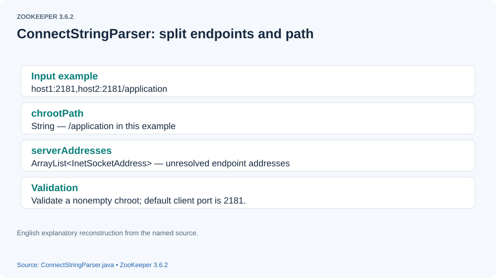
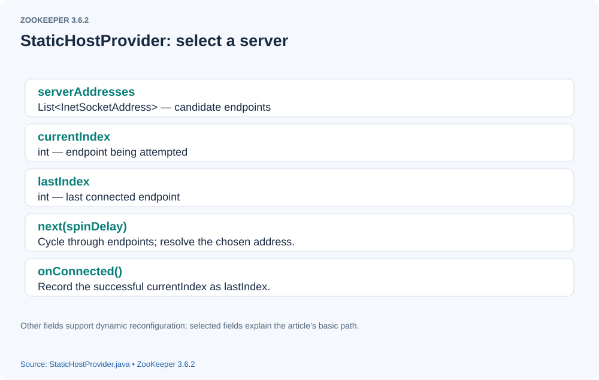
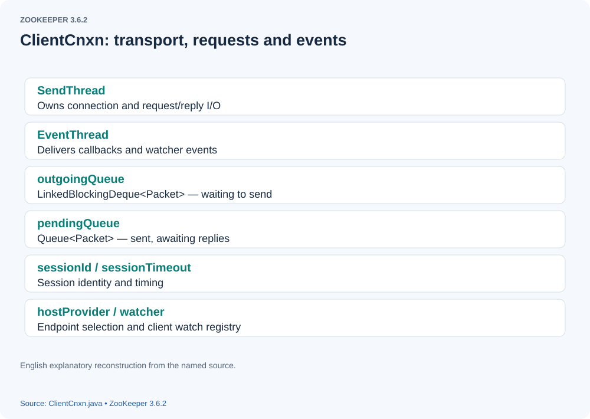
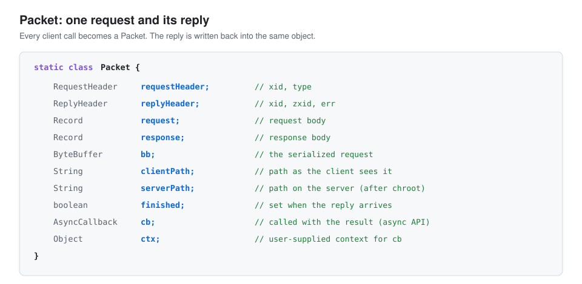
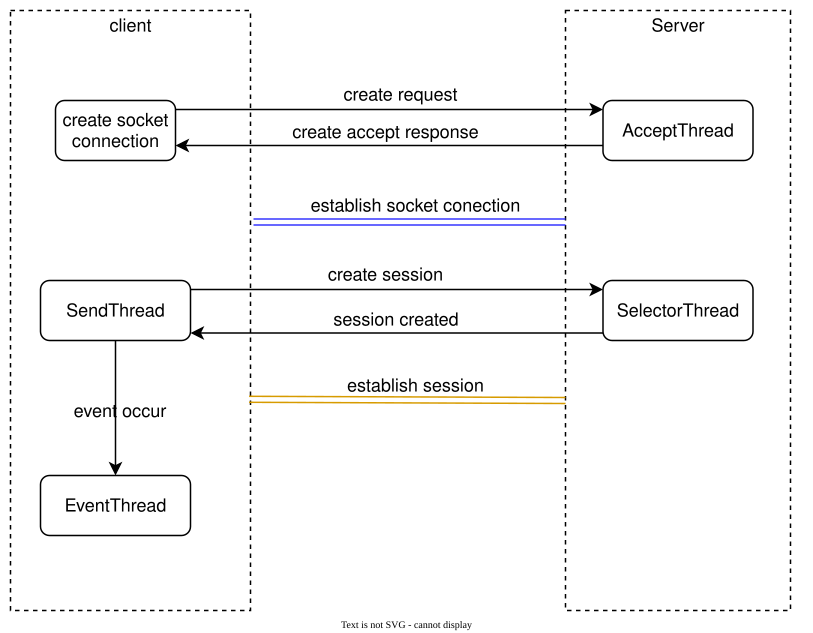

# How a ZooKeeper Client Starts and Establishes a Session

> **Source version and figures:** This article is checked against ZooKeeper **3.6.2**, commit `803c7f1a12f85978cb049af5e4ef23bd8b688715`, the latest 3.6 release available in October 2020. The analyzed excerpts are retained with English annotations; identified original-source variants are labeled explicitly. Figures are reconstructed from the source and original discussion because the original screenshots are unavailable. They are explanatory diagrams, not newly observed debugger output.

## Introduction

The previous article examined [server startup](standalone-server-startup.html). Here we trace the startup of a ZooKeeper client.

## Creating the client connection object

A typical client created through the native ZooKeeper Java library looks like this:

```java

Zookeeper zookeeper = new Zookeeper(connectionString,sessionTimeout,watcher)

```


Let us go directly to the `ZooKeeper` constructor.

```java

public ZooKeeper(
        String connectString,
        int sessionTimeout,
        Watcher watcher,
        boolean canBeReadOnly,
        HostProvider aHostProvider,
        ZKClientConfig clientConfig) throws IOException {
        LOG.info(
            "Initiating client connection, connectString={} sessionTimeout={} watcher={}",
            connectString,
            sessionTimeout,
            watcher);

        if (clientConfig == null) {
            clientConfig = new ZKClientConfig();
        }
         // clientConfig holds configurable client properties.
        this.clientConfig = clientConfig;
       // Create the client watcher manager.
        watchManager = defaultWatchManager();
        // Set the default watcher.
        watchManager.defaultWatcher = watcher;
        // Parse the supplied connectString; ConnectStringParser is explained below.
        ConnectStringParser connectStringParser = new ConnectStringParser(connectString);
      // hostProvider encapsulates server selection when the connection string contains several addresses.
        hostProvider = aHostProvider;
      // ClientCnxn is the central client connection object; we examine it below.
        cnxn = createConnection(
            connectStringParser.getChrootPath(),
            hostProvider,
            sessionTimeout,
            this,
            watchManager,
            getClientCnxnSocket(),
            canBeReadOnly);
        // Start the client threads.
        cnxn.start();
    }

```


##### ConnectStringParser

First, examine `ConnectStringParser`.

[](assets/client-startup-01.svg)

The figure shows its two important fields, `chrootPath` and `serverAddresses`. It derives both from the connection string. For `192.168.11.1:2181,192.168.11.2:2181/tt`, the chroot is `/tt`, and the address list contains the two host/port pairs. **Correction:** the original explanation wrote `tt`; the parsed chroot retains its leading slash. A chroot makes subsequent client paths relative to that server-side subtree; it does not create the subtree.
**Source variant note:** the following original excerpt uses `ConfigUtils.getHostAndPort` inside a `try/catch`. This is not the pinned 3.6.2 constructor, which uses `NetUtils.getIPV6HostAndPort` with a colon-parsing fallback. The original variant is retained for its analysis; consult the pinned implementation for historical behavior. The shared chroot and address-list explanation applies to both.

Here is the original parsing excerpt.

```java

public ConnectStringParser(String connectString) {
        // parse out chroot, if any
        // Find the separator preceding the chroot path.
        int off = connectString.indexOf('/');
        if (off >= 0) {
            // Parse the chroot path.
            String chrootPath = connectString.substring(off);
            // ignore "/" chroot spec, same as null
            if (chrootPath.length() == 1) {
                this.chrootPath = null;
            } else {
                PathUtils.validatePath(chrootPath);
                this.chrootPath = chrootPath;
            }
            // Keep the host:port portion of the connection string.
            connectString = connectString.substring(0, off);
        } else {
            this.chrootPath = null;
        }
       // Split the host:port pairs on commas.
        List<String> hostsList = split(connectString, ",");
        for (String host : hostsList) {
            int port = DEFAULT_PORT;
            try {
                // Extract the host and port.
                String[] hostAndPort = ConfigUtils.getHostAndPort(host);
                host = hostAndPort[0];
                if (hostAndPort.length == 2) {
                    port = Integer.parseInt(hostAndPort[1]);
                }
            } catch (ConfigException e) {
                e.printStackTrace();
            }
            // Create an InetSocketAddress and add it to serverAddresses.
            serverAddresses.add(InetSocketAddress.createUnresolved(host, port));
        }
    }


```


##### HostProvider

The parser allows multiple server addresses. `HostProvider` chooses which one to connect to; its default implementation is `StaticHostProvider`.

[](assets/client-startup-02.svg)

The figure highlights `serverAddresses`, `lastIndex`, and `currentIndex`, the key fields used for server selection. `StaticHostProvider.next()` encapsulates choosing the next server. The provider shuffles the supplied list during initialization before cycling through it.

##### next()

```java

public InetSocketAddress next(long spinDelay) {
        boolean needToSleep = false;
        InetSocketAddress addr;

        synchronized (this) {
           // reconfigMode supports redistributing connections when the server list changes.
            if (reconfigMode) {
                addr = nextHostInReconfigMode();
                if (addr != null) {
                    currentIndex = serverAddresses.indexOf(addr);
                    return resolve(addr);
                }
                //tried all servers and couldn't connect
                reconfigMode = false;
                needToSleep = (spinDelay > 0);
            }
           // Advance currentIndex.
            ++currentIndex;
            // Wrap currentIndex to zero at the end of the server list.
            if (currentIndex == serverAddresses.size()) {
                currentIndex = 0;
            }
           // Select an address from the server list.
            addr = serverAddresses.get(currentIndex);
           // Decide whether to pause before retrying.
            needToSleep = needToSleep || (currentIndex == lastIndex && spinDelay > 0);
            if (lastIndex == -1) {
                // We don't want to sleep on the first ever connect attempt.
                // Initialize lastIndex here; starting at zero would incorrectly cause the first attempt to sleep.
                lastIndex = 0;
            }
        }
        if (needToSleep) {
            try {
                // Pause after cycling through the server list without reconnecting.
                Thread.sleep(spinDelay);
            } catch (InterruptedException e) {
                LOG.warn("Unexpected exception", e);
            }
        }
      // Return the resolved server address.
        return resolve(addr);
    }

```


#### ClientCnxn

`ClientCnxn` stores the state required to connect the client to a server. The figure annotates several of its many fields.

[](assets/client-startup-03.svg)

Here is its ultimate constructor.

```java

 public ClientCnxn(
        String chrootPath,
        HostProvider hostProvider,
        int sessionTimeout,
        ZooKeeper zooKeeper,
        ClientWatchManager watcher,
        ClientCnxnSocket clientCnxnSocket,
        long sessionId,
        byte[] sessionPasswd,
        boolean canBeReadOnly) {
        this.zooKeeper = zooKeeper;
        this.watcher = watcher;
        this.sessionId = sessionId;
        this.sessionPasswd = sessionPasswd;
        this.sessionTimeout = sessionTimeout;
        this.hostProvider = hostProvider;
        this.chrootPath = chrootPath;

        connectTimeout = sessionTimeout / hostProvider.size();
        readTimeout = sessionTimeout * 2 / 3;
        readOnly = canBeReadOnly;
        // Create SendThread for I/O; ClientCnxnSocketNIO is the default socket implementation.
        sendThread = new SendThread(clientCnxnSocket);
       // Create EventThread to dispatch watcher events and callbacks.
        eventThread = new EventThread();
        this.clientConfig = zooKeeper.getClientConfig();
        initRequestTimeout();
    }

```


##### ClientCnxn.start()

`ClientCnxn.start()` starts `SendThread` and `EventThread`.

```java

  public void start() {
        sendThread.start();
        eventThread.start();
    }

```


#### SendThread

`SendThread` handles client I/O. Let us examine its `run` method. **Debugging modification:** this original excerpt sets `MAX_SEND_PING_INTERVAL` to `10000000` milliseconds. The pinned release sets it to `10000` milliseconds (10 seconds). This cap is distinct from the ordinary ping deadline derived from the negotiated session timeout. The enlarged value is retained to document the original experiment.

##### SendThread.run

```java

 public void run() {
            // Initialize the socket's session ID and outgoingQueue.
            // On the first connection, the server has not assigned a session ID, so it is zero.
            clientCnxnSocket.introduce(this, sessionId, outgoingQueue);
            clientCnxnSocket.updateNow();
            clientCnxnSocket.updateLastSendAndHeard();
            int to;
            long lastPingRwServer = Time.currentElapsedTime();
             // The original author enlarged this source constant for debugging; it is not the release default.
            final int MAX_SEND_PING_INTERVAL = 10000000; // Original debugging value; release default is 10000 ms.
            InetSocketAddress serverAddress = null;
           // Keep running while the client state is alive.
            while (state.isAlive()) {
                try {
                    // Establish a connection when the socket is not connected.
                    if (!clientCnxnSocket.isConnected()) {
                        // don't re-establish connection if we are closing
                        if (closing) {
                            break;
                        }
                        if (rwServerAddress != null) {
                            serverAddress = rwServerAddress;
                            rwServerAddress = null;
                        } else {
                         // Obtain the next server from hostProvider.
                            serverAddress = hostProvider.next(1000);
                        }
                       // Start a socket connection to that server; details follow below.
                        startConnect(serverAddress);
                        clientCnxnSocket.updateLastSendAndHeard();
                    }
                    // If the client is already connected to the server...
                    if (state.isConnected()) {
                        // determine whether we need to send an AuthFailed event.
                        if (zooKeeperSaslClient != null) {
                            boolean sendAuthEvent = false;
                            if (zooKeeperSaslClient.getSaslState() == ZooKeeperSaslClient.SaslState.INITIAL) {
                                try {
                                    zooKeeperSaslClient.initialize(ClientCnxn.this);
                                } catch (SaslException e) {
                                    LOG.error("SASL authentication with Zookeeper Quorum member failed.", e);
                                    state = States.AUTH_FAILED;
                                    sendAuthEvent = true;
                                }
                            }
                            KeeperState authState = zooKeeperSaslClient.getKeeperState();
                            if (authState != null) {
                                if (authState == KeeperState.AuthFailed) {
                                    // An authentication error occurred during authentication with the Zookeeper Server.
                                    state = States.AUTH_FAILED;
                                    sendAuthEvent = true;
                                } else {
                                    if (authState == KeeperState.SaslAuthenticated) {
                                        sendAuthEvent = true;
                                    }
                                }
                            }

                            if (sendAuthEvent) {
                                eventThread.queueEvent(new WatchedEvent(Watcher.Event.EventType.None, authState, null));
                                if (state == States.AUTH_FAILED) {
                                    eventThread.queueEventOfDeath();
                                }
                            }
                        }
                        to = readTimeout - clientCnxnSocket.getIdleRecv();
                    } else {
                       // Account for elapsed time while establishing the connection.
                        to = connectTimeout - clientCnxnSocket.getIdleRecv();
                    }
                     // A nonpositive remaining timeout means the operation has timed out.
                    if (to <= 0) {
                        String warnInfo = String.format(
                            "Client session timed out, have not heard from server in %dms for session id 0x%s",
                            clientCnxnSocket.getIdleRecv(),
                            Long.toHexString(sessionId));
                        LOG.warn(warnInfo);
                        throw new SessionTimeoutException(warnInfo);
                    }

                    if (state.isConnected()) {
                       // Calculate the time remaining before the next ping.
                        //1000(1 second) is to prevent race condition missing to send the second ping
                        //also make sure not to send too many pings when readTimeout is small
                        int timeToNextPing = readTimeout / 2
                                             - clientCnxnSocket.getIdleSend()
                                             - ((clientCnxnSocket.getIdleSend() > 1000) ? 1000 : 0);
                        //send a ping request either time is due or no packet sent out within MAX_SEND_PING_INTERVAL
                        // Ping if its normal deadline has arrived or MAX_SEND_PING_INTERVAL has elapsed without a send.
                        if (timeToNextPing <= 0 || clientCnxnSocket.getIdleSend() > MAX_SEND_PING_INTERVAL) {
                            sendPing();
                            clientCnxnSocket.updateLastSend();
                        } else {
                            if (timeToNextPing < to) {
                                to = timeToNextPing;
                            }
                        }
                    }
                   // For CONNECTEDREADONLY, apply the behavior explained by the following source comment.
                    // If we are in read-only mode, seek for read/write server
                    if (state == States.CONNECTEDREADONLY) {
                        long now = Time.currentElapsedTime();
                        int idlePingRwServer = (int) (now - lastPingRwServer);
                        if (idlePingRwServer >= pingRwTimeout) {
                            lastPingRwServer = now;
                            idlePingRwServer = 0;
                            pingRwTimeout = Math.min(2 * pingRwTimeout, maxPingRwTimeout);
                            pingRwServer();
                        }
                        to = Math.min(to, pingRwTimeout - idlePingRwServer);
                    }
                  // Handle transport readiness and I/O; details follow below.
                    clientCnxnSocket.doTransport(to, pendingQueue, ClientCnxn.this);
                } catch (Throwable e) {
                    if (closing) {
                        // closing so this is expected
                        LOG.warn(
                            "An exception was thrown while closing send thread for session 0x{}.",
                            Long.toHexString(getSessionId()),
                            e);
                        break;
                    } else {
                        LOG.warn(
                            "Session 0x{} for sever {}, Closing socket connection. "
                                + "Attempting reconnect except it is a SessionExpiredException.",
                            Long.toHexString(getSessionId()),
                            serverAddress,
                            e);

                        // At this point, there might still be new packets appended to outgoingQueue.
                        // they will be handled in next connection or cleared up if closed.
                        cleanAndNotifyState();
                    }
                }
            }
         // Reaching this path means the connection encountered an exception.
            synchronized (state) {
                // When it comes to this point, it guarantees that later queued
                // packet to outgoingQueue will be notified of death.
                cleanup();
            }
            clientCnxnSocket.close();
            if (state.isAlive()) {
                // Queue a disconnected event for the client's EventThread.
                eventThread.queueEvent(new WatchedEvent(Event.EventType.None, Event.KeeperState.Disconnected, null));
            }
            eventThread.queueEvent(new WatchedEvent(Event.EventType.None, Event.KeeperState.Closed, null));
            ZooTrace.logTraceMessage(
                LOG,
                ZooTrace.getTextTraceLevel(),
                "SendThread exited loop for session: 0x" + Long.toHexString(getSessionId()));
        }

```


### Connecting the client socket

Socket establishment occurs in `ClientCnxnSocketNIO.connect`.

```java

  void connect(InetSocketAddress addr) throws IOException {
       // Create the client SocketChannel.
        SocketChannel sock = createSock();
        try {
           // Register OP_CONNECT on the selector and
           // initiate the connection to the remote server.
            registerAndConnect(sock, addr);
        } catch (IOException e) {
            LOG.error("Unable to open socket to {}", addr);
            sock.close();
            throw e;
        }
        // Reset the connection initialization flag.
        initialized = false;

        /*
         * Reset incomingBuffer
         */
       // The default client transport uses NIO. Each message is framed as [length, message], with message normally [header, body].
      // lenBuffer holds the fixed four-byte length prefix for the following payload.

        lenBuffer.clear();
        incomingBuffer = lenBuffer;
    }

```


After initiating the connection, execution reaches `ClientCnxnSocketNIO.doTransport`, the entry point for client readiness processing.

##### ClientCnxnSocketNIO.doTransport

```java

 void doTransport(
        int waitTimeOut,
        Queue<Packet> pendingQueue,
        ClientCnxn cnxn) throws IOException, InterruptedException {
       // Wait for registered readiness events.
        selector.select(waitTimeOut);
        Set<SelectionKey> selected;
        synchronized (this) {
            selected = selector.selectedKeys();
        }
        // Everything below and until we get back to the select is
        // non blocking, so time is effectively a constant. That is
        // Why we just have to do this once, here
        updateNow();
        for (SelectionKey k : selected) {
            SocketChannel sc = ((SocketChannel) k.channel());
            if ((k.readyOps() & SelectionKey.OP_CONNECT) != 0) {
                 // For OP_CONNECT, finish connecting the SocketChannel.
                if (sc.finishConnect()) {
                    updateLastSendAndHeard();
                    updateSocketAddresses();
                   // Prime the session handshake and authentication queue; details follow below.
                    sendThread.primeConnection();
                }
            } else if ((k.readyOps() & (SelectionKey.OP_READ | SelectionKey.OP_WRITE)) != 0) {
                // For read/write readiness, call doIO.
                doIO(pendingQueue, cnxn);
            }
        }
        if (sendThread.getZkState().isConnected()) {
           // Register OP_WRITE if outgoingQueue contains data to send.
          // A write may be partial, so check for remaining queued data after each transport iteration.
            if (findSendablePacket(outgoingQueue, sendThread.tunnelAuthInProgress()) != null) {
                enableWrite();
            }
        }
      // Clear the selected keys.
        selected.clear();
    }

```


Once the TCP connection is established, the client begins the ZooKeeper session handshake.
`SendThread.primeConnection()` prepares this stage; it queues the request rather than itself completing the session.

##### sendThread.primeConnection

The client requests a new session, or reconnects an existing session, using the following logic.

```java

void primeConnection() throws IOException {
            LOG.info(
                "Socket connection established, initiating session, client: {}, server: {}",
                clientCnxnSocket.getLocalSocketAddress(),
                clientCnxnSocket.getRemoteSocketAddress());
            isFirstConnect = false;
            long sessId = (seenRwServerBefore) ? sessionId : 0;
             // Construct the session connection request.
            ConnectRequest conReq = new ConnectRequest(0, lastZxid, sessionTimeout, sessId, sessionPasswd);
            // We add backwards since we are pushing into the front
            // Only send if there's a pending watch
            // TODO: here we have the only remaining use of zooKeeper in
            // this class. It's to be eliminated!
            if (!clientConfig.getBoolean(ZKClientConfig.DISABLE_AUTO_WATCH_RESET)) {
             // The following block restores existing watcher registrations when reconnecting.
                List<String> dataWatches = zooKeeper.getDataWatches();
                List<String> existWatches = zooKeeper.getExistWatches();
                List<String> childWatches = zooKeeper.getChildWatches();
                List<String> persistentWatches = zooKeeper.getPersistentWatches();
                List<String> persistentRecursiveWatches = zooKeeper.getPersistentRecursiveWatches();
                if (!dataWatches.isEmpty() || !existWatches.isEmpty() || !childWatches.isEmpty()
                        || !persistentWatches.isEmpty() || !persistentRecursiveWatches.isEmpty()) {
                    Iterator<String> dataWatchesIter = prependChroot(dataWatches).iterator();
                    Iterator<String> existWatchesIter = prependChroot(existWatches).iterator();
                    Iterator<String> childWatchesIter = prependChroot(childWatches).iterator();
                    Iterator<String> persistentWatchesIter = prependChroot(persistentWatches).iterator();
                    Iterator<String> persistentRecursiveWatchesIter = prependChroot(persistentRecursiveWatches).iterator();
                    long setWatchesLastZxid = lastZxid;

                    while (dataWatchesIter.hasNext() || existWatchesIter.hasNext() || childWatchesIter.hasNext()
                            || persistentWatchesIter.hasNext() || persistentRecursiveWatchesIter.hasNext()) {
                        List<String> dataWatchesBatch = new ArrayList<String>();
                        List<String> existWatchesBatch = new ArrayList<String>();
                        List<String> childWatchesBatch = new ArrayList<String>();
                        List<String> persistentWatchesBatch = new ArrayList<String>();
                        List<String> persistentRecursiveWatchesBatch = new ArrayList<String>();
                        int batchLength = 0;

                        // Note, we may exceed our max length by a bit when we add the last
                        // watch in the batch. This isn't ideal, but it makes the code simpler.
                        while (batchLength < SET_WATCHES_MAX_LENGTH) {
                            final String watch;
                            if (dataWatchesIter.hasNext()) {
                                watch = dataWatchesIter.next();
                                dataWatchesBatch.add(watch);
                            } else if (existWatchesIter.hasNext()) {
                                watch = existWatchesIter.next();
                                existWatchesBatch.add(watch);
                            } else if (childWatchesIter.hasNext()) {
                                watch = childWatchesIter.next();
                                childWatchesBatch.add(watch);
                            }  else if (persistentWatchesIter.hasNext()) {
                                watch = persistentWatchesIter.next();
                                persistentWatchesBatch.add(watch);
                            } else if (persistentRecursiveWatchesIter.hasNext()) {
                                watch = persistentRecursiveWatchesIter.next();
                                persistentRecursiveWatchesBatch.add(watch);
                            } else {
                                break;
                            }
                            batchLength += watch.length();
                        }

                        Record record;
                        int opcode;
                        if (persistentWatchesBatch.isEmpty() && persistentRecursiveWatchesBatch.isEmpty()) {
                            // maintain compatibility with older servers - if no persistent/recursive watchers
                            // are used, use the old version of SetWatches
                            record = new SetWatches(setWatchesLastZxid, dataWatchesBatch, existWatchesBatch, childWatchesBatch);
                            opcode = OpCode.setWatches;
                        } else {
                            record = new SetWatches2(setWatchesLastZxid, dataWatchesBatch, existWatchesBatch,
                                    childWatchesBatch, persistentWatchesBatch, persistentRecursiveWatchesBatch);
                            opcode = OpCode.setWatches2;
                        }
                   // Construct a set-watches request header.
                        RequestHeader header = new RequestHeader(ClientCnxn.SET_WATCHES_XID, opcode);
                        // Wrap the header and body in a Packet and enqueue it for sending.
                        Packet packet = new Packet(header, new ReplyHeader(), record, null, null);
                        outgoingQueue.addFirst(packet);
                    }
                }
            }

            for (AuthData id : authInfo) {
              // Add authentication packets to outgoingQueue.
                outgoingQueue.addFirst(
                    new Packet(
                        new RequestHeader(ClientCnxn.AUTHPACKET_XID, OpCode.auth),
                        null,
                        new AuthPacket(0, id.scheme, id.data),
                        null,
                        null));
            }
          // Finally place the connection request at the head of outgoingQueue.
            outgoingQueue.addFirst(new Packet(null, null, conReq, null, null, readOnly));
            // connectionPrimed registers OP_READ and enables handshake writes.
            clientCnxnSocket.connectionPrimed();
            LOG.debug("Session establishment request sent on {}", clientCnxnSocket.getRemoteSocketAddress());
        }

```


The queued connection request is sent through `ClientCnxnSocketNIO.doIO`.

##### ClientCnxnSocketNIO.doIO

This method is long because it handles both directions of the transport. We will walk through its important branches.

```java

void doIO(Queue<Packet> pendingQueue, ClientCnxn cnxn) throws InterruptedException, IOException {
       // Get the SocketChannel from the SelectionKey.
        SocketChannel sock = (SocketChannel) sockKey.channel();
        if (sock == null) {
            throw new IOException("Socket is null!");
        }
        // Handle read readiness.
        if (sockKey.isReadable()) {
           // Read bytes from the socket.
            int rc = sock.read(incomingBuffer);
            if (rc < 0) {
                throw new EndOfStreamException("Unable to read additional data from server sessionid 0x"
                                               + Long.toHexString(sessionId)
                                               + ", likely server has closed socket");
            }

            if (!incomingBuffer.hasRemaining()) {
              // The buffer is full; flip it for consumption.
                incomingBuffer.flip();

                if (incomingBuffer == lenBuffer) {
                  // incomingBuffer == lenBuffer means the length prefix has just been read.
                    recvCount.getAndIncrement();
                     // Allocate a buffer of the received length for the message payload.
                    readLength();
                } else if (!initialized) {
                   // If the connection is not initialized, the session handshake has not completed.
                   // Handle the server's ConnectResponse with readConnectResult, described below.
                    readConnectResult();
                    // Enable OP_READ.
                    enableRead();
                    // Enable OP_WRITE according to outgoingQueue state.
                    if (findSendablePacket(outgoingQueue, sendThread.tunnelAuthInProgress()) != null) {
                        // Since SASL authentication has completed (if client is configured to do so),
                        // outgoing packets waiting in the outgoingQueue can now be sent.
                        enableWrite();
                    }
                    // Update counters and reset framing state.
                    lenBuffer.clear();
                    incomingBuffer = lenBuffer;
                    updateLastHeard();
                    initialized = true;
                } else {
                    // For an initialized connection, dispatch the received message body.
                   // readResponse is examined in the watch-processing article.
                    sendThread.readResponse(incomingBuffer);
                   // Reset lenBuffer.
                    lenBuffer.clear();
                   // Use lenBuffer again for the next message's length prefix.
                    incomingBuffer = lenBuffer;
                    updateLastHeard();
                }
            }
        }
        // Handle write readiness.
        if (sockKey.isWritable()) {
            // Obtain the next Packet from outgoingQueue.
            Packet p = findSendablePacket(outgoingQueue, sendThread.tunnelAuthInProgress());

            if (p != null) {
                updateLastSend();
                // If we already started writing p, p.bb will already exist
                if (p.bb == null) {
                    if ((p.requestHeader != null)
                        && (p.requestHeader.getType() != OpCode.ping)
                        && (p.requestHeader.getType() != OpCode.auth)) {
                        // Assign an incrementing xid to ordinary requests; ping and auth have special identifiers.
                        p.requestHeader.setXid(cnxn.getXid());
                    }
                   // Serialize the Packet into a ByteBuffer; details follow below.
                    p.createBB();
                }
               // Write bytes to the server socket.
                sock.write(p.bb);
                if (!p.bb.hasRemaining()) {
                   // Remove a fully written Packet; a partial write leaves it queued for the next write opportunity.
                    sentCount.getAndIncrement();
                    outgoingQueue.removeFirstOccurrence(p);
                    if (p.requestHeader != null
                        && p.requestHeader.getType() != OpCode.ping
                        && p.requestHeader.getType() != OpCode.auth) {
                        // Ordinary requests enter pendingQueue to await a server response.
                        synchronized (pendingQueue) {
                            pendingQueue.add(p);
                        }
                    }
                }
            }
            if (outgoingQueue.isEmpty()) {
                // Disable OP_WRITE when outgoingQueue is empty.
                // No more packets to send: turn off write interest flag.
                // Will be turned on later by a later call to enableWrite(),
                // from within ZooKeeperSaslClient (if client is configured
                // to attempt SASL authentication), or in either doIO() or
                // in doTransport() if not.
                disableWrite();
            } else if (!initialized && p != null && !p.bb.hasRemaining()) {
                // On initial connection, write the complete connect request
                // packet, but then disable further writes until after
                // receiving a successful connection response.  If the
                // session is expired, then the server sends the expiration
                // response and immediately closes its end of the socket.  If
                // the client is simultaneously writing on its end, then the
                // TCP stack may choose to abort with RST, in which case the
                // client would never receive the session expired event.  See
                // http://docs.oracle.com/javase/6/docs/technotes/guides/net/articles/connection_release.html
      // Until the handshake is initialized, suppress further writes after ConnectRequest. Otherwise a server closing an expired session could meet a concurrent write, cause a TCP reset, and prevent the client from receiving the expiration response.
                disableWrite();
            } else {
                // Just in case
               // Re-enable OP_WRITE if data remains queued and the connection is initialized.
                enableWrite();
            }
        }
    }

```


Having traced `doIO`, let us examine how a message becomes a `ByteBuffer`.
First, consider the message object.

[](assets/client-startup-04.svg)

For an outgoing message, `Packet` holds a request header, `requestHeader`, and a request body, `request`.
These are serialized into its `bb` ByteBuffer. Here is that process.

```java

 public void createBB() {
            try {
               // Create the output stream.
                ByteArrayOutputStream baos = new ByteArrayOutputStream();
                BinaryOutputArchive boa = BinaryOutputArchive.getArchive(baos);
              // Reserve the first four bytes for the payload length, temporarily set to -1.
                boa.writeInt(-1, "len"); // We'll fill this in later
                if (requestHeader != null) {
                   // Serialize RequestHeader: xid and type are four bytes each, for an eight-byte header.
                    requestHeader.serialize(boa, "header");
                }
                if (request instanceof ConnectRequest) {
                    // For a session handshake, serialize ConnectRequest to the output stream.
                    request.serialize(boa, "connect");
                    // append "am-I-allowed-to-be-readonly" flag
                    boa.writeBool(readOnly, "readOnly");
                } else if (request != null) {
                // Serialize the request body.
                    request.serialize(boa, "request");
                }

                baos.close();
                // Wrap the serialized bytes in a ByteBuffer.
                this.bb = ByteBuffer.wrap(baos.toByteArray());
              // Fill in the payload length.
                this.bb.putInt(this.bb.capacity() - 4);
               // Rewind the buffer for transmission.
                this.bb.rewind();
            } catch (IOException e) {
                LOG.warn("Unexpected exception", e);
            }
        }

```


ZooKeeper uses its own Jute serialization library. The [pinned Jute definitions](https://github.com/apache/zookeeper/blob/803c7f1a12f85978cb049af5e4ef23bd8b688715/zookeeper-jute/src/main/resources/zookeeper.jute) define these protocol records.
We have examined outgoing framing. Now let us trace the response that establishes the session.

##### ClientCnxnSocket.readConnectResult

```java

void readConnectResult() throws IOException {
        if (LOG.isTraceEnabled()) {
            StringBuilder buf = new StringBuilder("0x[");
            for (byte b : incomingBuffer.array()) {
                buf.append(Integer.toHexString(b)).append(",");
            }
            buf.append("]");
            if (LOG.isTraceEnabled()) {
                LOG.trace("readConnectResult {} {}", incomingBuffer.remaining(), buf.toString());
            }
        }
       // Create an input stream over the ByteBuffer.
        ByteBufferInputStream bbis = new ByteBufferInputStream(incomingBuffer);
        BinaryInputArchive bbia = BinaryInputArchive.getArchive(bbis);
        ConnectResponse conRsp = new ConnectResponse();
        // Deserialize ConnectResponse.
        conRsp.deserialize(bbia, "connect");

        // read "is read-only" flag
        boolean isRO = false;
        try {
            isRO = bbia.readBool("readOnly");
        } catch (IOException e) {
            // this is ok -- just a packet from an old server which
            // doesn't contain readOnly field
            LOG.warn("Connected to an old server; r-o mode will be unavailable");
        }
         // Obtain the session ID from ConnectResponse.
        this.sessionId = conRsp.getSessionId();
       // Notify the client of the connection result through SendThread.onConnected.
        sendThread.onConnected(conRsp.getTimeOut(), this.sessionId, conRsp.getPasswd(), isRO);
    }

```


This completes client startup: first the socket connection, then the session handshake. The diagram summarizes the sequence. Constructing a `ZooKeeper` object starts this work asynchronously; applications should wait for the appropriate connection event before relying on an established session.

[](assets/client-startup-05.svg)

## Pinned source references

- [ZooKeeper.java](https://github.com/apache/zookeeper/blob/803c7f1a12f85978cb049af5e4ef23bd8b688715/zookeeper-server/src/main/java/org/apache/zookeeper/ZooKeeper.java)
- [ConnectStringParser.java](https://github.com/apache/zookeeper/blob/803c7f1a12f85978cb049af5e4ef23bd8b688715/zookeeper-server/src/main/java/org/apache/zookeeper/client/ConnectStringParser.java)
- [StaticHostProvider.java](https://github.com/apache/zookeeper/blob/803c7f1a12f85978cb049af5e4ef23bd8b688715/zookeeper-server/src/main/java/org/apache/zookeeper/client/StaticHostProvider.java)
- [ClientCnxn.java](https://github.com/apache/zookeeper/blob/803c7f1a12f85978cb049af5e4ef23bd8b688715/zookeeper-server/src/main/java/org/apache/zookeeper/ClientCnxn.java)
- [ClientCnxnSocketNIO.java](https://github.com/apache/zookeeper/blob/803c7f1a12f85978cb049af5e4ef23bd8b688715/zookeeper-server/src/main/java/org/apache/zookeeper/ClientCnxnSocketNIO.java)
- [ClientCnxnSocket.java](https://github.com/apache/zookeeper/blob/803c7f1a12f85978cb049af5e4ef23bd8b688715/zookeeper-server/src/main/java/org/apache/zookeeper/ClientCnxnSocket.java)
