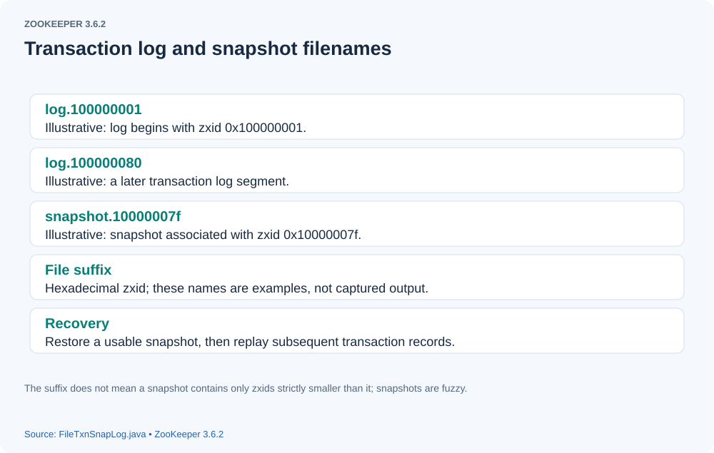
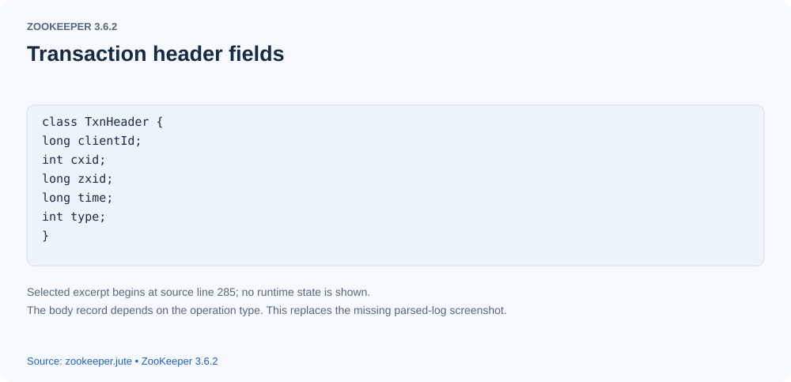
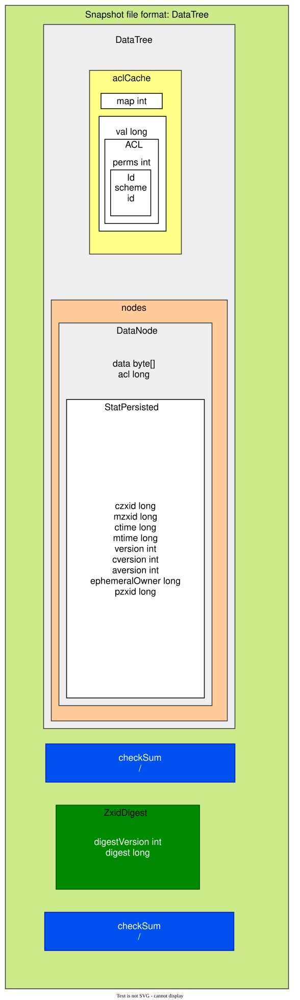
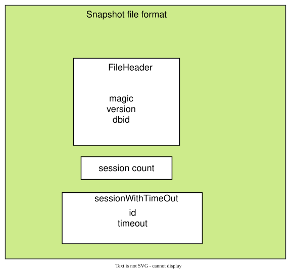
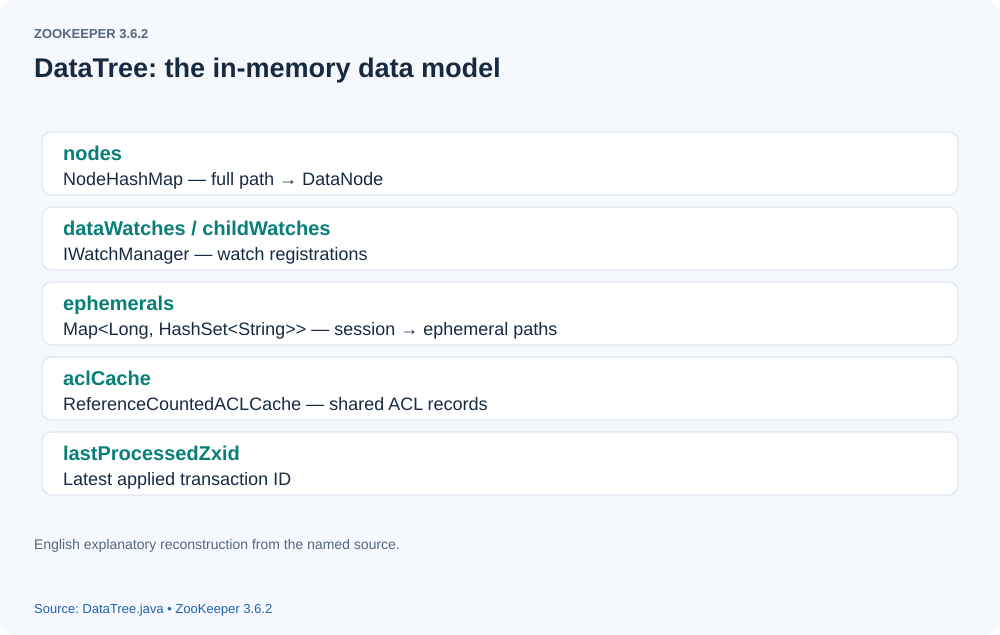
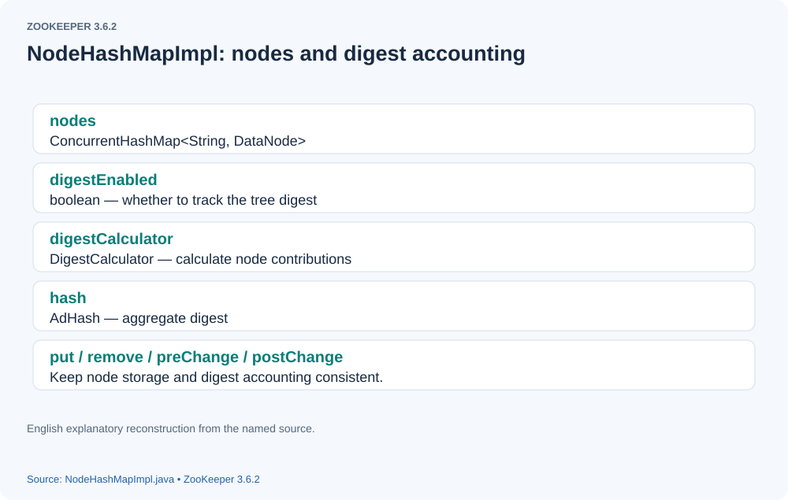
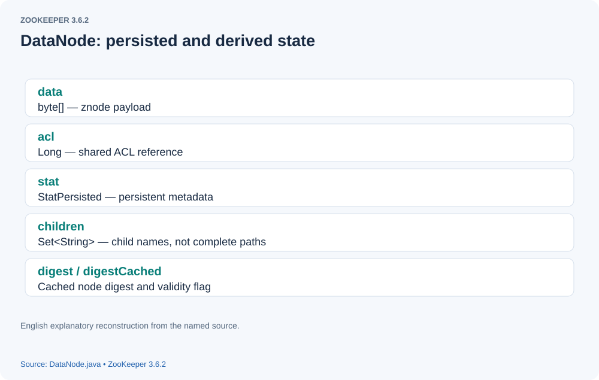

# How ZooKeeper Recovers Data from Snapshots and Transaction Logs

> **Source version and figures:** This article is checked against ZooKeeper **3.6.2**, commit `803c7f1a12f85978cb049af5e4ef23bd8b688715`, the latest 3.6 release available in October 2020. The analyzed excerpts are retained with English annotations; identified original-source variants are labeled explicitly. Figures are reconstructed from the source and original discussion because the original screenshots are unavailable. They are explanatory diagrams, not newly observed debugger output.

## Introduction

ZooKeeper logs state-changing transactions before completing them and periodically saves its in-memory state as a snapshot. In this context, transactional changes include create, set-data, delete, session, and related state changes; a read is not a state-changing transaction simply because it belongs to CRUD terminology.
On startup, the server restores data using the snapshot and transaction log files.

## The recovery process

Recovery has two parts:

- Restore a snapshot.
- Replay transaction logs.

Why are both needed?
The transaction log records changes, whereas a snapshot is a checkpoint of server data generated under configured conditions. A snapshot alone may omit transactions processed after it began. If the server crashes before the next snapshot, those changes must be recovered from logs. Conversely, rebuilding entirely from a complete log history would require retaining that history and replaying it all, which can be slow. **Correction:** log-only reconstruction is possible in principle from a suitable initial state and complete history; it is not categorically impossible as the original explanation suggested. Normal recovery uses snapshots to bound replay work, with the retained covering log and subsequent logs completing the restored state.

## Log and snapshot formats

[](assets/data-recovery-01.svg)

This reconstructed figure illustrates the log and snapshot naming scheme discussed in the original article. The filenames are examples, not the output of a new local run.
Log filenames have the form `log.x`, and snapshots `snapshot.y`. The suffix is a zxid written in hexadecimal. A state-changing transaction receives a server-assigned zxid. In standalone operation these advance monotonically; in an ensemble, zxids encode an epoch and a counter. If transaction B follows A, its zxid is larger, but not necessarily A's zxid plus one if other transactions intervene.

### Meaning of filename suffixes

For `log.y`, the suffix identifies the first zxid in that log; its records have zxids at least that value. The original explanation described every log as a fixed 64 MiB file. **Correction:** 64 MiB is the default preallocation increment, configurable through `zookeeper.preAllocSize`, and a log may grow through multiple increments. Preallocation reduces allocation work during append; it does not guarantee physically contiguous placement or eliminate all seeks. For `snapshot.x`, x is the last-processed zxid captured when snapshot generation starts. ZooKeeper snapshots are fuzzy: concurrent state changes can be reflected in some serialized nodes, so the file is not simply a strict list of all transactions below x. Recovery replays overlapping transactions safely.


### Transaction log contents

[](assets/data-recovery-02.svg)

The reconstructed record panel shows the main fields of a transaction log entry. Its example values reproduce the original explanation and do not claim a newly observed execution.

- Transaction timestamp.
- Session ID.
- Client request ID, `cxid`.
- Server transaction ID, `zxid`.
- The operation-specific transaction body:

```text

  1. Operation type, such as `create2`.
  2. Node path, such as `/test/hsbxxxxxxx`.
  3. Node data, such as `#xxxxxx`.
  4. ACL information, such as the serialized world/anyone entry `v{s{31,s{'world,'anyone}}}`.

```


- Optional digest information:

```text

  1. Digest version, shown as `2` in the original example.
  2. Digest value, shown as `10546528799` in the original example. These are illustrative values, not constants required for every log.

```


### Snapshot contents

[](assets/data-recovery-03.svg)

[](assets/data-recovery-04.svg)

The two reconstructed panels show a snapshot's node and session information.

1. **Znodes:** the data tree serializes its nodes, their state, data, and ACL references. The serialization is a fuzzy snapshot rather than an atomic point-in-time copy of every node.
2. **Sessions:** the server also serializes session IDs and their timeout values.

### Znode state

The displayed znode state includes:

- `czxid`: the transaction that created the node.
- `ctime`: creation time.
- `mzxid`: the transaction that last changed the node's data.
- `mtime`: last data modification time.
- `pzxid`: the transaction that last changed the node's child list.
- `cversion`: child-list version, not the node's creation version.
- `dataVersion`: data version, exposed as `version` in `Stat`.
- `aclVersion`: ACL version, exposed as `aversion` in `Stat`.
- `ephemeralOwner`: the owning session ID for an ordinary ephemeral node; container and TTL nodes use special encodings.
- `dataLength`: length of the node's data.

The display may omit stored data and ACL details. `dataLength` and child counts are derived for the public `Stat`; they are not separate fields in the serialized `StatPersisted` record.

### Session information

Session inspection exposes the following information:

- sessionid
- Session timeout.
- Number of ephemeral nodes owned by the session. **Correction:** snapshots directly persist the session-ID-to-timeout map; the owner-to-ephemeral-node sets are reconstructed from node state, rather than serializing this displayed count as a session field.

----

With these formats in mind, we can follow the recovery implementation.
Find the newest valid snapshot, then replay the log containing the next required zxid and later logs. A log that starts below the snapshot zxid can still contain required later entries, so selecting only logs whose filenames exceed it would miss data. In the illustrative filename list, `snapshot.30` and `log.27` can be sufficient when that log covers all later transactions. The suffixes are hexadecimal; sufficiency depends on actual valid record contents, not filenames alone.

##### ZooKeeperServer.startData

Startup enters recovery through `ZooKeeperServer.startdata` (lowercase `d` in this version).

```java

  public void startdata() throws IOException, InterruptedException {
        //check to see if zkDb is not null
        // ZKDatabase represents the server's data store.
        if (zkDb == null) {
            zkDb = new ZKDatabase(this.txnLogFactory);
        }
        if (!zkDb.isInitialized()) {
           // Recover the database if it has not been initialized.
            loadData();
        }
    }

```


##### loadData

```java

  public void loadData() throws IOException, InterruptedException {

        if (zkDb.isInitialized()) {
            setZxid(zkDb.getDataTreeLastProcessedZxid());
        } else {
            // Load data through zkDb.loadDataBase().
            setZxid(zkDb.loadDataBase());
        }

        // Clean up dead sessions
       // Remove sessions no longer present in the recovered timeout map.
        List<Long> deadSessions = new ArrayList<>();
        for (Long session : zkDb.getSessions()) {
            if (zkDb.getSessionWithTimeOuts().get(session) == null) {
                deadSessions.add(session);
            }
        }

        for (long session : deadSessions) {
            // TODO: Is lastProcessedZxid really the best thing to use?
            killSession(session, zkDb.getDataTreeLastProcessedZxid());
        }

       // Take a fresh snapshot after recovery.
        // Make a clean snapshot
        takeSnapshot();
    }

```


##### ZKDatabase.loadDataBase()

Recovery repopulates the fields of `ZKDatabase`.

```java

public long loadDataBase() throws IOException {
        long startTime = Time.currentElapsedTime();
         // Restore dataTree and sessionsWithTimeouts and return the highest recovered zxid.
        // dataTree holds nodes; sessionsWithTimeouts holds session timeout values.
        long zxid = snapLog.restore(dataTree, sessionsWithTimeouts, commitProposalPlaybackListener);
        initialized = true;
        long loadTime = Time.currentElapsedTime() - startTime;
        ServerMetrics.getMetrics().DB_INIT_TIME.add(loadTime);
        LOG.info("Snapshot loaded in {} ms, highest zxid is 0x{}, digest is {}",
                loadTime, Long.toHexString(zxid), dataTree.getTreeDigest());
        return zxid;
    }

```


Now consider `DataTree`.

##### DataTree

`DataTree` is ZooKeeper's in-memory data engine. The following figure identifies its key fields.

[](assets/data-recovery-05.svg)

Its `nodes` map holds the data nodes.

[](assets/data-recovery-06.svg)

Internally, the node storage uses a concurrent map keyed by full node path, with `DataNode` values. The figure shows the fields of a `DataNode`. **Terminology correction:** the key is the full path, not merely the final node name.

[](assets/data-recovery-07.svg)

##### snapLog.restore

Continue with `FileTxnSnapLog.restore` on the recovery call chain.

```java

 public long restore(DataTree dt, Map<Long, Integer> sessions, PlayBackListener listener) throws IOException {
        long snapLoadingStartTime = Time.currentElapsedTime();
       // Deserialize snapshot data through snapLog.
        long deserializeResult = snapLog.deserialize(dt, sessions);
        ServerMetrics.getMetrics().STARTUP_SNAP_LOAD_TIME.add(Time.currentElapsedTime() - snapLoadingStartTime);
        // Create the transaction log implementation.
        FileTxnLog txnLog = new FileTxnLog(dataDir);
        boolean trustEmptyDB;
        File initFile = new File(dataDir.getParent(), "initialize");
        if (Files.deleteIfExists(initFile.toPath())) {
            LOG.info("Initialize file found, an empty database will not block voting participation");
            trustEmptyDB = true;
        } else {
            trustEmptyDB = autoCreateDB;
        }
        // RestoreFinalizer.run replays the transaction logs.
        RestoreFinalizer finalizer = () -> {
            long highestZxid = fastForwardFromEdits(dt, sessions, listener);
            // The snapshotZxidDigest will reset after replaying the txn of the
            // zxid in the snapshotZxidDigest, if it's not reset to null after
            // restoring, it means either there are not enough txns to cover that
            // zxid or that txn is missing
            DataTree.ZxidDigest snapshotZxidDigest = dt.getDigestFromLoadedSnapshot();
            if (snapshotZxidDigest != null) {
                LOG.warn(
                        "Highest txn zxid 0x{} is not covering the snapshot digest zxid 0x{}, "
                                + "which might lead to inconsistent state",
                        Long.toHexString(highestZxid),
                        Long.toHexString(snapshotZxidDigest.getZxid()));
            }
            return highestZxid;
        };

        if (-1L == deserializeResult) {
            /* this means that we couldn't find any snapshot, so we need to
             * initialize an empty database (reported in ZOOKEEPER-2325) */
            if (txnLog.getLastLoggedZxid() != -1) {
                // ZOOKEEPER-3056: provides an escape hatch for users upgrading
                // from old versions of zookeeper (3.4.x, pre 3.5.3).
                if (!trustEmptySnapshot) {
                    throw new IOException(EMPTY_SNAPSHOT_WARNING + "Something is broken!");
                } else {
                    LOG.warn("{}This should only be allowed during upgrading.", EMPTY_SNAPSHOT_WARNING);
                    return finalizer.run();
                }
            }

            if (trustEmptyDB) {
                /* TODO: (br33d) we should either put a ConcurrentHashMap on restore()
                 *       or use Map on save() */
                save(dt, (ConcurrentHashMap<Long, Integer>) sessions, false);

                /* return a zxid of 0, since we know the database is empty */
                return 0L;
            } else {
                /* return a zxid of -1, since we are possibly missing data */
                LOG.warn("Unexpected empty data tree, setting zxid to -1");
                dt.lastProcessedZxid = -1L;
                return -1L;
            }
        }

        return finalizer.run();
    }

```


##### FileSnap.deserialize

First, examine snapshot restoration.

```java

public long deserialize(DataTree dt, Map<Long, Integer> sessions) throws IOException {
        // we run through 100 snapshots (not all of them)
        // if we cannot get it running within 100 snapshots
        // we should  give up
      // Find up to 100 candidate valid snapshots, ordered by decreasing zxid suffix.
        List<File> snapList = findNValidSnapshots(100);
        if (snapList.size() == 0) {
            return -1L;
        }
        File snap = null;
        long snapZxid = -1;
        boolean foundValid = false;
        // Try snapshots in order; stop after one is successfully restored.
        for (int i = 0, snapListSize = snapList.size(); i < snapListSize; i++) {
            // Select the current snapshot file.
            snap = snapList.get(i);
            LOG.info("Reading snapshot {}", snap);
            // Read its filename zxid, the checkpoint at snapshot start.
            snapZxid = Util.getZxidFromName(snap.getName(), SNAPSHOT_FILE_PREFIX);
            try (CheckedInputStream snapIS = SnapStream.getInputStream(snap)) {
              // Open the snapshot input stream.
                InputArchive ia = BinaryInputArchive.getArchive(snapIS);
               // Deserialize node and session data.
                deserialize(dt, sessions, ia);
               // Verify the snapshot integrity seal.
                SnapStream.checkSealIntegrity(snapIS, ia);

                // Digest feature was added after the CRC to make it backward
                // compatible, the older code can still read snapshots which
                // includes digest.
                //
                // To check the intact, after adding digest we added another
                // CRC check.
                // Deserialize optional digest information.
                if (dt.deserializeZxidDigest(ia, snapZxid)) {
               // Verify the corresponding integrity seal.

                    SnapStream.checkSealIntegrity(snapIS, ia);
                }
                // Stop after successful parsing.
                foundValid = true;
                break;
            } catch (IOException e) {
                LOG.warn("problem reading snap file {}", snap, e);
            }
        }
        if (!foundValid) {
            throw new IOException("Not able to find valid snapshots in " + snapDir);
        }
         // Record snapZxid as the checkpoint in DataTree.
        dt.lastProcessedZxid = snapZxid;
        lastSnapshotInfo = new SnapshotInfo(dt.lastProcessedZxid, snap.lastModified() / 1000);

        // compare the digest if this is not a fuzzy snapshot, we want to compare
        // and find inconsistent asap.
        if (dt.getDigestFromLoadedSnapshot() != null) {
            dt.compareSnapshotDigests(dt.lastProcessedZxid);
        }
        return dt.lastProcessedZxid;
    }

```


##### deserialize

Here is the snapshot `deserialize` call chain.

```java

public void deserialize(DataTree dt, Map<Long, Integer> sessions, InputArchive ia) throws IOException {

        FileHeader header = new FileHeader();
       // Deserialize FileHeader first.
        header.deserialize(ia, "fileheader");
        if (header.getMagic() != SNAP_MAGIC) {
            throw new IOException("mismatching magic headers " + header.getMagic() + " !=  " + FileSnap.SNAP_MAGIC);
        }
         //
        SerializeUtils.deserializeSnapshot(dt, ia, sessions);
    }

```


#####  SerializeUtils.deserializeSnapshot

```java


public static void deserializeSnapshot(DataTree dt, InputArchive ia, Map<Long, Integer> sessions) throws IOException {
        // Restore session timeout information first.
        int count = ia.readInt("count");
        while (count > 0) {
            // Read each session ID and timeout from the snapshot.
            long id = ia.readLong("id");
            int to = ia.readInt("timeout");
            sessions.put(id, to);
            if (LOG.isTraceEnabled()) {
                ZooTrace.logTraceMessage(
                    LOG,
                    ZooTrace.SESSION_TRACE_MASK,
                    "loadData --- session in archive: " + id + " with timeout: " + to);
            }
            count--;
        }
       // Deserialize the DataTree.
        dt.deserialize(ia, "tree");
    }

```


##### DataTree.deserialize()

```java

public void deserialize(InputArchive ia, String tag) throws IOException {
        // Read ACL cache information first.
        aclCache.deserialize(ia);
        nodes.clear();
        pTrie.clear();
        nodeDataSize.set(0);
        // Read node paths and data.
        String path = ia.readString("path");
        while (!"/".equals(path)) {
            DataNode node = new DataNode();
          // Deserialize a DataNode.
            ia.readRecord(node, "node");
            nodes.put(path, node);
            synchronized (node) {
                aclCache.addUsage(node.acl);
            }
            int lastSlash = path.lastIndexOf('/');
            if (lastSlash == -1) {
                root = node;
            } else {
                String parentPath = path.substring(0, lastSlash);
                DataNode parent = nodes.get(parentPath);
                if (parent == null) {
                    throw new IOException("Invalid Datatree, unable to find "
                                          + "parent "
                                          + parentPath
                                          + " of path "
                                          + path);
                }
               // Link this node into its parent's child set.
                parent.addChild(path.substring(lastSlash + 1));
                long eowner = node.stat.getEphemeralOwner();
                EphemeralType ephemeralType = EphemeralType.get(eowner);
                if (ephemeralType == EphemeralType.CONTAINER) {
                    containers.add(path);
                } else if (ephemeralType == EphemeralType.TTL) {
                    ttls.add(path);
                } else if (eowner != 0) {
                    HashSet<String> list = ephemerals.get(eowner);
                    if (list == null) {
                        list = new HashSet<String>();
                        ephemerals.put(eowner, list);
                    }
                    list.add(path);
                }
            }
            path = ia.readString("path");
        }
        // have counted digest for root node with "", ignore here to avoid
        // counting twice for root node
        nodes.putWithoutDigest("/", root);

        nodeDataSize.set(approximateDataSize());

        // we are done with deserializing the
        // the datatree
        // update the quotas - create path trie
        // and also update the stat nodes
       // Rebuild quota information.
        setupQuota();
       // Purge unused ACL entries.
        aclCache.purgeUnused();
    }

```


That covers snapshot restoration. Next, examine transaction log replay.

##### RestoreFinalizer.run

```java


long highestZxid = fastForwardFromEdits(dt, sessions, listener);
            // The snapshotZxidDigest will reset after replaying the txn of the
            // zxid in the snapshotZxidDigest, if it's not reset to null after
            // restoring, it means either there are not enough txns to cover that
            // zxid or that txn is missing
            DataTree.ZxidDigest snapshotZxidDigest = dt.getDigestFromLoadedSnapshot();
            if (snapshotZxidDigest != null) {
                LOG.warn(
                        "Highest txn zxid 0x{} is not covering the snapshot digest zxid 0x{}, "
                                + "which might lead to inconsistent state",
                        Long.toHexString(highestZxid),
                        Long.toHexString(snapshotZxidDigest.getZxid()));
            }
            return highestZxid;

```


##### fastForwardFromEdits

```java

 public long fastForwardFromEdits(
        DataTree dt,
        Map<Long, Integer> sessions,
        PlayBackListener listener) throws IOException {
       // Read logs covering dt.lastProcessedZxid + 1, including the latest log starting at or below that zxid.
        TxnIterator itr = txnLog.read(dt.lastProcessedZxid + 1);
        long highestZxid = dt.lastProcessedZxid;
        TxnHeader hdr;
        int txnLoaded = 0;
        long startTime = Time.currentElapsedTime();
        try {
            while (true) {
                // iterator points to
                // the first valid txn when initialized
                hdr = itr.getHeader();
                if (hdr == null) {
                    //empty logs
                    return dt.lastProcessedZxid;
                }
                if (hdr.getZxid() < highestZxid && highestZxid != 0) {
                     // Report a transaction zxid lower than highestZxid.
                    LOG.error("{}(highestZxid) > {}(next log) for type {}", highestZxid, hdr.getZxid(), hdr.getType());
                } else {
                    // Advance highestZxid to the current log record's zxid.
                    highestZxid = hdr.getZxid();
                }
                try {
                    // Apply the transaction to DataTree; the node-creation article explains this path.
                    processTransaction(hdr, dt, sessions, itr.getTxn());
                    dt.compareDigest(hdr, itr.getTxn(), itr.getDigest());
                    txnLoaded++;
                } catch (KeeperException.NoNodeException e) {
                    throw new IOException("Failed to process transaction type: "
                                          + hdr.getType()
                                          + " error: "
                                          + e.getMessage(),
                                          e);
                }
                listener.onTxnLoaded(hdr, itr.getTxn(), itr.getDigest());

                if (!itr.next()) {
                    break;
                }
            }
        } finally {
            if (itr != null) {
                itr.close();
            }
        }

        long loadTime = Time.currentElapsedTime() - startTime;
        LOG.info("{} txns loaded in {} ms", txnLoaded, loadTime);
        ServerMetrics.getMetrics().STARTUP_TXNS_LOADED.add(txnLoaded);
        ServerMetrics.getMetrics().STARTUP_TXNS_LOAD_TIME.add(loadTime);
         // Return the highest processed zxid.
        return highestZxid;
    }

```


##### TxnIterator.next()

`next()` reads the next record from the transaction logs.

```java

public boolean next() throws IOException {
            if (ia == null) {
                return false;
            }
            try {
                // Read the stored checksum.
                long crcValue = ia.readLong("crcvalue");
                // Read the serialized transaction entry.
                byte[] bytes = Util.readTxnBytes(ia);
                // Since we preallocate, we define EOF to be an
                if (bytes == null || bytes.length == 0) {
                    throw new EOFException("Failed to read " + logFile);
                }
                // EOF or corrupted record
                // validate CRC
                Checksum crc = makeChecksumAlgorithm();
                crc.update(bytes, 0, bytes.length);
                if (crcValue != crc.getValue()) {
                    throw new IOException(CRC_ERROR);
                }
                // Deserialize the binary record into TxnLogEntry.
                TxnLogEntry logEntry = SerializeUtils.deserializeTxn(bytes);
                hdr = logEntry.getHeader();
               // record holds the operation-specific transaction body.
                record = logEntry.getTxn();
              // digest holds optional transaction digest information.
                digest = logEntry.getDigest();
            } catch (EOFException e) {
                LOG.debug("EOF exception", e);
                inputStream.close();
                inputStream = null;
                ia = null;
                hdr = null;
                // this means that the file has ended
                // we should go to the next file
                // At the end of this log, open the next file.
                if (!goToNextLog()) {
                    return false;
                }
                // if we went to the next log file, we should call next() again
                // Read the first record of the next log.
                return next();
            } catch (IOException e) {
                inputStream.close();
                throw e;
            }
            return true;
        }

```


## Closing remarks

This is ZooKeeper's recovery path through snapshot restoration and transaction replay. See [node creation](node-creation.html) for the transaction application stage.

## Pinned source references

- [ZooKeeperServer.java](https://github.com/apache/zookeeper/blob/803c7f1a12f85978cb049af5e4ef23bd8b688715/zookeeper-server/src/main/java/org/apache/zookeeper/server/ZooKeeperServer.java)
- [ZKDatabase.java](https://github.com/apache/zookeeper/blob/803c7f1a12f85978cb049af5e4ef23bd8b688715/zookeeper-server/src/main/java/org/apache/zookeeper/server/ZKDatabase.java)
- [DataTree.java](https://github.com/apache/zookeeper/blob/803c7f1a12f85978cb049af5e4ef23bd8b688715/zookeeper-server/src/main/java/org/apache/zookeeper/server/DataTree.java)
- [DataNode.java](https://github.com/apache/zookeeper/blob/803c7f1a12f85978cb049af5e4ef23bd8b688715/zookeeper-server/src/main/java/org/apache/zookeeper/server/DataNode.java)
- [FileTxnSnapLog.java](https://github.com/apache/zookeeper/blob/803c7f1a12f85978cb049af5e4ef23bd8b688715/zookeeper-server/src/main/java/org/apache/zookeeper/server/persistence/FileTxnSnapLog.java)
- [FileSnap.java](https://github.com/apache/zookeeper/blob/803c7f1a12f85978cb049af5e4ef23bd8b688715/zookeeper-server/src/main/java/org/apache/zookeeper/server/persistence/FileSnap.java)
- [FileTxnLog.java](https://github.com/apache/zookeeper/blob/803c7f1a12f85978cb049af5e4ef23bd8b688715/zookeeper-server/src/main/java/org/apache/zookeeper/server/persistence/FileTxnLog.java)
- [SerializeUtils.java](https://github.com/apache/zookeeper/blob/803c7f1a12f85978cb049af5e4ef23bd8b688715/zookeeper-server/src/main/java/org/apache/zookeeper/server/util/SerializeUtils.java)
- [Protocol and persisted-record Jute definitions](https://github.com/apache/zookeeper/blob/803c7f1a12f85978cb049af5e4ef23bd8b688715/zookeeper-jute/src/main/resources/zookeeper.jute)
- [Historical configuration reference](https://github.com/apache/zookeeper/blob/803c7f1a12f85978cb049af5e4ef23bd8b688715/zookeeper-docs/src/main/resources/markdown/zookeeperAdmin.md)
