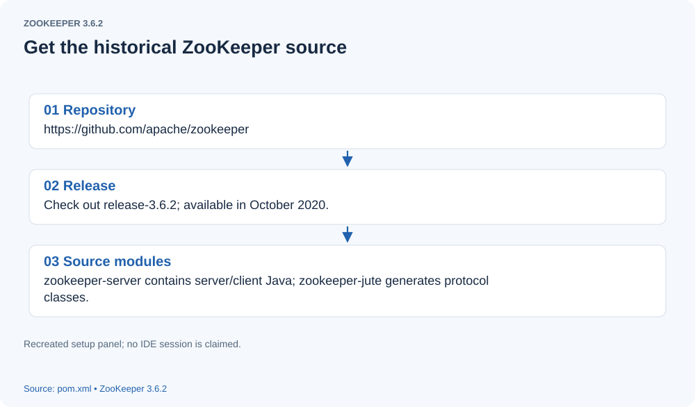
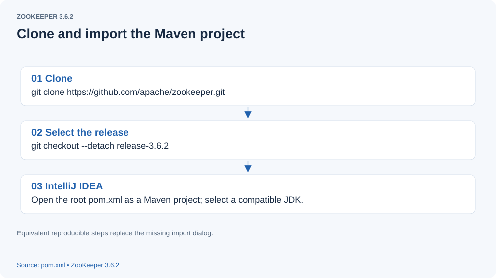
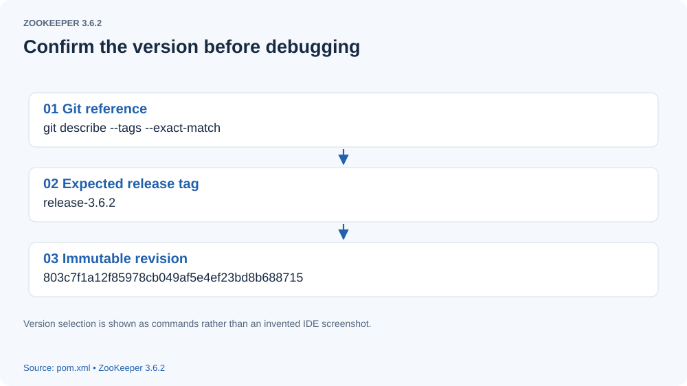
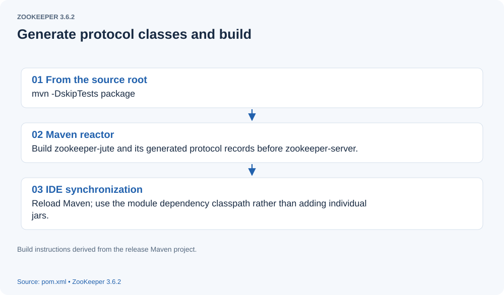
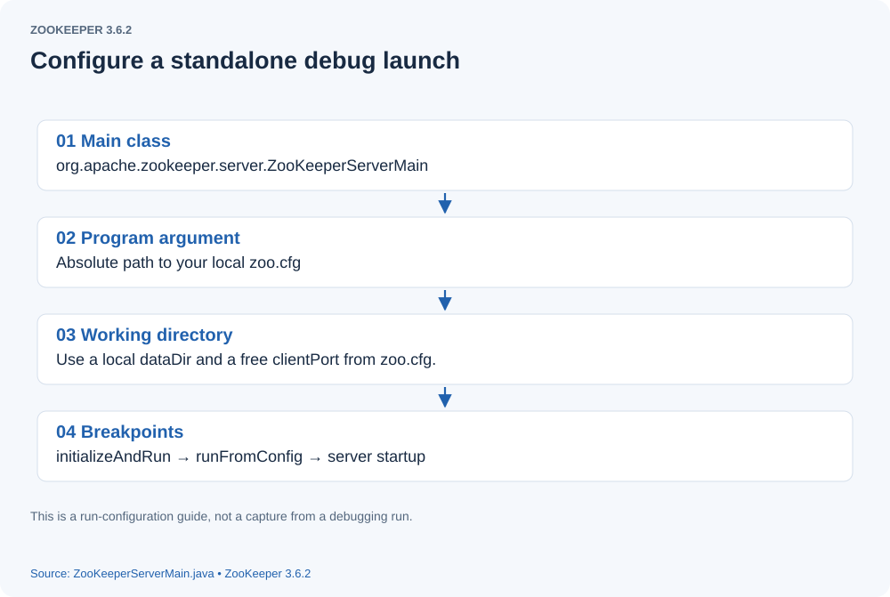

# Setting Up a ZooKeeper Source Debugging Environment

This guide sets up an IntelliJ IDEA workspace for reading and debugging ZooKeeper source. The historical reference is **ZooKeeper 3.6.2**, the latest release in the 3.6 line available in October 2020. Use commit `803c7f1a12f85978cb049af5e4ef23bd8b688715` so source locations and protocol behavior agree with the rest of this series.

## Getting the source from GitHub

In IntelliJ IDEA, use the action for obtaining a project from version control and enter the Apache ZooKeeper Git repository URL. The original article used **File → New → Project from Version Control → Git** and noted that an installed GitHub plugin did not appear as a separate provider. Menu wording varies by IDE version; the Git clone operation is sufficient.

[](assets/debugging-environment-01.svg)

If using SSH, configure your SSH key and GitHub access for the IDE's Git environment. An HTTPS URL is also suitable; public source can be read without a GitHub account.

[](assets/debugging-environment-02.svg)

Clone the repository, then select the historical version before importing or building. Download time depends on your network. A reproducible terminal equivalent is:

```sh

git clone https://github.com/apache/zookeeper.git
cd zookeeper
git checkout --detach 803c7f1a12f85978cb049af5e4ef23bd8b688715
git rev-parse HEAD

```


The final command should print the pinned commit. Open the root `pom.xml` as a Maven project, rather than importing only `zookeeper-server`. The reactor includes `zookeeper-jute`, whose generated protocol classes are needed by the server and client.

[](assets/debugging-environment-03.svg)

## Building with Maven

Older ZooKeeper releases used Ant; this release uses Maven for the Java reactor and dependency management. Use a supported JDK. For a consistent historical setup, choose JDK 8 update 211 or newer, as specified by the pinned README, and configure both the project SDK and Maven runner to use it.

From the repository root, follow the packaging instructions:

```sh

mvn clean install -DskipTests

```


This compiles the reactor and builds the distribution without running the test suite. To include tests, omit `-DskipTests`. The resulting binary distribution is under `zookeeper-assembly/target`; the server module's package phase also copies its dependency jars to `zookeeper-server/target/lib`. Reload the Maven model in the IDE after generation so `zookeeper-jute/target/generated-sources/java` is recognized as generated source.

[](assets/debugging-environment-04.svg)

## Running the standalone server

1. Copy `conf/zoo_sample.cfg` to `conf/zoo.cfg`. **Filename correction:** the original called the template `zoo_example.cfg`; this checkout supplies `zoo_sample.cfg`. Set `dataDir` to an absolute writable directory created for this experiment, and choose a free `clientPort` such as 2181. A separate `dataLogDir` is optional; otherwise logs share the data directory.
2. Create an application run configuration with main class `org.apache.zookeeper.server.ZooKeeperServerMain`. Use the `zookeeper-server` module classpath, include dependencies with Maven `provided` scope, set the working directory to the repository root, and supply `conf/zoo.cfg` as the program argument.
3. Configure logging explicitly with the VM option `-Dlog4j.configuration=file:conf/log4j.properties`, resolved relative to that working directory. The original moved the logging file into a module resources directory and marked it as a resource root. Keeping the checked-in configuration in `conf` and referring to it avoids altering the Maven source layout; copying it into an appropriate classpath resource directory is another option.
4. Run or debug `ZooKeeperServerMain.main`. A breakpoint in `initializeAndRun` or `runFromConfig` lets you follow parsing and server initialization. Consult [standalone startup](standalone-server-startup.html) for the request and connection threads.

[](assets/debugging-environment-05.svg)

For example, create the data directory and use this minimal configuration, replacing the example path with a real writable directory:

```properties

tickTime=2000
dataDir=/absolute/path/to/zookeeper-debug-data
clientPort=2181

```


A terminal alternative using the module build outputs is:

```sh

java -cp 'conf:zookeeper-server/target/classes:zookeeper-jute/target/classes:zookeeper-server/target/lib/*' \
  org.apache.zookeeper.server.ZooKeeperServerMain conf/zoo.cfg

```


This uses the Unix classpath separator; use `;` on Windows. These are reproducible setup instructions derived from the checked-in build and configuration, not a claim that this migration ran an IDE debugging session.

## Dependency errors encountered in the original setup

The original author reported these two startup failures while using the 3.6 source:

- `java.lang.NoClassDefFoundError: com/codahale/metrics/Reservoir`. The original workaround upgraded `metrics-core` from 3.2.5 to 4.1.10. **Correction:** the pinned POM deliberately selects 3.2.5, which supplies `Reservoir`. A missing class indicates a runtime classpath problem; include the configured dependency before changing its version. The server POM marks this jar `provided`, and the distribution supplies it.
- `java.lang.ClassNotFoundException: org.xerial.snappy.SnappyInputStream`. The original workaround removed the `provided` scope from `snappy-java`. **Correction:** that can change a local Maven application's runtime dependency set, but the historical distribution already includes the required library. For the IDE main-class launch, include provided dependencies or use the built distribution's library classpath rather than permanently editing the POM.

## Closing remarks

Enjoy the source-reading journey. This setup makes it possible to move between the configuration, generated wire records, server startup, and client code with a consistent historical source tree.

> **Figure provenance:** All five figures reconstruct the missing original screenshots as English setup panels. They show configuration and source structure, not an invented IDE session.

## Pinned references

- [ZooKeeper 3.6.2 README and Java requirements](https://github.com/apache/zookeeper/blob/803c7f1a12f85978cb049af5e4ef23bd8b688715/README.md)
- [Packaging and Maven build instructions](https://github.com/apache/zookeeper/blob/803c7f1a12f85978cb049af5e4ef23bd8b688715/README_packaging.md)
- [Server module POM and dependency scopes](https://github.com/apache/zookeeper/blob/803c7f1a12f85978cb049af5e4ef23bd8b688715/zookeeper-server/pom.xml)
- [Root POM and dependency versions](https://github.com/apache/zookeeper/blob/803c7f1a12f85978cb049af5e4ef23bd8b688715/pom.xml)
- [Sample configuration](https://github.com/apache/zookeeper/blob/803c7f1a12f85978cb049af5e4ef23bd8b688715/conf/zoo_sample.cfg)
- [ZooKeeperServerMain](https://github.com/apache/zookeeper/blob/803c7f1a12f85978cb049af5e4ef23bd8b688715/zookeeper-server/src/main/java/org/apache/zookeeper/server/ZooKeeperServerMain.java)
