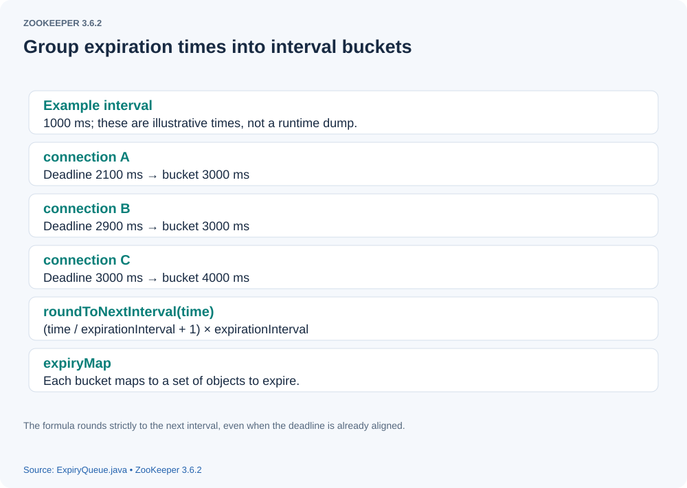

# How ExpiryQueue Manages Connection and Session Timeouts

> **Source version and figures:** This article is checked against ZooKeeper **3.6.2**, commit `803c7f1a12f85978cb049af5e4ef23bd8b688715`, the latest 3.6 release available in October 2020. The analyzed excerpts are retained with English annotations; identified original-source variants are labeled explicitly. The figures are the author's original diagrams, with their labels translated into English.

## Background

The ZooKeeper server manages two kinds of objects with timeouts: connections and sessions. `ExpiryQueue` provides a reusable container for expiration management.

## Implementation

Consider connection timeouts. Different connections can have different expiration deadlines.

[{: .diagram}](assets/expiry-queue-01.svg)

How does ZooKeeper manage these deadlines efficiently?
`ExpiryQueue` has an `expirationInterval` field. It groups each deadline into an interval bucket using this calculation:

`normalizeTimeout = (timeoutPoint/expirationInterval +1) * expirationInterval`
Connections whose timeout points fall in the same interval are therefore grouped into one bucket. In the example below, three nearby deadlines all round to the same bucket.

```text

Suppose `expirationInterval = 10000`:
connection_1_timeout_point = 1599715479084
connection_2_timeout_point =  1599715479184
connection_3_timeout_point =  1599715479384
normalized_deadline = 1599715480000

```


The example uses illustrative numeric timestamps. **Clock correction:** the implementation obtains elapsed time through `Time.currentElapsedTime()`, not the wall-clock Unix epoch, so do not compare these numbers directly with calendar time.

Here are two important fields in `ExpiryQueue`.

```java

  // Each object maps to its rounded expiration deadline.
  private final ConcurrentHashMap<E, Long> elemMap = new ConcurrentHashMap<E, Long>();

   // Each expiration deadline maps to the set of objects expiring in that bucket.
  private final ConcurrentHashMap<Long, Set<E>> expiryMap = new ConcurrentHashMap<Long, Set<E>>();

```


## The expiration management thread

A container also needs a consumer to monitor expired objects. The expiration consumer works in units of `expirationInterval`. Its next scheduled expiration boundary is stored in `nextExpirationTime`, initialized as follows:

`nextExpirationTime = (now / expirationInterval + 1) * expirationInterval`
Here `now` is the elapsed-time clock value when the queue is created.
Later boundaries advance according to:

`nextExpirationTime = nextExpirationTime + expirationInterval`
Both `nextExpirationTime` and the rounded connection deadlines are multiples of `expirationInterval`. The rounding expression advances to the next boundary even when the supplied time is already exactly on a boundary.

### Retrieving expired objects

The consumer obtains an expired bucket through `ExpiryQueue.poll`.

```java

 public Set<E> poll() {
        long now = Time.currentElapsedTime();
        long expirationTime = nextExpirationTime.get();
        if (now < expirationTime) {
            return Collections.emptySet();
        }

        Set<E> set = null;
        // Advance nextExpirationTime by expirationInterval.
        long newExpirationTime = expirationTime + expirationInterval;
        if (nextExpirationTime.compareAndSet(expirationTime, newExpirationTime)) {
            // Remove and return the set at the expirationTime boundary.
            set = expiryMap.remove(expirationTime);
        }
        if (set == null) {
            return Collections.emptySet();
        }
       // Return the objects expiring at this boundary.
        return set;
    }

```


After obtaining an expired bucket, the consumer applies behavior appropriate to the object: for example closing a connection or expiring a session. Scheduling belongs to that consumer; `ExpiryQueue` itself does not create a management thread.

## Updating expiration deadlines

Objects update their deadlines as activity occurs. For a connection, an I/O event can refresh its expiration time. `ExpiryQueue.update` implements the change.

```java

 // timeout is the object's allowed lifetime from the current time.
 public Long update(E elem, int timeout) {
      // Retrieve the previous expiration deadline from elemMap.
        Long prevExpiryTime = elemMap.get(elem);
        long now = Time.currentElapsedTime();
      // Compute the new rounded deadline.
        Long newExpiryTime = roundToNextInterval(now + timeout);

        // Do nothing if the old and new buckets are identical.
        if (newExpiryTime.equals(prevExpiryTime)) {
            // No change, so nothing to update
            return null;
        }

        // First add the elem to the new expiry time bucket in expiryMap.
        // Find the set of objects at the new expiration deadline.
        Set<E> set = expiryMap.get(newExpiryTime);
        if (set == null) {
            // Construct a ConcurrentHashSet using a ConcurrentHashMap
            // Create a set if the bucket does not yet exist.
            set = Collections.newSetFromMap(new ConcurrentHashMap<E, Boolean>());
            // Put the new set in the map, but only if another thread
            // hasn't beaten us to it
             // Concurrent threads may create the same bucket, so install it with putIfAbsent.
            Set<E> existingSet = expiryMap.putIfAbsent(newExpiryTime, set);
            if (existingSet != null) {
                set = existingSet;
            }
        }
       // Add this object to the new bucket.
        set.add(elem);

        // Map the elem to the new expiry time. If a different previous
        // mapping was present, clean up the previous expiry bucket.
        // Record its new deadline in elemMap.
        prevExpiryTime = elemMap.put(elem, newExpiryTime);
        if (prevExpiryTime != null && !newExpiryTime.equals(prevExpiryTime)) {
            // Remove it from the bucket for its previous deadline.
            Set<E> prevSet = expiryMap.get(prevExpiryTime);
            if (prevSet != null) {
                prevSet.remove(elem);
            }
        }
        return newExpiryTime;
    }

```


This is how ZooKeeper implements expiration management in the source. For additional background, I recommend *From Paxos to ZooKeeper: Principles and Practice of Distributed Consistency*, the book that helped me understand this part of the design.

## Pinned source references

- [ExpiryQueue.java](https://github.com/apache/zookeeper/blob/803c7f1a12f85978cb049af5e4ef23bd8b688715/zookeeper-server/src/main/java/org/apache/zookeeper/server/ExpiryQueue.java)
- [SessionTrackerImpl.java](https://github.com/apache/zookeeper/blob/803c7f1a12f85978cb049af5e4ef23bd8b688715/zookeeper-server/src/main/java/org/apache/zookeeper/server/SessionTrackerImpl.java)
- [NIOServerCnxnFactory.java](https://github.com/apache/zookeeper/blob/803c7f1a12f85978cb049af5e4ef23bd8b688715/zookeeper-server/src/main/java/org/apache/zookeeper/server/NIOServerCnxnFactory.java)
- [Time.java](https://github.com/apache/zookeeper/blob/803c7f1a12f85978cb049af5e4ef23bd8b688715/zookeeper-server/src/main/java/org/apache/zookeeper/common/Time.java)
