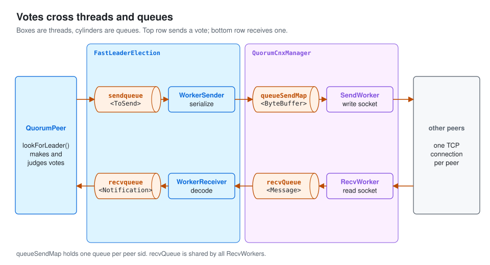
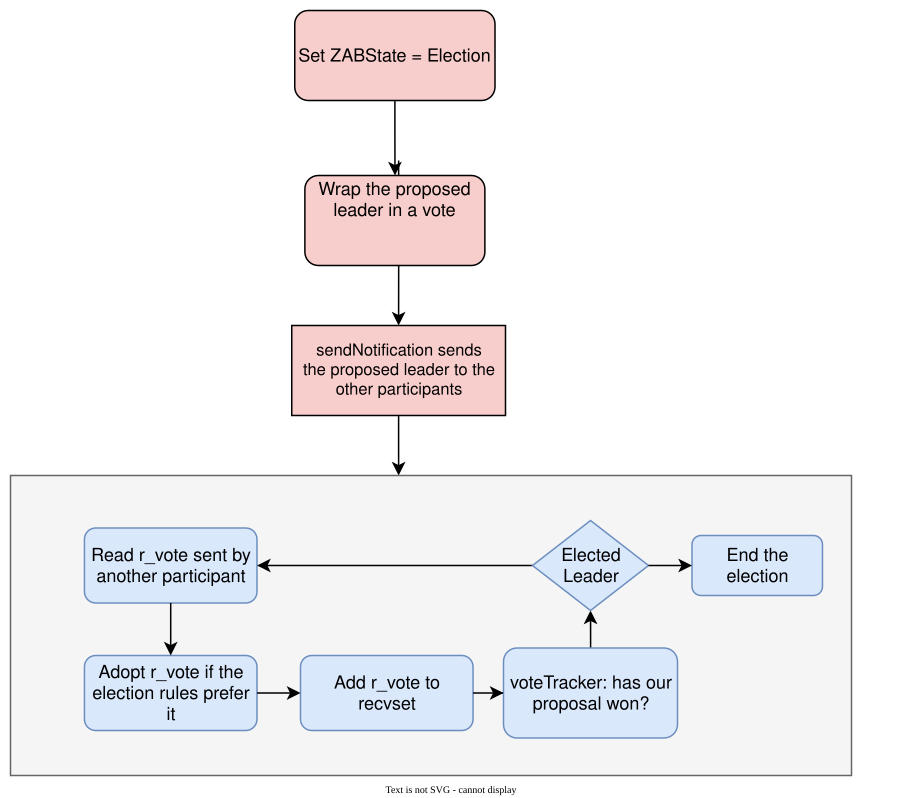
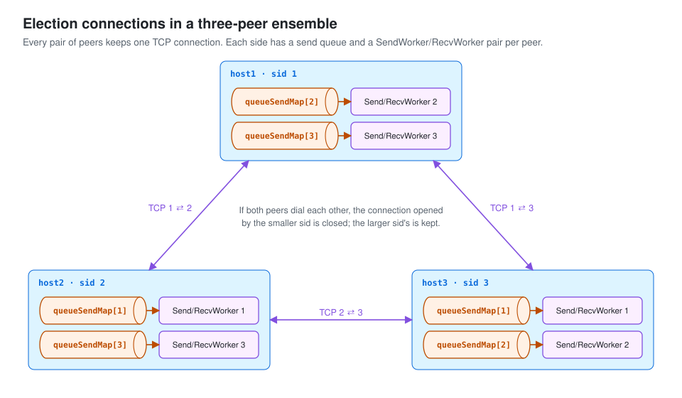

# Following ZooKeeper Fast Leader Election

Before an ensemble can replicate anything, its servers must agree on one **leader**. This article follows ZooKeeper's fast leader election: the voting rule, the threads and queues that carry votes, and the socket connections between peers.

## 1. The election protocol

An ensemble has two kinds of members:

- **Participants** vote in elections.
- **Observers** do not vote.

Only participants take part. The election runs like this:

1. On startup, each server creates a vote **for itself**. A vote carries:

   | Field | Meaning |
   | --- | --- |
   | `id` | Proposed leader's server ID. At first, the server itself. |
   | `zxid` | Latest transaction ID logged on this server. |
   | `electionEpoch` | The election round. |

2. Each server sends its vote to every other voting server.
3. When a server receives another vote, `r_vote`, it compares it with its own. The **larger** candidate wins, compared in this order:

   1. `peerEpoch`: the candidate's epoch.
   2. `zxid`: the candidate's latest transaction. A server with more history is preferred.
   3. `sid`: the server ID, as a tie-breaker.

4. If the received candidate wins, the server switches its vote to it and broadcasts the new vote.
5. The server checks whether one candidate has a quorum of votes. In a normal equal-weight ensemble, that is more than half of the participants.
6. If not, it keeps exchanging votes from step 2.

### Rounds and ordering

Each server keeps an `electionEpoch` for the current round. If it hears about a **newer** round, it clears its collected votes, updates its logical clock and joins that round. Notifications from **older** rounds are ignored, so the servers converge on one round.

> **Note:** the original sketch compared only `zxid` and `id`, and had the zxid comparison reversed. The real rule, [`totalOrderPredicate`](https://github.com/apache/zookeeper/blob/803c7f1a12f85978cb049af5e4ef23bd8b688715/zookeeper-server/src/main/java/org/apache/zookeeper/server/quorum/FastLeaderElection.java#L721), compares `(peerEpoch, zxid, sid)` and prefers the larger tuple. `peerEpoch` is the candidate's epoch and is different from the round number `electionEpoch`. Quorums are checked by a `QuorumVerifier`; "more than half" describes the standard majority verifier.

## 2. The threads involved

Election work is split across several threads. The first two belong to the election algorithm and never touch sockets:

| Thread | Job |
| --- | --- |
| `WorkerSender` | Takes `ToSend` notifications from `sendqueue`, serializes them and hands them to `QuorumCnxManager`. |
| `WorkerReceiver` | Takes raw messages from `QuorumCnxManager.recvQueue`, validates and decodes them, and puts `Notification`s into the algorithm's `recvqueue`. Sends replies when needed. |

> **Note:** the original introduction swapped the descriptions of these two threads.

Every voting peer connects to every other voting peer, and each connection has its own pair of socket threads:

| Thread | Job |
| --- | --- |
| `SendWorker` | Writes vote messages to one peer's socket. |
| `RecvWorker` | Reads vote messages from one peer's socket. (The original called it ReceiveWorker.) |

Two more:

| Thread | Job |
| --- | --- |
| `ListenerHandler` | Accepts election connections from other peers. |
| `QuorumPeer` | Reads notifications, updates its vote and decides when a leader is elected. Then it leaves the election loop for discovery and synchronization. |

How votes move between these threads and queues:

[{: .diagram}](assets/leader-election-01.svg)

With the roles clear, follow the code.

## 3. Peer startup

`QuorumPeerMain` is the entry point of an ensemble server.

### `initializeAndRun`

It does three things:

1. Parses `zoo.cfg` into a `QuorumPeerConfig`.
2. Starts `DatadirCleanupManager`, which deletes old snapshots and logs if auto-purge is on.
3. Starts the peer through `runFromConfig`.

### `runFromConfig`

A long method. The annotated excerpt keeps its main steps:

```java
 public void runFromConfig(QuorumPeerConfig config) throws IOException, AdminServerException {

           // Earlier setup is omitted; the relevant initialization follows.
            if (config.getClientPortAddress() != null) {
                // Obtain the server connection factory; the default is NIOServerCnxnFactory.
                cnxnFactory = ServerCnxnFactory.createFactory();
               // Configure the listening address, connection limits, SelectorThreads, and connection expiry support.
                cnxnFactory.configure(config.getClientPortAddress(), config.getMaxClientCnxns(), config.getClientPortListenBacklog(), false);
            }

            if (config.getSecureClientPortAddress() != null) {
                secureCnxnFactory = ServerCnxnFactory.createFactory();
                secureCnxnFactory.configure(config.getSecureClientPortAddress(), config.getMaxClientCnxns(), config.getClientPortListenBacklog(), true);
            }
            // QuorumPeer represents this ensemble server; subsequent peer behavior belongs to it.
            quorumPeer = getQuorumPeer();
            // Set the accessor for transaction logs and snapshots.
            quorumPeer.setTxnFactory(new FileTxnSnapLog(config.getDataLogDir(), config.getDataDir()));
            quorumPeer.enableLocalSessions(config.areLocalSessionsEnabled());
            quorumPeer.enableLocalSessionsUpgrading(config.isLocalSessionsUpgradingEnabled());
            //quorumPeer.setQuorumPeers(config.getAllMembers());
            // Set the leader election algorithm; the supported algorithm here is FastLeaderElection.
            quorumPeer.setElectionType(config.getElectionAlg());
            // Set this peer's server ID (sid).
            quorumPeer.setMyid(config.getServerId());
            quorumPeer.setTickTime(config.getTickTime());
            quorumPeer.setMinSessionTimeout(config.getMinSessionTimeout());
            quorumPeer.setMaxSessionTimeout(config.getMaxSessionTimeout());
            quorumPeer.setInitLimit(config.getInitLimit());
            quorumPeer.setSyncLimit(config.getSyncLimit());
            quorumPeer.setConnectToLearnerMasterLimit(config.getConnectToLearnerMasterLimit());
            quorumPeer.setObserverMasterPort(config.getObserverMasterPort());
            quorumPeer.setConfigFileName(config.getConfigFilename());
            quorumPeer.setClientPortListenBacklog(config.getClientPortListenBacklog());
           // Set the ZooKeeper database; persisted data has not yet been restored here.
            quorumPeer.setZKDatabase(new ZKDatabase(quorumPeer.getTxnFactory()));
            quorumPeer.setQuorumVerifier(config.getQuorumVerifier(), false);
            if (config.getLastSeenQuorumVerifier() != null) {
                quorumPeer.setLastSeenQuorumVerifier(config.getLastSeenQuorumVerifier(), false);
            }
            quorumPeer.initConfigInZKDatabase();
            quorumPeer.setCnxnFactory(cnxnFactory);
            quorumPeer.setSecureCnxnFactory(secureCnxnFactory);
            quorumPeer.setSslQuorum(config.isSslQuorum());
            quorumPeer.setUsePortUnification(config.shouldUsePortUnification());
            // Set the member type: participant or observer.
            quorumPeer.setLearnerType(config.getPeerType());
            quorumPeer.setSyncEnabled(config.getSyncEnabled());
          // Additional configuration is omitted.
           // Initialize QuorumPeer, including quorum authentication helpers.
            quorumPeer.initialize();

            if (config.jvmPauseMonitorToRun) {
                quorumPeer.setJvmPauseMonitor(new JvmPauseMonitor(config));
            }
            // Start QuorumPeer.
            quorumPeer.start();
            ZKAuditProvider.addZKStartStopAuditLog();

            quorumPeer.join();
        } catch (InterruptedException e) {
            // warn, but generally this is ok
            LOG.warn("Quorum Peer interrupted", e);
        } finally {
            if (metricsProvider != null) {
                try {
                    metricsProvider.stop();
                } catch (Throwable error) {
                    LOG.warn("Error while stopping metrics", error);
                }
            }
        }
    }
```

### `QuorumPeer.start()`

Here `QuorumPeer` starts:

```java
   public synchronized void start() {
        // Check that this peer is included in the configured server list.
        if (!getView().containsKey(myid)) {
            throw new RuntimeException("My id " + myid + " not in the peer list");
        }
        // Restore persisted data; see data-recovery.html.
        loadDataBase();
       // Start SelectorThreads and AcceptThread to accept clients; see standalone-server-startup.html.
        startServerCnxnFactory();
//        try {
//            adminServer.start();
//        } catch (AdminServerException e) {
//            LOG.warn("Problem starting AdminServer", e);
//            System.out.println(e);
//        }
        // Start the ensemble's leader election machinery.
        startLeaderElection();
        startJvmPauseMonitor();
        // QuorumPeer itself is a thread; now start that thread.
        super.start();
    }
```

### `startLeaderElection`

Creates the components and threads used by the election:

```java
public synchronized void startLeaderElection() {
        try {
            if (getPeerState() == ServerState.LOOKING) {
                // Initialize the vote with the proposed leader ID, latest logged zxid, and current peer epoch.
                // Each voting server initially proposes itself as leader: an optimistic start!
                currentVote = new Vote(myid, getLastLoggedZxid(), getCurrentEpoch());
            }
        } catch (IOException e) {
            RuntimeException re = new RuntimeException(e.getMessage());
            re.setStackTrace(e.getStackTrace());
            throw re;
        }
        // Create the election algorithm.
        this.electionAlg = createElectionAlgorithm(electionType);
    }
```

### `createElectionAlgorithm`

```java
 protected Election createElectionAlgorithm(int electionAlgorithm) {
        Election le = null;

        //TODO: use a factory rather than a switch
        switch (electionAlgorithm) {
        case 1:
            throw new UnsupportedOperationException("Election Algorithm 1 is not supported.");
        case 2:
            throw new UnsupportedOperationException("Election Algorithm 2 is not supported.");
         // This version supports FastLeaderElection as the election algorithm.
        case 3:
           // QuorumCnxManager manages QuorumPeer's socket connections to the other peers.
            QuorumCnxManager qcm = createCnxnManager();
            // Use qcmRef to find and shut down an older QuorumCnxManager, if present.
            QuorumCnxManager oldQcm = qcmRef.getAndSet(qcm);
            if (oldQcm != null) {
                LOG.warn("Clobbering already-set QuorumCnxManager (restarting leader election?)");
                oldQcm.halt();
            }
            // Listener manages the ListenerHandler instances.
            QuorumCnxManager.Listener listener = qcm.listener;
            if (listener != null) {
               // Start Listener so its ListenerHandlers begin accepting connections.
                listener.start();
                // Create FastLeaderElection.
                FastLeaderElection fle = new FastLeaderElection(this, qcm);
                // start launches WorkerSender and WorkerReceiver.
                fle.start();
                le = fle;
            } else {
                LOG.error("Null listener when initializing cnx manager");
            }
            break;
        default:
            assert false;
        }
        return le;
    }
```

> **Why does `QuorumCnxManager` use a `Listener` to manage `ListenerHandler`s?** A peer can listen on several configured addresses, for example one per network interface. Then one `QuorumCnxManager` has several `ListenerHandler`s, and the `Listener` coordinates them. Multi-address support is a 3.6.2 feature; see [`QuorumCnxManager`](https://github.com/apache/zookeeper/blob/803c7f1a12f85978cb049af5e4ef23bd8b688715/zookeeper-server/src/main/java/org/apache/zookeeper/server/quorum/QuorumCnxManager.java).

### `FastLeaderElection`

Creating it does two things:

1. It creates `sendqueue` and `recvqueue` for outgoing and incoming notifications.

```java
private void starter(QuorumPeer self, QuorumCnxManager manager) {
        this.self = self;
        proposedLeader = -1;
        proposedZxid = -1;
        // Create sendqueue and recvqueue.
        sendqueue = new LinkedBlockingQueue<ToSend>();
        recvqueue = new LinkedBlockingQueue<Notification>();
        // Create Messenger to manage WorkerSender and WorkerReceiver.
        this.messenger = new Messenger(manager);
    }
```

2. It creates a `Messenger`, which starts `WorkerSender` and `WorkerReceiver` to serve those queues. (The original text calls this helper "Manager".)

```java
Messenger(QuorumCnxManager manager) {

            this.ws = new WorkerSender(manager);

            this.wsThread = new Thread(this.ws, "WorkerSender[myid=" + self.getId() + "]");
            this.wsThread.setDaemon(true);

            this.wr = new WorkerReceiver(manager);

            this.wrThread = new Thread(this.wr, "WorkerReceiver[myid=" + self.getId() + "]");
            this.wrThread.setDaemon(true);
        }
```

## 4. The election loop

### `QuorumPeer.run`

The `QuorumPeer` thread's main loop:

```java
try {
            /*
             * Main loop
             */
            while (running) {
                switch (getPeerState()) {
                // Handle leader election.
                case LOOKING:
                    LOG.info("LOOKING");
                       // Other setup is omitted.

                        try {
                            reconfigFlagClear();
                            if (shuttingDownLE) {
                                shuttingDownLE = false;
                                startLeaderElection();
                            }
                            // QuorumPeer enters the leader election algorithm.
                            setCurrentVote(makeLEStrategy().lookForLeader());
                        } catch (Exception e) {
                            LOG.warn("Unexpected exception", e);
                            setPeerState(ServerState.LOOKING);
                        }
                    break;
               // Handle the observer role.
                case OBSERVING:
                    // Role-specific code is omitted.
                    break;
               // Handle the follower role.
                case FOLLOWING:
                    // Role-specific code is omitted.
                    break;
                // Handle the leader role.
                case LEADING:
                      // Role-specific code is omitted.
                    break;
                }
            }
        } finally {
           // Additional cleanup is omitted.
        }
    }
```

### `FastLeaderElection.lookForLeader`

The election itself happens in `lookForLeader`, about 200 lines long. The excerpt drops unrelated code:

```java
 public Vote lookForLeader() throws InterruptedException {
          // JMX registration is omitted here.

        self.start_fle = Time.currentElapsedTime();
        try {
            /*
             * The votes from the current leader election are stored in recvset. In other words, a vote v is in recvset
             * if v.electionEpoch == logicalclock. The current participant uses recvset to deduce on whether a majority
             * of participants has voted for it.
             */
             // recvset records the latest vote received from each server.
             // The key is the sender's sid; the value is its vote. This map supports checking whether a proposal has a quorum.
            Map<Long, Vote> recvset = new HashMap<Long, Vote>();

            /*
             * The votes from previous leader elections, as well as the votes from the current leader election are
             * stored in outofelection. Note that notifications in a LOOKING state are not stored in outofelection.
             * Only FOLLOWING or LEADING notifications are stored in outofelection. The current participant could use
             * outofelection to learn which participant is the leader if it arrives late (i.e., higher logicalclock than
             * the electionEpoch of the received notifications) in a leader election.
             */
            // outofelection stores votes received from peers already following or leading an elected leader.
            Map<Long, Vote> outofelection = new HashMap<Long, Vote>();

            int notTimeout = minNotificationInterval;

            synchronized (this) {
                // logicalclock identifies the current election round.
                logicalclock.incrementAndGet();
                 // Update this server's proposal: proposedLeader, proposedZxid, and proposedEpoch.
                updateProposal(getInitId(), getInitLastLoggedZxid(), getPeerEpoch());
            }

            LOG.info(
                "New election. My id = {}, proposed zxid=0x{}",
                self.getId(),
                Long.toHexString(proposedZxid));
            // Send the local proposal to the other voting servers.
            sendNotifications();

            SyncedLearnerTracker voteSet;

            /*
             * Loop in which we exchange notifications until we find a leader
             */

            while ((self.getPeerState() == ServerState.LOOKING) && (!stop)) {
                /*
                 * Remove next notification from queue, times out after 2 times
                 * the termination time
                 */
                // Poll recvqueue for notifications from other servers, including loopback notifications from this server.
                Notification n = recvqueue.poll(notTimeout, TimeUnit.MILLISECONDS);

                /*
                 * Sends more notifications if haven't received enough.
                 * Otherwise processes new notification.
                 */
                if (n == null) {
                     // No notification arrived from recvqueue before the timeout.
                     // If the connection manager has delivered messages, resend the notification.
                    if (manager.haveDelivered()) {
                        sendNotifications();
                    } else {
                        // Otherwise ask QuorumCnxManager to connect to the other peers.
                        manager.connectAll();
                    }

                    /*
                     * Exponential backoff
                     */
                     // Increase the notification timeout, bounded by the configured maximum.
                    int tmpTimeOut = notTimeout * 2;
                    notTimeout = Math.min(tmpTimeOut, maxNotificationInterval);
                    LOG.info("Notification time out: {}", notTimeout);
                } else if (validVoter(n.sid) && validVoter(n.leader)) {
                    /*
                     * Only proceed if the vote comes from a replica in the current or next
                     * voting view for a replica in the current or next voting view.
                     */
                    switch (n.state) {
                    case LOOKING:
                        if (getInitLastLoggedZxid() == -1) {
                            LOG.debug("Ignoring notification as our zxid is -1");
                            break;
                        }
                        if (n.zxid == -1) {
                            LOG.debug("Ignoring notification from member with -1 zxid {}", n.sid);
                            break;
                        }
                        // If notification > current, replace and send messages out

                        if (n.electionEpoch > logicalclock.get()) {
                           // If the received election round is newer, advance logicalclock and
                           // clear votes collected in the previous round.
                            logicalclock.set(n.electionEpoch);
                            recvset.clear();
                            // totalOrderPredicate compares the received candidate with the local initial candidate: peerEpoch, then zxid, then sid.
                           // If the candidate is better, update the proposal; broadcast the proposal for this new round.
                            if (totalOrderPredicate(n.leader, n.zxid, n.peerEpoch, getInitId(), getInitLastLoggedZxid(), getPeerEpoch())) {
                                updateProposal(n.leader, n.zxid, n.peerEpoch);
                            } else {
                                updateProposal(getInitId(), getInitLastLoggedZxid(), getPeerEpoch());
                            }
                            sendNotifications();
                        } else if (n.electionEpoch < logicalclock.get()) {
                                 // Discard notifications from an older electionEpoch than this server's logicalclock.
                                LOG.debug(
                                    "Notification election epoch is smaller than logicalclock. n.electionEpoch = 0x{}, logicalclock=0x{}",
                                    Long.toHexString(n.electionEpoch),
                                    Long.toHexString(logicalclock.get()));
                            break;
                        } else if (totalOrderPredicate(n.leader, n.zxid, n.peerEpoch, proposedLeader, proposedZxid, proposedEpoch)) {
                             // Use the same totalOrderPredicate comparison to decide whether to update the proposal.
                            updateProposal(n.leader, n.zxid, n.peerEpoch);
                            sendNotifications();
                        }

                        LOG.debug(
                            "Adding vote: from={}, proposed leader={}, proposed zxid=0x{}, proposed election epoch=0x{}",
                            n.sid,
                            n.leader,
                            Long.toHexString(n.zxid),
                            Long.toHexString(n.electionEpoch));

                        // don't care about the version if it's in LOOKING state
                        // Record the received vote in recvset under its sender ID.
                        recvset.put(n.sid, new Vote(n.leader, n.zxid, n.electionEpoch, n.peerEpoch));
                        // Build a SyncedLearnerTracker for votes matching this server's proposal.
                        // The tracker checks whether the matching votes satisfy the configured quorum verifier(s).
                        voteSet = getVoteTracker(recvset, new Vote(proposedLeader,proposedZxid , logicalclock.get(), proposedEpoch));
                        if (voteSet.hasAllQuorums()) {
                            // Even after obtaining a quorum, poll recvqueue for up to finalizeWait milliseconds to check for a better proposal.

                            // Verify if there is any change in the proposed leader
                            while ((n = recvqueue.poll(finalizeWait, TimeUnit.MILLISECONDS)) != null) {
                                if (totalOrderPredicate(n.leader, n.zxid, n.peerEpoch, proposedLeader, proposedZxid, proposedEpoch)) {
                                    recvqueue.put(n);
                                    break;
                                }
                            }

                            /*
                             * This predicate is true once we don't read any new
                             * relevant message from the reception queue
                             */
                            if (n == null) {
                                // If no better proposal arrives during this finalization window, complete election for the current proposal.
                              // Set QuorumPeer's role from proposedLeader and this server's sid.
                               // If proposedLeader equals sid, become LEADING; otherwise a participant becomes FOLLOWING and an observer becomes OBSERVING.
                                setPeerState(proposedLeader, voteSet);
                               // Create the final Vote representing the elected leader.
                                Vote endVote = new Vote(proposedLeader, proposedZxid, logicalclock.get(), proposedEpoch);
                                // leaveInstance clears recvqueue to leave this election instance.
                                leaveInstance(endVote);
                                return endVote;
                            }
                        }
                        break;
                    case OBSERVING:
                      // An OBSERVING notification does not contribute a vote here.

                        LOG.debug("Notification from observer: {}", n.sid);
                        break;
                    case FOLLOWING:
                    case LEADING:
                        /*
                         * Consider all notifications from the same epoch
                         * together.
                         */
                         // When could this server receive a vote whose state is FOLLOWING or LEADING?
                          // Those states mean an ensemble has already elected a leader.
                         // For example, a newly joining server can receive such votes from the running ensemble; WorkerReceiver's reply logic explains this behavior.
                         // Handle notifications from peers already LEADING or FOLLOWING.
                        if (n.electionEpoch == logicalclock.get()) {
                            // If the election round matches, record the vote in recvset.
                            recvset.put(n.sid, new Vote(n.leader, n.zxid, n.electionEpoch, n.peerEpoch, n.state));
                            voteSet = getVoteTracker(recvset, new Vote(n.version, n.leader, n.zxid, n.electionEpoch, n.peerEpoch, n.state));
                              // Check for a quorum supporting this leader and confirm that the leader itself has sent a valid LEADING vote.
                            if (voteSet.hasAllQuorums() && checkLeader(recvset, n.leader, n.electionEpoch)) {
                                setPeerState(n.leader, voteSet);
                                Vote endVote = new Vote(n.leader, n.zxid, n.electionEpoch, n.peerEpoch);
                                leaveInstance(endVote);
                                return endVote;
                            }
                        }

                        /*
                         * Before joining an established ensemble, verify that
                         * a majority are following the same leader.
                         *
                         * Note that the outofelection map also stores votes from the current leader election.
                         * See ZOOKEEPER-1732 for more information.
                         */
                        // Record established-ensemble votes in outofelection and use that map to identify the leader, including when the election rounds differ.
                        outofelection.put(n.sid, new Vote(n.version, n.leader, n.zxid, n.electionEpoch, n.peerEpoch, n.state));
                        voteSet = getVoteTracker(outofelection, new Vote(n.version, n.leader, n.zxid, n.electionEpoch, n.peerEpoch, n.state));

                        if (voteSet.hasAllQuorums() && checkLeader(outofelection, n.leader, n.electionEpoch)) {
                            synchronized (this) {
                                logicalclock.set(n.electionEpoch);
                                setPeerState(n.leader, voteSet);
                            }
                            Vote endVote = new Vote(n.leader, n.zxid, n.electionEpoch, n.peerEpoch);
                            leaveInstance(endVote);
                            return endVote;
                        }
                        break;
                    default:
                        LOG.warn("Notification state unrecoginized: {} (n.state), {}(n.sid)", n.state, n.sid);
                        break;
                    }
                } else {
                    if (!validVoter(n.leader)) {
                        LOG.warn("Ignoring notification for non-cluster member sid {} from sid {}", n.leader, n.sid);
                    }
                    if (!validVoter(n.sid)) {
                        LOG.warn("Ignoring notification for sid {} from non-quorum member sid {}", n.leader, n.sid);
                    }
                }
            }
            return null;
        } finally {
            try {
                if (self.jmxLeaderElectionBean != null) {
                    MBeanRegistry.getInstance().unregister(self.jmxLeaderElectionBean);
                }
            } catch (Exception e) {
                LOG.warn("Failed to unregister with JMX", e);
            }
            self.jmxLeaderElectionBean = null;
            LOG.debug("Number of connection processing threads: {}", manager.getConnectionThreadCount());
        }
    }
```

The decisions in this loop:

[{: .diagram}](assets/leader-election-02.svg)

That is the logic the `QuorumPeer` thread runs. Next, the plumbing that connects it to the other threads.

### `sendNotifications`

When a peer starts, or switches to a better candidate after an `r_vote`, it broadcasts its vote with `sendNotifications`:

```java
 private void sendNotifications() {
        for (long sid : self.getCurrentAndNextConfigVoters()) {
            QuorumVerifier qv = self.getQuorumVerifier();
            // Wrap the proposed leader information in a ToSend object and add it to sendqueue.
            ToSend notmsg = new ToSend(
                ToSend.mType.notification,
                proposedLeader,
                proposedZxid,
                logicalclock.get(),
                QuorumPeer.ServerState.LOOKING,
                sid,
                proposedEpoch,
                qv.toString().getBytes());

            LOG.debug(
                "Sending Notification: {} (n.leader), 0x{} (n.zxid), 0x{} (n.round), {} (recipient),"
                    + " {} (myid), 0x{} (n.peerEpoch) ",
                proposedLeader,
                Long.toHexString(proposedZxid),
                Long.toHexString(logicalclock.get()),
                sid,
                self.getId(),
                Long.toHexString(proposedEpoch));

            sendqueue.offer(notmsg);
        }
    }
```

## 5. Sending a vote

### `WorkerSender.run`

`WorkerSender` consumes `sendqueue`:

```java
public void run() {
                while (!stop) {
                    try {
                        // Take a ToSend notification from sendqueue and pass it to process.
                        ToSend m = sendqueue.poll(3000, TimeUnit.MILLISECONDS);
                        if (m == null) {
                            continue;
                        }

                        process(m);
                    } catch (InterruptedException e) {
                        break;
                    }
                }
                LOG.info("WorkerSender is down");
            }
```

### `WorkerSender.process`

```java
 void process(ToSend m) {
                // Serialize ToSend as a ByteBuffer.
                ByteBuffer requestBuffer = buildMsg(m.state.ordinal(), m.leader, m.zxid, m.electionEpoch, m.peerEpoch, m.configData);
              // Hand requestBuffer to QuorumCnxManager for delivery to the specified participant.
                manager.toSend(m.sid, requestBuffer);

            }
```

### `QuorumCnxManager.toSend`

```java
 public void toSend(Long sid, ByteBuffer b) {
     /*
      * If sending message to myself, then simply enqueue it (loopback).
      */
    // If the message is addressed to this server itself, place it directly in recvQueue.
     if (this.mySid == sid) {
         b.position(0);
         addToRecvQueue(new Message(b.duplicate(), sid));
         /*
          * Otherwise send to the corresponding thread to send.
          */
     } else {
         /*
          * Start a new connection if doesn't have one already.
          */
        // queueSendMap is a ConcurrentHashMap holding outgoing queues indexed by remote sid.
         BlockingQueue<ByteBuffer> bq = queueSendMap.computeIfAbsent(sid, serverId -> new CircularBlockingQueue<>(SEND_CAPACITY));
         // Enqueue this vote message in the outgoing queue for the specified sid.
         addToSendQueue(bq, b);
        // Ensure a socket connection exists to that sid.
         connectOne(sid);
     }
 }
```

### Connection topology

Before `connectOne`, look at how the voting peers are connected. For three peers:

[{: .diagram}](assets/leader-election-03.svg)

Every peer connects to every other peer, and each kept connection has a `SendWorker` and a `RecvWorker`. Because both ends may try to connect, ZooKeeper keeps only one connection per pair with a simple rule:

> **The peer with the larger sid keeps its connection.** If peer 1 connects to peer 2, TCP succeeds, but the election handshake sees that the smaller ID initiated it and closes it. The connection from peer 2 to peer 1 is kept. This tie-break happens **after** TCP connects; it does not stop TCP itself. See [`startConnection` and `handleConnection`](https://github.com/apache/zookeeper/blob/803c7f1a12f85978cb049af5e4ef23bd8b688715/zookeeper-server/src/main/java/org/apache/zookeeper/server/quorum/QuorumCnxManager.java).

### `QuorumCnxManager.connectOne`

`connectOne` builds that topology:

```java
 synchronized void connectOne(long sid) {
      // senderWorkerMap holds the SendWorker associated with each remote sid.
     if (senderWorkerMap.get(sid) != null) {
        // If a SendWorker already exists for sid, check multi-address reachability as needed and return.
         LOG.debug("There is a connection already for server {}", sid);
         if (self.isMultiAddressEnabled() && self.isMultiAddressReachabilityCheckEnabled()) {
             // since ZOOKEEPER-3188 we can use multiple election addresses to reach a server. It is possible, that the
             // one we are using is already dead and we need to clean-up, so when we will create a new connection
             // then we will choose an other one, which is actually reachable
             senderWorkerMap.get(sid).asyncValidateIfSocketIsStillReachable();
         }
         return;
     }
     synchronized (self.QV_LOCK) {
         boolean knownId = false;
         // Resolve hostname for the remote server before attempting to
         // connect in case the underlying ip address has changed.
         self.recreateSocketAddresses(sid);
         Map<Long, QuorumPeer.QuorumServer> lastCommittedView = self.getView();
         QuorumVerifier lastSeenQV = self.getLastSeenQuorumVerifier();
         Map<Long, QuorumPeer.QuorumServer> lastProposedView = lastSeenQV.getAllMembers();
         if (lastCommittedView.containsKey(sid)) {
             knownId = true;
             LOG.debug("Server {} knows {} already, it is in the lastCommittedView", self.getId(), sid);
             // If no socket connection exists for this sid, initiate one using its configured election addresses.
             if (connectOne(sid, lastCommittedView.get(sid).electionAddr)) {
                 return;
             }
         }
         if (lastSeenQV != null
             && lastProposedView.containsKey(sid)
             && (!knownId
                 || (lastProposedView.get(sid).electionAddr != lastCommittedView.get(sid).electionAddr))) {
             knownId = true;
             LOG.debug("Server {} knows {} already, it is in the lastProposedView", self.getId(), sid);

             if (connectOne(sid, lastProposedView.get(sid).electionAddr)) {
                 return;
             }
         }
         if (!knownId) {
             LOG.warn("Invalid server id: {} ", sid);
         }
     }
 }
```

The `connectOne(sid, electionAddr)` overload calls `initiateConnectionAsync`.

### `QuorumCnxManager.initiateConnectionAsync`

It wraps the attempt in a `QuorumConnectionReqThread` task and runs it asynchronously:

```java
public boolean initiateConnectionAsync(final MultipleAddresses electionAddr, final Long sid) {
    if (!inprogressConnections.add(sid)) {
        // simply return as there is a connection request to
        // server 'sid' already in progress.
        LOG.debug("Connection request to server id: {} is already in progress, so skipping this request", sid);
        return true;
    }
    try {
        connectionExecutor.execute(new QuorumConnectionReqThread(electionAddr, sid));
        connectionThreadCnt.incrementAndGet();
    } catch (Throwable e) {
        // Imp: Safer side catching all type of exceptions and remove 'sid'
        // from inprogress connections. This is to avoid blocking further
        // connection requests from this 'sid' in case of errors.
        inprogressConnections.remove(sid);
        LOG.error("Exception while submitting quorum connection request", e);
        return false;
    }
    return true;
}
```

### `QuorumConnectionReqThread`

The task opens a socket to the remote peer. Its `run` method calls `initiateConnection`:

```java
 public void initiateConnection(final MultipleAddresses electionAddr, final Long sid) {
     Socket sock = null;
     try {
         LOG.debug("Opening channel to server {}", sid);
         if (self.isSslQuorum()) {
             sock = self.getX509Util().createSSLSocket();
         } else {
            // Create a socket through the socket factory.
             sock = SOCKET_FACTORY.get();
         }
         setSockOpts(sock);
        // Connect to the remote peer.
         sock.connect(electionAddr.getReachableOrOne(), cnxTO);
         if (sock instanceof SSLSocket) {
             SSLSocket sslSock = (SSLSocket) sock;
             sslSock.startHandshake();
             LOG.info("SSL handshake complete with {} - {} - {}",
                      sslSock.getRemoteSocketAddress(),
                      sslSock.getSession().getProtocol(),
                      sslSock.getSession().getCipherSuite());
         }

         LOG.debug("Connected to server {} using election address: {}:{}",
                   sid, sock.getInetAddress(), sock.getPort());
     } catch (X509Exception e) {
         LOG.warn("Cannot open secure channel to {} at election address {}", sid, electionAddr, e);
         closeSocket(sock);
         return;
     } catch (UnresolvedAddressException | IOException e) {
         LOG.warn("Cannot open channel to {} at election address {}", sid, electionAddr, e);
         closeSocket(sock);
         return;
     }

     try {
        // We will analyze startConnection below.
         startConnection(sock, sid);
     } catch (IOException e) {
         LOG.error(
           "Exception while connecting, id: {}, addr: {}, closing learner connection",
           sid,
           sock.getRemoteSocketAddress(),
           e);
         closeSocket(sock);
     }
 }
```

### `QuorumCnxManager.startConnection`

Applies the sid rule above, then creates the connection's `SendWorker` and `RecvWorker`:

```java
 private boolean startConnection(Socket sock, Long sid) throws IOException {
     // The socket output stream.
     DataOutputStream dout = null;
     // The socket input stream.
     DataInputStream din = null;
     LOG.debug("startConnection (myId:{} --> sid:{})", self.getId(), sid);
     try {
         // Use BufferedOutputStream to reduce the number of IP packets. This is
         // important for x-DC scenarios.
           // Wrap the output stream in DataOutputStream.
         BufferedOutputStream buf = new BufferedOutputStream(sock.getOutputStream());
         dout = new DataOutputStream(buf);

         // Sending id and challenge

         // First sending the protocol version (in other words - message type).
         // For backward compatibility reasons we stick to the old protocol version, unless the MultiAddress
         // feature is enabled. During rolling upgrade, we must make sure that all the servers can
         // understand the protocol version we use to avoid multiple partitions. see ZOOKEEPER-3720
        // Send basic election connection handshake information.
         long protocolVersion = self.isMultiAddressEnabled() ? PROTOCOL_VERSION_V2 : PROTOCOL_VERSION_V1;
         // Send the protocol version marker.
         dout.writeLong(protocolVersion);
         // Send this server's sid.
         dout.writeLong(self.getId());

         // now we send our election address. For the new protocol version, we can send multiple addresses.
         Collection<InetSocketAddress> addressesToSend = protocolVersion == PROTOCOL_VERSION_V2
                 ? self.getElectionAddress().getAllAddresses()
                 : Arrays.asList(self.getElectionAddress().getOne());

         String addr = addressesToSend.stream()
                 .map(NetUtils::formatInetAddr).collect(Collectors.joining("|"));
         byte[] addr_bytes = addr.getBytes();
         dout.writeInt(addr_bytes.length);
         dout.write(addr_bytes);
         dout.flush();
          // Create the DataInputStream.
         din = new DataInputStream(new BufferedInputStream(sock.getInputStream()));
     } catch (IOException e) {
         LOG.warn("Ignoring exception reading or writing challenge: ", e);
         closeSocket(sock);
         return false;
     }

     // authenticate learner
     QuorumPeer.QuorumServer qps = self.getVotingView().get(sid);
     if (qps != null) {
         // TODO - investigate why reconfig makes qps null.
        // Authenticate the remote server when quorum authentication is enabled.
         authLearner.authenticate(sock, qps.hostname);
     }

     // If lost the challenge, then drop the new connection
     if (sid > self.getId()) {
         // This is the application-level connection tie-break described earlier.
         LOG.info("Have smaller server identifier, so dropping the connection: (myId:{} --> sid:{})", self.getId(), sid);
 // If the remote sid is larger than this server's sid, close the outgoing socket.
 closeSocket(sock);
         // Otherwise proceed with the connection
     } else {
         LOG.debug("Have larger server identifier, so keeping the connection: (myId:{} --> sid:{})", self.getId(), sid);
         // Create SendWorker from the remote sid and socket.
         SendWorker sw = new SendWorker(sock, sid);
        // Create RecvWorker from the socket, input stream, sid, and SendWorker.
         RecvWorker rw = new RecvWorker(sock, din, sid, sw);
         // SendWorker keeps a reference to its paired RecvWorker.
         sw.setRecv(rw);

         SendWorker vsw = senderWorkerMap.get(sid);

         if (vsw != null) {
             vsw.finish();
         }

        // Register SendWorker in senderWorkerMap.
         senderWorkerMap.put(sid, sw);
           // Initialize the outgoing queue for this sid in queueSendMap.
         queueSendMap.putIfAbsent(sid, new CircularBlockingQueue<>(SEND_CAPACITY));
         // Start SendWorker and RecvWorker.
         sw.start();
         rw.start();

         return true;

     }
     return false;
 }
```

### `SendWorker`

```java
 public void run() {
      threadCnt.incrementAndGet();
      try {
          /**
           * If there is nothing in the queue to send, then we
           * send the lastMessage to ensure that the last message
           * was received by the peer. The message could be dropped
           * in case self or the peer shutdown their connection
           * (and exit the thread) prior to reading/processing
           * the last message. Duplicate messages are handled correctly
           * by the peer.
           *
           * If the send queue is non-empty, then we have a recent
           * message than that stored in lastMessage. To avoid sending
           * stale message, we should send the message in the send queue.
           */
          // Find this worker's outgoing queue in queueSendMap using its remote sid.
          BlockingQueue<ByteBuffer> bq = queueSendMap.get(sid);
                if (bq == null || isSendQueueEmpty(bq)) {
                   // On initial startup, if the queue is absent or empty, resend lastMessageSent when a previous message is available.
                  // SendWorker records the most recently sent message in lastMessageSent.
                    ByteBuffer b = lastMessageSent.get(sid);
                    if (b != null) {
                        LOG.debug("Attempting to send lastMessage to sid={}", sid);
                        send(b);
                    }
                }
            } catch (IOException e) {
                LOG.error("Failed to send last message. Shutting down thread.", e);
                this.finish();
            }
            LOG.debug("SendWorker thread started towards {}. myId: {}", sid, QuorumCnxManager.this.mySid);

            try {
              // The main loop polls this peer's outgoing queue and sends vote messages.
                while (running && !shutdown && sock != null) {

                    ByteBuffer b = null;
                    try {
                        BlockingQueue<ByteBuffer> bq = queueSendMap.get(sid);
                        if (bq != null) {
                            b = pollSendQueue(bq, 1000, TimeUnit.MILLISECONDS);
                        } else {
                            LOG.error("No queue of incoming messages for server {}", sid);
                            break;
                        }

                        if (b != null) {
                          // Record the latest vote message in lastMessageSent.
                            lastMessageSent.put(sid, b);
                           // Write the message through the socket.
                            send(b);
                        }
                    } catch (InterruptedException e) {
                        LOG.warn("Interrupted while waiting for message on queue", e);
                    }
                }
            } catch (Exception e) {
                LOG.warn(
                    "Exception when using channel: for id {} my id = {}",
                    sid ,
                    QuorumCnxManager.this.mySid,
                    e);
            }
            this.finish();

            LOG.warn("Send worker leaving thread id {} my id = {}", sid, self.getId());
        }
```

## 6. Receiving a vote

### `RecvWorker`

```java
 public void run() {
            threadCnt.incrementAndGet();
            try {
                LOG.debug("RecvWorker thread towards {} started. myId: {}", sid, QuorumCnxManager.this.mySid);
                // Keep reading messages from the input stream.
                while (running && !shutdown && sock != null) {
                    /**
                     * Reads the first int to determine the length of the
                     * message
                     */
                    // Vote messages have variable length, so read their length prefix first.
                    int length = din.readInt();
                    if (length <= 0 || length > PACKETMAXSIZE) {
                        throw new IOException("Received packet with invalid packet: " + length);
                    }
                    /**
                     * Allocates a new ByteBuffer to receive the message
                     */
                    final byte[] msgArray = new byte[length];
                    // Read the entire message body using that length.
                    din.readFully(msgArray, 0, length);
                   // Wrap the received bytes in a Message and put it in recvQueue for processing.
                    addToRecvQueue(new Message(ByteBuffer.wrap(msgArray), sid));
                }
            } catch (Exception e) {
                LOG.warn(
                    "Connection broken for id {}, my id = {}",
                    sid,
                    QuorumCnxManager.this.mySid,
                    e);
            } finally {
                LOG.warn("Interrupting SendWorker thread from RecvWorker. sid: {}. myId: {}", sid, QuorumCnxManager.this.mySid);
                sw.finish();
                closeSocket(sock);
            }
        }

    }
```

### `WorkerReceiver`

`RecvWorker` puts raw `Message`s into `recvQueue`. `WorkerReceiver` consumes that queue. A long method, but it completes the incoming path:

```java
  public void run() {

                Message response;
                // The main receive loop.
                while (!stop) {
                    // Sleeps on receive
                    try {
                        // Poll QuorumCnxManager.recvQueue for a vote message.
                        response = manager.pollRecvQueue(3000, TimeUnit.MILLISECONDS);
                        if (response == null) {
                            // If no message arrived, continue polling.
                            continue;
                        }
                       // Validate the message format and size.
                        final int capacity = response.buffer.capacity();

                        // The current protocol and two previous generations all send at least 28 bytes
                        if (capacity < 28) {
                            LOG.error("Got a short response from server {}: {}", response.sid, capacity);
                            continue;
                        }

                        // this is the backwardCompatibility mode in place before ZK-107
                        // It is for a version of the protocol in which we didn't send peer epoch
                        // With peer epoch and version the message became 40 bytes
                        boolean backCompatibility28 = (capacity == 28);

                        // this is the backwardCompatibility mode for no version information
                        boolean backCompatibility40 = (capacity == 40);

                        response.buffer.clear();

                        // Instantiate Notification and set its attributes
                        Notification n = new Notification();
                         // Extract fields used to construct a Notification.
                        int rstate = response.buffer.getInt();
                        long rleader = response.buffer.getLong();
                        long rzxid = response.buffer.getLong();
                        long relectionEpoch = response.buffer.getLong();
                        long rpeerepoch;

                        int version = 0x0;
                        QuorumVerifier rqv = null;

                        try {
                            if (!backCompatibility28) {
                                rpeerepoch = response.buffer.getLong();
                                if (!backCompatibility40) {
                                    /*
                                     * Version added in 3.4.6
                                     */

                                    version = response.buffer.getInt();
                                } else {
                                    LOG.info("Backward compatibility mode (36 bits), server id: {}", response.sid);
                                }
                            } else {
                                LOG.info("Backward compatibility mode (28 bits), server id: {}", response.sid);
                                rpeerepoch = ZxidUtils.getEpochFromZxid(rzxid);
                            }

                            // check if we have a version that includes config. If so extract config info from message.
                            if (version > 0x1) {
                                int configLength = response.buffer.getInt();

                                // we want to avoid errors caused by the allocation of a byte array with negative length
                                // (causing NegativeArraySizeException) or huge length (causing e.g. OutOfMemoryError)
                                if (configLength < 0 || configLength > capacity) {
                                    throw new IOException(String.format("Invalid configLength in notification message! sid=%d, capacity=%d, version=%d, configLength=%d",
                                                                        response.sid, capacity, version, configLength));
                                }

                                byte[] b = new byte[configLength];
                               // Extract the serialized quorum configuration.
                                response.buffer.get(b);

                                synchronized (self) {
                                    try {
                                         // Construct a QuorumVerifier from that configuration.
                                        rqv = self.configFromString(new String(b));
                                        QuorumVerifier curQV = self.getQuorumVerifier();
                                        if (rqv.getVersion() > curQV.getVersion()) {
                                            LOG.info("{} Received version: {} my version: {}",
                                                     self.getId(),
                                                     Long.toHexString(rqv.getVersion()),
                                                     Long.toHexString(self.getQuorumVerifier().getVersion()));
                                            if (self.getPeerState() == ServerState.LOOKING) {
                                                LOG.debug("Invoking processReconfig(), state: {}", self.getServerState());
                                                self.processReconfig(rqv, null, null, false);
                                                if (!rqv.equals(curQV)) {
                                                    LOG.info("restarting leader election");
                                                    self.shuttingDownLE = true;
                                                    self.getElectionAlg().shutdown();

                                                    break;
                                                }
                                            } else {
                                                LOG.debug("Skip processReconfig(), state: {}", self.getServerState());
                                            }
                                        }
                                    } catch (IOException | ConfigException e) {
                                        LOG.error("Something went wrong while processing config received from {}", response.sid);
                                    }
                                }
                            } else {
                                LOG.info("Backward compatibility mode (before reconfig), server id: {}", response.sid);
                            }
                        } catch (BufferUnderflowException | IOException e) {
                            LOG.warn("Skipping the processing of a partial / malformed response message sent by sid={} (message length: {})",
                                     response.sid, capacity, e);
                            continue;
                        }
                        /*
                         * If it is from a non-voting server (such as an observer or
                         * a non-voting follower), respond right away.
                         */
                          // If the sender's sid is not a valid voter, send a reply rather than count its vote.
                        if (!validVoter(response.sid)) {
                            Vote current = self.getCurrentVote();
                            QuorumVerifier qv = self.getQuorumVerifier();
                            ToSend notmsg = new ToSend(
                                ToSend.mType.notification,
                                current.getId(),
                                current.getZxid(),
                                logicalclock.get(),
                                self.getPeerState(),
                                response.sid,
                                current.getPeerEpoch(),
                                qv.toString().getBytes());

                            sendqueue.offer(notmsg);
                        } else {
                            // Receive new message
                            LOG.debug("Receive new notification message. My id = {}", self.getId());

                            // State of peer that sent this message
                            QuorumPeer.ServerState ackstate = QuorumPeer.ServerState.LOOKING;
                            switch (rstate) {
                            case 0:
                                ackstate = QuorumPeer.ServerState.LOOKING;
                                break;
                            case 1:
                                ackstate = QuorumPeer.ServerState.FOLLOWING;
                                break;
                            case 2:
                                ackstate = QuorumPeer.ServerState.LEADING;
                                break;
                            case 3:
                                ackstate = QuorumPeer.ServerState.OBSERVING;
                                break;
                            default:
                                continue;
                            }
                            // Populate Notification with the fields extracted from Message.
                            n.leader = rleader;
                            n.zxid = rzxid;
                            n.electionEpoch = relectionEpoch;
                            n.state = ackstate;
                            n.sid = response.sid;
                            n.peerEpoch = rpeerepoch;
                            n.version = version;
                            n.qv = rqv;
                            /*
                             * Print notification info
                             */
                            LOG.info(
                                "Notification: my state:{}; n.sid:{}, n.state:{}, n.leader:{}, n.round:0x{}, "
                                    + "n.peerEpoch:0x{}, n.zxid:0x{}, message format version:0x{}, n.config version:0x{}",
                                self.getPeerState(),
                                n.sid,
                                n.state,
                                n.leader,
                                Long.toHexString(n.electionEpoch),
                                Long.toHexString(n.peerEpoch),
                                Long.toHexString(n.zxid),
                                Long.toHexString(n.version),
                                (n.qv != null ? (Long.toHexString(n.qv.getVersion())) : "0"));

                            /*
                             * If this server is looking, then send proposed leader
                             */
                            // While this server is LOOKING, add the Notification to the election algorithm's recvqueue.
                            if (self.getPeerState() == QuorumPeer.ServerState.LOOKING) {
                                recvqueue.offer(n);

                                /*
                                 * Send a notification back if the peer that sent this
                                 * message is also looking and its logical clock is
                                 * lagging behind.
                                 */
                                if ((ackstate == QuorumPeer.ServerState.LOOKING)
                                    && (n.electionEpoch < logicalclock.get())) {
                                   // If the sender's election round is behind this server's round, reply with the current local proposal.
                                    Vote v = getVote();
                                    QuorumVerifier qv = self.getQuorumVerifier();
                                    ToSend notmsg = new ToSend(
                                        ToSend.mType.notification,
                                        v.getId(),
                                        v.getZxid(),
                                        logicalclock.get(),
                                        self.getPeerState(),
                                        response.sid,
                                        v.getPeerEpoch(),
                                        qv.toString().getBytes());
                                    sendqueue.offer(notmsg);
                                }
                            } else {
                                /*
                                 * If this server is not looking, but the one that sent the ack
                                 * is looking, then send back what it believes to be the leader.
                                 */
                                // If this server is no longer LOOKING, it has already adopted an elected leader.
                                Vote current = self.getCurrentVote();
                                if (ackstate == QuorumPeer.ServerState.LOOKING) {
                                    // Check whether the reported leader state is consistent.
                                    if (self.leader != null) {
                                        if (leadingVoteSet != null) {
                                            self.leader.setLeadingVoteSet(leadingVoteSet);
                                            leadingVoteSet = null;
                                        }
                                        self.leader.reportLookingSid(response.sid);
                                    }


                                    LOG.debug(
                                        "Sending new notification. My id ={} recipient={} zxid=0x{} leader={} config version = {}",
                                        self.getId(),
                                        response.sid,
                                        Long.toHexString(current.getZxid()),
                                        current.getId(),
                                        Long.toHexString(self.getQuorumVerifier().getVersion()));
                                     // Reply to the remote sid with the current leader information.
                                    QuorumVerifier qv = self.getQuorumVerifier();
                                    ToSend notmsg = new ToSend(
                                        ToSend.mType.notification,
                                        current.getId(),
                                        current.getZxid(),
                                        current.getElectionEpoch(),
                                        self.getPeerState(),
                                        response.sid,
                                        current.getPeerEpoch(),
                                        qv.toString().getBytes());
                                    sendqueue.offer(notmsg);
                                }
                            }
                        }
                    } catch (InterruptedException e) {
                        LOG.warn("Interrupted Exception while waiting for new message", e);
                    }
                }
                LOG.info("WorkerReceiver is down");
            }

        }
```

`WorkerReceiver` decodes messages into `Notification`s and puts them into `recvqueue`, where the `QuorumPeer` election loop picks them up.

> **Two queues, similar names:** `QuorumCnxManager.recvQueue` holds raw `Message`s; `FastLeaderElection.recvqueue` holds decoded `Notification`s.

## Summary

We followed leader election from peer startup, through vote comparison and quorum checks, down to the threads and sockets that carry the votes. The [next article](leader-follower-initialization.html) continues once a leader is chosen.

> **Note:** the original export cut off two log statements in `startConnection`; their endings are restored from the pinned source without changing the logic. The headings `QuorumPeer.run` and `QuorumCnxManager.startConnection` and the class name `RecvWorker` are also corrected.

## Source references

- [`QuorumPeerMain`](https://github.com/apache/zookeeper/blob/803c7f1a12f85978cb049af5e4ef23bd8b688715/zookeeper-server/src/main/java/org/apache/zookeeper/server/quorum/QuorumPeerMain.java): configuration parsing and peer startup.
- [`QuorumPeer`](https://github.com/apache/zookeeper/blob/803c7f1a12f85978cb049af5e4ef23bd8b688715/zookeeper-server/src/main/java/org/apache/zookeeper/server/quorum/QuorumPeer.java): role transitions and election component creation.
- [`FastLeaderElection`](https://github.com/apache/zookeeper/blob/803c7f1a12f85978cb049af5e4ef23bd8b688715/zookeeper-server/src/main/java/org/apache/zookeeper/server/quorum/FastLeaderElection.java): candidate ordering, notification queues, and quorum completion.
- [`QuorumCnxManager`](https://github.com/apache/zookeeper/blob/803c7f1a12f85978cb049af5e4ef23bd8b688715/zookeeper-server/src/main/java/org/apache/zookeeper/server/quorum/QuorumCnxManager.java): socket handshakes, duplicate connection resolution, and send/receive workers.
