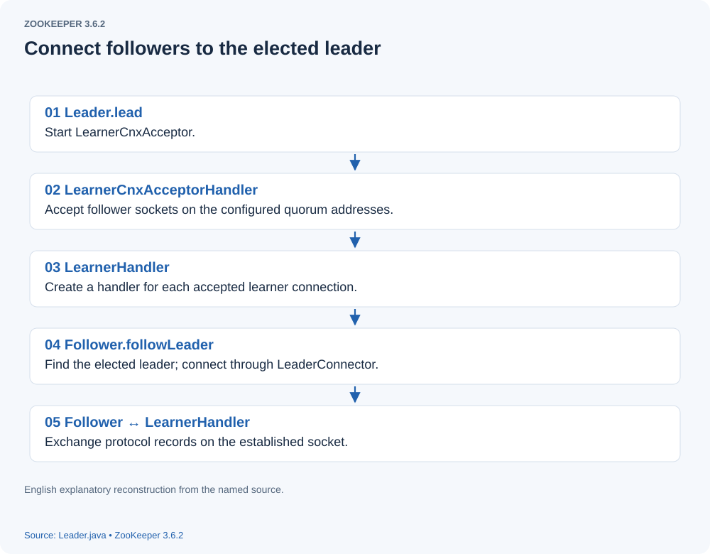
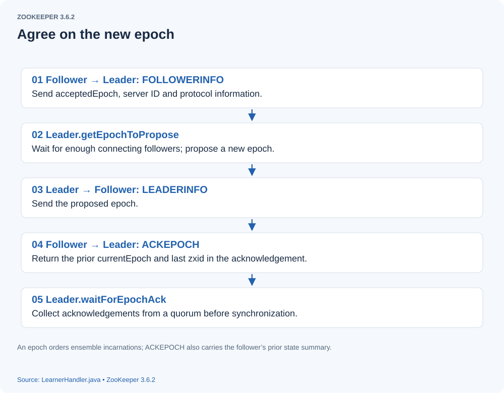
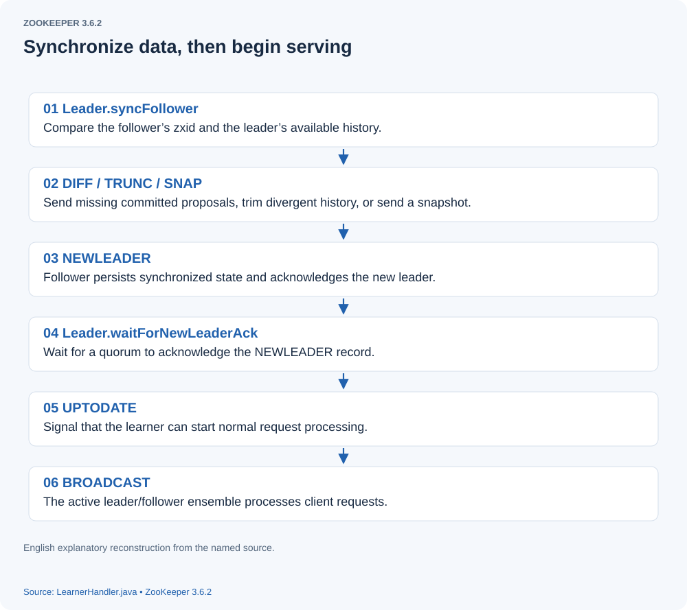

# How ZooKeeper Leaders and Followers Form an Ensemble

> **Source version.** This English edition checks the original analysis against ZooKeeper 3.6.2, available in October 2020, pinned at commit `803c7f1a12f85978cb049af5e4ef23bd8b688715`. The annotated excerpts retain the original selection and executable logic; ellipses mark omissions and are not complete compilable methods. The English figures reconstruct relationships from this pinned code; they are explanatory diagrams, not recovered debugger screenshots. 

## Before we begin
[Following ZooKeeper Fast Leader Election](leader-election.html) examined the election process in detail. This article follows what happens next: the initialization of the leader and its followers.

## Initialization diagrams
After a leader is elected, the leader and followers form a quorum and synchronize their data. This includes the following stages.
### 1. Establish connections
The leader starts `LearnerCnxAcceptorHandler` to accept follower connections on the quorum port: the first of the two server ports configured in `zoo.cfg`.
[](assets/leader-follower-initialization-01.svg)
### Agree on a new epoch
The newly formed ensemble needs a new epoch identifying its new leadership period, so the peers can agree on the generation in which they are working.
[](assets/leader-follower-initialization-02.svg)

### Synchronize data
After agreeing on a new epoch, the peers synchronize their data. Once synchronization and the new-leader quorum acknowledgment are complete, the follower and leader request processing engines start and the ensemble can serve clients. **Protocol clarification:** epoch acknowledgment (`ACKEPOCH`) and acknowledgment of the synchronized `NEWLEADER` are separate barriers; `LEADERINFO` alone does not make the server ready to serve. The diagrams reconstruct the handshake from the pinned [`Leader`](https://github.com/apache/zookeeper/blob/803c7f1a12f85978cb049af5e4ef23bd8b688715/zookeeper-server/src/main/java/org/apache/zookeeper/server/quorum/Leader.java), [`Learner`](https://github.com/apache/zookeeper/blob/803c7f1a12f85978cb049af5e4ef23bd8b688715/zookeeper-server/src/main/java/org/apache/zookeeper/server/quorum/Learner.java), and [`LearnerHandler`](https://github.com/apache/zookeeper/blob/803c7f1a12f85978cb049af5e4ef23bd8b688715/zookeeper-server/src/main/java/org/apache/zookeeper/server/quorum/LearnerHandler.java).
[](assets/leader-follower-initialization-03.svg)
-----

Now let us follow the source code in detail.

#### Leader
After voting successfully elects a leader, the corresponding `QuorumPeer` enters its `LEADING` branch.

```java


while (running) {
                switch (getPeerState()) {
                   case LOOKING:  .....
                   case FOLLOWING: .....
                   case OBSERVING: ......
                   case LEADING:
                       LOG.info("LEADING");
                      try {
                        // Create the Leader object.
                        setLeader(makeLeader(logFactory));
                       // Begin leading the ensemble.
                        leader.lead();
                        setLeader(null);
                        } catch (Exception e) {
                            LOG.warn("Unexpected exception", e);
                        } finally {
                            if (leader != null) {
                                leader.shutdown("Forcing shutdown");
                                setLeader(null);
                            }
                            updateServerState();
                        }
                        break;
                }

               }

       }

```

## QuorumPeer creates the Leader
`Leader` extends `LearnerMaster`. It has many fields; rather than listing them all here, we will explain each relevant field when we encounter it.

##### new Leader

```java

// LeaderZooKeeperServer extends ZooKeeperServer and represents the server in its leader role.
public Leader(QuorumPeer self, LeaderZooKeeperServer zk) throws IOException {
        this.self = self;
        this.proposalStats = new BufferStats();
        // Obtain the leader's configured quorum listening addresses.
        Set<InetSocketAddress> addresses;
        if (self.getQuorumListenOnAllIPs()) {
            addresses = self.getQuorumAddress().getWildcardAddresses();
        } else {
            addresses = self.getQuorumAddress().getAllAddresses();
        }

        addresses.stream()
          .map(address -> createServerSocket(address, self.shouldUsePortUnification(), self.isSslQuorum()))
          .filter(Optional::isPresent)
          .map(Optional::get)
          .forEach(serverSockets::add);

        if (serverSockets.isEmpty()) {
            throw new IOException("Leader failed to initialize any of the following sockets: " + addresses);
        }

        this.zk = zk;
    }

```


##### new  LeaderZooKeeperServer
Creating `LeaderZooKeeperServer` ultimately initializes `ZooKeeperServer`. The following constructor was explained in [How a Standalone ZooKeeper Server Starts](standalone-server-startup.html), so we will not repeat that analysis here.

```java

 public ZooKeeperServer(FileTxnSnapLog txnLogFactory, int tickTime, int minSessionTimeout, int maxSessionTimeout, int clientPortListenBacklog, ZKDatabase zkDb, String initialConfig, boolean reconfigEnabled) {
        serverStats = new ServerStats(this);
        this.txnLogFactory = txnLogFactory;
        this.txnLogFactory.setServerStats(this.serverStats);
        this.zkDb = zkDb;
        this.tickTime = tickTime;
        setMinSessionTimeout(minSessionTimeout);
        setMaxSessionTimeout(maxSessionTimeout);
        this.listenBacklog = clientPortListenBacklog;
        this.reconfigEnabled = reconfigEnabled;

        listener = new ZooKeeperServerListenerImpl(this);

        readResponseCache = new ResponseCache(Integer.getInteger(
            GET_DATA_RESPONSE_CACHE_SIZE,
            ResponseCache.DEFAULT_RESPONSE_CACHE_SIZE));

        getChildrenResponseCache = new ResponseCache(Integer.getInteger(
            GET_CHILDREN_RESPONSE_CACHE_SIZE,
            ResponseCache.DEFAULT_RESPONSE_CACHE_SIZE));

        this.initialConfig = initialConfig;

        this.requestPathMetricsCollector = new RequestPathMetricsCollector();

        this.initLargeRequestThrottlingSettings();

        LOG.info(
            "Created server with"
                + " tickTime {}"
                + " minSessionTimeout {}"
                + " maxSessionTimeout {}"
                + " clientPortListenBacklog {}"
                + " datadir {}"
                + " snapdir {}",
            tickTime,
            getMinSessionTimeout(),
            getMaxSessionTimeout(),
            getClientPortListenBacklog(),
            txnLogFactory.getDataDir(),
            txnLogFactory.getSnapDir());
    }

```

We will return to `LeaderZooKeeperServer` when discussing the leader's request processing chain; for now, leave that part aside.
##### Leader.lead
Once created, `Leader` enters its leadership routine through `lead`. This method is long, so we will inspect it in stages, starting with its first section.

```java

            // Set the ZAB state to DISCOVERY.
           self.setZabState(QuorumPeer.ZabState.DISCOVERY);
            self.tick.set(0);
           // Load local data. Normally election startup has already loaded the database; this call takes a local snapshot.
            zk.loadData();
            
            leaderStateSummary = new StateSummary(self.getCurrentEpoch(), zk.getLastProcessedZxid());

            // Start thread that waits for connection requests from
            // new followers.
           // Create the acceptor manager thread, which starts LearnerCnxAcceptorHandlers to accept follower connections.
            cnxAcceptor = new LearnerCnxAcceptor();
            cnxAcceptor.start();
            // Wait for a quorum of voting participants, including the leader itself, and propose a new epoch.
            long epoch = getEpochToPropose(self.getId(), self.getAcceptedEpoch());

```

##### LearnerCnxAcceptor
`lead` creates `LearnerCnxAcceptor`. Let us examine its `run` implementation.

```java

 public void run() {
            if (!stop.get() && !serverSockets.isEmpty()) {
                ExecutorService executor = Executors.newFixedThreadPool(serverSockets.size());
                CountDownLatch latch = new CountDownLatch(serverSockets.size());
                 // Create a LearnerCnxAcceptorHandler for each bound listening socket.
                serverSockets.forEach(serverSocket ->
                        executor.submit(new LearnerCnxAcceptorHandler(serverSocket, latch)));

                try {
                    latch.await();
                } catch (InterruptedException ie) {
                    LOG.error("Interrupted while sleeping in LearnerCnxAcceptor.", ie);
                } finally {
                    closeSockets();
                    executor.shutdown();
                    try {
                        if (!executor.awaitTermination(1, TimeUnit.SECONDS)) {
                            LOG.error("not all the LearnerCnxAcceptorHandler terminated properly");
                        }
                    } catch (InterruptedException ie) {
                        LOG.error("Interrupted while terminating LearnerCnxAcceptor.", ie);
                    }
                }
            }
        }

```


##### LearnerCnxAcceptorHandler
This handler accepts follower connection requests on the leader.
Let us inspect `LearnerCnxAcceptorHandler.run`.

```java

public void run() {
                try {
                    Thread.currentThread().setName("LearnerCnxAcceptorHandler-" + serverSocket.getLocalSocketAddress());

                    while (!stop.get()) {
                       // acceptConnections accepts followers on the leader's ServerSocket.
                        acceptConnections();
                    }
                } catch (Exception e) {
                    LOG.warn("Exception while accepting follower", e);
                    if (fail.compareAndSet(false, true)) {
                        handleException(getName(), e);
                        halt();
                    }
                } finally {
                    latch.countDown();
                }
            }

```

##### LearnerCnxAcceptorHandler.acceptConnections

```java

  private void acceptConnections() throws IOException {
                Socket socket = null;
                boolean error = false;
                try {
                  // Accept a follower's socket connection.
                    socket = serverSocket.accept();

                    // start with the initLimit, once the ack is processed
                    // in LearnerHandler switch to the syncLimit
                    // Set the initial socket timeout.
                    socket.setSoTimeout(self.tickTime * self.initLimit);
                    socket.setTcpNoDelay(nodelay);

                    BufferedInputStream is = new BufferedInputStream(socket.getInputStream());
                    // Create a LearnerHandler thread representing this learner and processing its messages.
                    LearnerHandler fh = new LearnerHandler(socket, is, Leader.this);
                    fh.start();
                } catch (SocketException e) {
                    error = true;
                    if (stop.get()) {
                        LOG.warn("Exception while shutting down acceptor.", e);
                    } else {
                        throw e;
                    }
                } catch (SaslException e) {
                    LOG.error("Exception while connecting to quorum learner", e);
                    error = true;
                } catch (Exception e) {
                    error = true;
                    throw e;
                } finally {
                    // Don't leak sockets on errors
                    if (error && socket != null && !socket.isClosed()) {
                        try {
                            socket.close();
                        } catch (IOException e) {
                            LOG.warn("Error closing socket: " + socket, e);
                        }
                    }
                }
            }

```

### LearnerHandler represents a follower on the leader
We will defer its detailed explanation until we have introduced the follower's side of the handshake.


#### Follower
So far we have examined part of leader initialization. Continuing requires the follower's actions to make the handshake clear, so we will now move to follower initialization.
After a leader is elected, the remaining voting servers become followers and enter `followLeader` (observers are outside this article's main path). Here is the `FOLLOWING` branch in a follower's `QuorumPeer`:

```java


                case FOLLOWING:
                    try {
                        LOG.info("FOLLOWING");
                        setFollower(makeFollower(logFactory));
                        follower.followLeader();
                    } catch (Exception e) {
                        LOG.warn("Unexpected exception", e);
                    } finally {
                        follower.shutdown();
                        setFollower(null);
                        updateServerState();
                    }
                    break;

```

### Create the Follower
Creating a `Follower` first creates a `FollowerZooKeeperServer`. This class extends `ZooKeeperServer` and represents the follower's server instance, with its own request processing chain. We will explain that chain when discussing request processing.

```java

       new Follower(this, new FollowerZooKeeperServer(logFactory, this, this.zkDb));

```


##### follower.followLeader
After creating the `Follower` instance, `followLeader` starts its interaction with the leader.

```java

 void followLeader() throws InterruptedException {
        self.end_fle = Time.currentElapsedTime();
        long electionTimeTaken = self.end_fle - self.start_fle;
        self.setElectionTimeTaken(electionTimeTaken);
        ServerMetrics.getMetrics().ELECTION_TIME.add(electionTimeTaken);
        LOG.info("FOLLOWING - LEADER ELECTION TOOK - {} {}", electionTimeTaken, QuorumPeer.FLE_TIME_UNIT);
        self.start_fle = 0;
        self.end_fle = 0;
        fzk.registerJMX(new FollowerBean(this, zk), self.jmxLocalPeerBean);

        long connectionTime = 0;
        boolean completedSync = false;

        try {
            // Change the ZAB state from election to DISCOVERY.
            self.setZabState(QuorumPeer.ZabState.DISCOVERY);
           // Find the leader from the election result.
            QuorumServer leaderServer = findLeader();
            try {
                 // Establish a socket connection to the leader.
                connectToLeader(leaderServer.addr, leaderServer.hostname);
                connectionTime = System.currentTimeMillis();
                 // Register with the leader and obtain its proposed new epoch. Synchronization and NEWLEADER acknowledgment are still required before serving clients.
                long newEpochZxid = registerWithLeader(Leader.FOLLOWERINFO);
                if (self.isReconfigStateChange()) {
                    throw new Exception("learned about role change");
                }
                //check to see if the leader zxid is lower than ours
                //this should never happen but is just a safety check
                long newEpoch = ZxidUtils.getEpochFromZxid(newEpochZxid);
                if (newEpoch < self.getAcceptedEpoch()) {
                    LOG.error("Proposed leader epoch "
                              + ZxidUtils.zxidToString(newEpochZxid)
                              + " is less than our accepted epoch "
                              + ZxidUtils.zxidToString(self.getAcceptedEpoch()));
                    throw new IOException("Error: Epoch of leader is lower");
                }
                long startTime = Time.currentElapsedTime();
                try {
                     // Record the leader's address and sid on the follower.
                    self.setLeaderAddressAndId(leaderServer.addr, leaderServer.getId());
                  // Change the ZAB state to SYNCHRONIZATION.
                    self.setZabState(QuorumPeer.ZabState.SYNCHRONIZATION);
                   // Synchronize data with the leader.
                    syncWithLeader(newEpochZxid);
                // After synchronization completes, enter ZAB's BROADCAST phase and begin normal operation.
                    self.setZabState(QuorumPeer.ZabState.BROADCAST);
                    completedSync = true;
                } finally {
                    long syncTime = Time.currentElapsedTime() - startTime;
                    ServerMetrics.getMetrics().FOLLOWER_SYNC_TIME.add(syncTime);
                }
                if (self.getObserverMasterPort() > 0) {
                    LOG.info("Starting ObserverMaster");

                    om = new ObserverMaster(self, fzk, self.getObserverMasterPort());
                    om.start();
                } else {
                    om = null;
                }
                // create a reusable packet to reduce gc impact todo: at this point follower is ready to serve
                QuorumPacket qp = new QuorumPacket();
                // The follower then enters a loop receiving and processing messages from the leader.
                while (this.isRunning()) {
                     // Receive a message from the leader.
                    readPacket(qp);
                   // Process the message; we will discuss message handling later.
                    processPacket(qp);
                }
            } catch (Exception e) {
                LOG.warn("Exception when following the leader", e);
                closeSocket();

                // clear pending revalidations
                pendingRevalidations.clear();
            }
        } finally {
            if (om != null) {
                om.stop();
            }
            zk.unregisterJMX(this);

            if (connectionTime != 0) {
                long connectionDuration = System.currentTimeMillis() - connectionTime;
                LOG.info(
                    "Disconnected from leader (with address: {}). Was connected for {}ms. Sync state: {}",
                    leaderAddr,
                    connectionDuration,
                    completedSync);
                messageTracker.dumpToLog(leaderAddr.toString());
            }
        }
    }

```


##### connectToLeader
Let us read how the follower connects to the leader.

```java


 protected void connectToLeader(MultipleAddresses multiAddr, String hostname) throws IOException {

        this.leaderAddr = multiAddr;
        Set<InetSocketAddress> addresses;
        if (self.isMultiAddressReachabilityCheckEnabled()) {
            // even if none of the addresses are reachable, we want to try to establish connection
            // see ZOOKEEPER-3758
            addresses = multiAddr.getAllReachableAddressesOrAll();
        } else {
            addresses = multiAddr.getAllAddresses();
        }
        ExecutorService executor = Executors.newFixedThreadPool(addresses.size());
        CountDownLatch latch = new CountDownLatch(addresses.size());
        AtomicReference<Socket> socket = new AtomicReference<>(null);
       // Create a LeaderConnector for each configured leader address; these tasks establish the leader socket connection.
        addresses.stream().map(address -> new LeaderConnector(address, socket, latch)).forEach(executor::submit);

        try {
            latch.await();
        } catch (InterruptedException e) {
            LOG.warn("Interrupted while trying to connect to Leader", e);
        } finally {
            executor.shutdown();
            try {
                if (!executor.awaitTermination(1, TimeUnit.SECONDS)) {
                    LOG.error("not all the LeaderConnector terminated properly");
                }
            } catch (InterruptedException ie) {
                LOG.error("Interrupted while terminating LeaderConnector executor.", ie);
            }
        }

        if (socket.get() == null) {
            throw new IOException("Failed connect to " + multiAddr);
        } else {
            sock = socket.get();
        }

        self.authLearner.authenticate(sock, hostname);
        // LeaderConnector has established the socket connection to the leader.
        // leaderIs wraps the leader socket's input stream.
        leaderIs = BinaryInputArchive.getArchive(new BufferedInputStream(sock.getInputStream()));
        bufferedOutput = new BufferedOutputStream(sock.getOutputStream());
        // leaderOs wraps the leader socket's output stream.
        leaderOs = BinaryOutputArchive.getArchive(bufferedOutput);
    }

```

##### LeaderConnector
`LeaderConnector` is a runnable task whose job is to establish the follower's connection to the leader. Once the connection attempt is complete, that task ends. The implementation is straightforward and is not expanded further in the original article.


##### Follower.registerWithLeader
The follower registers its information with the leader.

```java

 protected long registerWithLeader(int pktType) throws IOException {
        /*
         * Send follower info, including last zxid and sid
         */
        // Read the follower's last logged transaction ID from the database.
        long lastLoggedZxid = self.getLastLoggedZxid();
         // QuorumPacket is the serialized message container used between leader and follower.
        QuorumPacket qp = new QuorumPacket();
        qp.setType(pktType);
        qp.setZxid(ZxidUtils.makeZxid(self.getAcceptedEpoch(), 0));

        /*
         * Add sid to payload
         */
        // LearnerInfo describes this follower.
        LearnerInfo li = new LearnerInfo(self.getId(), 0x10000, self.getQuorumVerifier().getVersion());
        ByteArrayOutputStream bsid = new ByteArrayOutputStream();
        BinaryOutputArchive boa = BinaryOutputArchive.getArchive(bsid);
         // Serialize sid, protocolVersion, and the quorum verifier's version into the QuorumPacket data field.
        boa.writeRecord(li, "LearnerInfo");
        qp.setData(bsid.toByteArray());
        // Send QuorumPacket to the leader through the socket.
        writePacket(qp, true);
        // Wait for the leader's reply carrying the proposed new epoch.
        readPacket(qp);
        // Extract the proposed epoch from the leader's reply zxid.
        final long newEpoch = ZxidUtils.getEpochFromZxid(qp.getZxid());
        if (qp.getType() == Leader.LEADERINFO) {
            // we are connected to a 1.0 server so accept the new epoch and read the next packet
            leaderProtocolVersion = ByteBuffer.wrap(qp.getData()).getInt();
            byte[] epochBytes = new byte[4];
            final ByteBuffer wrappedEpochBytes = ByteBuffer.wrap(epochBytes);
            if (newEpoch > self.getAcceptedEpoch()) {
                // Persist the newer epoch in this peer's acceptedEpoch file.
                wrappedEpochBytes.putInt((int) self.getCurrentEpoch());
                self.setAcceptedEpoch(newEpoch);
            } else if (newEpoch == self.getAcceptedEpoch()) {
                  // If the proposed epoch equals acceptedEpoch, do not advance acceptedEpoch; signal the equal-epoch case with currentEpoch = -1.
                // since we have already acked an epoch equal to the leaders, we cannot ack
                // again, but we still need to send our lastZxid to the leader so that we can
                // sync with it if it does assume leadership of the epoch.
                // the -1 indicates that this reply should not count as an ack for the new epoch
                wrappedEpochBytes.putInt(-1);
            } else {
                // If this peer's acceptedEpoch exceeds the proposed epoch, reject the stale leader epoch.
                throw new IOException("Leaders epoch, "
                                      + newEpoch
                                      + " is less than accepted epoch, "
                                      + self.getAcceptedEpoch());
            }
            // Acknowledge the proposed epoch to the leader, including lastLoggedZxid and currentEpoch.
            QuorumPacket ackNewEpoch = new QuorumPacket(Leader.ACKEPOCH, lastLoggedZxid, epochBytes, null);
            writePacket(ackNewEpoch, true);
            return ZxidUtils.makeZxid(newEpoch, 0);
        } else {
            if (newEpoch > self.getAcceptedEpoch()) {
                self.setAcceptedEpoch(newEpoch);
            }
            if (qp.getType() != Leader.NEWLEADER) {
                LOG.error("First packet should have been NEWLEADER");
                throw new IOException("First packet should have been NEWLEADER");
            }
            return qp.getZxid();
        }
    }

```

----
## Pause at the message exchange: how the leader responds
----
Earlier we saw the leader create a `LearnerHandler` thread to handle a follower's requests. Now let us examine `LearnerHandler.run`.
##### LearnerHandler.run
`LearnerHandler` handles all communication with this learner. The method is long, so we will split it into stages. The first stage receives the epoch and identification information sent by the follower.

```java

 public void run() {
        try {
            // Add this LearnerHandler to LearnerMaster's learner set.
            learnerMaster.addLearnerHandler(this);
            tickOfNextAckDeadline = learnerMaster.getTickOfInitialAckDeadline();
           // Initialize the input and output archives and buffered streams.
            ia = BinaryInputArchive.getArchive(bufferedInput);
            bufferedOutput = new BufferedOutputStream(sock.getOutputStream());
            oa = BinaryOutputArchive.getArchive(bufferedOutput);

            QuorumPacket qp = new QuorumPacket();
            // Read the follower's first packet, containing its accepted epoch in the zxid.
            ia.readRecord(qp, "packet");

            messageTracker.trackReceived(qp.getType());
            if (qp.getType() != Leader.FOLLOWERINFO && qp.getType() != Leader.OBSERVERINFO) {
                LOG.error("First packet {} is not FOLLOWERINFO or OBSERVERINFO!", qp.toString());

                return;
            }

            if (learnerMaster instanceof ObserverMaster && qp.getType() != Leader.OBSERVERINFO) {
                throw new IOException("Non observer attempting to connect to ObserverMaster. type = " + qp.getType());
            }
            // Read the packet's data payload.
            byte[] learnerInfoData = qp.getData();
            if (learnerInfoData != null) {
                ByteBuffer bbsid = ByteBuffer.wrap(learnerInfoData);
                if (learnerInfoData.length >= 8) {
                    // Extract the follower's sid from the payload.
                    this.sid = bbsid.getLong();
                }
                if (learnerInfoData.length >= 12) {
                     // Extract protocolVersion.
                    this.version = bbsid.getInt(); // protocolVersion
                }
                if (learnerInfoData.length >= 20) {
                     // Extract configVersion.
                    long configVersion = bbsid.getLong();
                    if (configVersion > learnerMaster.getQuorumVerifierVersion()) {
                        throw new IOException("Follower is ahead of the leader (has a later activated configuration)");
                    }
                }
            } else {
                this.sid = learnerMaster.getAndDecrementFollowerCounter();
            }
           // Resolve the follower's configured addresses and ports using sid.
            String followerInfo = learnerMaster.getPeerInfo(this.sid);
            if (followerInfo.isEmpty()) {
                LOG.info(
                    "Follower sid: {} not in the current config {}",
                    this.sid,
                    Long.toHexString(learnerMaster.getQuorumVerifierVersion()));
            } else {
                LOG.info("Follower sid: {} : info : {}", this.sid, followerInfo);
            }

            if (qp.getType() == Leader.OBSERVERINFO) {
                learnerType = LearnerType.OBSERVER;
            }

            learnerMaster.registerLearnerHandlerBean(this, sock);
              // getEpochFromZxid extracts the epoch sent by the learner.
            long lastAcceptedEpoch = ZxidUtils.getEpochFromZxid(qp.getZxid());
       long peerLastZxid;
            StateSummary ss = null;
            long zxid = qp.getZxid();
           // The leader's QuorumPeer thread is also waiting in getEpochToPropose until a quorum of participants has connected.
          // Each eligible follower contributes its sid and accepted epoch. With a quorum including the leader, waiting threads resume and obtain a proposed epoch greater than the accepted epochs seen.
            long newEpoch = learnerMaster.getEpochToPropose(this.getSid(), lastAcceptedEpoch);

```

The second section sends the proposed new epoch to the follower.

```java

           // Construct the leader's new epoch zxid.
          long newLeaderZxid = ZxidUtils.makeZxid(newEpoch, 0);

            if (this.getVersion() < 0x10000) {
                // we are going to have to extrapolate the epoch information
                long epoch = ZxidUtils.getEpochFromZxid(zxid);
                ss = new StateSummary(epoch, zxid);
                // fake the message
                learnerMaster.waitForEpochAck(this.getSid(), ss);
            } else {
                byte[] ver = new byte[4];
                ByteBuffer.wrap(ver).putInt(0x10000);
                 // Create LEADERINFO carrying the new epoch zxid and protocol version.
                QuorumPacket newEpochPacket = new QuorumPacket(Leader.LEADERINFO, newLeaderZxid, ver, null);
               // Write the packet to the socket and flush it.
                oa.writeRecord(newEpochPacket, "packet");
                messageTracker.trackSent(Leader.LEADERINFO);
                bufferedOutput.flush();
               // Read the follower's ACKEPOCH reply.
                QuorumPacket ackEpochPacket = new QuorumPacket();
                ia.readRecord(ackEpochPacket, "packet");
                messageTracker.trackReceived(ackEpochPacket.getType());
                if (ackEpochPacket.getType() != Leader.ACKEPOCH) {
                    LOG.error("{} is not ACKEPOCH", ackEpochPacket.toString());
                    return;
                }

```


Now return to `Leader.lead`. What happens when its main thread returns from `getEpochToPropose`?

```java

            // Obtain the newly proposed epoch.
            long epoch = getEpochToPropose(self.getId(), self.getAcceptedEpoch());
            
             // Create the initial zxid for that epoch.
            zk.setZxid(ZxidUtils.makeZxid(epoch, 0));

            synchronized (this) {
                lastProposed = zk.getZxid();
            }
             // Create a NEWLEADER proposal declaring this leader and its initial epoch zxid.
            newLeaderProposal.packet = new QuorumPacket(NEWLEADER, zk.getZxid(), null, null);

            if ((newLeaderProposal.packet.getZxid() & 0xffffffffL) != 0) {
                LOG.info("NEWLEADER proposal has Zxid of {}", Long.toHexString(newLeaderProposal.packet.getZxid()));
            }

            QuorumVerifier lastSeenQV = self.getLastSeenQuorumVerifier();
            QuorumVerifier curQV = self.getQuorumVerifier();
            if (curQV.getVersion() == 0 && curQV.getVersion() == lastSeenQV.getVersion()) {
               
                try {
                    LOG.debug(String.format("set lastSeenQuorumVerifier to currentQuorumVerifier (%s)", curQV.toString()));
                    QuorumVerifier newQV = self.configFromString(curQV.toString());
                    newQV.setVersion(zk.getZxid());
                    self.setLastSeenQuorumVerifier(newQV, true);
                } catch (Exception e) {
                    throw new IOException(e);
                }
            }

            newLeaderProposal.addQuorumVerifier(self.getQuorumVerifier());
            if (self.getLastSeenQuorumVerifier().getVersion() > self.getQuorumVerifier().getVersion()) {
                newLeaderProposal.addQuorumVerifier(self.getLastSeenQuorumVerifier());
            }

           // Wait for a quorum of participants to acknowledge the new epoch.
            waitForEpochAck(self.getId(), leaderStateSummary);

```

At this point, the leader is waiting for the configured quorum to acknowledge the proposed epoch.

Back in `LearnerHandler`, what happens after it receives the follower's epoch acknowledgment?

```java

 ByteBuffer bbepoch = ByteBuffer.wrap(ackEpochPacket.getData());
 ss = new StateSummary(bbepoch.getInt(), ackEpochPacket.getZxid());
 // On receiving ACKEPOCH, call the leader's waitForEpochAck with the follower's state summary.
    learnerMaster.waitForEpochAck(this.getSid(), ss);

```


##### waitForEpochAck
`waitForEpochAck` checks whether a quorum of participants has acknowledged the epoch. It also checks the learner's state summary against the leader's state. With a quorum, the discovery phase completes; the subsequent synchronization and `NEWLEADER` barrier still remain. This distinction corrects the original article's description of epoch acknowledgment as completing all of election and formation.

```java

 public void waitForEpochAck(long id, StateSummary ss) throws IOException, InterruptedException {
    // electingFollowers holds the IDs of participants that have acknowledged this epoch.
        synchronized (electingFollowers) {
            if (electionFinished) {
                return;
            }
            if (ss.getCurrentEpoch() != -1) {
                if (ss.isMoreRecentThan(leaderStateSummary)) {
                    throw new IOException("Follower is ahead of the leader, leader summary: "
                                          + leaderStateSummary.getCurrentEpoch()
                                          + " (current epoch), "
                                          + leaderStateSummary.getLastZxid()
                                          + " (last zxid)");
                }
                if (ss.getLastZxid() != -1 && isParticipant(id)) {
                    electingFollowers.add(id);
                }
            }
            QuorumVerifier verifier = self.getQuorumVerifier();
             // A quorum has acknowledged the epoch, completing the epoch agreement barrier.
            if (electingFollowers.contains(self.getId()) && verifier.containsQuorum(electingFollowers)) {
                electionFinished = true;
                electingFollowers.notifyAll();
            } else {
              // Without a quorum, wait for further acknowledgments until the initialization timeout.
                long start = Time.currentElapsedTime();
                long cur = start;
                long end = start + self.getInitLimit() * self.getTickTime();
                while (!electionFinished && cur < end) {
                    electingFollowers.wait(end - cur);
                    cur = Time.currentElapsedTime();
                }
                if (!electionFinished) {
                    throw new InterruptedException("Timeout while waiting for epoch to be acked by quorum");
                }
            }
        }
    }

```


----
After sending its epoch acknowledgment, the follower proceeds to ZAB synchronization. Let us inspect `Learner.syncWithLeader`; again, we will break this long method into sections.

```java


  protected void syncWithLeader(long newLeaderZxid) throws Exception {
          // Prepare an ACK packet for the leader's initial epoch zxid; it will be used in the synchronization protocol.
        QuorumPacket ack = new QuorumPacket(Leader.ACK, 0, null, null);
        QuorumPacket qp = new QuorumPacket();
        long newEpoch = ZxidUtils.getEpochFromZxid(newLeaderZxid);

        QuorumVerifier newLeaderQV = null;

        // In the DIFF case we don't need to do a snapshot because the transactions will sync on top of any existing snapshot
        // For SNAP and TRUNC the snapshot is needed to save that history
        boolean snapshotNeeded = true;
        boolean syncSnapshot = false;
       // Read the leader's synchronization instruction.
        readPacket(qp);

```


Back on the leader, once the epoch has quorum agreement, `LearnerHandler` calls `syncFollower`.
##### LearnerHandler syncFollower
`syncFollower` compares the follower's zxid with the leader's committed history to choose how to synchronize the follower's data.

```java

boolean syncFollower(long peerLastZxid, LearnerMaster learnerMaster) {
        /*
         * When leader election is completed, the leader will set its
         * lastProcessedZxid to be (epoch < 32). There will be no txn associated
         * with this zxid.
         *
         * The learner will set its lastProcessedZxid to the same value if
         * it get DIFF or SNAP from the learnerMaster. If the same learner come
         * back to sync with learnerMaster using this zxid, we will never find this
         * zxid in our history. In this case, we will ignore TRUNC logic and
         * always send DIFF if we have old enough history
         */
        boolean isPeerNewEpochZxid = (peerLastZxid & 0xffffffffL) == 0;
        // Keep track of the latest zxid which already queued
        long currentZxid = peerLastZxid;
        boolean needSnap = true;
       // Obtain the leader's ZooKeeper database.
        ZKDatabase db = learnerMaster.getZKDatabase();
        boolean txnLogSyncEnabled = db.isTxnLogSyncEnabled();
        ReentrantReadWriteLock lock = db.getLogLock();
        ReadLock rl = lock.readLock();
        try {
            rl.lock();
             // The greatest zxid in the leader's in-memory committed log.
            long maxCommittedLog = db.getmaxCommittedLog();
             // The smallest zxid in the leader's in-memory committed log.
            long minCommittedLog = db.getminCommittedLog();

            // The last zxid applied to the leader's database.
            // The original commentary interpreted maxCommittedLog > lastProcessedZxid as an unacknowledged transaction;
           // the source treats these as distinct committed-log and database watermarks. Do not infer acknowledgment state from their comparison alone.
            long lastProcessedZxid = db.getDataTreeLastProcessedZxid();

            LOG.info("Synchronizing with Learner sid: {} maxCommittedLog=0x{}"
                     + " minCommittedLog=0x{} lastProcessedZxid=0x{}"
                     + " peerLastZxid=0x{}",
                     getSid(),
                     Long.toHexString(maxCommittedLog),
                     Long.toHexString(minCommittedLog),
                     Long.toHexString(lastProcessedZxid),
                     Long.toHexString(peerLastZxid));

            if (db.getCommittedLog().isEmpty()) {
                /*
                 * It is possible that committedLog is empty. In that case
                 * setting these value to the latest txn in learnerMaster db
                 * will reduce the case that we need to handle
                 *
                 * Here is how each case handle by the if block below
                 * 1. lastProcessZxid == peerZxid -> Handle by (2)
                 * 2. lastProcessZxid < peerZxid -> Handle by (3)
                 * 3. lastProcessZxid > peerZxid -> Handle by (5)
                 */
                minCommittedLog = lastProcessedZxid;
                maxCommittedLog = lastProcessedZxid;
            }

            /*
            * The source comment below outlines the synchronization strategies handled by syncFollower.
             * Here are the cases that we want to handle
             *
             * 1. Force sending snapshot (for testing purpose)
             // If follower and leader zxids already match, send DIFF with no missing history to replay.
             * 2. Peer and learnerMaster is already sync, send empty diff          
              // If the follower is ahead of the leader's committed log, send TRUNC to discard its divergent suffix.
             // A new-epoch marker has counter zero and is handled specially; do not truncate solely because that marker is numerically larger.
             * 3. Follower has txn that we haven't seen. This may be old leader
             *    so we need to send TRUNC. However, if peer has newEpochZxid,
             *    we cannot send TRUNC since the follower has no txnlog
              // If the follower's zxid is within the leader's committed-log range, synchronize with DIFF.
             * 4. Follower is within committedLog range or already in-sync.
             *    We may need to send DIFF or TRUNC depending on follower's zxid
             *    We always send empty DIFF if follower is already in-sync
              // If the follower is behind the oldest in-memory entry, try the disk transaction log plus the in-memory committed log.
             // If the required history cannot be supplied, fall back to a SNAP transfer.
             * 5. Follower missed the committedLog. We will try to use on-disk
             *    txnlog + committedLog to sync with follower. If that fail,
             *    we will send snapshot
             */
         // Now examine these follower synchronization cases in the implementation.

            if (forceSnapSync) {
                // Force learnerMaster to use snapshot to sync with follower
                LOG.warn("Forcing snapshot sync - should not see this in production");
            } else if (lastProcessedZxid == peerLastZxid) {
                // Follower is already sync with us, send empty diff
                // If the follower's zxid equals lastProcessedZxid, queue DIFF; no missing committed transactions need replay.
                LOG.info(
                    "Sending DIFF zxid=0x{} for peer sid: {}",
                    Long.toHexString(peerLastZxid),
                    getSid());
                queueOpPacket(Leader.DIFF, peerLastZxid);
                needOpPacket = false;
                needSnap = false;
            } else if (peerLastZxid > maxCommittedLog && !isPeerNewEpochZxid) {
               // If the follower is ahead of maxCommittedLog, queue TRUNC,
              // instructing it to discard its extra transactions and retain history only through maxCommittedLog.
                // Newer than committedLog, send trunc and done
                LOG.debug(
                    "Sending TRUNC to follower zxidToSend=0x{} for peer sid:{}",
                    Long.toHexString(maxCommittedLog),
                    getSid());
                queueOpPacket(Leader.TRUNC, maxCommittedLog);
                currentZxid = maxCommittedLog;
                needOpPacket = false;
                needSnap = false;
            } else if ((maxCommittedLog >= peerLastZxid) && (minCommittedLog <= peerLastZxid)) {
                // If the follower's zxid is between minCommittedLog and maxCommittedLog, queue transactions in (peerLastZxid, maxCommittedLog] for synchronization.
                // Follower is within commitLog range
                LOG.info("Using committedLog for peer sid: {}", getSid());
                Iterator<Proposal> itr = db.getCommittedLog().iterator();
                // Queue the committed proposals missing on the follower.
                currentZxid = queueCommittedProposals(itr, peerLastZxid, null, maxCommittedLog);
                needSnap = false;
            } else if (peerLastZxid < minCommittedLog && txnLogSyncEnabled) {
                // Use txnlog and committedLog to sync
               // If the follower is older than minCommittedLog, it may need transactions from both disk and memory in (peerLastZxid, maxCommittedLog].
            // The in-memory committedLog covers [minCommittedLog, maxCommittedLog]; earlier required transactions must come from the disk log.

                // Calculate sizeLimit that we allow to retrieve txnlog from disk
                long sizeLimit = db.calculateTxnLogSizeLimit();
                // This method can return empty iterator if the requested zxid
                // is older than on-disk txnlog
              // Obtain a disk proposal iterator using the follower's zxid and the size limit.
                Iterator<Proposal> txnLogItr = db.getProposalsFromTxnLog(peerLastZxid, sizeLimit);
                if (txnLogItr.hasNext()) {
                    LOG.info("Use txnlog and committedLog for peer sid: {}", getSid());
                    // Track the zxid reached by queuing disk proposals.
                    currentZxid = queueCommittedProposals(txnLogItr, peerLastZxid, minCommittedLog, maxCommittedLog);

                    if (currentZxid < minCommittedLog) {
                        // If the disk history cannot reach minCommittedLog, DIFF cannot bridge the gap; fall back to SNAP.
                        LOG.info(
                            "Detected gap between end of txnlog: 0x{} and start of committedLog: 0x{}",
                            Long.toHexString(currentZxid),
                            Long.toHexString(minCommittedLog));
                        currentZxid = peerLastZxid;
                        // Clear out currently queued requests and revert
                        // to sending a snapshot.
                        queuedPackets.clear();
                        needOpPacket = true;
                    } else {
                        LOG.debug("Queueing committedLog 0x{}", Long.toHexString(currentZxid));
               
                        Iterator<Proposal> committedLogItr = db.getCommittedLog().iterator();
         // queueCommittedProposals normally queues proposals newer than the follower's zxid.
         // It can also discover a divergent follower suffix and queue TRUNC; a matching boundary supports DIFF. Consult its explicit boundary and epoch checks rather than deciding from numeric zxid alone.
         // If history cannot bridge the follower's epoch boundary safely, synchronization falls back to a full SNAP transfer.
                        currentZxid = queueCommittedProposals(committedLogItr, currentZxid, null, maxCommittedLog);
                        needSnap = false;
                    }
                }
                // closing the resources
                if (txnLogItr instanceof TxnLogProposalIterator) {
                    TxnLogProposalIterator txnProposalItr = (TxnLogProposalIterator) txnLogItr;
                    txnProposalItr.close();
                }
            } else {
                LOG.warn(
                    "Unhandled scenario for peer sid: {} maxCommittedLog=0x{}"
                        + " minCommittedLog=0x{} lastProcessedZxid=0x{}"
                        + " peerLastZxid=0x{} txnLogSyncEnabled={}",
                    getSid(),
                    Long.toHexString(maxCommittedLog),
                    Long.toHexString(minCommittedLog),
                    Long.toHexString(lastProcessedZxid),
                    Long.toHexString(peerLastZxid),
                    txnLogSyncEnabled);
            }
            if (needSnap) {
                currentZxid = db.getDataTreeLastProcessedZxid();
            }

            LOG.debug("Start forwarding 0x{} for peer sid: {}", Long.toHexString(currentZxid), getSid());
            leaderLastZxid = learnerMaster.startForwarding(this, currentZxid);
        } finally {
            rl.unlock();
        }

        if (needOpPacket && !needSnap) {
           // Fall back to SNAP for full database synchronization.
            // This should never happen, but we should fall back to sending
            // snapshot just in case.
            LOG.error("Unhandled scenario for peer sid: {} fall back to use snapshot",  getSid());
            needSnap = true;
        }
         // Return whether a snapshot transfer is required.
        return needSnap;
    }

```


Return to the main `LearnerHandler` thread. What happens after it determines whether snapshot synchronization is required?

```java

 // syncFollower returns whether the learner needs a snapshot transfer.
 // When needSnap is false, the necessary DIFF/TRUNC packets and replay proposals have already been queued in queuedPackets.
 boolean needSnap = syncFollower(peerLastZxid, learnerMaster);

            // syncs between followers and the leader are exempt from throttling because it
            // is importatnt to keep the state of quorum servers up-to-date. The exempted syncs
            // are counted as concurrent syncs though
             // Select snapshot or differential synchronization throttling. Voting followers are essential; observers are subject to admission limits.
            boolean exemptFromThrottle = getLearnerType() != LearnerType.OBSERVER;
            /* if we are not truncating or sending a diff just send a snapshot */
            if (needSnap) {
               // If needSnap is true, transfer a snapshot.
               // syncThrottler controls concurrent synchronization admissions.
                syncThrottler = learnerMaster.getLearnerSnapSyncThrottler();
                syncThrottler.beginSync(exemptFromThrottle);
                ServerMetrics.getMetrics().INFLIGHT_SNAP_COUNT.add(syncThrottler.getSyncInProgress());
                try {
                  // Read the leader's latest applied zxid.
                    long zxidToSend = learnerMaster.getZKDatabase().getDataTreeLastProcessedZxid();
                    // Send the SNAP synchronization instruction to the follower.
                    oa.writeRecord(new QuorumPacket(Leader.SNAP, zxidToSend, null, null), "packet");
                    messageTracker.trackSent(Leader.SNAP);
                    bufferedOutput.flush();

                    LOG.info(
                        "Sending snapshot last zxid of peer is 0x{}, zxid of leader is 0x{}, "
                            + "send zxid of db as 0x{}, {} concurrent snapshot sync, "
                            + "snapshot sync was {} from throttle",
                        Long.toHexString(peerLastZxid),
                        Long.toHexString(leaderLastZxid),
                        Long.toHexString(zxidToSend),
                        syncThrottler.getSyncInProgress(),
                        exemptFromThrottle ? "exempt" : "not exempt");
                    // Dump data to peer
                   // Serialize the leader's database snapshot to the follower.
                    learnerMaster.getZKDatabase().serializeSnapshot(oa);
                    oa.writeString("BenWasHere", "signature");
                    // Flush the serialized bytes to the network.
                    bufferedOutput.flush();
                } finally {
                    ServerMetrics.getMetrics().SNAP_COUNT.add(1);
                }
            } else {
                syncThrottler = learnerMaster.getLearnerDiffSyncThrottler();
                syncThrottler.beginSync(exemptFromThrottle);
                ServerMetrics.getMetrics().INFLIGHT_DIFF_COUNT.add(syncThrottler.getSyncInProgress());
                ServerMetrics.getMetrics().DIFF_COUNT.add(1);
            }

            LOG.debug("Sending NEWLEADER message to {}", sid);
            // the version of this quorumVerifier will be set by leader.lead() in case
            // the leader is just being established. waitForEpochAck makes sure that readyToStart is true if

              // Send NEWLEADER and wait for the learner's acknowledgment of the synchronized leader state.
            // we got here, so the version was set
            if (getVersion() < 0x10000) {
                QuorumPacket newLeaderQP = new QuorumPacket(Leader.NEWLEADER, newLeaderZxid, null, null);
                oa.writeRecord(newLeaderQP, "packet");
            } else {
                QuorumPacket newLeaderQP = new QuorumPacket(Leader.NEWLEADER, newLeaderZxid, learnerMaster.getQuorumVerifierBytes(), null);
                queuedPackets.add(newLeaderQP);
            }
            bufferedOutput.flush();

            // Start thread that blast packets in the queue to learner
           // Start the sender thread to transmit packets buffered in queuedPackets.
            startSendingPackets();

             // Read the follower's acknowledgment.
            qp = new QuorumPacket();
            ia.readRecord(qp, "packet");

            messageTracker.trackReceived(qp.getType());
            if (qp.getType() != Leader.ACK) {
                LOG.error("Next packet was supposed to be an ACK, but received packet: {}", packetToString(qp));
                return;
            }

            LOG.debug("Received NEWLEADER-ACK message from {}", sid);
            // Wait for a quorum of participants to acknowledge NEWLEADER.
           // The leader's QuorumPeer thread is waiting at the same NEWLEADER acknowledgment barrier.
            learnerMaster.waitForNewLeaderAck(getSid(), qp.getZxid());

 syncLimitCheck.start();
            // sync ends when NEWLEADER-ACK is received
            syncThrottler.endSync();
            if (needSnap) {
                ServerMetrics.getMetrics().INFLIGHT_SNAP_COUNT.add(syncThrottler.getSyncInProgress());
            } else {
                ServerMetrics.getMetrics().INFLIGHT_DIFF_COUNT.add(syncThrottler.getSyncInProgress());
            }
            syncThrottler = null;

            // now that the ack has been processed expect the syncLimit
            sock.setSoTimeout(learnerMaster.syncTimeout());

            /*
             * Wait until learnerMaster starts up
             */
            // After the NEWLEADER quorum is established, LearnerHandler waits for the leader's server engine to start.
            learnerMaster.waitForStartup();
          // Once the leader's server has started, normal request processing follows; we return to it later.

```


##### Follower.syncWithLeader
Now return to the follower and inspect the rest of `syncWithLeader`. This method is also long; we will first follow its data synchronization path.

```java

 protected void syncWithLeader(long newLeaderZxid) throws Exception {
        QuorumPacket ack = new QuorumPacket(Leader.ACK, 0, null, null);
        QuorumPacket qp = new QuorumPacket();
        long newEpoch = ZxidUtils.getEpochFromZxid(newLeaderZxid);

        QuorumVerifier newLeaderQV = null;

        // In the DIFF case we don't need to do a snapshot because the transactions will sync on top of any existing snapshot
        // For SNAP and TRUNC the snapshot is needed to save that history
        boolean snapshotNeeded = true;
        boolean syncSnapshot = false;
        // Read the synchronization command sent by the leader.
        readPacket(qp);
        Deque<Long> packetsCommitted = new ArrayDeque<>();
        Deque<PacketInFlight> packetsNotCommitted = new ArrayDeque<>();
        synchronized (zk) {
            if (qp.getType() == Leader.DIFF) {
               // Receive DIFF: retain the database and replay the missing committed history.
                LOG.info("Getting a diff from the leader 0x{}", Long.toHexString(qp.getZxid()));
                self.setSyncMode(QuorumPeer.SyncMode.DIFF);
                snapshotNeeded = false;
            } else if (qp.getType() == Leader.SNAP) {
               // Receive SNAP: replace the database from the serialized snapshot.

                self.setSyncMode(QuorumPeer.SyncMode.SNAP);
                LOG.info("Getting a snapshot from leader 0x{}", Long.toHexString(qp.getZxid()));
                // The leader is going to dump the database
                // db is clear as part of deserializeSnapshot()
                // Deserialize the leader's snapshot directly into the follower's local database.
                zk.getZKDatabase().deserializeSnapshot(leaderIs);
                // ZOOKEEPER-2819: overwrite config node content extracted
                // from leader snapshot with local config, to avoid potential
                // inconsistency of config node content during rolling restart.
                if (!self.isReconfigEnabled()) {
                    LOG.debug("Reset config node content from local config after deserialization of snapshot.");
                    zk.getZKDatabase().initConfigInZKDatabase(self.getQuorumVerifier());
                }
                String signature = leaderIs.readString("signature");
                if (!signature.equals("BenWasHere")) {
                    LOG.error("Missing signature. Got {}", signature);
                    throw new IOException("Missing signature");
                }
                // Set the local database's last processed transaction ID.
                zk.getZKDatabase().setlastProcessedZxid(qp.getZxid());

                // immediately persist the latest snapshot when there is txn log gap
                syncSnapshot = true;
            } else if (qp.getType() == Leader.TRUNC) {
               // Receive TRUNC and discard the divergent transaction suffix.
                //we need to truncate the log to the lastzxid of the leader
                self.setSyncMode(QuorumPeer.SyncMode.TRUNC);
                LOG.warn("Truncating log to get in sync with the leader 0x{}", Long.toHexString(qp.getZxid()));
                // Truncate invalid transaction history through the instructed zxid boundary.
                boolean truncated = zk.getZKDatabase().truncateLog(qp.getZxid());
                if (!truncated) {
                    // not able to truncate the log
                    LOG.error("Not able to truncate the log 0x{}", Long.toHexString(qp.getZxid()));
                    ServiceUtils.requestSystemExit(ExitCode.QUORUM_PACKET_ERROR.getValue());
                }
                zk.getZKDatabase().setlastProcessedZxid(qp.getZxid());

            } else {
                LOG.error("Got unexpected packet from leader: {}, exiting ... ", LearnerHandler.packetToString(qp));
                ServiceUtils.requestSystemExit(ExitCode.QUORUM_PACKET_ERROR.getValue());
            }
         // Initialize the local database's /zookeeper/config node.
         zk.getZKDatabase().initConfigInZKDatabase(self.getQuorumVerifier()); 
         // Create LearnerSessionTracker; the earlier startup articles explain session tracking.
         zk.createSessionTracker();

            long lastQueued = 0;

            // in Zab V1.0 (ZK 3.4+) we might take a snapshot when we get the NEWLEADER message, but in pre V1.0
            // we take the snapshot on the UPDATE message, since Zab V1.0 also gets the UPDATE (after the NEWLEADER)
            // we need to make sure that we don't take the snapshot twice.
            boolean isPreZAB1_0 = true;
            //If we are not going to take the snapshot be sure the transactions are not applied in memory
            // but written out to the transaction log
            boolean writeToTxnLog = !snapshotNeeded;
            TxnLogEntry logEntry;
            // we are now going to start getting transactions to apply followed by an UPTODATE
           // Process PROPOSAL, COMMIT, NEWLEADER, and UPTODATE packets used to bring this follower up to date.
            outerLoop:
            while (self.isRunning()) {
                 // Read the next packet. Depending on DIFF/TRUNC/SNAP and queued history, proposals and NEWLEADER can precede UPTODATE.
                readPacket(qp);
                switch (qp.getType()) {
                case Leader.PROPOSAL:
                    PacketInFlight pif = new PacketInFlight();
                    logEntry = SerializeUtils.deserializeTxn(qp.getData());
                    pif.hdr = logEntry.getHeader();
                    pif.rec = logEntry.getTxn();
                    pif.digest = logEntry.getDigest();
                    if (pif.hdr.getZxid() != lastQueued + 1) {
                        LOG.warn(
                            "Got zxid 0x{} expected 0x{}",
                            Long.toHexString(pif.hdr.getZxid()),
                            Long.toHexString(lastQueued + 1));
                    }
                    lastQueued = pif.hdr.getZxid();

                    if (pif.hdr.getType() == OpCode.reconfig) {
                        SetDataTxn setDataTxn = (SetDataTxn) pif.rec;
                        QuorumVerifier qv = self.configFromString(new String(setDataTxn.getData()));
                        self.setLastSeenQuorumVerifier(qv, true);
                    }

                    packetsNotCommitted.add(pif);
                    break;
                // Each proposal to apply must be matched with its COMMIT, in order.
                case Leader.COMMIT:
                case Leader.COMMITANDACTIVATE:
                    pif = packetsNotCommitted.peekFirst();
                    if (pif.hdr.getZxid() == qp.getZxid() && qp.getType() == Leader.COMMITANDACTIVATE) {
                        QuorumVerifier qv = self.configFromString(new String(((SetDataTxn) pif.rec).getData()));
                        boolean majorChange = self.processReconfig(
                            qv,
                            ByteBuffer.wrap(qp.getData()).getLong(), qp.getZxid(),
                            true);
                        if (majorChange) {
                            throw new Exception("changes proposed in reconfig");
                        }
                    }
                    if (!writeToTxnLog) {
                        if (pif.hdr.getZxid() != qp.getZxid()) {
                            LOG.warn(
                                "Committing 0x{}, but next proposal is 0x{}",
                                Long.toHexString(qp.getZxid()),
                                Long.toHexString(pif.hdr.getZxid()));
                        } else {
                          // Apply this committed proposal to the local database.
                            zk.processTxn(pif.hdr, pif.rec);
                            packetsNotCommitted.remove();
                        }
                    } else {
                        packetsCommitted.add(qp.getZxid());
                    }
                    break;
                case Leader.INFORM:
                case Leader.INFORMANDACTIVATE:
                    PacketInFlight packet = new PacketInFlight();

                    if (qp.getType() == Leader.INFORMANDACTIVATE) {
                        ByteBuffer buffer = ByteBuffer.wrap(qp.getData());
                        long suggestedLeaderId = buffer.getLong();
                        byte[] remainingdata = new byte[buffer.remaining()];
                        buffer.get(remainingdata);
                        logEntry = SerializeUtils.deserializeTxn(remainingdata);
                        packet.hdr = logEntry.getHeader();
                        packet.rec = logEntry.getTxn();
                        packet.digest = logEntry.getDigest();
                        QuorumVerifier qv = self.configFromString(new String(((SetDataTxn) packet.rec).getData()));
                        boolean majorChange = self.processReconfig(qv, suggestedLeaderId, qp.getZxid(), true);
                        if (majorChange) {
                            throw new Exception("changes proposed in reconfig");
                        }
                    } else {
                        logEntry = SerializeUtils.deserializeTxn(qp.getData());
                        packet.rec = logEntry.getTxn();
                        packet.hdr = logEntry.getHeader();
                        packet.digest = logEntry.getDigest();
                        // Log warning message if txn comes out-of-order
                        if (packet.hdr.getZxid() != lastQueued + 1) {
                            LOG.warn(
                                "Got zxid 0x{} expected 0x{}",
                                Long.toHexString(packet.hdr.getZxid()),
                                Long.toHexString(lastQueued + 1));
                        }
                        lastQueued = packet.hdr.getZxid();
                    }
                    if (!writeToTxnLog) {
                        // Apply to db directly if we haven't taken the snapshot
                        zk.processTxn(packet.hdr, packet.rec);
                    } else {
                        packetsNotCommitted.add(packet);
                        packetsCommitted.add(qp.getZxid());
                    }

                    break;
                case Leader.UPTODATE:
                  // Receive the leader's UPTODATE packet.
                    LOG.info("Learner received UPTODATE message");
                    if (newLeaderQV != null) {
                        boolean majorChange = self.processReconfig(newLeaderQV, null, null, true);
                        if (majorChange) {
                            throw new Exception("changes proposed in reconfig");
                        }
                    }
                    if (isPreZAB1_0) {
                        zk.takeSnapshot(syncSnapshot);
                        self.setCurrentEpoch(newEpoch);
                    }
                   
                    self.setZooKeeperServer(zk);
                    self.adminServer.setZooKeeperServer(zk);
                   // Leave the synchronization loop and prepare to start the local ZooKeeper server.
                    break outerLoop;
                case Leader.NEWLEADER: // Getting NEWLEADER here instead of in discovery
                    // means this is Zab 1.0
                    // Receive the leader's NEWLEADER packet.
                    LOG.info("Learner received NEWLEADER message");
                    if (qp.getData() != null && qp.getData().length > 1) {
                        try {
                           // Extract the ensemble configuration from the leader's packet.
                            QuorumVerifier qv = self.configFromString(new String(qp.getData()));
                            self.setLastSeenQuorumVerifier(qv, true);
                            newLeaderQV = qv;
                        } catch (Exception e) {
                            e.printStackTrace();
                        }
                    }

                    if (snapshotNeeded) {
                        zk.takeSnapshot(syncSnapshot);
                    }
                    // Persist currentEpoch.
                    self.setCurrentEpoch(newEpoch);
                    writeToTxnLog = true; //Anything after this needs to go to the transaction log, not applied directly in memory
                    isPreZAB1_0 = false;
                     // Send an ACK for NEWLEADER to the leader.
                    writePacket(new QuorumPacket(Leader.ACK, newLeaderZxid, null, null), true);
                    break;
                }
            }
        }
       // Send the synchronization-completion ACK after UPTODATE.
      ack.setZxid(ZxidUtils.makeZxid(newEpoch, 0));
        writePacket(ack, true);
        sock.setSoTimeout(self.tickTime * self.syncLimit);
        self.setSyncMode(QuorumPeer.SyncMode.NONE);
        // Start the follower's server engine.
        zk.startup();

```


### Start the follower's server engine
After receiving `UPTODATE`, the follower starts its server engine: initialize the request processor chain and start session tracking. The source sequences these operations inside `ZooKeeperServer.startup`; this means the follower is now ready for normal client and leader traffic.

```java

protected void setupRequestProcessors() {
        RequestProcessor finalProcessor = new FinalRequestProcessor(this);
        commitProcessor = new CommitProcessor(finalProcessor, Long.toString(getServerId()), true, getZooKeeperServerListener());
        commitProcessor.start();
        firstProcessor = new FollowerRequestProcessor(this, commitProcessor);
        ((FollowerRequestProcessor) firstProcessor).start();
        syncProcessor = new SyncRequestProcessor(this, new SendAckRequestProcessor(getFollower()));
        syncProcessor.start();
    }

```


### The follower processes messages from the leader
The following excerpt from `followLeader` handles incoming leader messages. The individual packet cases belong to ensemble request processing rather than initialization, so the original article defers their detailed analysis.

```java

  while (this.isRunning()) {
                    // Read a message from the leader.
                    readPacket(qp);
                    // Process the received leader message.
                    processPacket(qp);
                }

```


### Start the leader's server engine
Once the leader receives a quorum of acknowledgments for **NEWLEADER**, it starts its ZooKeeper server engine, including session tracking and the request processor chain. **Correction:** the original prose called this a quorum acknowledgment of `LEADERINFO`; the startup barrier is `waitForNewLeaderAck`. The following excerpt initializes the leader processor chain; the original series planned a later detailed analysis of request processing.

```java

 protected void setupRequestProcessors() {
        RequestProcessor finalProcessor = new FinalRequestProcessor(this);
        RequestProcessor toBeAppliedProcessor = new Leader.ToBeAppliedRequestProcessor(finalProcessor, getLeader());
        commitProcessor = new CommitProcessor(toBeAppliedProcessor, Long.toString(getServerId()), false, getZooKeeperServerListener());
        commitProcessor.start();
        ProposalRequestProcessor proposalProcessor = new ProposalRequestProcessor(this, commitProcessor);
        proposalProcessor.initialize();
        prepRequestProcessor = new PrepRequestProcessor(this, proposalProcessor);
        prepRequestProcessor.start();
        firstProcessor = new LeaderRequestProcessor(this, prepRequestProcessor);
        // The manager handling container-type znodes.
        setupContainerManager();
    }

```

##### Leader QuorumPeer
After the leader's server engine starts, its main thread periodically checks that it still has enough synchronized followers to maintain a quorum.

### LearnerHandler request processing
After leader startup, each corresponding `LearnerHandler` enters its normal packet-processing loop. The original article included the following excerpt for the request-processing discussion that follows initialization.

```java

 while (true) {
                qp = new QuorumPacket();
                ia.readRecord(qp, "packet");
                messageTracker.trackReceived(qp.getType());

                long traceMask = ZooTrace.SERVER_PACKET_TRACE_MASK;
                if (qp.getType() == Leader.PING) {
                    traceMask = ZooTrace.SERVER_PING_TRACE_MASK;
                }
                if (LOG.isTraceEnabled()) {
                    ZooTrace.logQuorumPacket(LOG, traceMask, 'i', qp);
                }
                tickOfNextAckDeadline = learnerMaster.getTickOfNextAckDeadline();

                packetsReceived.incrementAndGet();

                ByteBuffer bb;
                long sessionId;
                int cxid;
                int type;

                switch (qp.getType()) {
                case Leader.ACK:
                    if (this.learnerType == LearnerType.OBSERVER) {
                        LOG.debug("Received ACK from Observer {}", this.sid);
                    }
                    syncLimitCheck.updateAck(qp.getZxid());
                    learnerMaster.processAck(this.sid, qp.getZxid(), sock.getLocalSocketAddress());
                    break;
                case Leader.PING:
                    // Process the touches
                    ByteArrayInputStream bis = new ByteArrayInputStream(qp.getData());
                    DataInputStream dis = new DataInputStream(bis);
                    while (dis.available() > 0) {
                        long sess = dis.readLong();
                        int to = dis.readInt();
                        learnerMaster.touch(sess, to);
                    }
                    break;
                case Leader.REVALIDATE:
                    ServerMetrics.getMetrics().REVALIDATE_COUNT.add(1);
                    learnerMaster.revalidateSession(qp, this);
                    break;
                case Leader.REQUEST:
                    bb = ByteBuffer.wrap(qp.getData());
                    sessionId = bb.getLong();
                    cxid = bb.getInt();
                    type = bb.getInt();
                    bb = bb.slice();
                    Request si;
                    if (type == OpCode.sync) {
                        si = new LearnerSyncRequest(this, sessionId, cxid, type, bb, qp.getAuthinfo());
                    } else {
                        si = new Request(null, sessionId, cxid, type, bb, qp.getAuthinfo());
                    }
                    si.setOwner(this);
                    learnerMaster.submitLearnerRequest(si);
                    requestsReceived.incrementAndGet();
                    break;
                default:
                    LOG.warn("unexpected quorum packet, type: {}", packetToString(qp));
                    break;
                }
            }
        } catch (IOException e) {
            if (sock != null && !sock.isClosed()) {
                LOG.error("Unexpected exception causing shutdown while sock still open", e);
                //close the socket to make sure the
                //other side can see it being close
                try {
                    sock.close();
                } catch (IOException ie) {
                    // do nothing
                }
            }
        } catch (InterruptedException e) {
            LOG.error("Unexpected exception in LearnerHandler.", e);
        } catch (SyncThrottleException e) {
            LOG.error("too many concurrent sync.", e);
            syncThrottler = null;
        } catch (Exception e) {
            LOG.error("Unexpected exception in LearnerHandler.", e);
            throw e;
        } finally {
            if (syncThrottler != null) {
                syncThrottler.endSync();
                syncThrottler = null;
            }
            String remoteAddr = getRemoteAddress();
            LOG.warn("******* GOODBYE {} ********", remoteAddr);
            messageTracker.dumpToLog(remoteAddr);
            shutdown();
        }

```


-----
This completes the analysis of ZooKeeper leader and follower initialization: connect, agree on an epoch, synchronize history, acknowledge NEWLEADER, start the servers, and enter normal broadcast processing.

## Source checks and reading notes

The original excerpts were compared with the pinned 3.6.2 implementations. The multi-address acceptors, request path metrics, large-request throttling initialization, learner synchronization throttlers, and digest-aware synchronization methods shown here are present in that baseline; they do not require relabeling as later-release excerpts. The original snippets remain selected method excerpts, so some setup, closing braces, or earlier branches are intentionally outside the quoted selections.

The source-check corrections distinguish the epoch agreement barrier from the `NEWLEADER` quorum acknowledgment, describe `UPTODATE` as the end of synchronization rather than necessarily the first synchronization packet, and avoid treating the committed-log watermark as proof that a transaction lacks quorum acknowledgment. In `syncFollower`, a missing disk-log bridge forces a snapshot; it is not enough to have some transactions available on disk.

- [`Leader`](https://github.com/apache/zookeeper/blob/803c7f1a12f85978cb049af5e4ef23bd8b688715/zookeeper-server/src/main/java/org/apache/zookeeper/server/quorum/Leader.java): learner acceptors, proposed epoch, epoch acknowledgments, and the `NEWLEADER` quorum barrier.
- [`Follower`](https://github.com/apache/zookeeper/blob/803c7f1a12f85978cb049af5e4ef23bd8b688715/zookeeper-server/src/main/java/org/apache/zookeeper/server/quorum/Follower.java): connect, register, synchronize, and process leader traffic.
- [`Learner`](https://github.com/apache/zookeeper/blob/803c7f1a12f85978cb049af5e4ef23bd8b688715/zookeeper-server/src/main/java/org/apache/zookeeper/server/quorum/Learner.java): leader registration and follower-side `DIFF`, `TRUNC`, `SNAP`, `NEWLEADER`, and `UPTODATE` handling.
- [`LearnerHandler`](https://github.com/apache/zookeeper/blob/803c7f1a12f85978cb049af5e4ef23bd8b688715/zookeeper-server/src/main/java/org/apache/zookeeper/server/quorum/LearnerHandler.java): leader-side synchronization choice, transfer, and normal packet processing.
- [`ZooKeeperServer`](https://github.com/apache/zookeeper/blob/803c7f1a12f85978cb049af5e4ef23bd8b688715/zookeeper-server/src/main/java/org/apache/zookeeper/server/ZooKeeperServer.java), [`FollowerZooKeeperServer`](https://github.com/apache/zookeeper/blob/803c7f1a12f85978cb049af5e4ef23bd8b688715/zookeeper-server/src/main/java/org/apache/zookeeper/server/quorum/FollowerZooKeeperServer.java), and [`LeaderZooKeeperServer`](https://github.com/apache/zookeeper/blob/803c7f1a12f85978cb049af5e4ef23bd8b688715/zookeeper-server/src/main/java/org/apache/zookeeper/server/quorum/LeaderZooKeeperServer.java): session tracking and role-specific request processor chains.
- [`zookeeper.jute`](https://github.com/apache/zookeeper/blob/803c7f1a12f85978cb049af5e4ef23bd8b688715/zookeeper-jute/src/main/resources/zookeeper.jute): generated `QuorumPacket` and `LearnerInfo` record definitions used in the handshake.
