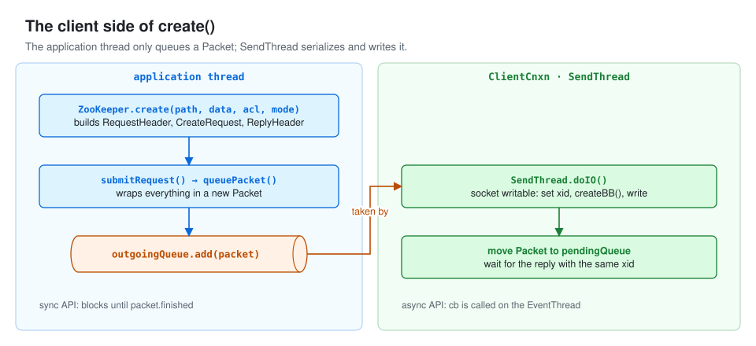
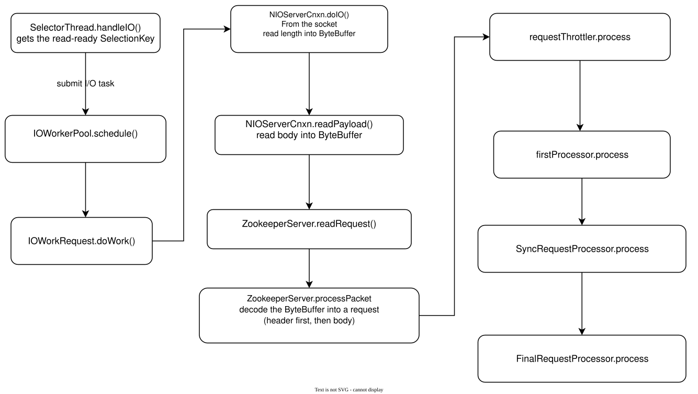
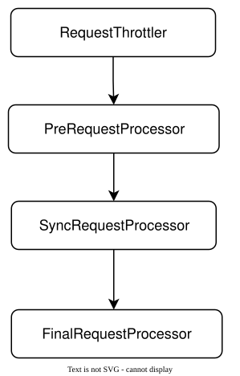

# Following a ZooKeeper Node Creation Request

> **Source version and figures:** This article is checked against ZooKeeper **3.6.2**, commit `803c7f1a12f85978cb049af5e4ef23bd8b688715`, the latest 3.6 release available in October 2020. The analyzed excerpts are retained with English annotations; identified original-source variants are labeled explicitly. Figures are reconstructed from the source and original discussion because the original screenshots are unavailable. They are explanatory diagrams, not newly observed debugger output.

## Introduction

The preceding articles examined the source behind server and client startup:
[Client startup](client-startup.html)
[Standalone server startup](standalone-server-startup.html)
Now let us trace creation of a znode from the public API to the in-memory data tree.

## Building the client request

The client constructs a create request inside `ZooKeeper.create`.

```java

public void create(
        final String path,
        byte[] data,
        List<ACL> acl,
        CreateMode createMode,
        Create2Callback cb,
        Object ctx,
        long ttl) {
        // path is the node path supplied by the caller.
        final String clientPath = path;
        PathUtils.validatePath(clientPath, createMode.isSequential());
        EphemeralType.validateTTL(createMode, ttl);
      // Combine chrootPath and clientPath to obtain the server-side path.
        final String serverPath = prependChroot(clientPath);
        // Create the request header.
        RequestHeader h = new RequestHeader();
       // Set the operation type; the server uses it to select request handling.
        setCreateHeader(createMode, h);
       // Create the response header object.
        ReplyHeader r = new ReplyHeader();
         // Create the response body object.
        Create2Response response = new Create2Response();
       // Construct the request body, examined below.
        Record record = makeCreateRecord(createMode, serverPath, data, acl, ttl);
       // Submit the request through the client connection.
        cnxn.queuePacket(h, r, record, response, cb, clientPath, serverPath, ctx, null);
    }

```


##### makeCreateRecord

Here is how the create request body is built. **Excerpt correction:** a missing semicolon after `request.setAcl(acl)` and a stray quotation mark after `incomingBuffer.slice()` later in the original were copying errors; they are corrected here without changing logic.

```java

private Record makeCreateRecord(CreateMode createMode, String serverPath, byte[] data, List<ACL> acl, long ttl) {
        Record record;
        if (createMode.isTTL()) {
            // Handle creation of a TTL node.
            CreateTTLRequest request = new CreateTTLRequest();
            request.setData(data);
            request.setFlags(createMode.toFlag());
            request.setPath(serverPath);
            request.setAcl(acl);
            request.setTtl(ttl);
            record = request;
        } else {
         // CreateRequest represents an ordinary node creation request.
            CreateRequest request = new CreateRequest();
           // Set node data.
            request.setData(data);
           // Set node flags: persistent, sequential, container, and so on.
            request.setFlags(createMode.toFlag());
          // Set the node path.
            request.setPath(serverPath);
          // Set the ACL.
            request.setAcl(acl);
            record = request;
        }
        return record;
    }

```


**Limit correction:** the original annotation called the aggregate large-request limit “100k.” In 3.6.2, the default `largeRequestMaxBytes` is 100 MiB, and large-request classification is disabled until `largeRequestThreshold` is configured.

Next, examine how the client sends the request to the server.

##### cnxn.queuePacket

```java

 public Packet queuePacket(
        RequestHeader h,
        ReplyHeader r,
        Record request,
        Record response,
        AsyncCallback cb,
        String clientPath,
        String serverPath,
        Object ctx,
        WatchRegistration watchRegistration,
        WatchDeregistration watchDeregistration) {
        Packet packet = null;

        // Note that we do not generate the Xid for the packet yet. It is
        // generated later at send-time, by an implementation of ClientCnxnSocket::doIO(),
        // where the packet is actually sent.
       // Wrap the create request in a Packet.
        packet = new Packet(h, r, request, response, watchRegistration);
        packet.cb = cb;
        packet.ctx = ctx;
        packet.clientPath = clientPath;
        packet.serverPath = serverPath;
        packet.watchDeregistration = watchDeregistration;
        // The synchronized block here is for two purpose:
        // 1. synchronize with the final cleanup() in SendThread.run() to avoid race
        // 2. synchronized against each packet. So if a closeSession packet is added,
        // later packet will be notified.
        synchronized (state) {
            if (!state.isAlive() || closing) {
         // If the client connection is no longer alive, finish the Packet with the appropriate error.
                conLossPacket(packet);
            } else {
                // If the client is asking to close the session then
                // mark as closing
                if (h.getType() == OpCode.closeSession) {
                    closing = true;
                }
                // Enqueue the request in outgoingQueue for transmission.
                outgoingQueue.add(packet);
            }
        }
       // Wake SendThread to process outgoingQueue.
        sendThread.getClientCnxnSocket().packetAdded();
        return packet;
    }

```


Once `SendThread` wakes from `selector.select`, it can process write readiness through `doIO`. The create Packet is assigned an xid, serialized to a `ByteBuffer`, and written to the server socket. The synchronous API waits for completion of that Packet; the asynchronous APIs deliver a callback instead.

[](assets/node-creation-01.svg)


## Processing on the server

The following figure shows the server-side processing path.

[](assets/node-creation-02.svg)

[Server startup](standalone-server-startup.html) already examined `SelectorThread.handleIO`. We now follow each subsequent stage.


##### IOWorkRequest.doWork

When a client request arrives, `SelectorThread` observes readiness on its `SelectionKey`. It wraps that key in an `IOWorkRequest` and submits it to the worker pool. A worker executes `IOWorkRequest.doWork`; here is that method.

```java

 public void doWork() throws InterruptedException {
            if (!key.isValid()) {
             // Cancel an invalid SelectionKey.
                selectorThread.cleanupSelectionKey(key);
                return;
            }
             // Execute connection I/O for read or write readiness.
            if (key.isReadable() || key.isWritable()) {
                cnxn.doIO(key);

                // Check if we shutdown or doIO() closed this connection
                if (stopped) {
                    // Close the connection if the server has stopped, including socket and connection-level cleanup.
cnxn.close(ServerCnxn.DisconnectReason.SERVER_SHUTDOWN);
                    return;
                }
                if (!key.isValid()) {
                    selectorThread.cleanupSelectionKey(key);
                    return;
                }
              // Update connection state used for expiration tracking.
                touchCnxn(cnxn);
            }

            // Mark this connection as once again ready for selection
           // Restore connection readability when appropriate.
            cnxn.enableSelectable();
            // Push an update request on the queue to resume selecting
            // on the current set of interest ops, which may have changed
            // as a result of the I/O operations we just performed.
            // Wake SelectorThread so it can apply the interest update.
            if (!selectorThread.addInterestOpsUpdateRequest(key)) {
                cnxn.close(ServerCnxn.DisconnectReason.CONNECTION_MODE_CHANGED);
            }
        }

```


##### NIOServerCnxn.doIO

```java

void doIO(SelectionKey k) throws InterruptedException {
        try {
            if (!isSocketOpen()) {
                LOG.warn("trying to do i/o on a null socket for session: 0x{}", Long.toHexString(sessionId));

                return;
            }
            if (k.isReadable()) {
               // Handle read readiness.
                int rc = sock.read(incomingBuffer);
                if (rc < 0) {
                    handleFailedRead();
                }
               // If incomingBuffer has been completely filled...
                if (incomingBuffer.remaining() == 0) {
                    boolean isPayload;
                    if (incomingBuffer == lenBuffer) { // start of next request
                       // incomingBuffer currently holds the request length prefix.
                        incomingBuffer.flip();
                        isPayload = readLength(k);
                        incomingBuffer.clear();
                    } else {
                        // continuation
                        isPayload = true;
                    }
                    if (isPayload) { // not the case for 4letterword
                       // Read the request payload.
                        readPayload();
                    } else {
                        // four letter words take care
                        // need not do anything else
                        return;
                    }
                }
            }
            if (k.isWritable()) {
             // Handle write readiness; response transmission is discussed later.
                handleWrite(k);

                if (!initialized && !getReadInterest() && !getWriteInterest()) {
                    throw new CloseRequestException("responded to info probe", DisconnectReason.INFO_PROBE);
                }
            }
        } catch (CancelledKeyException e) {
            LOG.warn("CancelledKeyException causing close of session: 0x{}", Long.toHexString(sessionId));

            LOG.debug("CancelledKeyException stack trace", e);

            close(DisconnectReason.CANCELLED_KEY_EXCEPTION);
        } catch (CloseRequestException e) {
            // expecting close to log session closure
            close();
        } catch (EndOfStreamException e) {
            LOG.warn("Unexpected exception", e);
            // expecting close to log session closure
            close(e.getReason());
        } catch (ClientCnxnLimitException e) {
            // Common case exception, print at debug level
            ServerMetrics.getMetrics().CONNECTION_REJECTED.add(1);
            LOG.warn("Closing session 0x{}", Long.toHexString(sessionId), e);
            close(DisconnectReason.CLIENT_CNX_LIMIT);
        } catch (IOException e) {
            LOG.warn("Close of session 0x{}", Long.toHexString(sessionId), e);
            close(DisconnectReason.IO_EXCEPTION);
        }
    }

```


##### NIOServerCnxn.readPayload

Read the request bytes from the socket:

```java

private void readPayload() throws IOException, InterruptedException, ClientCnxnLimitException {
        if (incomingBuffer.remaining() != 0) { // have we read length bytes?
           // Continue reading if incomingBuffer is not full.
            int rc = sock.read(incomingBuffer); // sock is non-blocking, so ok
            if (rc < 0) {
                handleFailedRead();
            }
        }

        if (incomingBuffer.remaining() == 0) { // have we read length bytes?
            incomingBuffer.flip();
            packetReceived(4 + incomingBuffer.remaining());
            if (!initialized) {
               // An uninitialized connection carries a session handshake request.
                readConnectRequest();
            } else {
              // Read an ordinary request payload.
                readRequest();
            }
            // Reset lenBuffer and incomingBuffer for the next message.
            lenBuffer.clear();
            incomingBuffer = lenBuffer;
        }
    }

```


Now the server begins processing the request itself.
`NIOServerCnxn.readRequest` calls `ZooKeeperServer.processPacket`.

##### ZooKeeperServer.processPacket

This converts the message stream into a server-side request.

```java

public void processPacket(ServerCnxn cnxn, ByteBuffer incomingBuffer) throws IOException {
        // We have the request, now process and setup for next
        // Create an input stream over incomingBuffer.
        InputStream bais = new ByteBufferInputStream(incomingBuffer);
        BinaryInputArchive bia = BinaryInputArchive.getArchive(bais);
       // Deserialize the request header first.
        RequestHeader h = new RequestHeader();
        h.deserialize(bia, "header");

        // Need to increase the outstanding request count first, otherwise
        // there might be a race condition that it enabled recv after
        // processing request and then disabled when check throttling.
        //
        // Be aware that we're actually checking the global outstanding
        // request before this request.
        //
        // It's fine if the IOException thrown before we decrease the count
        // in cnxn, since it will close the cnxn anyway.
        // Increase outstanding-request accounting and check whether reads should be throttled.
        cnxn.incrOutstandingAndCheckThrottle(h);

        // Through the magic of byte buffers, txn will not be
        // pointing
        // to the start of the txn
        incomingBuffer = incomingBuffer.slice();
       // Dispatch according to the operation type in the request header.
        if (h.getType() == OpCode.auth) {
            LOG.info("got auth packet {}", cnxn.getRemoteSocketAddress());
            AuthPacket authPacket = new AuthPacket();
           // Deserialize the authentication body into AuthPacket.
            ByteBufferInputStream.byteBuffer2Record(incomingBuffer, authPacket);
            String scheme = authPacket.getScheme();
            // Find the authentication provider for the requested scheme.
            ServerAuthenticationProvider ap = ProviderRegistry.getServerProvider(scheme);
            Code authReturn = KeeperException.Code.AUTHFAILED;
            if (ap != null) {
                try {
                    // handleAuthentication may close the connection, to allow the client to choose
                    // a different server to connect to.
                    // Perform authentication.
                    authReturn = ap.handleAuthentication(
                        new ServerAuthenticationProvider.ServerObjs(this, cnxn),
                        authPacket.getAuth());
                } catch (RuntimeException e) {
                    LOG.warn("Caught runtime exception from AuthenticationProvider: {}", scheme, e);
                    authReturn = KeeperException.Code.AUTHFAILED;
                }
            }

            if (authReturn == KeeperException.Code.OK) {
              // On success, return the authentication result to the client.
                LOG.debug("Authentication succeeded for scheme: {}", scheme);
                LOG.info("auth success {}", cnxn.getRemoteSocketAddress());
                ReplyHeader rh = new ReplyHeader(h.getXid(), 0, KeeperException.Code.OK.intValue());
                cnxn.sendResponse(rh, null, null);
            } else {
                if (ap == null) {
                    LOG.warn(
                        "No authentication provider for scheme: {} has {}",
                        scheme,
                        ProviderRegistry.listProviders());
                } else {
                    LOG.warn("Authentication failed for scheme: {}", scheme);
                }
                // send a response...
                ReplyHeader rh = new ReplyHeader(h.getXid(), 0, KeeperException.Code.AUTHFAILED.intValue());
                cnxn.sendResponse(rh, null, null);
                 // ... and close connection
                 // On failure, send the connection-close response.
                cnxn.sendBuffer(ServerCnxnFactory.closeConn);
                // Stop accepting requests on a failed authentication connection.
                cnxn.disableRecv();
            }
            return;
        } else if (h.getType() == OpCode.sasl) {
            processSasl(incomingBuffer, cnxn, h);
        } else {
            if (shouldRequireClientSaslAuth() && !hasCnxSASLAuthenticated(cnxn)) {
                ReplyHeader replyHeader = new ReplyHeader(h.getXid(), 0, Code.SESSIONCLOSEDREQUIRESASLAUTH.intValue());
                cnxn.sendResponse(replyHeader, null, "response");
                cnxn.sendCloseSession();
                cnxn.disableRecv();
            } else {
           // Construct the server-side Request.
                Request si = new Request(cnxn, cnxn.getSessionId(), h.getXid(), h.getType(), incomingBuffer, cnxn.getAuthInfo());
                int length = incomingBuffer.limit();
               // If the request exceeds the configurable large-request threshold...
                if (isLargeRequest(length)) {
                    // checkRequestSize will throw IOException if request is rejected
                   // Check the aggregate large-request byte limit before accepting this request.
                    checkRequestSizeWhenMessageReceived(length);
                    si.setLargeRequestSize(length);
                }
               // Set the request owner.
                si.setOwner(ServerCnxn.me);
              // Submit the request to RequestThrottler.
                submitRequest(si);
            }
        }
    }

```


After `processPacket`, the request enters the processing pipeline. Standalone operation sends requests through this pipeline, whose broad structure was introduced in [server startup](standalone-server-startup.html).

[](assets/node-creation-03.svg)

We will examine the processors one by one.

##### RequestThrottler

`RequestThrottler` limits the number of requests admitted to processing, helping prevent overload. It runs in a separate thread, so its `run` method is the place to start. **Configuration note:** throttling limits are configurable, and a zero maximum disables that particular limit; they are not universal fixed limits imposed on every installation.

```java

public void run() {
        try {
            while (true) {
                if (killed) {
                    break;
                }
               // Take a request from the queue.
                Request request = submittedRequests.take();
                if (Request.requestOfDeath == request) {
                    break;
                }

                if (request.mustDrop()) {
                    continue;
                }

                // Throttling is disabled when maxRequests = 0
                if (maxRequests > 0) {
                    while (!killed) {
                        if (dropStaleRequests && request.isStale()) {
                            // Note: this will close the connection
                            dropRequest(request);
                            ServerMetrics.getMetrics().STALE_REQUESTS_DROPPED.add(1);
                            request = null;
                            break;
                        }
                       // No throttling limit has been reached.
                        if (zks.getInProcess() < maxRequests) {
                            break;
                        }
                      // If in-process requests exceed maxRequests, wait before submitting more work.
                        throttleSleep(stallTime);
                    }
                }
              // Exit if the thread has been asked to stop.
                if (killed) {
                    break;
                }

                // A dropped stale request will be null
                if (request != null) {
                    if (request.isStale()) {
                        ServerMetrics.getMetrics().STALE_REQUESTS.add(1);
                    }
                   // Submit the request to the server's first request processor.
                    zks.submitRequestNow(request);
                }
            }
        } catch (InterruptedException e) {
            LOG.error("Unexpected interruption", e);
        }
        int dropped = drainQueue();
        LOG.info("RequestThrottler shutdown. Dropped {} requests", dropped);
    }

```


##### PrepRequestProcessor

`PrepRequestProcessor` is the first processor doing operation-specific preparation. What happens inside it?
It also runs in its own thread; here is `run`.

```java

 public void run() {
        LOG.info(String.format("PrepRequestProcessor (sid:%d) started, reconfigEnabled=%s", zks.getServerId(), zks.reconfigEnabled));
        try {
            while (true) {
                ServerMetrics.getMetrics().PREP_PROCESSOR_QUEUE_SIZE.add(submittedRequests.size());
                // Take the next request.
                Request request = submittedRequests.take();
                ServerMetrics.getMetrics().PREP_PROCESSOR_QUEUE_TIME
                    .add(Time.currentElapsedTime() - request.prepQueueStartTime);
                long traceMask = ZooTrace.CLIENT_REQUEST_TRACE_MASK;
                if (request.type == OpCode.ping) {
                    traceMask = ZooTrace.CLIENT_PING_TRACE_MASK;
                }
                if (LOG.isTraceEnabled()) {
                    ZooTrace.logRequest(LOG, traceMask, 'P', request, "");
                }
                if (Request.requestOfDeath == request) {
                    break;
                }

                request.prepStartTime = Time.currentElapsedTime();
           // pRequest is the core preparation method.
                pRequest(request);
            }
        } catch (Exception e) {
            handleException(this.getName(), e);
        }
        LOG.info("PrepRequestProcessor exited loop!");
    }

```


##### pRequest

`pRequest` is long because it converts many operation types into their corresponding records and transactions. We will focus on create requests while retaining the complete analyzed excerpt.

```java

protected void pRequest(Request request) throws RequestProcessorException {
        // LOG.info("Prep>>> cxid = " + request.cxid + " type = " +
        // request.type + " id = 0x" + Long.toHexString(request.sessionId));
        request.setHdr(null);
        request.setTxn(null);

        try {
            // Dispatch by request type.
            switch (request.type) {
            case OpCode.createContainer:
            case OpCode.create:
            case OpCode.create2:
                  // Create the appropriate node-creation request record.
                CreateRequest create2Request = new CreateRequest();
                pRequest2Txn(request.type, zks.getNextZxid(), request, create2Request, true);
                break;
            case OpCode.createTTL:
                CreateTTLRequest createTtlRequest = new CreateTTLRequest();
                pRequest2Txn(request.type, zks.getNextZxid(), request, createTtlRequest, true);
                break;
            case OpCode.deleteContainer:
            case OpCode.delete:
                DeleteRequest deleteRequest = new DeleteRequest();
                pRequest2Txn(request.type, zks.getNextZxid(), request, deleteRequest, true);
                break;
            case OpCode.setData:
                SetDataRequest setDataRequest = new SetDataRequest();
                pRequest2Txn(request.type, zks.getNextZxid(), request, setDataRequest, true);
                break;
            case OpCode.reconfig:
                ReconfigRequest reconfigRequest = new ReconfigRequest();
                ByteBufferInputStream.byteBuffer2Record(request.request, reconfigRequest);
                pRequest2Txn(request.type, zks.getNextZxid(), request, reconfigRequest, true);
                break;
            case OpCode.setACL:
                SetACLRequest setAclRequest = new SetACLRequest();
                pRequest2Txn(request.type, zks.getNextZxid(), request, setAclRequest, true);
                break;
            case OpCode.check:
                CheckVersionRequest checkRequest = new CheckVersionRequest();
                pRequest2Txn(request.type, zks.getNextZxid(), request, checkRequest, true);
                break;
            case OpCode.multi:
                MultiOperationRecord multiRequest = new MultiOperationRecord();
                try {
                    ByteBufferInputStream.byteBuffer2Record(request.request, multiRequest);
                } catch (IOException e) {
                    request.setHdr(new TxnHeader(request.sessionId, request.cxid, zks.getNextZxid(), Time.currentWallTime(), OpCode.multi));
                    throw e;
                }
                List<Txn> txns = new ArrayList<Txn>();
                //Each op in a multi-op must have the same zxid!
                long zxid = zks.getNextZxid();
                KeeperException ke = null;

                //Store off current pending change records in case we need to rollback
                Map<String, ChangeRecord> pendingChanges = getPendingChanges(multiRequest);
                request.setHdr(new TxnHeader(request.sessionId, request.cxid, zxid,
                        Time.currentWallTime(), request.type));

                for (Op op : multiRequest) {
                    Record subrequest = op.toRequestRecord();
                    int type;
                    Record txn;

                    /* If we've already failed one of the ops, don't bother
                     * trying the rest as we know it's going to fail and it
                     * would be confusing in the logfiles.
                     */
                    if (ke != null) {
                        type = OpCode.error;
                        txn = new ErrorTxn(Code.RUNTIMEINCONSISTENCY.intValue());
                    } else {
                        /* Prep the request and convert to a Txn */
                        try {
                            pRequest2Txn(op.getType(), zxid, request, subrequest, false);
                            type = op.getType();
                            txn = request.getTxn();
                        } catch (KeeperException e) {
                            ke = e;
                            type = OpCode.error;
                            txn = new ErrorTxn(e.code().intValue());

                            if (e.code().intValue() > Code.APIERROR.intValue()) {
                                LOG.info("Got user-level KeeperException when processing {} aborting"
                                         + " remaining multi ops. Error Path:{} Error:{}",
                                         request.toString(),
                                         e.getPath(),
                                         e.getMessage());
                            }

                            request.setException(e);

                            /* Rollback change records from failed multi-op */
                            rollbackPendingChanges(zxid, pendingChanges);
                        }
                    }

                    // TODO: I don't want to have to serialize it here and then
                    //       immediately deserialize in next processor. But I'm
                    //       not sure how else to get the txn stored into our list.
                    try (ByteArrayOutputStream baos = new ByteArrayOutputStream()) {
                        BinaryOutputArchive boa = BinaryOutputArchive.getArchive(baos);
                        txn.serialize(boa, "request");
                        ByteBuffer bb = ByteBuffer.wrap(baos.toByteArray());
                        txns.add(new Txn(type, bb.array()));
                    }
                }

                request.setTxn(new MultiTxn(txns));
                if (digestEnabled) {
                    setTxnDigest(request);
                }

                break;

            //create/close session don't require request record
            case OpCode.createSession:
            case OpCode.closeSession:
                if (!request.isLocalSession()) {
                    pRequest2Txn(request.type, zks.getNextZxid(), request, null, true);
                }
                break;

            //All the rest don't need to create a Txn - just verify session
            case OpCode.sync:
            case OpCode.exists:
            case OpCode.getData:
            case OpCode.getACL:
            case OpCode.getChildren:
            case OpCode.getAllChildrenNumber:
            case OpCode.getChildren2:
            case OpCode.ping:
            case OpCode.setWatches:
            case OpCode.setWatches2:
            case OpCode.checkWatches:
            case OpCode.removeWatches:
            case OpCode.getEphemerals:
            case OpCode.multiRead:
            case OpCode.addWatch:
                zks.sessionTracker.checkSession(request.sessionId, request.getOwner());
                break;
            default:
                LOG.warn("unknown type {}", request.type);
                break;
            }
        } catch (KeeperException e) {
            if (request.getHdr() != null) {
                request.getHdr().setType(OpCode.error);
                request.setTxn(new ErrorTxn(e.code().intValue()));
            }

            if (e.code().intValue() > Code.APIERROR.intValue()) {
                LOG.info(
                    "Got user-level KeeperException when processing {} Error Path:{} Error:{}",
                    request.toString(),
                    e.getPath(),
                    e.getMessage());
            }
            request.setException(e);
        } catch (Exception e) {
            // log at error level as we are returning a marshalling
            // error to the user
            LOG.error("Failed to process {}", request, e);

            StringBuilder sb = new StringBuilder();
            ByteBuffer bb = request.request;
            if (bb != null) {
                bb.rewind();
                while (bb.hasRemaining()) {
                    sb.append(Integer.toHexString(bb.get() & 0xff));
                }
            } else {
                sb.append("request buffer is null");
            }

            LOG.error("Dumping request buffer: 0x{}", sb.toString());
            if (request.getHdr() != null) {
                request.getHdr().setType(OpCode.error);
                request.setTxn(new ErrorTxn(Code.MARSHALLINGERROR.intValue()));
            }
        }
      // Also record the zxid on the request.
        request.zxid = zks.getZxid();
        ServerMetrics.getMetrics().PREP_PROCESS_TIME.add(Time.currentElapsedTime() - request.prepStartTime);
       // Pass the request to SyncRequestProcessor.
        nextProcessor.processRequest(request);
    }

```


How is a create request transformed? The deserialized protocol request is stored in `Request.record`, while `Request.txn` holds the prepared transaction that can be logged and applied.

##### pRequest2Txn → pRequest2TxnCreate

`pRequest2Txn` dispatches by operation type. Rather than analyze all of its branches, we will examine `pRequest2TxnCreate`, which prepares creation of a new node.

```java

private void pRequest2TxnCreate(int type, Request request, Record record, boolean deserialize) throws IOException, KeeperException {
        if (deserialize) {
          // Deserialize the ByteBuffer into the request record.
            ByteBufferInputStream.byteBuffer2Record(request.request, record);
        }

        int flags;
        String path;
        List<ACL> acl;
        byte[] data;
        long ttl;
        if (type == OpCode.createTTL) {
            // Handle a createTTL request.
            CreateTTLRequest createTtlRequest = (CreateTTLRequest) record;
            flags = createTtlRequest.getFlags();
            path = createTtlRequest.getPath();
            acl = createTtlRequest.getAcl();
            data = createTtlRequest.getData();
            ttl = createTtlRequest.getTtl();
        } else {
           // Handle an ordinary create request.
            CreateRequest createRequest = (CreateRequest) record;
           // Extract flags, path, ACL, and data.
            flags = createRequest.getFlags();
            path = createRequest.getPath();
            acl = createRequest.getAcl();
            data = createRequest.getData();
            ttl = -1;
        }
        CreateMode createMode = CreateMode.fromFlag(flags);
        validateCreateRequest(path, createMode, request, ttl);
       // Obtain the parent path.
        String parentPath = validatePathForCreate(path, request.sessionId);
        // Normalize and validate ACL information.
        List<ACL> listACL = fixupACL(path, request.authInfo, acl);
       // Obtain the parent's ChangeRecord, which tracks state pending in the processing pipeline.
        ChangeRecord parentRecord = getRecordForPath(parentPath);
         // Check permission to create a child under the parent.
        zks.checkACL(request.cnxn, parentRecord.acl, ZooDefs.Perms.CREATE, request.authInfo, path, listACL);
        // Obtain the parent's cversion, used to allocate sequential node suffixes.
        int parentCVersion = parentRecord.stat.getCversion();
        if (createMode.isSequential()) {
            // For a sequential node, append a suffix derived from cversion.
            path = path + String.format(Locale.ENGLISH, "%010d", parentCVersion);
        }
        validatePath(path, request.sessionId);
        try {
            // Look up a ChangeRecord for the requested path; NoNodeException means the path is available.
          // If the node already exists, throw NodeExistsException.
            if (getRecordForPath(path) != null) {
                throw new KeeperException.NodeExistsException(path);
            }
        } catch (KeeperException.NoNodeException e) {

            // ignore this one
        }
        boolean ephemeralParent = EphemeralType.get(parentRecord.stat.getEphemeralOwner()) == EphemeralType.NORMAL;
   // Ordinary ephemeral nodes cannot have children; reject the request if the parent is one.
        if (ephemeralParent) {
            throw new KeeperException.NoChildrenForEphemeralsException(path);
        }
       // Advance the parent's cversion.
        int newCversion = parentRecord.stat.getCversion() + 1;
        if (type == OpCode.createContainer) {
            request.setTxn(new CreateContainerTxn(path, data, listACL, newCversion));
        } else if (type == OpCode.createTTL) {
            request.setTxn(new CreateTTLTxn(path, data, listACL, newCversion, ttl));
        } else {
           // Prepare the transaction containing path, data, ACL, node properties, and parent cversion.
            request.setTxn(new CreateTxn(path, data, listACL, createMode.isEphemeral(), newCversion));
        }

        TxnHeader hdr = request.getHdr();
        long ephemeralOwner = 0;
        if (createMode.isContainer()) {
            ephemeralOwner = EphemeralType.CONTAINER_EPHEMERAL_OWNER;
        } else if (createMode.isTTL()) {
            ephemeralOwner = EphemeralType.TTL.toEphemeralOwner(ttl);
        } else if (createMode.isEphemeral()) {
         // For an ephemeral node, set ephemeralOwner to the session ID.
            ephemeralOwner = request.sessionId;
        }
        // Initialize the new node's state.
        StatPersisted s = DataTree.createStat(hdr.getZxid(), hdr.getTime(), ephemeralOwner);
        parentRecord = parentRecord.duplicate(request.getHdr().getZxid());
       // Increment the parent's child count.
        parentRecord.childCount++;
       // Update the parent's cversion.
        parentRecord.stat.setCversion(newCversion);
        // Update the parent's last child-change zxid.
        parentRecord.stat.setPzxid(request.getHdr().getZxid());
        parentRecord.precalculatedDigest = precalculateDigest(
                DigestOpCode.UPDATE, parentPath, parentRecord.data, parentRecord.stat);
       // Append the parent's updated ChangeRecord to outstandingChanges.
        addChangeRecord(parentRecord);
       // Construct the new node's ChangeRecord.
        ChangeRecord nodeRecord = new ChangeRecord(
                request.getHdr().getZxid(), path, s, 0, listACL);
       // Set node data.
        nodeRecord.data = data;
        nodeRecord.precalculatedDigest = precalculateDigest(
                DigestOpCode.ADD, path, nodeRecord.data, s);
        // Precalculate digest information.
        setTxnDigest(request, nodeRecord.precalculatedDigest);
       // Append the new node's ChangeRecord to outstandingChanges.
        addChangeRecord(nodeRecord);
    }

```


To summarize what preparation does for a create request:
`PrepRequestProcessor` deserializes the request, resolves and checks the parent, prepares a transaction, and records prospective parent and child state in `outstandingChanges`. Parent state includes the child count, cversion, and pzxid. These records let later queued requests see pending changes. They do not yet publish the new node in the live `DataTree`. The request then passes to `SyncRequestProcessor`.

##### SyncRequestProcessor

`SyncRequestProcessor` runs on another thread. Here is its `run` method.

```java

 public void run() {
        try {
            // we do this in an attempt to ensure that not all of the servers
            // in the ensemble take a snapshot at the same time
           // Randomize the snapshot thresholds so ensemble servers do not all snapshot simultaneously.
          // randRoll and randSize participate in deciding when to roll the log and snapshot.
            resetSnapshotStats();
        // Initialize lastFlushTime.
            lastFlushTime = Time.currentElapsedTime();
            while (true) {
                ServerMetrics.getMetrics().SYNC_PROCESSOR_QUEUE_SIZE.add(queuedRequests.size());
                // Compute the remaining delay before a configured flush is due.
                long pollTime = Math.min(zks.getMaxWriteQueuePollTime(), getRemainingDelay());
              // Poll for a request until that delay expires; a timeout returns null.
                Request si = queuedRequests.poll(pollTime, TimeUnit.MILLISECONDS);
                if (si == null) {
                // The following source comment explains this branch.
                    /* We timed out looking for more writes to batch, go ahead and flush immediately */
                    flush();
                    // After flushing, take waits indefinitely for the next request.
                    si = queuedRequests.take();
                }
                if (si == REQUEST_OF_DEATH) {
                 // Stop when the shutdown sentinel arrives.
                    break;
                }

                long startProcessTime = Time.currentElapsedTime();
                ServerMetrics.getMetrics().SYNC_PROCESSOR_QUEUE_TIME.add(startProcessTime - si.syncQueueStartTime);

                // track the number of records written to the log
                // Append the transaction log entry; details follow below.
                if (zks.getZKDatabase().append(si)) {
                    if (shouldSnapshot()) {
                        resetSnapshotStats();
                        // roll the log
                      // Roll the transaction log when a snapshot threshold is reached.
                        zks.getZKDatabase().rollLog();
                        // take a snapshot
                        if (!snapThreadMutex.tryAcquire()) {
                            LOG.warn("Too busy to snap, skipping");
                        } else {
                        // Start a background thread to take a snapshot.
                            new ZooKeeperThread("Snapshot Thread") {
                                public void run() {
                                    try {
                                        zks.takeSnapshot();
                                    } catch (Exception e) {
                                        LOG.warn("Unexpected exception", e);
                                    } finally {
                                        snapThreadMutex.release();
                                    }
                                }
                            }.start();
                        }
                    }
                } else if (toFlush.isEmpty()) {
                    // optimization for read heavy workloads
                    // iff this is a read, and there are no pending
                    // flushes (writes), then just pass this to the next
                    // processor
                    if (nextProcessor != null) {
                        nextProcessor.processRequest(si);
                        if (nextProcessor instanceof Flushable) {
                            ((Flushable) nextProcessor).flush();
                        }
                    }
                    continue;
                }
               // Add the request to the flush queue.
                toFlush.add(si);
                if (shouldFlush()) {
                 // Flush is examined below.
                    flush();
                }
                ServerMetrics.getMetrics().SYNC_PROCESS_TIME.add(Time.currentElapsedTime() - startProcessTime);
            }
        } catch (Throwable t) {
            handleException(this.getName(), t);
        }
        LOG.info("SyncRequestProcessor exited!");
    }

```


##### zkDatabase.append(si)

What happens in `zkDatabase.append(si)`?

```java

  public boolean append(Request si) throws IOException {
        // Increment the transaction count and delegate transaction append.
        txnCount.incrementAndGet();
        return this.snapLog.append(si);
    }

```


##### snapLog.append()

`FileTxnSnapLog.append` delegates logging to `FileTxnLog`.

```java

public boolean append(Request si) throws IOException {
        return txnLog.append(si.getHdr(), si.getTxn(), si.getTxnDigest());
    }

```


##### FileTxnLog.append

We have reached the implementation that serializes a transaction into the log stream. **Checksum terminology:** although the source names the field `txnEntryCRC` and the variable `crc`, `makeChecksumAlgorithm()` uses Adler32 in this release.

```java

 public synchronized boolean append(TxnHeader hdr, Record txn, TxnDigest digest) throws IOException {
        if (hdr == null) {
            return false;
        }
        if (hdr.getZxid() <= lastZxidSeen) {
            LOG.warn(
                "Current zxid {} is <= {} for {}",
                hdr.getZxid(),
                lastZxidSeen,
                hdr.getType());
        } else {
         // Set lastZxidSeen to this transaction's zxid.
            lastZxidSeen = hdr.getZxid();
        }
        if (logStream == null) {
            LOG.info("Creating new log file: {}", Util.makeLogName(hdr.getZxid()));
           // If no output stream exists, create a log named for the first transaction's zxid.
            logFileWrite = new File(logDir, Util.makeLogName(hdr.getZxid()));
          // Create the file output stream.
            fos = new FileOutputStream(logFileWrite);
            logStream = new BufferedOutputStream(fos);
            oa = BinaryOutputArchive.getArchive(logStream);
            FileHeader fhdr = new FileHeader(TXNLOG_MAGIC, VERSION, dbId);
           // Serialize the log file header.
            fhdr.serialize(oa, "fileheader");
            // Make sure that the magic number is written before padding.
           // Flush the file header into the underlying file stream.
            logStream.flush();
            // Initialize filePadding.currentSize for log preallocation.
            filePadding.setCurrentSize(fos.getChannel().position());
          // Track the stream in streamsToFlush for later persistence.
            streamsToFlush.add(fos);
        }
      // Preallocate log space; see data-recovery.html. The default increment is 64 MiB, not a fixed final file length.
        filePadding.padFile(fos.getChannel());
       // Serialize the transaction to binary data.
        byte[] buf = Util.marshallTxnEntry(hdr, txn, digest);
        if (buf == null || buf.length == 0) {
            throw new IOException("Faulty serialization for header " + "and txn");
        }
        Checksum crc = makeChecksumAlgorithm();
       // Calculate and write its Adler32 checksum.
        crc.update(buf, 0, buf.length);
        oa.writeLong(crc.getValue(), "txnEntryCRC");
        // Write the transaction entry to the log stream.
        Util.writeTxnBytes(oa, buf);
        return true;
    }

```


The transaction has now been appended to the buffered output stream, but durability requires the later flush/commit step. Let us examine `flush`.

##### SyncRequestProcessor.flush

```java

 private void flush() throws IOException, RequestProcessorException {
        if (this.toFlush.isEmpty()) {
            return;
        }

        ServerMetrics.getMetrics().BATCH_SIZE.add(toFlush.size());

        long flushStartTime = Time.currentElapsedTime();
     // Commit the transaction log to disk; examined separately below.
        zks.getZKDatabase().commit();
        ServerMetrics.getMetrics().SYNC_PROCESSOR_FLUSH_TIME.add(Time.currentElapsedTime() - flushStartTime);

        if (this.nextProcessor == null) {
            this.toFlush.clear();
        } else {
            while (!this.toFlush.isEmpty()) {
               // Take the next request from toFlush.
                final Request i = this.toFlush.remove();
                long latency = Time.currentElapsedTime() - i.syncQueueStartTime;
                ServerMetrics.getMetrics().SYNC_PROCESSOR_QUEUE_AND_FLUSH_TIME.add(latency);
              // Pass it to the next processor.
                this.nextProcessor.processRequest(i);
            }
            if (this.nextProcessor instanceof Flushable) {
                ((Flushable) this.nextProcessor).flush();
            }
            lastFlushTime = Time.currentElapsedTime();
        }
    }

```


##### FileTxnLog.commit

`ZKDatabase.commit()` eventually calls `FileTxnLog.commit`, which flushes the transaction log and, under the normal force-sync configuration, forces it to storage.

```java

/**
     * commit the logs. make sure that everything hits the
     * disk
     */
// Commit the transaction log so its buffered records can become durable.

    public synchronized void commit() throws IOException {
        if (logStream != null) {
            logStream.flush();
        }
       // Iterate over the file output streams.
        for (FileOutputStream log : streamsToFlush) {
           // Flush the buffered stream.
            log.flush();
            if (forceSync) {
                long startSyncNS = System.nanoTime();

                FileChannel channel = log.getChannel();
                channel.force(false);

                syncElapsedMS = TimeUnit.NANOSECONDS.toMillis(System.nanoTime() - startSyncNS);
                if (syncElapsedMS > fsyncWarningThresholdMS) {
                    if (serverStats != null) {
                        serverStats.incrementFsyncThresholdExceedCount();
                    }

                    LOG.warn(
                        "fsync-ing the write ahead log in {} took {}ms which will adversely effect operation latency."
                            + "File size is {} bytes. See the ZooKeeper troubleshooting guide",
                        Thread.currentThread().getName(),
                        syncElapsedMS,
                        channel.size());
                }

                ServerMetrics.getMetrics().FSYNC_TIME.add(syncElapsedMS);
            }
        }
        while (streamsToFlush.size() > 1) {
            streamsToFlush.poll().close();
        }

        // Roll the log file if we exceed the size limit
        if (txnLogSizeLimit > 0) {
            long logSize = getCurrentLogSize();

            if (logSize > txnLogSizeLimit) {
                LOG.debug("Log size limit reached: {}", logSize);
                rollLog();
            }
        }
    }

```


##### ZooKeeperServer.takeSnapshot

After the log path, consider snapshot generation. `takeSnapshot` calls `FileTxnSnapLog.save`.

```java

public void save(
        DataTree dataTree,
        ConcurrentHashMap<Long, Integer> sessionsWithTimeouts,
        boolean syncSnap) throws IOException {
        long lastZxid = dataTree.lastProcessedZxid;
      // Derive the snapshot filename from the latest processed zxid.
        File snapshotFile = new File(snapDir, Util.makeSnapshotName(lastZxid));
        LOG.info("Snapshotting: 0x{} to {}", Long.toHexString(lastZxid), snapshotFile);
        try {
            // Serialize the in-memory data tree and session timeouts into the snapshot; see data-recovery.html.
            snapLog.serialize(dataTree, sessionsWithTimeouts, snapshotFile, syncSnap);
        } catch (IOException e) {
            if (snapshotFile.length() == 0) {
                /* This may be caused by a full disk. In such a case, the server
                 * will get stuck in a loop where it tries to write a snapshot
                 * out to disk, and ends up creating an empty file instead.
                 * Doing so will eventually result in valid snapshots being
                 * removed during cleanup. */
                if (snapshotFile.delete()) {
                    LOG.info("Deleted empty snapshot file: {}", snapshotFile.getAbsolutePath());
                } else {
                    LOG.warn("Could not delete empty snapshot file: {}", snapshotFile.getAbsolutePath());
                }
            } else {
                /* Something else went wrong when writing the snapshot out to
                 * disk. If this snapshot file is invalid, when restarting,
                 * ZooKeeper will skip it, and find the last known good snapshot
                 * instead. */
            }
            throw e;
        }
    }

```


##### FinalRequestProcessor

`SyncRequestProcessor` supplies the logging and flush stage, and triggers snapshots as needed. It then calls `FinalRequestProcessor`, which is not a separate thread. This long method dispatches among many request types, applies prepared transactions, and prepares responses. Durability depends on settings such as `forceSync`; snapshot creation is not required for each individual acknowledged transaction.

```java

 public void processRequest(Request request) {
        LOG.debug("Processing request:: {}", request);

        // request.addRQRec(">final");
        long traceMask = ZooTrace.CLIENT_REQUEST_TRACE_MASK;
        if (request.type == OpCode.ping) {
            traceMask = ZooTrace.SERVER_PING_TRACE_MASK;
        }
        if (LOG.isTraceEnabled()) {
            ZooTrace.logRequest(LOG, traceMask, 'E', request, "");
        }
       // Apply the request transaction to the in-memory database; details follow below.
        ProcessTxnResult rc = zks.processTxn(request);

        // ZOOKEEPER-558:
        // In some cases the server does not close the connection (e.g., closeconn buffer
        // was not being queued — ZOOKEEPER-558) properly. This happens, for example,
        // when the client closes the connection. The server should still close the session, though.
        // Calling closeSession() after losing the cnxn, results in the client close session response being dropped.
        if (request.type == OpCode.closeSession && connClosedByClient(request)) {
            // We need to check if we can close the session id.
            // Sometimes the corresponding ServerCnxnFactory could be null because
            // we are just playing diffs from the leader.
            if (closeSession(zks.serverCnxnFactory, request.sessionId)
                || closeSession(zks.secureServerCnxnFactory, request.sessionId)) {
                return;
            }
        }

        if (request.getHdr() != null) {
            /*
             * Request header is created only by the leader, so this must be
             * a quorum request. Since we're comparing timestamps across hosts,
             * this metric may be incorrect. However, it's still a very useful
             * metric to track in the happy case. If there is clock drift,
             * the latency can go negative. Note: headers use wall time, not
             * CLOCK_MONOTONIC.
             */
            long propagationLatency = Time.currentWallTime() - request.getHdr().getTime();
            if (propagationLatency >= 0) {
                ServerMetrics.getMetrics().PROPAGATION_LATENCY.add(propagationLatency);
            }
        }

        if (request.cnxn == null) {
            return;
        }
        ServerCnxn cnxn = request.cnxn;

        long lastZxid = zks.getZKDatabase().getDataTreeLastProcessedZxid();

        String lastOp = "NA";
        // Notify ZooKeeperServer that the request has finished so that it can
        // update any request accounting/throttling limits
        zks.decInProcess();
        zks.requestFinished(request);
        Code err = Code.OK;
        Record rsp = null;
        String path = null;
        try {
            if (request.getHdr() != null && request.getHdr().getType() == OpCode.error) {
                AuditHelper.addAuditLog(request, rc, true);
                /*
                 * When local session upgrading is disabled, leader will
                 * reject the ephemeral node creation due to session expire.
                 * However, if this is the follower that issue the request,
                 * it will have the correct error code, so we should use that
                 * and report to user
                 */
                if (request.getException() != null) {
                    throw request.getException();
                } else {
                    throw KeeperException.create(KeeperException.Code.get(((ErrorTxn) request.getTxn()).getErr()));
                }
            }

            KeeperException ke = request.getException();
            if (ke instanceof SessionMovedException) {
                throw ke;
            }
            if (ke != null && request.type != OpCode.multi) {
                throw ke;
            }

            LOG.debug("{}", request);

            if (request.isStale()) {
                ServerMetrics.getMetrics().STALE_REPLIES.add(1);
            }
            AuditHelper.addAuditLog(request, rc);
            switch (request.type) {
            case OpCode.ping: {
                lastOp = "PING";
                updateStats(request, lastOp, lastZxid);

                cnxn.sendResponse(new ReplyHeader(ClientCnxn.PING_XID, lastZxid, 0), null, "response");
                return;
            }
            case OpCode.createSession: {
                lastOp = "SESS";
                updateStats(request, lastOp, lastZxid);

                zks.finishSessionInit(request.cnxn, true);
                return;
            }
            case OpCode.multi: {
                lastOp = "MULT";
                rsp = new MultiResponse();

                for (ProcessTxnResult subTxnResult : rc.multiResult) {

                    OpResult subResult;

                    switch (subTxnResult.type) {
                    case OpCode.check:
                        subResult = new CheckResult();
                        break;
                    case OpCode.create:
                        subResult = new CreateResult(subTxnResult.path);
                        break;
                    case OpCode.create2:
                    case OpCode.createTTL:
                    case OpCode.createContainer:
                        subResult = new CreateResult(subTxnResult.path, subTxnResult.stat);
                        break;
                    case OpCode.delete:
                    case OpCode.deleteContainer:
                        subResult = new DeleteResult();
                        break;
                    case OpCode.setData:
                        subResult = new SetDataResult(subTxnResult.stat);
                        break;
                    case OpCode.error:
                        subResult = new ErrorResult(subTxnResult.err);
                        if (subTxnResult.err == Code.SESSIONMOVED.intValue()) {
                            throw new SessionMovedException();
                        }
                        break;
                    default:
                        throw new IOException("Invalid type of op");
                    }

                    ((MultiResponse) rsp).add(subResult);
                }

                break;
            }
            case OpCode.multiRead: {
                lastOp = "MLTR";
                MultiOperationRecord multiReadRecord = new MultiOperationRecord();
                ByteBufferInputStream.byteBuffer2Record(request.request, multiReadRecord);
                rsp = new MultiResponse();
                OpResult subResult;
                for (Op readOp : multiReadRecord) {
                    try {
                        Record rec;
                        switch (readOp.getType()) {
                        case OpCode.getChildren:
                            rec = handleGetChildrenRequest(readOp.toRequestRecord(), cnxn, request.authInfo);
                            subResult = new GetChildrenResult(((GetChildrenResponse) rec).getChildren());
                            break;
                        case OpCode.getData:
                            rec = handleGetDataRequest(readOp.toRequestRecord(), cnxn, request.authInfo);
                            GetDataResponse gdr = (GetDataResponse) rec;
                            subResult = new GetDataResult(gdr.getData(), gdr.getStat());
                            break;
                        default:
                            throw new IOException("Invalid type of readOp");
                        }
                    } catch (KeeperException e) {
                        subResult = new ErrorResult(e.code().intValue());
                    }
                    ((MultiResponse) rsp).add(subResult);
                }
                break;
            }
            case OpCode.create: {
                lastOp = "CREA";
                rsp = new CreateResponse(rc.path);
                err = Code.get(rc.err);
                requestPathMetricsCollector.registerRequest(request.type, rc.path);
                break;
            }
            case OpCode.create2:
            case OpCode.createTTL:
            case OpCode.createContainer: {
                lastOp = "CREA";
                rsp = new Create2Response(rc.path, rc.stat);
                err = Code.get(rc.err);
                requestPathMetricsCollector.registerRequest(request.type, rc.path);
                break;
            }
            case OpCode.delete:
            case OpCode.deleteContainer: {
                lastOp = "DELE";
                err = Code.get(rc.err);
                requestPathMetricsCollector.registerRequest(request.type, rc.path);
                break;
            }
            case OpCode.setData: {
                lastOp = "SETD";
                rsp = new SetDataResponse(rc.stat);
                err = Code.get(rc.err);
                requestPathMetricsCollector.registerRequest(request.type, rc.path);
                break;
            }
            case OpCode.reconfig: {
                lastOp = "RECO";
                rsp = new GetDataResponse(
                    ((QuorumZooKeeperServer) zks).self.getQuorumVerifier().toString().getBytes(),
                    rc.stat);
                err = Code.get(rc.err);
                break;
            }
            case OpCode.setACL: {
                lastOp = "SETA";
                rsp = new SetACLResponse(rc.stat);
                err = Code.get(rc.err);
                requestPathMetricsCollector.registerRequest(request.type, rc.path);
                break;
            }
            case OpCode.closeSession: {
                lastOp = "CLOS";
                err = Code.get(rc.err);
                break;
            }
            case OpCode.sync: {
                lastOp = "SYNC";
                SyncRequest syncRequest = new SyncRequest();
                ByteBufferInputStream.byteBuffer2Record(request.request, syncRequest);
                rsp = new SyncResponse(syncRequest.getPath());
                requestPathMetricsCollector.registerRequest(request.type, syncRequest.getPath());
                break;
            }
            case OpCode.check: {
                lastOp = "CHEC";
                rsp = new SetDataResponse(rc.stat);
                err = Code.get(rc.err);
                break;
            }
            case OpCode.exists: {
                lastOp = "EXIS";
                // TODO we need to figure out the security requirement for this!
                ExistsRequest existsRequest = new ExistsRequest();
                ByteBufferInputStream.byteBuffer2Record(request.request, existsRequest);
                path = existsRequest.getPath();
                if (path.indexOf('\0') != -1) {
                    throw new KeeperException.BadArgumentsException();
                }
                Stat stat = zks.getZKDatabase().statNode(path, existsRequest.getWatch() ? cnxn : null);
                rsp = new ExistsResponse(stat);
                requestPathMetricsCollector.registerRequest(request.type, path);
                break;
            }
            case OpCode.getData: {
                lastOp = "GETD";
                GetDataRequest getDataRequest = new GetDataRequest();
                ByteBufferInputStream.byteBuffer2Record(request.request, getDataRequest);
                path = getDataRequest.getPath();
                rsp = handleGetDataRequest(getDataRequest, cnxn, request.authInfo);
                requestPathMetricsCollector.registerRequest(request.type, path);
                break;
            }
            case OpCode.setWatches: {
                lastOp = "SETW";
                SetWatches setWatches = new SetWatches();
                // TODO we really should not need this
                request.request.rewind();
                ByteBufferInputStream.byteBuffer2Record(request.request, setWatches);
                long relativeZxid = setWatches.getRelativeZxid();
                zks.getZKDatabase()
                   .setWatches(
                       relativeZxid,
                       setWatches.getDataWatches(),
                       setWatches.getExistWatches(),
                       setWatches.getChildWatches(),
                       Collections.emptyList(),
                       Collections.emptyList(),
                       cnxn);
                break;
            }
            case OpCode.setWatches2: {
                lastOp = "STW2";
                SetWatches2 setWatches = new SetWatches2();
                // TODO we really should not need this
                request.request.rewind();
                ByteBufferInputStream.byteBuffer2Record(request.request, setWatches);
                long relativeZxid = setWatches.getRelativeZxid();
                zks.getZKDatabase().setWatches(relativeZxid,
                        setWatches.getDataWatches(),
                        setWatches.getExistWatches(),
                        setWatches.getChildWatches(),
                        setWatches.getPersistentWatches(),
                        setWatches.getPersistentRecursiveWatches(),
                        cnxn);
                break;
            }
            case OpCode.addWatch: {
                lastOp = "ADDW";
                AddWatchRequest addWatcherRequest = new AddWatchRequest();
                ByteBufferInputStream.byteBuffer2Record(request.request,
                        addWatcherRequest);
                zks.getZKDatabase().addWatch(addWatcherRequest.getPath(), cnxn, addWatcherRequest.getMode());
                rsp = new ErrorResponse(0);
                break;
            }
            case OpCode.getACL: {
                lastOp = "GETA";
                GetACLRequest getACLRequest = new GetACLRequest();
                ByteBufferInputStream.byteBuffer2Record(request.request, getACLRequest);
                path = getACLRequest.getPath();
                DataNode n = zks.getZKDatabase().getNode(path);
                if (n == null) {
                    throw new KeeperException.NoNodeException();
                }
                zks.checkACL(
                    request.cnxn,
                    zks.getZKDatabase().aclForNode(n),
                    ZooDefs.Perms.READ | ZooDefs.Perms.ADMIN, request.authInfo, path,
                    null);

                Stat stat = new Stat();
                List<ACL> acl = zks.getZKDatabase().getACL(path, stat);
                requestPathMetricsCollector.registerRequest(request.type, getACLRequest.getPath());

                try {
                    zks.checkACL(
                        request.cnxn,
                        zks.getZKDatabase().aclForNode(n),
                        ZooDefs.Perms.ADMIN,
                        request.authInfo,
                        path,
                        null);
                    rsp = new GetACLResponse(acl, stat);
                } catch (KeeperException.NoAuthException e) {
                    List<ACL> acl1 = new ArrayList<ACL>(acl.size());
                    for (ACL a : acl) {
                        if ("digest".equals(a.getId().getScheme())) {
                            Id id = a.getId();
                            Id id1 = new Id(id.getScheme(), id.getId().replaceAll(":.*", ":x"));
                            acl1.add(new ACL(a.getPerms(), id1));
                        } else {
                            acl1.add(a);
                        }
                    }
                    rsp = new GetACLResponse(acl1, stat);
                }
                break;
            }
            case OpCode.getChildren: {
                lastOp = "GETC";
                GetChildrenRequest getChildrenRequest = new GetChildrenRequest();
                ByteBufferInputStream.byteBuffer2Record(request.request, getChildrenRequest);
                path = getChildrenRequest.getPath();
                rsp = handleGetChildrenRequest(getChildrenRequest, cnxn, request.authInfo);
                requestPathMetricsCollector.registerRequest(request.type, path);
                break;
            }
            case OpCode.getAllChildrenNumber: {
                lastOp = "GETACN";
                GetAllChildrenNumberRequest getAllChildrenNumberRequest = new GetAllChildrenNumberRequest();
                ByteBufferInputStream.byteBuffer2Record(request.request, getAllChildrenNumberRequest);
                path = getAllChildrenNumberRequest.getPath();
                DataNode n = zks.getZKDatabase().getNode(path);
                if (n == null) {
                    throw new KeeperException.NoNodeException();
                }
                zks.checkACL(
                    request.cnxn,
                    zks.getZKDatabase().aclForNode(n),
                    ZooDefs.Perms.READ,
                    request.authInfo,
                    path,
                    null);
                int number = zks.getZKDatabase().getAllChildrenNumber(path);
                rsp = new GetAllChildrenNumberResponse(number);
                break;
            }
            case OpCode.getChildren2: {
                lastOp = "GETC";
                GetChildren2Request getChildren2Request = new GetChildren2Request();
                ByteBufferInputStream.byteBuffer2Record(request.request, getChildren2Request);
                Stat stat = new Stat();
                path = getChildren2Request.getPath();
                DataNode n = zks.getZKDatabase().getNode(path);
                if (n == null) {
                    throw new KeeperException.NoNodeException();
                }
                zks.checkACL(
                    request.cnxn,
                    zks.getZKDatabase().aclForNode(n),
                    ZooDefs.Perms.READ,
                    request.authInfo, path,
                    null);
                List<String> children = zks.getZKDatabase()
                                           .getChildren(path, stat, getChildren2Request.getWatch() ? cnxn : null);
                rsp = new GetChildren2Response(children, stat);
                requestPathMetricsCollector.registerRequest(request.type, path);
                break;
            }
            case OpCode.checkWatches: {
                lastOp = "CHKW";
                CheckWatchesRequest checkWatches = new CheckWatchesRequest();
                ByteBufferInputStream.byteBuffer2Record(request.request, checkWatches);
                WatcherType type = WatcherType.fromInt(checkWatches.getType());
                path = checkWatches.getPath();
                boolean containsWatcher = zks.getZKDatabase().containsWatcher(path, type, cnxn);
                if (!containsWatcher) {
                    String msg = String.format(Locale.ENGLISH, "%s (type: %s)", path, type);
                    throw new KeeperException.NoWatcherException(msg);
                }
                requestPathMetricsCollector.registerRequest(request.type, checkWatches.getPath());
                break;
            }
            case OpCode.removeWatches: {
                lastOp = "REMW";
                RemoveWatchesRequest removeWatches = new RemoveWatchesRequest();
                ByteBufferInputStream.byteBuffer2Record(request.request, removeWatches);
                WatcherType type = WatcherType.fromInt(removeWatches.getType());
                path = removeWatches.getPath();
                boolean removed = zks.getZKDatabase().removeWatch(path, type, cnxn);
                if (!removed) {
                    String msg = String.format(Locale.ENGLISH, "%s (type: %s)", path, type);
                    throw new KeeperException.NoWatcherException(msg);
                }
                requestPathMetricsCollector.registerRequest(request.type, removeWatches.getPath());
                break;
            }
            case OpCode.getEphemerals: {
                lastOp = "GETE";
                GetEphemeralsRequest getEphemerals = new GetEphemeralsRequest();
                ByteBufferInputStream.byteBuffer2Record(request.request, getEphemerals);
                String prefixPath = getEphemerals.getPrefixPath();
                Set<String> allEphems = zks.getZKDatabase().getDataTree().getEphemerals(request.sessionId);
                List<String> ephemerals = new ArrayList<>();
                if (StringUtils.isBlank(prefixPath) || "/".equals(prefixPath.trim())) {
                    ephemerals.addAll(allEphems);
                } else {
                    for (String p : allEphems) {
                        if (p.startsWith(prefixPath)) {
                            ephemerals.add(p);
                        }
                    }
                }
                rsp = new GetEphemeralsResponse(ephemerals);
                break;
            }
            }
        } catch (SessionMovedException e) {
            // session moved is a connection level error, we need to tear
            // down the connection otw ZOOKEEPER-710 might happen
            // ie client on slow follower starts to renew session, fails
            // before this completes, then tries the fast follower (leader)
            // and is successful, however the initial renew is then
            // successfully fwd/processed by the leader and as a result
            // the client and leader disagree on where the client is most
            // recently attached (and therefore invalid SESSION MOVED generated)
            cnxn.sendCloseSession();
            return;
        } catch (KeeperException e) {
            err = e.code();
        } catch (Exception e) {
            // log at error level as we are returning a marshalling
            // error to the user
            LOG.error("Failed to process {}", request, e);
            StringBuilder sb = new StringBuilder();
            ByteBuffer bb = request.request;
            bb.rewind();
            while (bb.hasRemaining()) {
                sb.append(Integer.toHexString(bb.get() & 0xff));
            }
            LOG.error("Dumping request buffer: 0x{}", sb.toString());
            err = Code.MARSHALLINGERROR;
        }

        ReplyHeader hdr = new ReplyHeader(request.cxid, lastZxid, err.intValue());

        updateStats(request, lastOp, lastZxid);

        try {
         // After operation-specific processing, send the result and status to the client.
            if (path == null || rsp == null) {
                cnxn.sendResponse(hdr, rsp, "response");
            } else {
                int opCode = request.type;
                Stat stat = null;
                // Serialized read and get children responses could be cached by the connection
                // object. Cache entries are identified by their path and last modified zxid,
                // so these values are passed along with the response.
                switch (opCode) {
                    case OpCode.getData : {
                        GetDataResponse getDataResponse = (GetDataResponse) rsp;
                        stat = getDataResponse.getStat();
                        cnxn.sendResponse(hdr, rsp, "response", path, stat, opCode);
                        break;
                    }
                    case OpCode.getChildren2 : {
                        GetChildren2Response getChildren2Response = (GetChildren2Response) rsp;
                        stat = getChildren2Response.getStat();
                        cnxn.sendResponse(hdr, rsp, "response", path, stat, opCode);
                        break;
                    }
                    default:
                        cnxn.sendResponse(hdr, rsp, "response");
                }
            }

            if (request.type == OpCode.closeSession) {
                cnxn.sendCloseSession();
            }
        } catch (IOException e) {
            LOG.error("FIXMSG", e);
        }
    }

```


Let us follow the call chain that applies a create transaction to ZooKeeper's in-memory database.

##### ZooKeeperServer.processTxn

```java

public ProcessTxnResult processTxn(Request request) {
        TxnHeader hdr = request.getHdr();
        processTxnForSessionEvents(request, hdr, request.getTxn());

        final boolean writeRequest = (hdr != null);
        final boolean quorumRequest = request.isQuorum();

        // return fast w/o synchronization when we get a read
        if (!writeRequest && !quorumRequest) {
            return new ProcessTxnResult();
        }
        synchronized (outstandingChanges) {
          // Apply the transaction to the data tree.
            ProcessTxnResult rc = processTxnInDB(hdr, request.getTxn(), request.getTxnDigest());

            // request.hdr is set for write requests, which are the only ones
            // that add to outstandingChanges.
            if (writeRequest) {
                long zxid = hdr.getZxid();
              // Remove processed ChangeRecords from outstandingChanges.
                while (!outstandingChanges.isEmpty()
                        && outstandingChanges.peek().zxid <= zxid) {
                    ChangeRecord cr = outstandingChanges.remove();
                    ServerMetrics.getMetrics().OUTSTANDING_CHANGES_REMOVED.add(1);
                    if (cr.zxid < zxid) {
                        LOG.warn(
                            "Zxid outstanding 0x{} is less than current 0x{}",
                            Long.toHexString(cr.zxid),
                            Long.toHexString(zxid));
                    }
                    if (outstandingChangesForPath.get(cr.path) == cr) {
                        outstandingChangesForPath.remove(cr.path);
                    }
                }
            }

            // do not add non quorum packets to the queue.
            if (quorumRequest) {
                getZKDatabase().addCommittedProposal(request);
            }
            return rc;
        }
    }

```


##### DataTree.processTxn

Applying a transaction ultimately calls `DataTree.processTxn`. The original excerpt below elides the remaining operation branches with `...........`; it is a reading excerpt, not a complete compilable method. See the pinned source for those branches and the omitted exception handling.


```java

public ProcessTxnResult processTxn(TxnHeader header, Record txn, boolean isSubTxn) {
        ProcessTxnResult rc = new ProcessTxnResult();

        try {
            rc.clientId = header.getClientId();
            rc.cxid = header.getCxid();
            rc.zxid = header.getZxid();
            rc.type = header.getType();
            rc.err = 0;
            rc.multiResult = null;
           // Many cases implement different operations; here we examine create.
            switch (header.getType()) {
            case OpCode.create:
                CreateTxn createTxn = (CreateTxn) txn;
                rc.path = createTxn.getPath();
             // Create the node in the in-memory data tree.
                createNode(
                    createTxn.getPath(),
                    createTxn.getData(),
                    createTxn.getAcl(),
                    createTxn.getEphemeral() ? header.getClientId() : 0,
                    createTxn.getParentCVersion(),
                    header.getZxid(),
                    header.getTime(),
                    null);
                break;
            case OpCode.create2:
                CreateTxn create2Txn = (CreateTxn) txn;
                rc.path = create2Txn.getPath();
                Stat stat = new Stat();
                createNode(
                    create2Txn.getPath(),
                    create2Txn.getData(),
                    create2Txn.getAcl(),
                    create2Txn.getEphemeral() ? header.getClientId() : 0,
                    create2Txn.getParentCVersion(),
                    header.getZxid(),
                    header.getTime(),
                    stat);
                rc.stat = stat;
                break;
            ...........

        /*
         * Things we can only update after the whole txn is applied to data
         * tree.
         *
         * If we update the lastProcessedZxid with the first sub txn in multi
         * and there is a snapshot in progress, it's possible that the zxid
         * associated with the snapshot only include partial of the multi op.
         *
         * When loading snapshot, it will only load the txns after the zxid
         * associated with snapshot file, which could cause data inconsistency
         * due to missing sub txns.
         *
         * To avoid this, we only update the lastProcessedZxid when the whole
         * multi-op txn is applied to DataTree.
         */
        if (!isSubTxn) {
            /*
             * A snapshot might be in progress while we are modifying the data
             * tree. If we set lastProcessedZxid prior to making corresponding
             * change to the tree, then the zxid associated with the snapshot
             * file will be ahead of its contents. Thus, while restoring from
             * the snapshot, the restore method will not apply the transaction
             * for zxid associated with the snapshot file, since the restore
             * method assumes that transaction to be present in the snapshot.
             *
             * To avoid this, we first apply the transaction and then modify
             * lastProcessedZxid.  During restore, we correctly handle the
             * case where the snapshot contains data ahead of the zxid associated
             * with the file.
             */
          // Advance lastProcessedZxid.
            if (rc.zxid > lastProcessedZxid) {
                lastProcessedZxid = rc.zxid;
            }

            if (digestFromLoadedSnapshot != null) {
                compareSnapshotDigests(rc.zxid);
            } else {
                // only start recording digest when we're not in fuzzy state
                logZxidDigest(rc.zxid, getTreeDigest());
            }
        }

        return rc;
    }

```


##### createNode

```java

  public void createNode(final String path, byte[] data, List<ACL> acl, long ephemeralOwner, int parentCVersion, long zxid, long time, Stat outputStat) throws KeeperException.NoNodeException, KeeperException.NodeExistsException {
        int lastSlash = path.lastIndexOf('/');
       // Extract the parent path.
        String parentName = path.substring(0, lastSlash);
      // Extract the child name.
        String childName = path.substring(lastSlash + 1);
    // Initialize this node's persistent stat information.
        StatPersisted stat = createStat(zxid, time, ephemeralOwner);
      // Look up the parent in the in-memory data tree.
        DataNode parent = nodes.get(parentName);
        if (parent == null) {
            throw new KeeperException.NoNodeException();
        }
        synchronized (parent) {
            // Add the ACL to ACL cache first, to avoid the ACL not being
            // created race condition during fuzzy snapshot sync.
            //
            // This is the simplest fix, which may add ACL reference count
            // again if it's already counted in in the ACL map of fuzzy
            // snapshot, which might also happen for deleteNode txn, but
            // at least it won't cause the ACL not exist issue.
            //
            // Later we can audit and delete all non-referenced ACLs from
            // ACL map when loading the snapshot/txns from disk, like what
            // we did for the global sessions.
            Long longval = aclCache.convertAcls(acl);

            Set<String> children = parent.getChildren();
            // Reject an already existing child.
             if (children.contains(childName)) {
                throw new KeeperException.NodeExistsException();
            }
             // Update digest accounting before changing the parent.
            nodes.preChange(parentName, parent);
            if (parentCVersion == -1) {
                parentCVersion = parent.stat.getCversion();
                parentCVersion++;
            }
            // There is possibility that we'll replay txns for a node which
            // was created and then deleted in the fuzzy range, and it's not
            // exist in the snapshot, so replay the creation might revert the
            // cversion and pzxid, need to check and only update when it's
            // larger.
           // Set the parent's cversion and pzxid.
            if (parentCVersion > parent.stat.getCversion()) {
                parent.stat.setCversion(parentCVersion);
                parent.stat.setPzxid(zxid);
            }
            // Construct the child DataNode.
            DataNode child = new DataNode(data, longval, stat);
           // Add the child's name to the parent.
            parent.addChild(childName);
          // Include the updated parent in digest accounting.
            nodes.postChange(parentName, parent);
            nodeDataSize.addAndGet(getNodeSize(path, child.data));
           // Add the child to the node map; both parent and child state are now updated.
            nodes.put(path, child);
            EphemeralType ephemeralType = EphemeralType.get(ephemeralOwner);
            if (ephemeralType == EphemeralType.CONTAINER) {
               // Track a container node in containers.
                containers.add(path);
            } else if (ephemeralType == EphemeralType.TTL) {
               // Track a TTL node in ttls.
                ttls.add(path);
            } else if (ephemeralOwner != 0) {
               // Track an ordinary ephemeral node under its owner session.
                HashSet<String> list = ephemerals.get(ephemeralOwner);
                if (list == null) {
                    list = new HashSet<String>();
                    ephemerals.put(ephemeralOwner, list);
                }
                synchronized (list) {
                    list.add(path);
                }
            }
            if (outputStat != null) {
                child.copyStat(outputStat);
            }
        }
        // now check if its one of the zookeeper node child
       // Update quota bookkeeping; not analyzed further here.
        if (parentName.startsWith(quotaZookeeper)) {
            // now check if its the limit node
            if (Quotas.limitNode.equals(childName)) {
                // this is the limit node
                // get the parent and add it to the trie
                pTrie.addPath(parentName.substring(quotaZookeeper.length()));
            }
            if (Quotas.statNode.equals(childName)) {
                updateQuotaForPath(parentName.substring(quotaZookeeper.length()));
            }
        }
        // also check to update the quotas for this node
        String lastPrefix = getMaxPrefixWithQuota(path);
        long bytes = data == null ? 0 : data.length;
        if (lastPrefix != null) {
            // ok we have some match and need to update
            updateCountBytes(lastPrefix, bytes, 1);
        }
        updateWriteStat(path, bytes);
     // Trigger NodeCreated watches for this path.
        dataWatches.triggerWatch(path, Event.EventType.NodeCreated);
        // Trigger NodeChildrenChanged watches for the parent.
        childWatches.triggerWatch(parentName.equals("") ? "/" : parentName, Event.EventType.NodeChildrenChanged);
    }

```


That completes the client and server path for node creation.
Thank you for reading through this long trace. The [next article](watch-processing.html) continues from the final two calls to explain watch delivery.

## Pinned source references

- [ZooKeeper.java](https://github.com/apache/zookeeper/blob/803c7f1a12f85978cb049af5e4ef23bd8b688715/zookeeper-server/src/main/java/org/apache/zookeeper/ZooKeeper.java)
- [ClientCnxn.java](https://github.com/apache/zookeeper/blob/803c7f1a12f85978cb049af5e4ef23bd8b688715/zookeeper-server/src/main/java/org/apache/zookeeper/ClientCnxn.java)
- [ZooKeeperServer.java](https://github.com/apache/zookeeper/blob/803c7f1a12f85978cb049af5e4ef23bd8b688715/zookeeper-server/src/main/java/org/apache/zookeeper/server/ZooKeeperServer.java)
- [RequestThrottler.java](https://github.com/apache/zookeeper/blob/803c7f1a12f85978cb049af5e4ef23bd8b688715/zookeeper-server/src/main/java/org/apache/zookeeper/server/RequestThrottler.java)
- [PrepRequestProcessor.java](https://github.com/apache/zookeeper/blob/803c7f1a12f85978cb049af5e4ef23bd8b688715/zookeeper-server/src/main/java/org/apache/zookeeper/server/PrepRequestProcessor.java)
- [SyncRequestProcessor.java](https://github.com/apache/zookeeper/blob/803c7f1a12f85978cb049af5e4ef23bd8b688715/zookeeper-server/src/main/java/org/apache/zookeeper/server/SyncRequestProcessor.java)
- [FinalRequestProcessor.java](https://github.com/apache/zookeeper/blob/803c7f1a12f85978cb049af5e4ef23bd8b688715/zookeeper-server/src/main/java/org/apache/zookeeper/server/FinalRequestProcessor.java)
- [DataTree.java](https://github.com/apache/zookeeper/blob/803c7f1a12f85978cb049af5e4ef23bd8b688715/zookeeper-server/src/main/java/org/apache/zookeeper/server/DataTree.java)
- [FileTxnLog.java](https://github.com/apache/zookeeper/blob/803c7f1a12f85978cb049af5e4ef23bd8b688715/zookeeper-server/src/main/java/org/apache/zookeeper/server/persistence/FileTxnLog.java)
- [FileTxnSnapLog.java](https://github.com/apache/zookeeper/blob/803c7f1a12f85978cb049af5e4ef23bd8b688715/zookeeper-server/src/main/java/org/apache/zookeeper/server/persistence/FileTxnSnapLog.java)
- [Protocol and persisted-record Jute definitions](https://github.com/apache/zookeeper/blob/803c7f1a12f85978cb049af5e4ef23bd8b688715/zookeeper-jute/src/main/resources/zookeeper.jute)
- [Historical configuration reference](https://github.com/apache/zookeeper/blob/803c7f1a12f85978cb049af5e4ef23bd8b688715/zookeeper-docs/src/main/resources/markdown/zookeeperAdmin.md)
