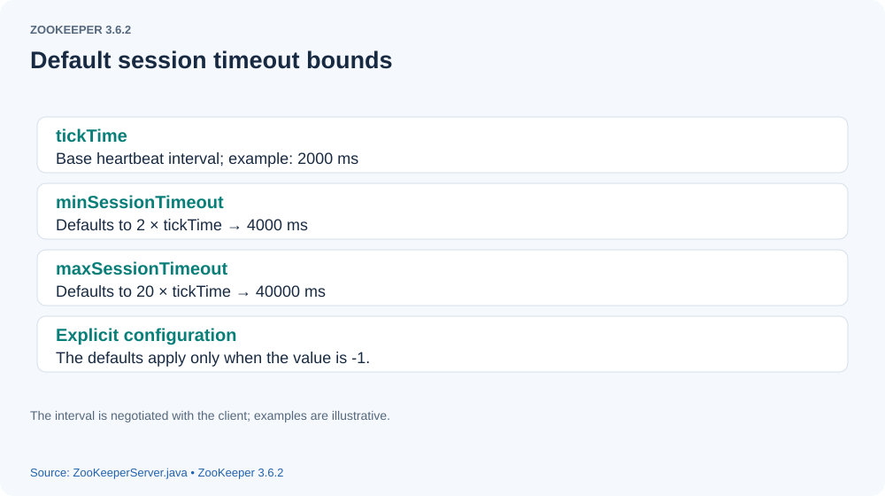
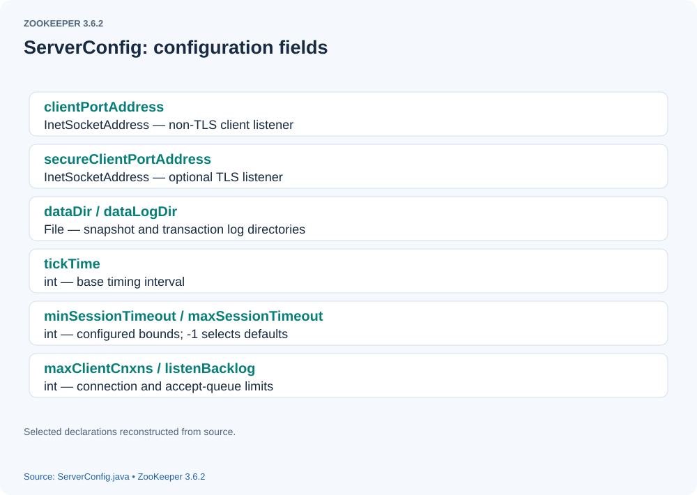
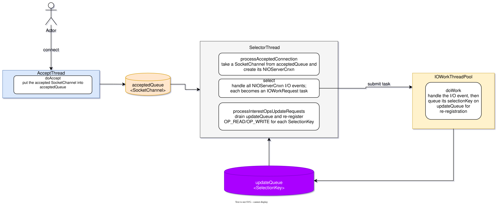

# How a Standalone ZooKeeper Server Starts

> **Source version and figures:** This article is checked against ZooKeeper **3.6.2**, commit `803c7f1a12f85978cb049af5e4ef23bd8b688715`, the latest 3.6 release available in October 2020. The analyzed excerpts are retained with English annotations; identified original-source variants are labeled explicitly. Diagrams drawn for the original article are reproduced with English labels. Where the original was a screenshot that could not be recovered, the figure is reconstructed from the source; those are explanatory diagrams, not newly observed debugger output.

## Introduction

I began using ZooKeeper several years ago and found it useful enough to turn a general file collector, which originally lacked distributed deployment and task dispatch, into a distributed system. After reading *From Paxos to ZooKeeper: Principles and Practice of Distributed Consistency*, I debugged the standalone source under several scenarios. I did not take notes at the time, and eventually forgot many details. Reading the source again has been rewarding; this article records what I learned.

## Server startup

### 1. Parsing configuration

Let us begin with standalone server startup. The entry point is `org.apache.zookeeper.server.ZooKeeperServerMain`, with `zoo.cfg` supplied as its argument. Configuration values become fields in `ServerConfig`. Two especially useful settings are `minSessionTimeout` and `maxSessionTimeout`: when unspecified, the server derives their defaults from `tickTime`, as two and twenty ticks respectively.

[](assets/standalone-server-startup-01.svg)

The following figure summarizes the `ServerConfig` fields.

[](assets/standalone-server-startup-02.svg)

Several important parameters deserve explanation:

- `clientPortAddress`: the address and port on which the server accepts client connections.
- `dataDir`: the directory holding persistent snapshots of ZooKeeper data.
- `logDir`: the transaction log directory, derived from `dataLogDir`, or `dataDir` if omitted.
- `tickTime`: the base interval used to derive default minimum and maximum session timeouts.
- `maxClientCnxns`: the maximum number of connections allowed from one IP address.
- `listenBacklog`: the requested size of the socket accept backlog.


#### runFromConfig

`runFromConfig` starts the server using the parsed configuration.

1. Create a `FileTxnSnapLog` instance.

```text

FileTxnSnapLog contains txnLog and snapLog, representing the transaction log and snapshot persistence implementations.

```


2. Create `ZooKeeperServer`.

```text

ZooKeeperServer represents the server and coordinates its data and request processing.

```


3. Create the admin server.

```text

The admin server uses Jetty and listens on port 8080 by default. Open http://ip:8080/commands
to inspect the available ZooKeeper commands.

```


4. Create `ServerCnxnFactory`.

```text

ServerCnxnFactory manages server-side connections. Its implementations include NIOServerCnxnFactory and NettyServerCnxnFactory.
NIOServerCnxnFactory is the default.

```


Let us examine `NIOServerCnxnFactory.configure`. **Timeout correction:** `sessionlessCnxnTimeout` bounds connections that have not established a session; it is also used as the connection-expiration bucket interval. It is not the negotiated session timeout.

```java

 public void configure(InetSocketAddress addr, int maxcc, int backlog, boolean secure) throws IOException {
        if (secure) {
            throw new UnsupportedOperationException("SSL isn't supported in NIOServerCnxn");
        }
        configureSaslLogin();

        maxClientCnxns = maxcc;
        initMaxCnxns();
       // sessionlessCnxnTimeout is the timeout for a connection without a session.
        sessionlessCnxnTimeout = Integer.getInteger(ZOOKEEPER_NIO_SESSIONLESS_CNXN_TIMEOUT, 10000);
        // We also use the sessionlessCnxnTimeout as expiring interval for
        // cnxnExpiryQueue. These don't need to be the same, but the expiring
        // interval passed into the ExpiryQueue() constructor below should be
        // less than or equal to the timeout.
            // Container for connection expiration times.
            cnxnExpiryQueue = new ExpiryQueue<NIOServerCnxn>(sessionlessCnxnTimeout);
          // Thread that handles expired connections.
        expirerThread = new ConnectionExpirerThread();

        int numCores = Runtime.getRuntime().availableProcessors();
        // 32 cores sweet spot seems to be 4 selector threads
        // Derive the number of selector threads from the available processors.
        numSelectorThreads = Integer.getInteger(
            ZOOKEEPER_NIO_NUM_SELECTOR_THREADS,
            Math.max((int) Math.sqrt((float) numCores / 2), 1));
        if (numSelectorThreads < 1) {
            throw new IOException("numSelectorThreads must be at least 1");
        }

       // Obtain the number of worker threads handling I/O events.
        numWorkerThreads = Integer.getInteger(ZOOKEEPER_NIO_NUM_WORKER_THREADS, 2 * numCores);
        workerShutdownTimeoutMS = Long.getLong(ZOOKEEPER_NIO_SHUTDOWN_TIMEOUT, 5000);

        String logMsg = "Configuring NIO connection handler with "
            + (sessionlessCnxnTimeout / 1000) + "s sessionless connection timeout, "
            + numSelectorThreads + " selector thread(s), "
            + (numWorkerThreads > 0 ? numWorkerThreads : "no") + " worker threads, and "
            + (directBufferBytes == 0 ? "gathered writes." : ("" + (directBufferBytes / 1024) + " kB direct buffers."));
        LOG.info(logMsg);
       // Create numSelectorThreads SelectorThread instances.
        for (int i = 0; i < numSelectorThreads; ++i) {
            selectorThreads.add(new SelectorThread(i));
        }

        listenBacklog = backlog;
        // Open the server SocketChannel and bind it to the configured address.
        this.ss = ServerSocketChannel.open();
        ss.socket().setReuseAddress(true);
        LOG.info("binding to port {}", addr);
        if (listenBacklog == -1) {
            ss.socket().bind(addr);
        } else {
            ss.socket().bind(addr, listenBacklog);
        }
        // Make the server SocketChannel nonblocking.
        ss.configureBlocking(false);
        // Create the thread accepting client connections.
        acceptThread = new AcceptThread(ss, addr, selectorThreads);
    }

```


`configure` creates three kinds of thread: connection expiration, selection, and acceptance. The I/O worker pool is created when the factory starts.

-  ConnectionExpirerThread
- SelectorThread
- AcceptThread

 ##### SelectorThread
Here is the `SelectorThread` constructor.

```java

 public SelectorThread(int id) throws IOException {
            super("NIOServerCxnFactory.SelectorThread-" + id);
            this.id = id;
           // Every accepted SocketChannel enters acceptedQueue.
            acceptedQueue = new LinkedBlockingQueue<SocketChannel>();
          // When a connection's interest operations need updating, its SelectionKey enters updateQueue.
            updateQueue = new LinkedBlockingQueue<SelectionKey>();
        }

```


##### AcceptThread

Next, examine the `AcceptThread` constructor.

```java

public AcceptThread(ServerSocketChannel ss, InetSocketAddress addr, Set<SelectorThread> selectorThreads) throws IOException {
             // The superclass creates the selector associated with AcceptThread.
            super("NIOServerCxnFactory.AcceptThread:" + addr);

            this.acceptSocket = ss;
          // Register OP_ACCEPT on the server channel to receive client connections.
            this.acceptKey = acceptSocket.register(selector, SelectionKey.OP_ACCEPT);
            // Each accepted connection is assigned one of selectorThreads.
            // That selector thread handles readiness events for this connection.
            this.selectorThreads = Collections.unmodifiableList(new ArrayList<SelectorThread>(selectorThreads));
            selectorIterator = this.selectorThreads.iterator();
        }

```


### Starting the ZooKeeper service

The threads described above have been constructed but have not yet started. Other threads still need to be created.
`NIOServerCnxnFactory.startup(ZooKeeperServer)` creates and starts the remaining components, completing standalone startup.

### NIOServerCnxnFactory.startup

```java

 @Override
    public void startup(ZooKeeperServer zks, boolean startServer) throws IOException, InterruptedException {
        // Start the previously constructed accept and selector threads.
        start();
        setZooKeeperServer(zks);
        if (startServer) {
           // Restore node data and session information from snapshots and transaction logs.
            zks.startdata();
           //
            zks.startup();
        }
    }

```


##### start()

```java

 public void start() {
        stopped = false;
        if (workerPool == null) {
            // Create the pool of I/O worker threads.
            workerPool = new WorkerService("NIOWorker", numWorkerThreads, false);
        }
       // Start SelectorThread instances.
        for (SelectorThread thread : selectorThreads) {
            if (thread.getState() == Thread.State.NEW) {
                thread.start();
            }
        }
        // Start AcceptThread.
        // ensure thread is started once and only once
        if (acceptThread.getState() == Thread.State.NEW) {
            acceptThread.start();
        }
    // Start connection expiration management.
        if (expirerThread.getState() == Thread.State.NEW) {
            expirerThread.start();
        }
    }

```


##### ZooKeeperServer.startup

```java

 public synchronized void startup() {
        if (sessionTracker == null) {
           // Create the session tracker to manage session expiration.
            createSessionTracker();
        }
       // Start the session tracker.
        startSessionTracker();
        // Set up the ZooKeeper request processor chain.
        // The standalone chain contains three processors.
       //PrepRequestProcessor --> SyncRequestProcessor --> FinalRequestProcessor
       // PrepRequestProcessor and SyncRequestProcessor run on separate threads and pass requests through queues.
        setupRequestProcessors();
        // Create and start RequestThrottler to control the number of requests.
       // This provides request throttling.
        startRequestThrottler();
        // Register JMX monitoring.
        registerJMX();
        // Start JVM pause monitoring.
        startJvmPauseMonitor();
        // Register metrics.
        registerMetrics();
        // Mark the server as running.
        setState(State.RUNNING);

        requestPathMetricsCollector.start();

        localSessionEnabled = sessionTracker.isLocalSessionsEnabled();
        notifyAll();
    }

```


### Starting ContainerManager

`ContainerManager` manages container znodes, which are intended to hold other nodes. After all children of a container have been removed, the manager's periodic checks can find and delete the empty container. The implementation also handles TTL nodes when that feature is enabled; deletion is a best-effort background operation, not an immediate guarantee.

------


That is the overall startup process. Let us now look more closely at the central server threads.

- acceptThread
- selectorThread

##### acceptThread

After startup, the server normally listens for client connections on port 2181, as configured in `zoo.cfg`. `AcceptThread` accepts a connection and assigns a `SelectorThread` to it, following a reactor-style design. Here is `AcceptThread.run`.

```java

// As discussed above, the AcceptThread constructor registers OP_ACCEPT on the server channel.
 public void run() {
            try {
                while (!stopped && !acceptSocket.socket().isClosed()) {
                    try {
                       // select contains the central acceptance logic.
                        select();
                    } catch (RuntimeException e) {
                        LOG.warn("Ignoring unexpected runtime exception", e);
                    } catch (Exception e) {
                        LOG.warn("Ignoring unexpected exception", e);
                    }
                }
            } finally {
                closeSelector();
                // This will wake up the selector threads, and tell the
                // worker thread pool to begin shutdown.
                if (!reconfiguring) {
                    NIOServerCnxnFactory.this.stop();
                }
                LOG.info("accept thread exitted run method");
            }
        }

```


- acceptThread.select

```java

  private void select() {
            try {
              // Wait for a client connection event.
                selector.select();

                Iterator<SelectionKey> selectedKeys = selector.selectedKeys().iterator();
                while (!stopped && selectedKeys.hasNext()) {
                    SelectionKey key = selectedKeys.next();
                    selectedKeys.remove();

                    if (!key.isValid()) {
                        continue;
                    }
                    // Handle an acceptable key through doAccept.
                    if (key.isAcceptable()) {
                        if (!doAccept()) {
                            // If unable to pull a new connection off the accept
                            // queue, pause accepting to give us time to free
                            // up file descriptors and so the accept thread
                            // doesn't spin in a tight loop.
                            pauseAccept(10);
                        }
                    } else {
                        LOG.warn("Unexpected ops in accept select {}", key.readyOps());
                    }
                }
            } catch (IOException e) {
                LOG.warn("Ignoring IOException while selecting", e);
            }
        }

```


- acceptThread.doAccept()

```java


private boolean doAccept() {
            boolean accepted = false;
            SocketChannel sc = null;
            try {
               // Obtain the SocketChannel for the client connection.
                sc = acceptSocket.accept();
                accepted = true;
                if (limitTotalNumberOfCnxns()) {
                    throw new IOException("Too many connections max allowed is " + maxCnxns);
                }
                InetAddress ia = sc.socket().getInetAddress();
               // getClientCnxnCount counts connections created from this IP address.
                int cnxncount = getClientCnxnCount(ia);
                // Reject a connection if the per-client limit has been reached.
                if (maxClientCnxns > 0 && cnxncount >= maxClientCnxns) {
                    throw new IOException("Too many connections from " + ia + " - max is " + maxClientCnxns);
                }

                LOG.debug("Accepted socket connection from {}", sc.socket().getRemoteSocketAddress());

                sc.configureBlocking(false);

                 // Choose a SelectorThread in round-robin order for this connection.
                // Round-robin assign this connection to a selector thread
                if (!selectorIterator.hasNext()) {
                    selectorIterator = selectorThreads.iterator();
                }
                SelectorThread selectorThread = selectorIterator.next();
               // Add the connection to its assigned SelectorThread queue.
                if (!selectorThread.addAcceptedConnection(sc)) {
                    throw new IOException("Unable to add connection to selector queue"
                                          + (stopped ? " (shutdown in progress)" : ""));
                }
                acceptErrorLogger.flush();
            } catch (IOException e) {
                // accept, maxClientCnxns, configureBlocking
                ServerMetrics.getMetrics().CONNECTION_REJECTED.add(1);
                acceptErrorLogger.rateLimitLog("Error accepting new connection: " + e.getMessage());
                fastCloseSock(sc);
            }
            return accepted;
        }

    }

```


Next, examine `SelectorThread.run`.

```java

// The run loop calls three important methods.
// select(), processAcceptedConnections(), processInterestOpsUpdateRequests()
 public void run() {
            try {
                while (!stopped) {
                    try {
                        select();
                        processAcceptedConnections();
                        processInterestOpsUpdateRequests();
                    } catch (RuntimeException e) {
                        LOG.warn("Ignoring unexpected runtime exception", e);
                    } catch (Exception e) {
                        LOG.warn("Ignoring unexpected exception", e);
                    }
                }

                // Close connections still pending on the selector. Any others
                // with in-flight work, let drain out of the work queue.
                for (SelectionKey key : selector.keys()) {
                    NIOServerCnxn cnxn = (NIOServerCnxn) key.attachment();
                    if (cnxn.isSelectable()) {
                        cnxn.close(ServerCnxn.DisconnectReason.SERVER_SHUTDOWN);
                    }
                    cleanupSelectionKey(key);
                }
                SocketChannel accepted;
                while ((accepted = acceptedQueue.poll()) != null) {
                    fastCloseSock(accepted);
                }
                updateQueue.clear();
            } finally {
                closeSelector();
                // This will wake up the accept thread and the other selector
                // threads, and tell the worker thread pool to begin shutdown.
                NIOServerCnxnFactory.this.stop();
                LOG.info("selector thread exitted run method");
            }
        }

```


The three methods are `select()`, `processAcceptedConnections()`, and `processInterestOpsUpdateRequests()`. For clarity, we will explain `processAcceptedConnections()` first.
Before doing so, return to the `selectorThread.addAcceptedConnection()` call inside `AcceptThread.doAccept`.

```java

 public boolean addAcceptedConnection(SocketChannel accepted) {
            // Add the accepted channel to acceptedQueue and wake the selector from select().
            if (stopped || !acceptedQueue.offer(accepted)) {
                return false;
            }
            wakeupSelector();
            return true;
        }

```


- processAcceptedConnections

`processAcceptedConnections` handles the SocketChannels waiting in `acceptedQueue`. **Queue correction:** the original annotation called the acceptance queue `updateQueue`; `updateQueue` instead holds SelectionKeys whose interest operations need refreshing.

```java

private void processAcceptedConnections() {
            SocketChannel accepted;
             // Take a SocketChannel from acceptedQueue.
            while (!stopped && (accepted = acceptedQueue.poll()) != null) {
                SelectionKey key = null;
                try {
                    // Register OP_READ on the selector belonging to this SelectorThread.
                    key = accepted.register(selector, SelectionKey.OP_READ);
                    // Wrap the SocketChannel in a server-side NIOServerCnxn.
                    NIOServerCnxn cnxn = createConnection(accepted, key, this);
                    key.attach(cnxn);
                   // Register the connection with the factory; cnxnExpiry will track its expiration.
                    addCnxn(cnxn);
                } catch (IOException e) {
                    // register, createConnection
                    cleanupSelectionKey(key);
                    fastCloseSock(accepted);
                }
            }
        }

```


After this step, the channel listens for `OP_READ` through its assigned selector. Now examine `select`.

```java

private void select() {
            try {
               // Obtain readiness events.
                selector.select();

                Set<SelectionKey> selected = selector.selectedKeys();
                ArrayList<SelectionKey> selectedList = new ArrayList<SelectionKey>(selected);
                Collections.shuffle(selectedList);
                Iterator<SelectionKey> selectedKeys = selectedList.iterator();
                while (!stopped && selectedKeys.hasNext()) {
                    SelectionKey key = selectedKeys.next();
                    selected.remove(key);

                    if (!key.isValid()) {
                        cleanupSelectionKey(key);
                        continue;
                    }
                    if (key.isReadable() || key.isWritable()) {
                       // Handle a readiness event through handleIO.
                        handleIO(key);
                    } else {
                        LOG.warn("Unexpected ops in select {}", key.readyOps());
                    }
                }
            } catch (IOException e) {
                LOG.warn("Ignoring IOException while selecting", e);
            }
        }

```


The implementation of `handleIO` follows.

```java

  private void handleIO(SelectionKey key) {
            // Wrap a channel's readiness event in an IOWorkRequest.
           // Submit the IOWorkRequest to the worker pool.
            IOWorkRequest workRequest = new IOWorkRequest(this, key);
            NIOServerCnxn cnxn = (NIOServerCnxn) key.attachment();

            // Stop selecting this key while processing on its
            // connection
            cnxn.disableSelectable();
            // Temporarily disable all interest operations on the key.
           // ZooKeeper serializes I/O handling for an individual connection.
           // How is overlapping work on one connection prevented?
           // Disable interests when work is submitted so the selector does not dispatch another task for this channel.
          // Re-register interests after the current task completes so subsequent readiness can be handled.
            key.interestOps(0);
            // Update the connection's expiration time.
            touchCnxn(cnxn);
            // Submit the IOWorkRequest to the I/O worker pool.
            workerPool.schedule(workRequest);
        }

```


Disabling the key's interest operations prevents concurrent I/O tasks for the same channel. How are its interests re-enabled after one task completes? This is readiness dispatch serialization; it does not imply that every underlying network event is a separately ordered application message.
That is the responsibility of `processInterestOpsUpdateRequests`.
Here is its source.

```java

// After handling I/O, IOWorkRequest puts the connection's SelectionKey into updateQueue.
 private void processInterestOpsUpdateRequests() {
            SelectionKey key;
           // Drain the SelectionKeys from updateQueue.
            while (!stopped && (key = updateQueue.poll()) != null) {
                if (!key.isValid()) {
                    cleanupSelectionKey(key);
                }
              // Retrieve NIOServerCnxn from the key's attachment.
                NIOServerCnxn cnxn = (NIOServerCnxn) key.attachment();
                if (cnxn.isSelectable()) {
                    // Re-register interests according to the connection's current read/write state.
                    key.interestOps(cnxn.getInterestOps());
                }
            }
        }

```


The following diagram summarizes connection acceptance and I/O dispatch.

[{: .diagram}](assets/standalone-server-startup-03.svg)

---
The server also starts threads managing session and connection expiration. Their implementation is covered separately in
[How ExpiryQueue Manages Connection and Session Timeouts](expiry-queue.html).

## Pinned source references

- [ZooKeeperServerMain.java](https://github.com/apache/zookeeper/blob/803c7f1a12f85978cb049af5e4ef23bd8b688715/zookeeper-server/src/main/java/org/apache/zookeeper/server/ZooKeeperServerMain.java)
- [ServerConfig.java](https://github.com/apache/zookeeper/blob/803c7f1a12f85978cb049af5e4ef23bd8b688715/zookeeper-server/src/main/java/org/apache/zookeeper/server/ServerConfig.java)
- [ZooKeeperServer.java](https://github.com/apache/zookeeper/blob/803c7f1a12f85978cb049af5e4ef23bd8b688715/zookeeper-server/src/main/java/org/apache/zookeeper/server/ZooKeeperServer.java)
- [NIOServerCnxnFactory.java](https://github.com/apache/zookeeper/blob/803c7f1a12f85978cb049af5e4ef23bd8b688715/zookeeper-server/src/main/java/org/apache/zookeeper/server/NIOServerCnxnFactory.java)
- [ContainerManager.java](https://github.com/apache/zookeeper/blob/803c7f1a12f85978cb049af5e4ef23bd8b688715/zookeeper-server/src/main/java/org/apache/zookeeper/server/ContainerManager.java)
