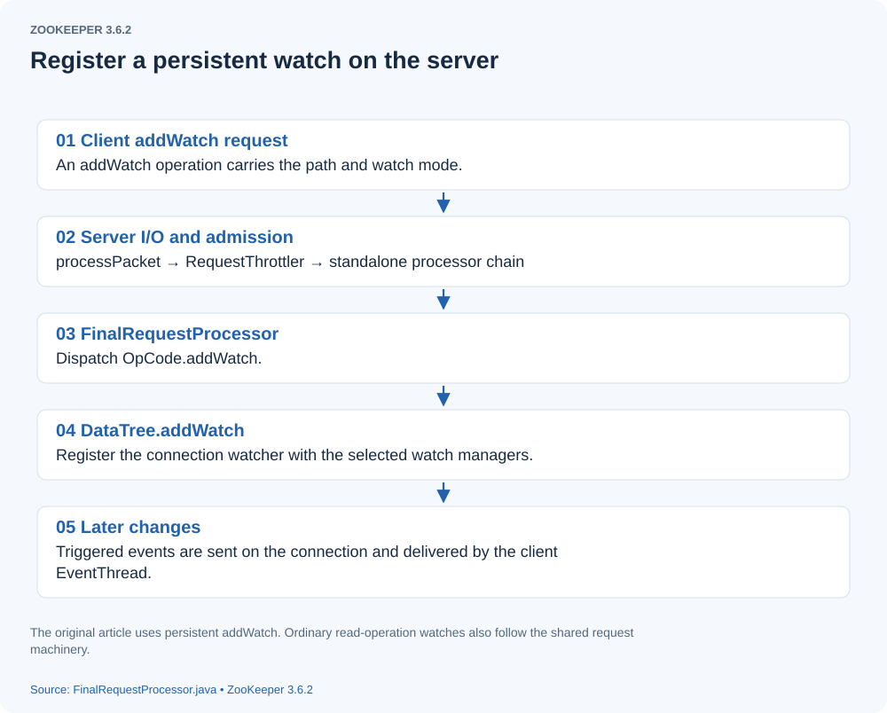

# How ZooKeeper Registers and Delivers Watch Events

> **Source version and figures:** This article is checked against ZooKeeper **3.6.2**, commit `803c7f1a12f85978cb049af5e4ef23bd8b688715`, the latest 3.6 release available in October 2020. The analyzed excerpts are retained with English annotations; identified original-source variants are labeled explicitly. Figures are reconstructed from the source and original discussion because the original screenshots are unavailable. They are explanatory diagrams, not newly observed debugger output.

## Introduction

This article explains ZooKeeper watches and continues the source trace in [Following a ZooKeeper Node Creation Request](node-creation.html).

## The client

A client can register a persistent watch on a path through `ZooKeeper.addWatch`. Traditional one-shot watches are instead registered through operations such as `exists`, `getData`, and `getChildren`.

```java

 public void addWatch(String basePath, Watcher watcher, AddWatchMode mode)
            throws KeeperException, InterruptedException {
        PathUtils.validatePath(basePath);
        // Combine the chroot and requested basePath into serverPath.
        String serverPath = prependChroot(basePath);
       // Construct the watch registration request for this path.
        RequestHeader h = new RequestHeader();
        h.setType(ZooDefs.OpCode.addWatch);
        AddWatchRequest request = new AddWatchRequest(serverPath, mode.getMode());
       // Send the request through the client connection.
        ReplyHeader r = cnxn.submitRequest(h, request, new ErrorResponse(),
                new AddWatchRegistration(watcher, basePath, mode));
        if (r.getErr() != 0) {
            throw KeeperException.create(KeeperException.Code.get(r.getErr()),
                    basePath);
        }
    }

```


## The server

The server receives the request through the same stages described in [node creation](node-creation.html): [](assets/watch-processing-01.svg)
The request traverses the same general pipeline as other requests. Operation-specific behavior occurs in the relevant switch branches; for `addWatch`, the important branch is in `FinalRequestProcessor.processRequest`:

```java

 case OpCode.addWatch: {
                lastOp = "ADDW";
                AddWatchRequest addWatcherRequest = new AddWatchRequest();
                ByteBufferInputStream.byteBuffer2Record(request.request,
                        addWatcherRequest);
                zks.getZKDatabase().addWatch(addWatcherRequest.getPath(), cnxn, addWatcherRequest.getMode());
                rsp = new ErrorResponse(0);
                break;
            }

```


It delegates through `ZKDatabase.addWatch` to `DataTree.addWatch`. Here is that method.

```java

 public void addWatch(String basePath, Watcher watcher, int mode) {
       // Determine the mode: standard, persistent, or persistent recursive.
        WatcherMode watcherMode = WatcherMode.fromZooDef(mode);
        dataWatches.addWatch(basePath, watcher, watcherMode);
        childWatches.addWatch(basePath, watcher, watcherMode);
    }

```


These three watch modes have different behavior:

1. **Standard:** the watch is removed when triggered. Register it again to receive another relevant event.
2. **Persistent:** triggering does not remove the registration; subsequent relevant events can also be delivered.
3. **Persistent recursive:** a registration covers the specified path and its descendants. When an event occurs, the server considers recursive registrations on that path and its ancestors. **Correction:** the original description said that ancestor nodes themselves are triggered by a child-list change. The event still names the path where the change occurred, and recursive watches deliberately exclude `NodeChildrenChanged`; descendant create/delete events convey those changes instead.

##### WatchManager.addWatch

The server watch manager adds a registration as follows.

```java

public synchronized boolean addWatch(String path, Watcher watcher, WatcherMode watcherMode) {
         // A server-side connection, such as NIOServerCnxn, serves as the Watcher.
        if (isDeadWatcher(watcher)) {
           // Disconnection marks the server connection stale/dead, preventing a new registration.
            LOG.debug("Ignoring addWatch with closed cnxn");
            return false;
        }
       // watchTable maps a path to its registered Watchers.
        Set<Watcher> list = watchTable.get(path);
        if (list == null) {
            // don't waste memory if there are few watches on a node
            // rehash when the 4th entry is added, doubling size thereafter
            // seems like a good compromise
            // Create the watcher set with an initial capacity of four.
            list = new HashSet<>(4);
            watchTable.put(path, list);
        }
        list.add(watcher);
        // watch2Paths tracks paths registered by a particular Watcher.
        Set<String> paths = watch2Paths.get(watcher);
        if (paths == null) {
            // cnxns typically have many watches, so use default cap here
            paths = new HashSet<>();
            watch2Paths.put(watcher, paths);
        }

        watcherModeManager.setWatcherMode(watcher, path, watcherMode);
        return paths.add(path);
    }

```


`DataTree.addWatch` registers the connection in both `dataWatches` and `childWatches`. Now return to the final event-triggering calls in [node creation](node-creation.html) and follow their delivery.

##### triggerWatch

They ultimately call `WatchManager.triggerWatch`.

```java

 public WatcherOrBitSet triggerWatch(String path, EventType type, WatcherOrBitSet supress) {
        WatchedEvent e = new WatchedEvent(type, KeeperState.SyncConnected, path);
        Set<Watcher> watchers = new HashSet<>();
        // Iterate the event path and, where recursive watches exist, its ancestors.
        PathParentIterator pathParentIterator = getPathParentIterator(path);
        synchronized (this) {
            for (String localPath : pathParentIterator.asIterable()) {
                // Obtain the Watchers registered at this path.
                Set<Watcher> thisWatchers = watchTable.get(localPath);
                if (thisWatchers == null || thisWatchers.isEmpty()) {
                    continue;
                }
                Iterator<Watcher> iterator = thisWatchers.iterator();
                while (iterator.hasNext()) {
                     // Examine each registered Watcher.
                    Watcher watcher = iterator.next();
                    WatcherMode watcherMode = watcherModeManager.getWatcherMode(watcher, localPath);
                    if (watcherMode.isRecursive()) {
                        if (type != EventType.NodeChildrenChanged) {
                           // Recursive watches are selected unless the event is NodeChildrenChanged.
                            watchers.add(watcher);
                        }
                    } else if (!pathParentIterator.atParentPath()) {
                       // A nonrecursive watch is selected only on the event's exact path.
                        watchers.add(watcher);
                        if (!watcherMode.isPersistent()) {
                          // Remove standard watches after selecting them; persistent registrations remain.
                            iterator.remove();
                            Set<String> paths = watch2Paths.get(watcher);
                            if (paths != null) {
                                paths.remove(localPath);
                            }
                        }
                    }
                }
                if (thisWatchers.isEmpty()) {
                   // Remove an empty path entry from watchTable.
                    watchTable.remove(localPath);
                }
            }
        }
        if (watchers.isEmpty()) {
            if (LOG.isTraceEnabled()) {
                ZooTrace.logTraceMessage(LOG, ZooTrace.EVENT_DELIVERY_TRACE_MASK, "No watchers for " + path);
            }
            return null;
        }
        // Invoke process on each selected Watcher outside the synchronized section.
        for (Watcher w : watchers) {
            if (supress != null && supress.contains(w)) {
                continue;
            }
            w.process(e);
        }

        switch (type) {
            case NodeCreated:
                ServerMetrics.getMetrics().NODE_CREATED_WATCHER.add(watchers.size());
                break;

            case NodeDeleted:
                ServerMetrics.getMetrics().NODE_DELETED_WATCHER.add(watchers.size());
                break;

            case NodeDataChanged:
                ServerMetrics.getMetrics().NODE_CHANGED_WATCHER.add(watchers.size());
                break;

            case NodeChildrenChanged:
                ServerMetrics.getMetrics().NODE_CHILDREN_WATCHER.add(watchers.size());
                break;
            default:
                // Other types not logged.
                break;
        }

        return new WatcherOrBitSet(watchers);
    }

```


##### NIOServerCnxn.process

On the server, the Watcher here is a connection object. Let us inspect `NIOServerCnxn.process`.

```java

public void process(WatchedEvent event) {
        // Construct the notification response header.
        ReplyHeader h = new ReplyHeader(ClientCnxn.NOTIFICATION_XID, -1L, 0);
        if (LOG.isTraceEnabled()) {
            ZooTrace.logTraceMessage(
                LOG,
                ZooTrace.EVENT_DELIVERY_TRACE_MASK,
                "Deliver event " + event + " to 0x" + Long.toHexString(this.sessionId) + " through " + this);
        }

        // Convert WatchedEvent to a type that can be sent over the wire
        WatcherEvent e = event.getWrapper();

        // The last parameter OpCode here is used to select the response cache.
        // Passing OpCode.error (with a value of -1) means we don't care, as we don't need
        // response cache on delivering watcher events.
        // Send the notification to the client.
        sendResponse(h, e, "notification", null, null, ZooDefs.OpCode.error);
    }

```


## Handling watch responses on the client

##### ClientCnxn.readResponse

`SendThread.readResponse` handles messages received from the server.

```java

 void readResponse(ByteBuffer incomingBuffer) throws IOException {
            ByteBufferInputStream bbis = new ByteBufferInputStream(incomingBuffer);
            BinaryInputArchive bbia = BinaryInputArchive.getArchive(bbis);
            ReplyHeader replyHdr = new ReplyHeader();
          // Deserialize the server's response header.
            replyHdr.deserialize(bbia, "header");
           // Dispatch according to the special response xid or ordinary request xid.
            switch (replyHdr.getXid()) {
            case PING_XID:
                // Handle a ping response.
                LOG.debug("Got ping response for session id: 0x{} after {}ms.",
                    Long.toHexString(sessionId),
                    ((System.nanoTime() - lastPingSentNs) / 1000000));
                return;
              case AUTHPACKET_XID:
                // Handle an authentication response.
                LOG.debug("Got auth session id: 0x{}", Long.toHexString(sessionId));
                if (replyHdr.getErr() == KeeperException.Code.AUTHFAILED.intValue()) {
                    state = States.AUTH_FAILED;
                    eventThread.queueEvent(new WatchedEvent(Watcher.Event.EventType.None,
                        Watcher.Event.KeeperState.AuthFailed, null));
                    eventThread.queueEventOfDeath();
                }
              return;
            case NOTIFICATION_XID:
                 // Handle a watch-event notification.
                LOG.debug("Got notification session id: 0x{}",
                    Long.toHexString(sessionId));
                WatcherEvent event = new WatcherEvent();
               // Deserialize the WatcherEvent payload.
                event.deserialize(bbia, "response");

                // convert from a server path to a client path
                if (chrootPath != null) {
                    String serverPath = event.getPath();
                    if (serverPath.compareTo(chrootPath) == 0) {
                        event.setPath("/");
                    } else if (serverPath.length() > chrootPath.length()) {
                        event.setPath(serverPath.substring(chrootPath.length()));
                     } else {
                         LOG.warn("Got server path {} which is too short for chroot path {}.",
                             event.getPath(), chrootPath);
                     }
                }
               // Convert WatcherEvent to WatchedEvent.
                WatchedEvent we = new WatchedEvent(event);
                LOG.debug("Got {} for session id 0x{}", we, Long.toHexString(sessionId));
               // Queue the event for EventThread.
                eventThread.queueEvent(we);
                return;
            default:
                break;
            }

            // If SASL authentication is currently in progress, construct and
            // send a response packet immediately, rather than queuing a
            // response as with other packets.
            if (tunnelAuthInProgress()) {
                GetSASLRequest request = new GetSASLRequest();
                request.deserialize(bbia, "token");
                zooKeeperSaslClient.respondToServer(request.getToken(), ClientCnxn.this);
                return;
            }

            Packet packet;
           // For an ordinary response, remove the first request from pendingQueue.
           // Requests on this connection are sent and matched in order.
           // The first entry is the oldest sent request still awaiting a response.
            synchronized (pendingQueue) {
                if (pendingQueue.size() == 0) {
                    throw new IOException("Nothing in the queue, but got " + replyHdr.getXid());
                }
                packet = pendingQueue.remove();
            }
            /*
             * Since requests are processed in order, we better get a response
             * to the first request!
             */
            try {
                 // Match the request and response xids; a mismatch breaks the expected response ordering.
                if (packet.requestHeader.getXid() != replyHdr.getXid()) {
                    packet.replyHeader.setErr(KeeperException.Code.CONNECTIONLOSS.intValue());
                    throw new IOException("Xid out of order. Got Xid " + replyHdr.getXid()
                                          + " with err " + replyHdr.getErr()
                                          + " expected Xid " + packet.requestHeader.getXid()
                                          + " for a packet with details: " + packet);
                }

                packet.replyHeader.setXid(replyHdr.getXid());
                packet.replyHeader.setErr(replyHdr.getErr());
                packet.replyHeader.setZxid(replyHdr.getZxid());

                if (replyHdr.getZxid() > 0) {
                    // Update the client's latest observed zxid.
                    lastZxid = replyHdr.getZxid();
                }
                if (packet.response != null && replyHdr.getErr() == 0) {
                  // Deserialize the response body.
                    packet.response.deserialize(bbia, "response");
                }

                LOG.debug("Reading reply session id: 0x{}, packet:: {}", Long.toHexString(sessionId), packet);
            } finally {
               // Finish the Packet: propagate response status, register successful watches, and deliver completion or callbacks as appropriate.
                finishPacket(packet);
            }
        }

```


##### eventThread.queueEvent

`queueEvent` puts the notification in the client's event queue.

```java

 private void queueEvent(WatchedEvent event, Set<Watcher> materializedWatchers) {
            if (event.getType() == EventType.None && sessionState == event.getState()) {
                return;
            }
            sessionState = event.getState();
            final Set<Watcher> watchers;
            if (materializedWatchers == null) {
                // materialize the watchers based on the event
                // Materialize the user Watchers matching the event type and path.
                watchers = watcher.materialize(event.getState(), event.getType(), event.getPath());
            } else {
                watchers = new HashSet<Watcher>();
                watchers.addAll(materializedWatchers);
            }
           // Enqueue the WatcherSetEventPair in waitingEvents.
            WatcherSetEventPair pair = new WatcherSetEventPair(watchers, event);
            // queue the pair (watch set & event) for later processing
            waitingEvents.add(pair);
        }

```


Next, examine how `EventThread` dispatches queued work. First, its `run` method:

```java

 public void run() {
            try {
                isRunning = true;
                while (true) {
                    // Take an event from waitingEvents.
                    Object event = waitingEvents.take();
                    if (event == eventOfDeath) {
                        wasKilled = true;
                    } else {
                       // Dispatch the event.
                        processEvent(event);
                    }
                    if (wasKilled) {
                        synchronized (waitingEvents) {
                            if (waitingEvents.isEmpty()) {
                                isRunning = false;
                                break;
                            }
                        }
                    }
                }
            } catch (InterruptedException e) {
                LOG.error("Event thread exiting due to interruption", e);
            }

            LOG.info("EventThread shut down for session: 0x{}", Long.toHexString(getSessionId()));
        }

```


##### processEvent

```java

private void processEvent(Object event) {
            try {
                if (event instanceof WatcherSetEventPair) {
                    // each watcher will process the event
                    WatcherSetEventPair pair = (WatcherSetEventPair) event;
                    for (Watcher watcher : pair.watchers) {
                        try {
                            // Invoke the application's Watcher.process method.
                            watcher.process(pair.event);
                        } catch (Throwable t) {
                            LOG.error("Error while calling watcher ", t);
                        }
                    }
                } else if (event instanceof LocalCallback) {
                     // Handle callback work; these branches are retained but not discussed individually.
                    LocalCallback lcb = (LocalCallback) event;
                    if (lcb.cb instanceof StatCallback) {
                        ((StatCallback) lcb.cb).processResult(lcb.rc, lcb.path, lcb.ctx, null);
                    } else if (lcb.cb instanceof DataCallback) {
                        ((DataCallback) lcb.cb).processResult(lcb.rc, lcb.path, lcb.ctx, null, null);
                    } else if (lcb.cb instanceof ACLCallback) {
                        ((ACLCallback) lcb.cb).processResult(lcb.rc, lcb.path, lcb.ctx, null, null);
                    } else if (lcb.cb instanceof ChildrenCallback) {
                        ((ChildrenCallback) lcb.cb).processResult(lcb.rc, lcb.path, lcb.ctx, null);
                    } else if (lcb.cb instanceof Children2Callback) {
                        ((Children2Callback) lcb.cb).processResult(lcb.rc, lcb.path, lcb.ctx, null, null);
                    } else if (lcb.cb instanceof StringCallback) {
                        ((StringCallback) lcb.cb).processResult(lcb.rc, lcb.path, lcb.ctx, null);
                    } else if (lcb.cb instanceof AsyncCallback.EphemeralsCallback) {
                        ((AsyncCallback.EphemeralsCallback) lcb.cb).processResult(lcb.rc, lcb.ctx, null);
                    } else if (lcb.cb instanceof AsyncCallback.AllChildrenNumberCallback) {
                        ((AsyncCallback.AllChildrenNumberCallback) lcb.cb).processResult(lcb.rc, lcb.path, lcb.ctx, -1);
                    } else {
                        ((VoidCallback) lcb.cb).processResult(lcb.rc, lcb.path, lcb.ctx);
                    }
                } else {
                     // Handle Packet callback results.
                    Packet p = (Packet) event;
                    int rc = 0;
                    String clientPath = p.clientPath;
                    if (p.replyHeader.getErr() != 0) {
                        rc = p.replyHeader.getErr();
                    }
                    if (p.cb == null) {
                        LOG.warn("Somehow a null cb got to EventThread!");
                    } else if (p.response instanceof ExistsResponse
                               || p.response instanceof SetDataResponse
                               || p.response instanceof SetACLResponse) {
                        StatCallback cb = (StatCallback) p.cb;
                        if (rc == 0) {
                            if (p.response instanceof ExistsResponse) {
                                cb.processResult(rc, clientPath, p.ctx, ((ExistsResponse) p.response).getStat());
                            } else if (p.response instanceof SetDataResponse) {
                                cb.processResult(rc, clientPath, p.ctx, ((SetDataResponse) p.response).getStat());
                            } else if (p.response instanceof SetACLResponse) {
                                cb.processResult(rc, clientPath, p.ctx, ((SetACLResponse) p.response).getStat());
                            }
                        } else {
                            cb.processResult(rc, clientPath, p.ctx, null);
                        }
                    } else if (p.response instanceof GetDataResponse) {
                        DataCallback cb = (DataCallback) p.cb;
                        GetDataResponse rsp = (GetDataResponse) p.response;
                        if (rc == 0) {
                            cb.processResult(rc, clientPath, p.ctx, rsp.getData(), rsp.getStat());
                        } else {
                            cb.processResult(rc, clientPath, p.ctx, null, null);
                        }
                    } else if (p.response instanceof GetACLResponse) {
                        ACLCallback cb = (ACLCallback) p.cb;
                        GetACLResponse rsp = (GetACLResponse) p.response;
                        if (rc == 0) {
                            cb.processResult(rc, clientPath, p.ctx, rsp.getAcl(), rsp.getStat());
                        } else {
                            cb.processResult(rc, clientPath, p.ctx, null, null);
                        }
                    } else if (p.response instanceof GetChildrenResponse) {
                        ChildrenCallback cb = (ChildrenCallback) p.cb;
                        GetChildrenResponse rsp = (GetChildrenResponse) p.response;
                        if (rc == 0) {
                            cb.processResult(rc, clientPath, p.ctx, rsp.getChildren());
                        } else {
                            cb.processResult(rc, clientPath, p.ctx, null);
                        }
                    } else if (p.response instanceof GetAllChildrenNumberResponse) {
                        AllChildrenNumberCallback cb = (AllChildrenNumberCallback) p.cb;
                        GetAllChildrenNumberResponse rsp = (GetAllChildrenNumberResponse) p.response;
                        if (rc == 0) {
                            cb.processResult(rc, clientPath, p.ctx, rsp.getTotalNumber());
                        } else {
                            cb.processResult(rc, clientPath, p.ctx, -1);
                        }
                    } else if (p.response instanceof GetChildren2Response) {
                        Children2Callback cb = (Children2Callback) p.cb;
                        GetChildren2Response rsp = (GetChildren2Response) p.response;
                        if (rc == 0) {
                            cb.processResult(rc, clientPath, p.ctx, rsp.getChildren(), rsp.getStat());
                        } else {
                            cb.processResult(rc, clientPath, p.ctx, null, null);
                        }
                    } else if (p.response instanceof CreateResponse) {
                        StringCallback cb = (StringCallback) p.cb;
                        CreateResponse rsp = (CreateResponse) p.response;
                        if (rc == 0) {
                            cb.processResult(
                                rc,
                                clientPath,
                                p.ctx,
                                (chrootPath == null
                                    ? rsp.getPath()
                                    : rsp.getPath().substring(chrootPath.length())));
                        } else {
                            cb.processResult(rc, clientPath, p.ctx, null);
                        }
                    } else if (p.response instanceof Create2Response) {
                        Create2Callback cb = (Create2Callback) p.cb;
                        Create2Response rsp = (Create2Response) p.response;
                        if (rc == 0) {
                            cb.processResult(
                                    rc,
                                    clientPath,
                                    p.ctx,
                                    (chrootPath == null
                                            ? rsp.getPath()
                                            : rsp.getPath().substring(chrootPath.length())),
                                    rsp.getStat());
                        } else {
                            cb.processResult(rc, clientPath, p.ctx, null, null);
                        }
                    } else if (p.response instanceof MultiResponse) {
                        MultiCallback cb = (MultiCallback) p.cb;
                        MultiResponse rsp = (MultiResponse) p.response;
                        if (rc == 0) {
                            List<OpResult> results = rsp.getResultList();
                            int newRc = rc;
                            for (OpResult result : results) {
                                if (result instanceof ErrorResult
                                    && KeeperException.Code.OK.intValue()
                                       != (newRc = ((ErrorResult) result).getErr())) {
                                    break;
                                }
                            }
                            cb.processResult(newRc, clientPath, p.ctx, results);
                        } else {
                            cb.processResult(rc, clientPath, p.ctx, null);
                        }
                    } else if (p.response instanceof GetEphemeralsResponse) {
                        EphemeralsCallback cb = (EphemeralsCallback) p.cb;
                        GetEphemeralsResponse rsp = (GetEphemeralsResponse) p.response;
                        if (rc == 0) {
                            cb.processResult(rc, p.ctx, rsp.getEphemerals());
                        } else {
                            cb.processResult(rc, p.ctx, null);
                        }
                    } else if (p.cb instanceof VoidCallback) {
                        VoidCallback cb = (VoidCallback) p.cb;
                        cb.processResult(rc, clientPath, p.ctx);
                    }
                }
            } catch (Throwable t) {
                LOG.error("Unexpected throwable", t);
            }
        }

    }

```


This completes the watch registration and delivery path on both client and server. User watcher callbacks run on `EventThread`, so blocking one callback delays other events and callbacks on that client.

## Pinned source references

- [ZooKeeper.java](https://github.com/apache/zookeeper/blob/803c7f1a12f85978cb049af5e4ef23bd8b688715/zookeeper-server/src/main/java/org/apache/zookeeper/ZooKeeper.java)
- [DataTree.java](https://github.com/apache/zookeeper/blob/803c7f1a12f85978cb049af5e4ef23bd8b688715/zookeeper-server/src/main/java/org/apache/zookeeper/server/DataTree.java)
- [WatchManager.java](https://github.com/apache/zookeeper/blob/803c7f1a12f85978cb049af5e4ef23bd8b688715/zookeeper-server/src/main/java/org/apache/zookeeper/server/watch/WatchManager.java)
- [NIOServerCnxn.java](https://github.com/apache/zookeeper/blob/803c7f1a12f85978cb049af5e4ef23bd8b688715/zookeeper-server/src/main/java/org/apache/zookeeper/server/NIOServerCnxn.java)
- [ClientCnxn.java](https://github.com/apache/zookeeper/blob/803c7f1a12f85978cb049af5e4ef23bd8b688715/zookeeper-server/src/main/java/org/apache/zookeeper/ClientCnxn.java)
- [Protocol and persisted-record Jute definitions](https://github.com/apache/zookeeper/blob/803c7f1a12f85978cb049af5e4ef23bd8b688715/zookeeper-jute/src/main/resources/zookeeper.jute)
